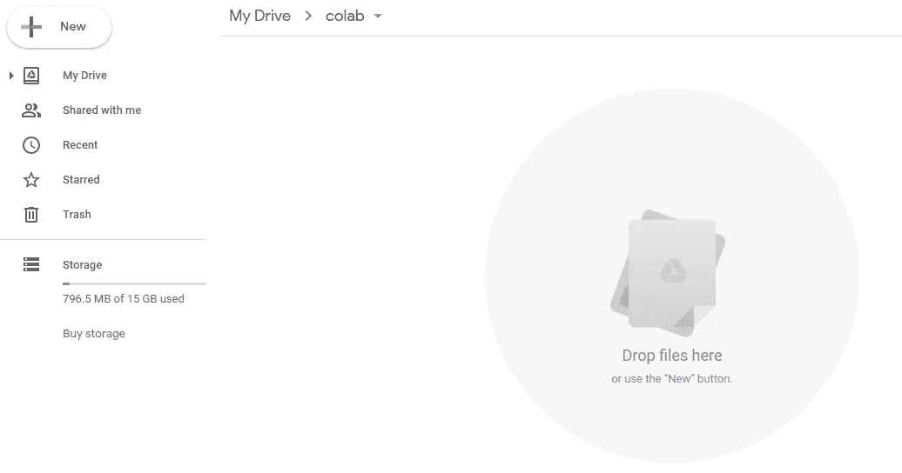
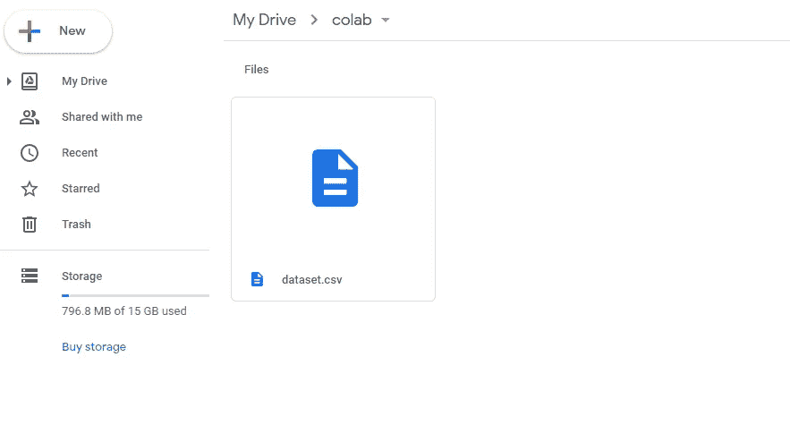
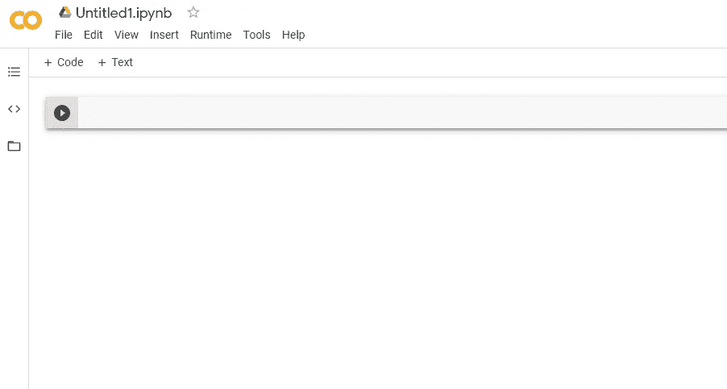
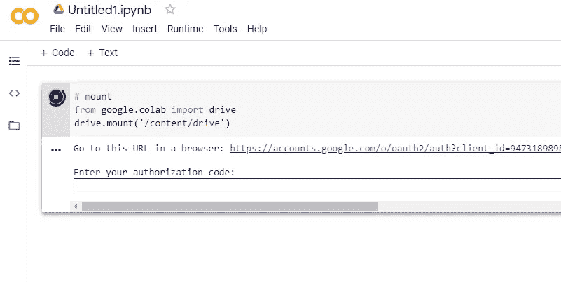
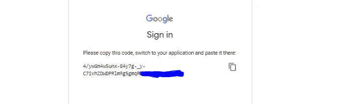
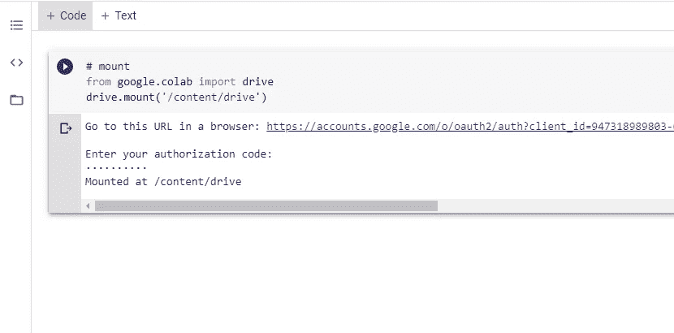
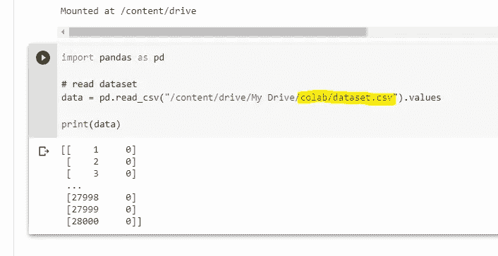

# 如何通过 Google Drive 轻松使用 Google Colab 中的数据集

> 原文：<https://medium.com/analytics-vidhya/how-to-use-your-dataset-in-google-colab-easily-via-google-drive-a9d9aa2c27fc?source=collection_archive---------19----------------------->

在 Google Colab 中使用数据集的简单方法


# 1.在 Google Drive 中创建一个文件夹

在这个例子中，我们在主*(我的驱动器)*目录中创建了一个名为“ **colab** 的文件夹。



# 2.上传数据集

在这里，我们将数据集上传到“colab”文件夹。



# 3.创建或打开 Colab 笔记本

在这里，我们创建了一个新的 colab 笔记本。



# 4.安装您的驱动器

使用以下代码安装驱动器:

```
# mount
from google.colab import drive
drive.mount('/content/drive')
```



现在，我们需要获得授权码，所以我们点击给出的 **URL** 并完成授权步骤。

> 完成所有步骤后，我们最终得到了我们的授权码:



我们将授权码复制并粘贴到输入字段，然后按下 **Enter。**



> 注意:应该在每个会话中重复安装步骤。

# 5.从 Google Drive 读取数据集

我们已经创建了一个名为“ **colab** ”的文件夹，并将数据集上传到其中。因此，我们需要使用下面的路径来读取数据集:

```
"/content/drive/My Drive/colab/dataset.csv"
```

在这个例子中，我们使用 **pandas 读取数据集。**



# 6.笔记

*   **安装**步骤应在每个*会话*中重复。