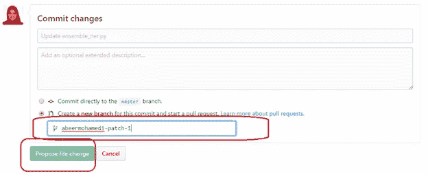
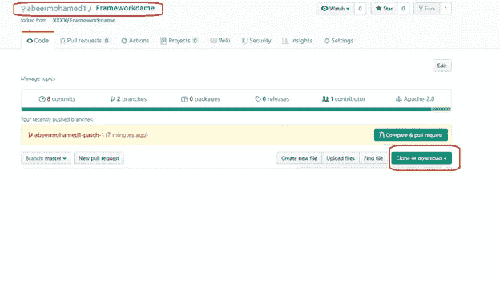

# 如何在您的 colab 笔记本中使用您的分叉开源项目，而无需等待合并和审查。

> 原文：<https://medium.com/analytics-vidhya/how-to-use-your-forked-open-source-project-in-your-colab-notebook-without-need-to-wait-for-merge-337b4188d544?source=collection_archive---------13----------------------->

Github 有很多开源项目，这些项目有很多特性，你需要把它作为一个预定义的现成框架来使用。大多数情况下，我们需要更新开源项目以进行定制、解决问题、添加新功能，并且您可能需要在代码中使用这种更改，而无需等到您的更改合并到主分支(由框架作者或贡献者)中。

在下面的文章中，我使用 colab 笔记本来运行我的代码。

以下是覆盖 python 开源项目并在您的笔记本中使用它的步骤:

在安装任何框架的正常情况下，您应该运行下面的标准语句来使用开源框架。

请注意，像这样的标签是可变的，应该在您的代码中替换为真实的名称。

> pip 安装

在我们的例子中，我们不会使用上面的命令，我们将使用一个不同的命令，在下面的步骤中解释。

**第一步:**首先要更改框架代码，按下按钮‘Fork’。

第一步的预期行为:Github 会将资源库复制到您的帐户。

**第二步:**选择想要更新的文件(点击文件名)。

步骤 2 的预期行为:文件将被打开。

**第三步:**点击编辑图标，如下图截图

步骤 3 的预期行为:文件将以编辑模式打开。

**步骤 4:** 做你想编码的修改，然后输入提交修改(注释描述你做的修改；什么和为什么)。然后选择 create a new branch(以防您还不想将您的变更合并到主分支中)。最后点击绿色按钮“提出文件变更”。

记住新的分行名称 ex。" **abeermohamed1-patch-1** "因为您将在接下来的步骤中使用它。

步骤 4 的预期行为:新的分支将被创建并应用变更。

**步骤 5:** 将更新后的框架安装到您的笔记本上。

**步骤 5.1:** 首先进入你的框架(你的分叉库显示在你的账号上)。然后点击绿色按钮“克隆或下载”。以访问存储库 URL。

**步骤 5.2:** 生成存储库 URL。你应该复制和克隆如下截图。

步骤 5.2 的预期行为:下面的 URL 将被复制到

> git+https://github . com/abeermohamed 1/framework name . git

**步骤 5.3:** 然后将步骤 4 中提到的分支名称附加到上面复制的 URL 中的“@”符号之后。然后追加#egg=frameworkname

即

> <your-repository-url>+" @ "+<your-branch-name>+" # egg = "+" framework name "</your-branch-name></your-repository-url>

预期结果:将如下 URL 所示:

> pip install-e git+https://github . com/abeermohamed 1/framework name . git @ abeermohamed 1-patch-1 # egg = framework name

**步骤 5.4:** 在您的 colab 笔记本中运行以下命令来安装更新的软件包:

> pip install-e git+https://github . com/abeermohamed 1/framework name . git @ abeermohamed 1-patch-1 # egg = framework name

**步骤 5.5:** 转到框架目录

然后使用下面的命令转到框架文件夹

> %cd '/content/src/frameworkname '

**步骤 5.6:** 运行下面的命令来编译您的更改:

> ！python 'setup.py '安装

祝贺你现在终于可以使用你的更新框架了。

希望这有用。如果您有任何意见，请告诉我:)。

请随时通过以下方式与我联系:

我的 Github 简介:[https://github.com/abeermohamed1](https://github.com/abeermohamed1)

领英:[https://www.linkedin.com/in/abeer-mohamed-7a32671b/](https://www.linkedin.com/in/abeer-mohamed-7a32671b/)