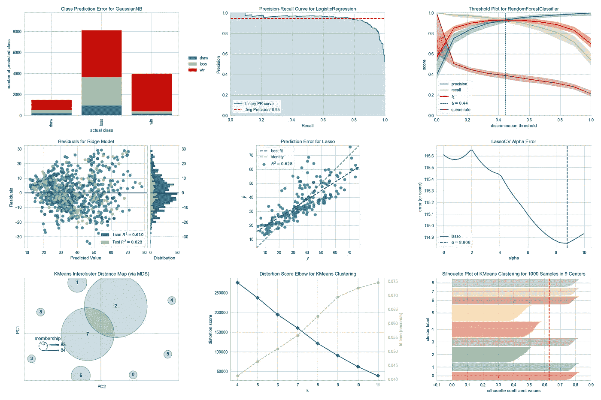
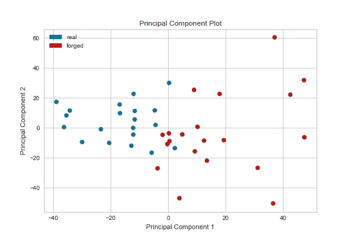
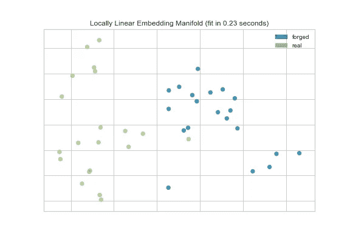
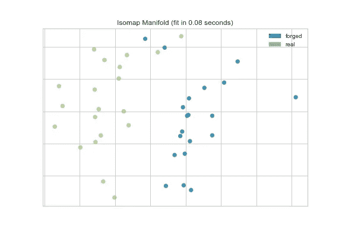
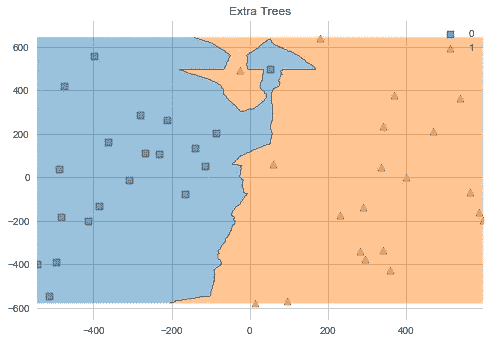
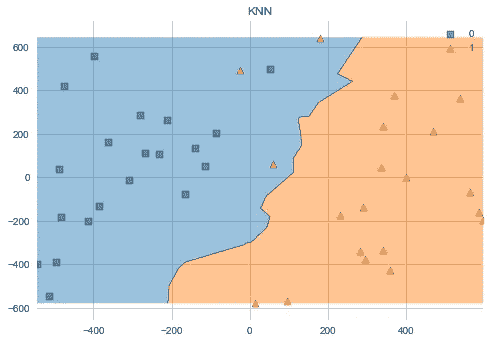
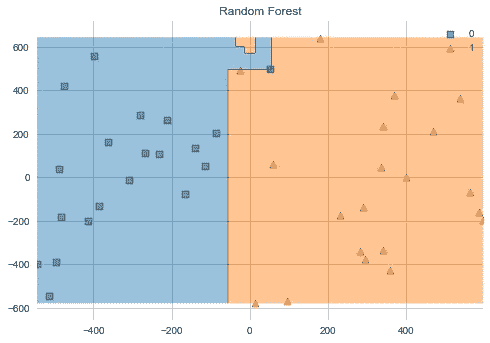
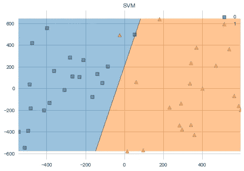
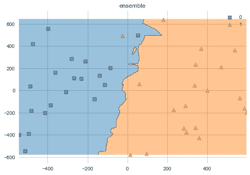

# 如何使用 Yellowbrick 和 Mlxtend 可视化机器学习中的任何东西(第 1 部分)

> 原文：<https://medium.com/analytics-vidhya/how-to-visualize-anything-in-machine-learning-using-yellowbrick-and-mlxtend-39c45e1e9e9f?source=collection_archive---------6----------------------->



黄砖官方文件上的照片

*这是关于在 ML 中可视化一切的两部分故事的第一部分，其中我们将可视化数据、ML 模型、使用可视化进行超参数调整并可视化结果。在这一部分，我们将把数据和 ML 模型可视化。*

最近我正在用机器学习写一篇研究论文，而研究论文中最重要的东西之一就是图表和可视化。我们可以可视化我们的数据，通过各种 ML 算法获得的预测和最终结果。这也有助于更好地理解我们的数据，帮助我们为我们的工作选择合适的分类器。在这篇文章中，我们调查了使用 Yellowbrick 和 Mlxtend 的机器学习的可视化。

# **什么是黄砖？**

根据其文档，“Yellowbrick 扩展了 Scikit-Learn API，使模型选择和超参数调整更加容易。在引擎盖下，它使用 Matplotlib。”使用 Yellowbrick，我们可以执行特征、分类、回归、聚类、模型选择、目标甚至文本可视化。我们甚至可以使用它来可视化超参数调整，从而获得给定任务的最佳超参数。更多信息请参考官方[文档](https://www.scikit-yb.org/en/latest/)。

Yellowbrick 需要 python 3.4 以上和 scikit-learn 0.20 以上和 matplotlib 3 . 0 . 1 以上版本才能最好的工作。使用 pip 安装

```
$ pip install yellowbrick
```

为 anaconda 安装 conda

```
conda install -c districtdatalabs yellowbrick
```

Yellowbrick 的主要接口是一个**可视化器**，它是一个 scikit-learn 估计器对象，从数据中学习以产生可视化。使用 fit()导入、初始化和拟合可视化工具，以开发可视化工具。可视化工具 API 由三种主要方法组成:

*   draw():向轴添加可视元素。
*   finalize():添加更精细的细节，如图例、标题、轴、标签等。
*   poof():显示可视化工具或将它保存到磁盘。

# 什么是 Mlxtend


Mlxtend 是一个用于数据科学的有用工具的 python 库，它可以用于绘制不同的机器学习算法和集成学习(集成学习是一种组合各种机器学习算法的方法，以便减少方差和提高预测)。

使用 pip 安装

```
pip install mlxtend
```

使用 conda 安装

```
conda **install** mlxtend *--channel conda-forge*
```

# 使用 Yellowbrick 的数据可视化

数据可视化是获取数据(信息)并将其放入可视化设置(例如，指南或图表)的演示。对于大数据和数据分析项目，数据可视化尤为重要。它们用于可视化数据空间中的实例，以便识别可能影响下游拟合的突出显示。使用 Yellowbrick，我们可以执行等级可视化、PCA 投影、流形可视化等等。在我的论文中，我使用了 PCA 和流形可视化，这将在下面讨论

*   **PCA** 利用正交变换将高维数据分解成二维或三维，以散点图的形式绘制每个实例。[这篇](https://towardsdatascience.com/a-one-stop-shop-for-principal-component-analysis-5582fb7e0a9c)是一篇很棒的文章，可以阅读更多相关内容。

```
from yellowbrick.features.pca import PCADecomposition
from yellowbrick.draw import manual_legend
import matplotlib.pyplot as pltdef visual_pca(x_train, y_train):
    plt.figure()
    colors = np.array(['b' if yi else 'r' for yi in y_train])
    visualizer = PCADecomposition(scale=True, color=colors)
    visualizer.fit_transform(x_train, y_train)
    manual_legend(visualizer, ('real', 'forged'), ('b', 'r'))
    visualizer.poof(outpath="pca.png")   
    plt.close()
```



*   **流形**可视化工具利用流形学习将多个维度降维为两个。流形捕捉非线性结构，因为它们使用最近邻方法。许多不同的算法具有不同的属性和时间复杂度，如 lle、hessian、isomap、spectral、tsne 等。Lle 和 isomap 在本文中使用，将在下面讨论。

1.  **局部线性嵌入(LLE)** 对数据进行低维投影，并保持局部邻域内的距离。这类似于一系列局部主成分分析，它们被全局比较以找到最佳非线性嵌入。

```
from yellowbrick.features.manifold import Manifold
import matplotlib.pyplot as pltdef visual_tsne(x_train, y_train):
    plt.figure()
    y = np.array(['real' if yi else 'forged' for yi in y_train])
    visualizer = Manifold(manifold='lle', target='discrete')
    visualizer.fit_transform(x_train, y)
    visualizer.finalize()
    visualizer.poof(outpath="lle.png")
    plt.close()
```



2. **Isomap** 是一种低维嵌入，保持所有点之间的测地线距离。它是内核 PCA 的扩展。

```
from yellowbrick.features.manifold import Manifold
import matplotlib.pyplot as pltdef visual_isomap(x_train, y_train):
    plt.figure()
    y = np.array(['real' if yi else 'forged' for yi in y_train])
    visualizer = Manifold(manifold='isomap', target='discrete')
    visualizer.fit(x_train, y)
    visualizer.poof(outpath="isomap.png")
    plt.close()
```



# 使用 Mlxtend 可视化 ML 模型预测

可视化 ML 模型有助于我们清楚地看到我们的模型是如何执行的，并且它还可以生成很好的图形😁。深入了解不同的算法如何对边界进行不同的分类是非常重要的，通过充分的练习，我们可以看到数据并了解哪个分类器工作得最好。我们将设想额外的树木，KNN，随机森林和 SVM。要阅读更多关于 [SVM](https://towardsdatascience.com/support-vector-machine-introduction-to-machine-learning-algorithms-934a444fca47) 、 [KNN](https://towardsdatascience.com/machine-learning-basics-with-the-k-nearest-neighbors-algorithm-6a6e71d01761) 和[额外的树和随机森林](https://towardsdatascience.com/an-intuitive-explanation-of-random-forest-and-extra-trees-classifiers-8507ac21d54b)点击这里。我们还将使用 mlxtend 通过组合所有这些预测来制作集成分类器。

Mlxtend 有一个缺点，我们一次只能绘制任意两个特征之间的关系，其余的特征需要作为填充值传递。这个 [stackoverflow 问题](https://stackoverflow.com/questions/52952310/plot-decision-regions-with-error-filler-values-must-be-provided-when-x-has-more/58116303#58116303)准确地描述了这一点。但是，在传入 mlxtend 'plot_decision_regions '之前，我们可以使用 PCA 执行维度缩减，将维度缩减为两个，或者您可以传递填充值，如 stackoverflow 问题的答案中所给。

```
from mlxtend.classifier import EnsembleVoteClassifier
from mlxtend.plotting import plot_decision_regions
import matplotlib.pyplot as plt
from sklearn.decomposition import PCAdef visual_ml(clf1, clf2, clf3, clf4, X, y):
    y = np.array(y, dtype = np.uint)
    pca = PCA(n_components = 2)
    X = pca.fit_transform(X)
    eclf = EnsembleVoteClassifier(clfs = [clf1, clf2, clf3, clf4], verbose = 2)
    labels = ['KNN',
          'Extra Trees',
          'SVM',
          'Random Forest',
          'ensemble']
    for clf, lab in zip([clf1, clf2, clf3, clf4, eclf], labels):
        clf.fit(X, y)
        plt.figure()
        fig = plot_decision_regions(X=X, y=y, clf=clf)
        plt.title(lab)
        plt.show()
        plt.close()
```



可视化 ML 模型



mlxtend 得到的系综模型

这是第一部分。在第二部分，我们将可视化超参数调整和结果。