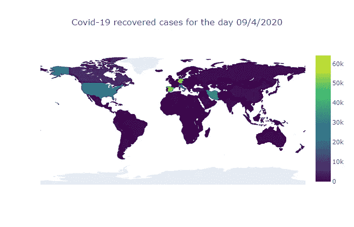
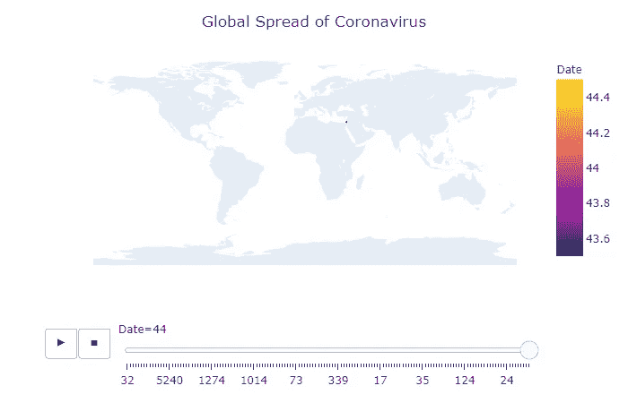

# 如何有效地形象化新冠肺炎

> 原文：<https://medium.com/analytics-vidhya/how-to-visualize-covid-19-in-an-effective-way-3f9092cfe15a?source=collection_archive---------24----------------------->


在 [Unsplash](https://unsplash.com?utm_source=medium&utm_medium=referral) 上由 [Adeolu Eletu](https://unsplash.com/@adeolueletu?utm_source=medium&utm_medium=referral) 拍摄的照片

在这篇文章中，我将向你展示如何使用 python 库来可视化新冠肺炎·疫情。

在这篇文章的结尾你会得到这样的结果:



静态 Choropleth 图

用于生成此输出的库有:

# Numpy

它是 Python 编程语言的一个库，增加了对大型多维数组和矩阵的支持，以及对这些数组进行操作的大量高级数学函数。

# 熊猫

pandas 是一个为 Python 编程语言编写的软件库，用于数据操作和分析。

# Plotly

**Plotly Python** 库是一个交互式的开源绘图库，支持 40 多种独特的图表类型，涵盖了广泛的统计、金融、地理、科学和三维用例。

构建在 **Plotly** JavaScript 库之上。

# Plotly Express

它是一个新的高级 **Python** 可视化库。它是 **Plotly.py** 的包装器，为复杂的图表提供了简单的语法。

# 图形 _ 对象

这个包为所有 Plotly 的图形对象导入定义。

包 graph_objs 和模块 graph_objs 的原因是为了给用户提供更清晰的 API。

在下面的源代码中，我只关注了一天的恢复案例，即 2020 年 9 月 4 日。

```
# Import libraries
import numpy as np 
import pandas as pd 
import plotly as py
import plotly.express as px
import plotly.graph_objs as gofrom plotly.subplots import make_subplots
from plotly.offline import download_plotlyjs, init_notebook_mode, plot, iplotinit_notebook_mode(connected=True)# Load data frame and tidy it
df = pd.read_csv('time_series_covid_19_recovered.csv')#convert the column '4/9/2020' type to string
df['4/9/2020'].apply(str)# Rename columns
df = df.rename(columns={'Country/Region':'Country'})
df = df.rename(columns={'4/9/2020':'Date'})# Create the Choropleth
fig = go.Figure(data=go.Choropleth(
    locations=df['Country'], # Spatial coordinates
    z = df['Date'], # Data to be color-coded
    locationmode = 'country names', # set of locations match entries in `locations`
    colorscale = 'Viridis',
    marker_line_color = 'black',
    marker_line_width = 0.5,
))
fig.update_layout(
    title_text = 'Covid-19 recovered cases for the day 09/4/2020',
    title_x = 0.5,
    geo=dict(
        showframe = False,
        showcoastlines = False,
        projection_type = 'equirectangular'
    )
)
fig.show()
```

要获得一个动态 choropleth 地图，应该进行下面代码中提到的更新:

```
# Import libraries
import numpy as np 
import pandas as pd 
import plotly as py
import plotly.express as px
import plotly.graph_objs as gofrom plotly.subplots import make_subplots
from plotly.offline import download_plotlyjs, init_notebook_mode, plot, iplot
init_notebook_mode(connected=True)# Load data frame and tidy it
df = pd.read_csv('time_series_covid_19_recovered.csv')#convert the column '4/9/2020' type to string
df['4/9/2020'].apply(str)# Rename columns
df = df.rename(columns={'Country/Region':'Country'})
df = df.rename(columns={'4/9/2020':'Date'})# Creating the visualization 
***#start of the update*** 
**fig = px.choropleth(df, 
                    locations="Country", 
                    locationmode = "country names",
                    color="Date", 
                    hover_name="Country", 
                    animation_frame="Date"
                   )
*#end of the update***
fig.update_layout(
    title_text = 'Covid-19 recovered cases for the day 09/4/2020',
    title_x = 0.5,
    geo=dict(
        showframe = False,
        showcoastlines = False,
    ))

fig.show()
```

输出:



动态 Choropleth 图

# 结论:

choropleth 地图显示划分的地理区域或地区，这些区域根据数字变量进行着色。

它允许研究一个变量如何沿着一个领域演化。

它是一种强大且广泛使用的数据可视化技术。

然而，它的缺点是面积越大的区域在地图解释中的权重越大，这就包含了偏差。

# 感谢阅读！

如果你喜欢我的工作，喜欢支持我…

*   在 twitter 上关注我[这里](https://twitter.com/zelakioui)
*   在 facebook 上关注我[这里](https://www.facebook.com/zelakioui)
*   在我的 [**Youtube 频道**](https://www.youtube.com/channel/UCU_LhClyNOtEQw7R0q9ovoQ) 上订阅，我分享了许多类似这样的精彩内容，但都是视频
*   看看我的博客网站[selcote.com](http://selcote.com/)

# 资源

[](https://www.kaggle.com/vignesh1694/covid19-coronavirus) [## 新冠肺炎冠状病毒数据集

### 约翰·霍普斯金发布的冠状病毒数据

www.kaggle.com](https://www.kaggle.com/vignesh1694/covid19-coronavirus)