# 如何可视化描述性统计函数

> 原文：<https://medium.com/analytics-vidhya/how-to-visualize-pandas-descriptive-statistics-functions-480c3f2ea87c?source=collection_archive---------2----------------------->

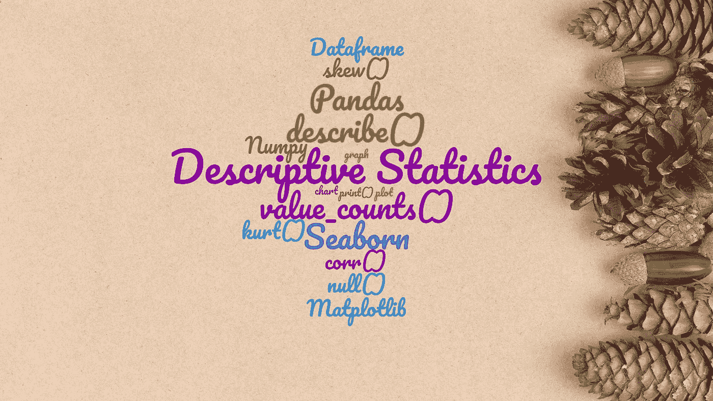

你想熊猫描述统计函数像 describe()，value_conuts()输出可视化。如果是这样，那么这篇文章是给你的。在本文中，您将学习如何使用 seaborn 的复杂可视化工具从描述性统计数据中绘制图形和图表。

描述性统计有助于发现关于数据集的许多有价值的见解。视觉化为这些见解提供了视角。统计和可视化携手并进，帮助您找到数据隐藏的一面。

# 为什么 Seaborn 要进行可视化？

Seaborn 具有简单的界面，使图表和绘图看起来引人入胜。它们是可定制的，所以你可以得到你想要的外观:定制颜色，字体和背景。它构建在 Matplotlib 之上，并与 pandas 数据结构紧密集成。

## **属地**

Python 2.7 或 3.5+，seaborn (>= 0.7.0)，numpy (>= 1.9.3)，scipy (>= 0.14.0)，matplotlib (>= 1.4.3)，pandas (>= 0.15.2)，statsmodels (>= 0.5.0)

> **注:基本的描述统计学和可视化知识是理解本文所必需的。**

从导入依赖项开始。

```
import pandas as pdimport matplotlib.pyplot as pltimport numpy as npimport seaborn as sns
```

## **加载数据集进行可视化**

我使用零售数据集进行数据可视化。Kaggle 上有各种类型的数据集。你可以选择其中一个来关注这篇文章。

```
train_data = pd.read_csv(‘train.csv’)test_data = pd.read_csv(‘test.csv’)train_data[‘source’] = ‘train’test_data[‘source’] = ‘test’# Combine both train and test data.combined_df = pd.concat([train_data, test_data], ignore_index=True)print(combined_df)
```

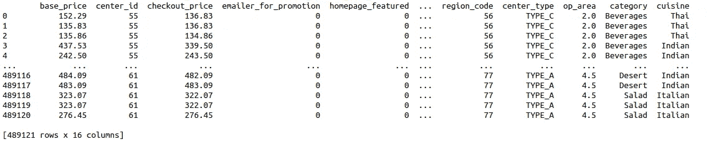

测试+训练数据

```
total_columns = combined_df.columns# store numerical and categorical column in two different variables. It comes handy during visualizaion.num_col = combined_df._get_numeric_data().columnscat_col = list(set(total_columns)-set(num_col))
```

# **绘图描述()功能**

Pandas describe()函数计算数据框或一系列数值的百分位数、平均值、标准差、计数和 IQR 值。

```
# By default describe() function only consider Int and float data type variables for calculation.combined_df.describe()
```

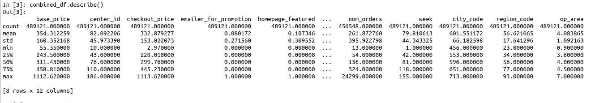

描述()输出

```
describe_num_df = combined_df.describe(include=[‘int64’,’float64'])describe_num_df.reset_index(inplace=True)# To remove any variable from plotdescribe_num_df = describe_num_df[describe_num_df[‘index’] != ‘count’]for i in num_col: if i in [‘index’]: continue sns.factorplot(x=”index”, y=i, data=describe_num_df) plt.show()
```

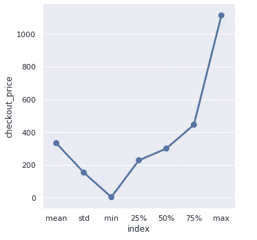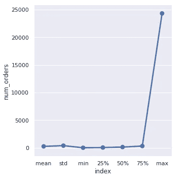

**描述()输出图**

# **在数据集中绘制空值**

空值是数据集中缺少的值。

```
null_df = combined_df.apply(lambda x: sum(x.isnull())).to_frame(name=”count”)
print(null_df)
```

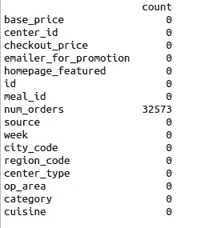

**数据中的空计数**

```
plt.plot(null_df.index, null_df[‘count’])plt.xticks(null_df.index, null_df.index, rotation=45,
horizontalalignment=’right’)plt.xlabel(‘column names’)plt.margins(0.1)plt.show()
```

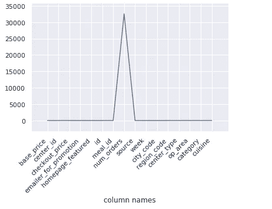

**空值图**

# 为分类变量绘制 value_counts()函数。

value_counts()函数计算包含唯一值计数的序列。系列按降序排列，因此第一个元素是出现频率最高的元素。默认情况下，它不包括空值。

```
for i in cat_col: if i in [‘source’]: continue plt.figure(figsize=(10, 5)) chart = sns.countplot( data=combined_df, x=i, palette=’Set1' ) chart.set_xticklabels(chart.get_xticklabels(), rotation=45) plt.show()
```

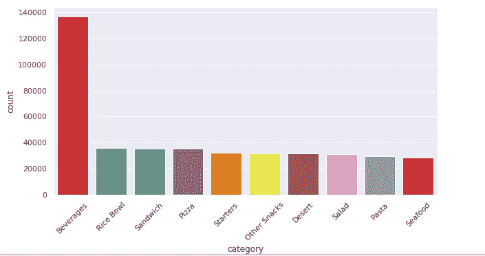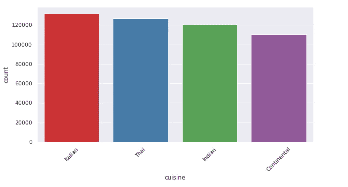

**分类列的 value_count()图**

# 绘制数值变量的数值计数。

数值型变量不宜使用 value_counts 函数。但如果你这样做，使用它与熊猫过滤功能或 seaborn 内置功能。

```
for i in num_col: if i in [‘source’]: continue plt.figure(figsize=(10, 5)) chart = sns.countplot( data=combined_df, x=i, palette=’Set1',# This option plot top category of numerical values. order=pd.value_counts(combined_df[i]).iloc[:10].index ) chart.set_xticklabels(chart.get_xticklabels(), rotation=45) plt.show()
```

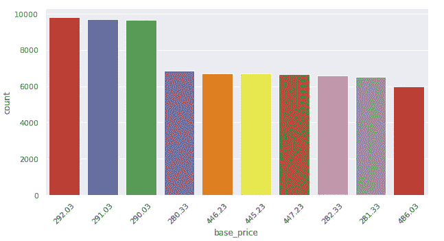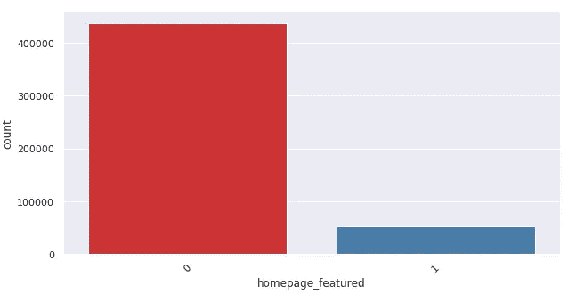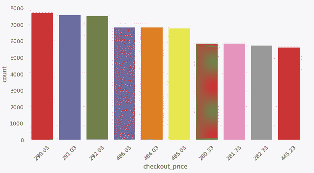

**数值列的 value_count()图**

# skew()和 kurt()函数的绘制。

skew()函数用于计算数据的偏斜度。它代表了分布的形状。偏斜度可以被量化以定义分布与正态分布的不同程度。

用于计算数据峰度的 kurt()函数。峰度是分布的厚度或密度的量度。它代表分布的高度。

```
skew = {}kurt = {}for i in num_col:# to skip columns for plotting if i in [‘num_orders’]: continue skew[i] = combined_df[i].skew() kurt[i] = combined_df[i].kurt()print(skew)
```

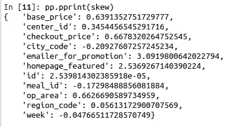

**列的偏斜度值**

```
plt.plot(list(skew.keys()),list(skew.values()))plt.xticks(rotation=45, horizontalalignment=’right’)plt.show()
```

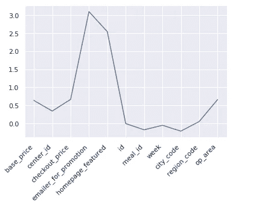

**偏斜度值图**

```
print(kurt)
```

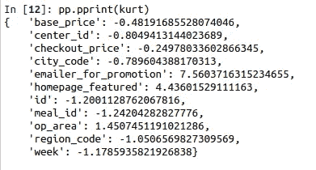

**柱的峰度值**

```
plt.plot(list(kurt.keys()),list(kurt.values()))plt.xticks(rotation=45, horizontalalignment=’right’)plt.show()
```


**峰度值图**

# corr()函数的绘制。

corr()用于查找数据帧中所有列的成对相关性。计算中排除的缺失值。相关性揭示了数据集中变量之间复杂和未知的关系。最常见和默认的相关系数是皮尔逊相关系数。

```
corrmat = combined_df.corr()print(corrmat)
```

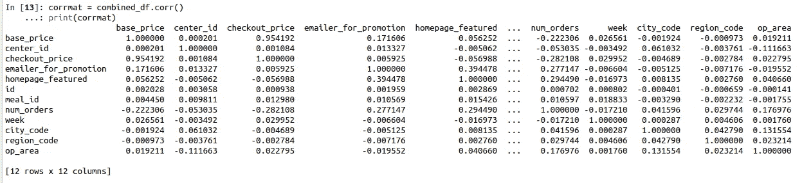

**列间关联**

```
plt.figure(figsize=(13, 6))sns.heatmap(corrmat, vmax=1, annot=True, linewidths=.5)plt.xticks(rotation=30, horizontalalignment=’right’)plt.show()
```

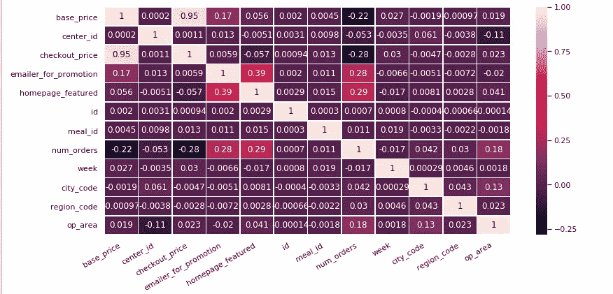

**关联热图**

这导致我们来到这篇文章的结尾。希望本文能让您对 pandas 和 seaborn visualization 中可用的描述性统计分析功能有一个基本的了解。

请告诉我您对[maillearnfromdata@gmail.com](mailto:maillearnfromdata@gmail.com)的看法或疑问。