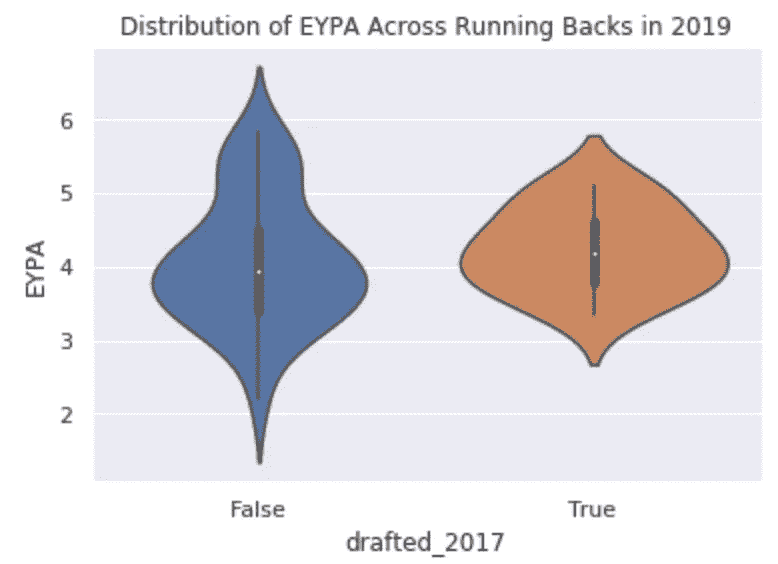

# 如何:在 Python 中可视化数据

> 原文：<https://medium.com/analytics-vidhya/how-to-visualize-your-data-in-python-a1dc46ad1f8d?source=collection_archive---------16----------------------->

由[桑德罗·舒赫](https://unsplash.com/@schuh?utm_source=medium&utm_medium=referral)在 [Unsplash](https://unsplash.com?utm_source=medium&utm_medium=referral) 上拍摄的照片

*这是 2017 年跑卫系列的第 3 部分，共 3 部分。点击* [*此处*](/@amanjaiman/how-to-manipulate-dataframes-in-pandas-31375623d859) *查看第二部分。*

任何与数据相关的问题都可以分为三个步骤:获取和清理数据，可视化和分析，然后解释分析以验证(或反驳)某个主张。

到目前为止，我们已经学会了如何从互联网上获取数据，并使用 Pandas 来清理我们的数据，并为分析做好准备。现在，我们将学习如何完成接下来的两步！让我们学习如何将数据可视化，以便从中得出一些意义。

> 在本期 How To 中，我们将学习如何使用 matplotlib 和 seaborn，利用我们已经清晰的数据框架创建不同类型的情节，这将让我们深入了解 2017 年 NFL 选秀和选秀中产生的跑卫。

# 可视化我们的数据

我们有自己的数据框架，但我们不能只看其中的数字来了解我们的跑卫。这就是可视化我们的数据发挥作用的地方。

## 用 Python 绘图

Python 中的许多图形库都可以使用数据帧。这些库帮助我们获取大量数据，并绘制成漂亮的图表，向我们展示趋势和见解。(而且可以做出好看的图形！)

我们将要使用的图形库是 [Matplotlib](https://matplotlib.org/) 和 [seaborn](https://seaborn.pydata.org/) (实际上基于 Matplotlib)。外面有很多很酷的图书馆，我鼓励你去探索自己。

> 我们将只讨论 Matplotlib 和 seaborn 的一些特性。你还可以做更多的事情！

首先导入必要的库:

让我们看看如何用 Matplotlib 绘图。我们要做的第一件事是通过解包`.subplots`函数来设置图形和轴。

`fig, ax = plt.subplots(figsize=(20,10)) # change the figure size`

这将为我们提供单独的图形和轴对象，然后我们可以添加绘图和文本(标题、标签等)。)到。

## 计数图

我们先来看看我们 2017 年的跑锋。让我们说，我们感兴趣的是，哪些会议在获得跑卫方面做得最好。我们可以使用 seaborn 的计数图来计算一列的唯一值，并显示这些值的图表。

为此，我们用必要的参数设置我们的轴`ax`到`sns.countplot`:我们想要使用哪一列，我们正在使用哪一个数据框架，并且可选地，如果我们想要绘制的值有一个顺序。如果你愿意，你可以使用 axes 对象来设置一个标题，然后最后是`fig.show()`。

ACC、Big 12 和 MW 会议正在向 NFL 输送人才。

你可以为这些情节疯狂，想展示什么就展示什么。再举一个例子，在你自己尝试之前，让我们看看有类似计数图的回合份额。

第 4 轮几乎每 4 个选秀权中就有 1 个是跑卫！

## LM 情节和小提琴情节

我们已经看了选秀数据，但这并没有告诉我们这些跑卫现在*做得怎么样*。让我们跳回到我们处理 2018 年和 2019 年数据的新数据框架。请记住，这些跑卫分别处于职业生涯的第二年和第三年，因此，如果他们中的大多数人都表现出高水平，我们可以得出结论，2017 年的跑卫确实技术高超。

来自足球局外人网站:

> **简单来说:DYAR 意味着一个更有总价值的跑锋。DVOA 意味着每场比赛更有价值的跑锋。**

这一次，我们将从使用 lmplot 开始，它绘制了数据点以及一条最佳拟合线。使用 lmplot，我们可以传入一个列作为`hue`，它根据列值设置颜色。我们希望将色调设置为`drafted_2017`列，这样我们就可以看到 2017 年选中的球员和没有选中的球员之间的差异。这样，我们可以展示许多不同的东西。

要绘制 2019 年的数据，我们可以使用相同的格式，并在必要时更改列名(成功率的名称略有不同)，以及数据来自哪个数据框架。

左:平均而言，2017 RBs 往往每次跑的码数更多(对于跑了~120 次以上的跑卫来说，这是合理的)。

当看总价值时，2017 RBs 似乎比非 2017 RBs 更有效率。他们的码数:DYAR 比率具有更高的斜率，DYAR:TD 比率也是如此，在跑卫第四次触地得分后，这一比率开始好于非 2017 年苏格兰皇家银行。

从这些图表中，我们可以看到，在大多数情况下，2017 年的后卫比 2018 年联盟中的其他跑后卫表现出更高的整体水平！最有趣的图表是 DVOA 对成功率的图表。Football Outsiders 网站告诉我们,“一个 DVOA 较高、成功率较低的球员会将长距离跑和混战中的唐斯混在一起。DVOA 较低且成功率较高的球员通常会获得所需的码数，但通常不会获得更多。”这意味着两者都很高是最好的情况:你的剧本是成功的，每部剧本都是有价值的。在我们的图表中，我们看到 2017 年 RBs 斜率更高，表明与非 2017 年 RBs 相比，与 DVOA 相关的成功率更高。

2019 年怎么样？我们可以假设这些跑锋会变得更好，因为他们会有更多的经验，但我们也可以假设其他跑锋会变得更好，赶上我们的水平。

似乎其他苏格兰皇家银行现在的表现与我们 2017 年的苏格兰皇家银行非常相似。

但有趣的是，他们的价值效率仍然高于其他苏格兰皇家银行。事实上，两个船厂:DYAR 和 DYAR:TD 比率都明显高于 2018 年。

这很有趣。乍一看，似乎所有的跑卫都表现出非常相似的水平。两组的每次跑步的估计码数实际上是一样的，DVOA 和成功率的图表似乎太集中在中间了。然而，当我们看价值效率时，我们可以看到 2017 年的跑锋仍然做得更好。所以可能到了 2019 年，整体技能差距有所减小。

所以`sns.lmplot`可以告诉我们一些很酷的事情。让我们探索最后一种类型的图表:小提琴图。

小提琴图是一个箱形图，它也显示了图内的密度。这意味着它不仅会告诉我们数据的中位数和四分位数，还会告诉我们数据的分布；是否以中间值为中心，左偏还是右偏，等等。

> 注意:记住，在我们的例子中，中位数是一个很好的统计数据，因为它是**稳健的**。这意味着它不受分布中异常值或其他缺陷的影响。(另一方面，均值并不稳健，因为一个非常高的异常值可能会提高均值，并导致我们对整个群体的评价很高，而事实并非如此)。

你可能认为实现一个小提琴的情节和我们看到的其他情节一样简单，你是对的！`sns.violinplot`有一些我们可以传入的可选参数，但是在我们的例子中，我们只告诉它数据源和两个轴。

我们可以简单地改变数据源，我们还会有我们的 2019 小提琴图！

哇漂亮的小提琴。

在这里我们看到了我们两组(2018 年)每次有效码数和每次有效码数的分布和统计值。进入联盟仅一年后，2017 年被选中的跑卫在 EYPA 和 YPA 的中值都较高。EYPA 多了整整一码！这本身并不重要，但小提琴图也告诉我们，这些跑卫的分布是正常的(除了 YPA 的非 2017 跑卫)，这意味着他们中的大多数都接近中位数。

有了这个，我们可以说**2017 年选秀的大多数**跑卫比 2017 年没选秀的跑卫有更高的 YPA，更重要的是 EPYA。现在让我们看看这种情况是否会持续到 2019 年。

同样，我们看到这些图是正态分布的，所以跑锋的表现接近中间值。(然而，我们仍然看到，对于 YPA 来说，2017 年未被选中的跑卫有一个奇怪的分布。)中间值已经非常接近:对于 EYPA，中间值的差异似乎只有大约 0.2 码，而对于 YPA，它们看起来几乎相同。这证明了我们在 lmplots 中看到的，我们看到两组之间的差距缩小了。

## 结论

哇！我们能够制作代表我们的数据的图像，并学会了如何从数据中得出结论。根据我们收集的信息，2017 年被选中的跑卫**在第二年就席卷了联盟，并且表现出比其他跑卫高得多的水平**。在他们的第三年(过去的 NFL 赛季)，这两个群体在表现上旗鼓相当，但在许多主要类别中，我们 2017 年的跑卫仍然比其他人表现得稍高。

我希望这套教程教会了你以下几点:

1.  **数据就在我们身边，你只需要走出去找到你要找的东西。**
2.  使用 requests 和 BeautifulSoup，您可以查询 web 并获取 HTML(然后 Pandas 允许您将其存储为 DataFrame)。
3.  Pandas 是一个很棒的库，允许用它的内置函数(iterrows、loc 等)操作数据。)
4.  我们可以使用这些数据框架，通过 matplotlib 和 seaborn，**可视化我们的数据，从数据中得出结论**。

这是需要记住的最重要的事情:通过观察数据，我们可以发现一些肉眼通常看不到的东西。

*本教程的完整代码如下:*

*一如既往，我很想听听你对这篇文章的看法！将任何问题或意见发送至*[*amanjaiman@outlook.com*](mailto:amanjaiman@outlook.com)*。*