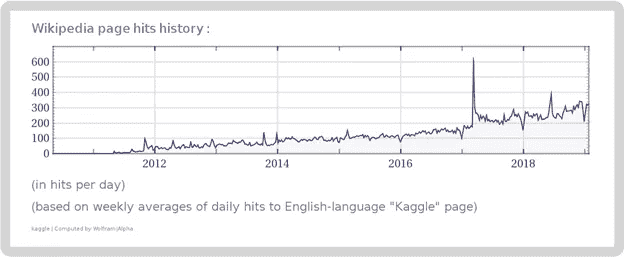
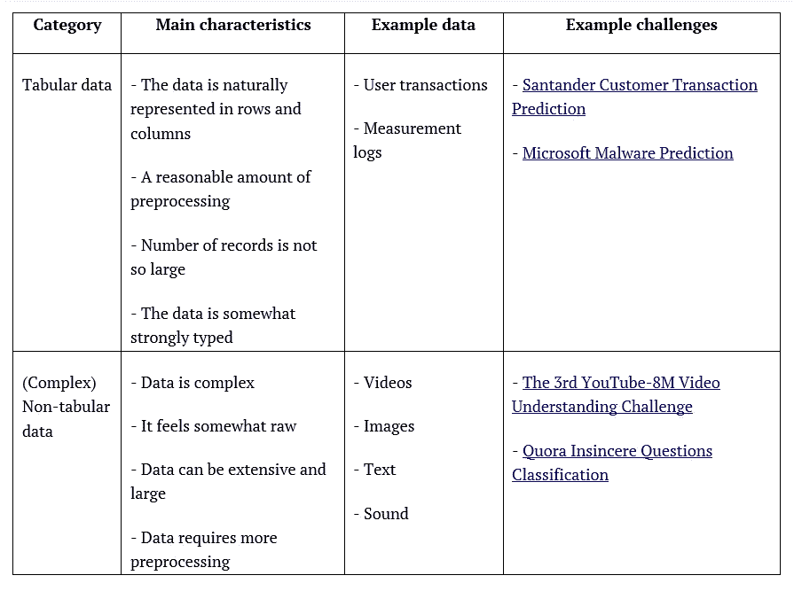
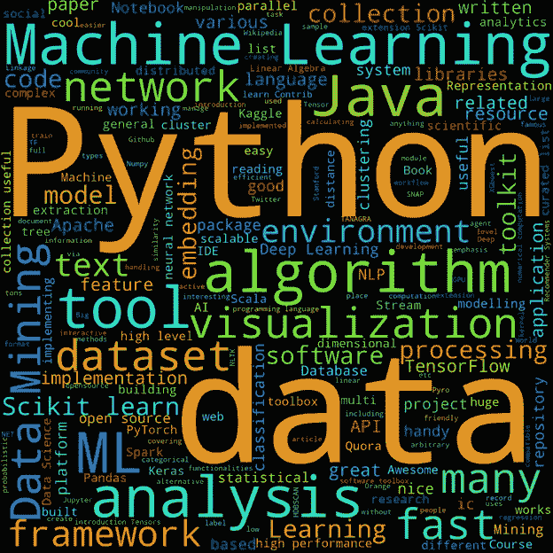
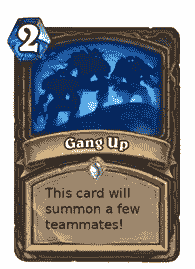
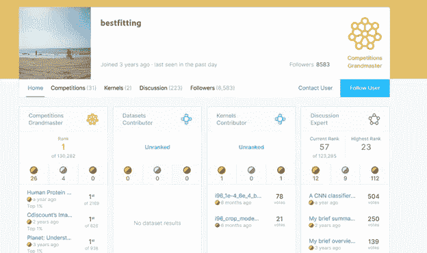

# 如何赢得 Kaggle 的数据科学挑战赛？

> 原文：<https://medium.com/analytics-vidhya/how-to-win-a-data-science-challenge-in-kaggle-9f884ecf904?source=collection_archive---------17----------------------->

# **简介**

这篇文章的主题是关于在 Kaggle 的数据科学竞赛中赢得或至少获得一个下降的顶级名次。它主要是为普通观众写的。现在每个人都在谈论数据科学、人工智能和机器学习，以及世界的未来如何取决于与这些热门话题相关的技术。在这种背景下，Kaggle 是数据科学爱好者的天堂。

# **什么是 Kaggle？**

“Kaggle 是 Google LLC 的子公司，是一个由数据科学家和机器学习实践者组成的在线社区。Kaggle 允许用户查找和发布数据集，在基于网络的数据科学环境中探索和构建模型，与其他数据科学家和机器学习工程师合作，并参加竞赛以解决数据科学挑战。”— [维基百科](https://en.wikipedia.org/wiki/Kaggle)

Kaggle 最大胆的特点是，目前，它是数据科学竞赛事实上的举办地。例如，许多大公司，如微软、谷歌和脸书，因为不同的原因在 Kaggle 进行了各种各样的竞争。发布挑战的原因可能包括获得宣传、招募人才、利用廉价劳动力，但最重要的是，收集关于他们(公司)如何解决数据驱动问题的新见解。

Kaggle 并不是一个新事物，但随着时间的推移，它可能会获得很多关注！

来源: [Wolfram Alpha](https://www.wolframalpha.com/input/?i=kaggle)

# **您为什么会有兴趣参加 Kaggle 比赛？**

对于大多数人来说，也可能有各种各样的好理由来参加 Kaggle 比赛，包括:

● **努力学习数据科学的技能并获得经验**。解决现实世界的数据科学问题是困难的，一些人认为你必须在某件事情上花费至少 10，000 个小时才能成为 it 专业人员

● **为你的职业生涯建立档案**。如果你想找一份与数据科学相关的工作，在简历中加入一份 Kaggle 简介可能是一件好事

● **为了钱**。大多数 Kaggle 挑战赛不会为获胜的顶级团队提供多少奖金，但仍然有一些高调的挑战，有数百万美元的奖金。有钱和没钱的挑战背后的动机是一种心理上的东西。奖项的金额并不重要，但它有助于聚集许多低收入阶层的人——让更多的人加入挑战

● **为了比赛的刺激，以及其中的酷的因素。对许多人来说，与他人竞争可能很有趣，这就像玩在线视频游戏一样，像是玩 [WoW](https://worldofwarcraft.com/en-us/) 或[堡垒之夜](https://www.epicgames.com/fortnite/en-US/home)这样的娱乐活动。还有，在 Kaggle 比赛有一种很酷的氛围；几年前，在新千年开始之际，很明显，计算的未来是扩大计算机的规模，这将带来新的技术和趋势。[集群计算(CC)](https://en.wikipedia.org/wiki/Computer_cluster) 过去和现在都是关键因素之一，您可以找到这样的描述来解释当时人们为何对 CC 如此感兴趣:**

o " *酷因素*:玩**集群**真的很酷。虽然这是一个纯粹的主观因素，但它已经推动了许多活动，特别是在年轻的从业者中，他们对上述许多授权问题做出反应，但也对开源软件的吸引力、无限的性能机会、支持自我激励的实验的沙盒思维以及**集群**的各个部分的微妙属性做出反应，在合作的基础上相互“交谈”以使事情一起发生。在该领域的贡献者中也有一种强烈的社区意识，这是一种吸引许多人的关联感的基础。与**商品集群**合作很有趣！”— [并行计算百科全书，施普林格](https://www.springer.com/gp/book/9780387097657)

我们可以——通过用正确的词(即数据科学、人工智能和人工智能)替换与集群计算相关的词(即**加粗的术语**)——使用几乎所有关于数据科学、人工智能和人工智能的诱人事物。

这里的中心假设是观众(你！)了解足够的算法，并编程到能够使用 Kaggle。我做的另一个重要假设是，人们通过实践学习效果最好！这篇文章并不试图教你如何做这些——能够编码；能够理解并实现算法；阅读和分析他人的模型——对你而言。

# 明智地选择你的挑战

在 Kaggle 中参加挑战的主要出发点是选择一个首先让你感兴趣的挑战——其次，你拥有应对挑战的技能和资源。对 Kaggle 中的挑战进行分类的一种方法是基于将用于比赛的数据的格式和形状。一般来说，你可以将基于这种方法的竞赛分为两种类型。首先是表格数据的挑战，在表格中，数据以自然的方式用列和行表示。第二种挑战是，数据并非天生就以记录行的形式提供或表示，而是打包成表格文件格式，如 CSV 或 MS Excel。下表显示了这两种挑战之间的主要区别:

基于数据的 Kaggle 竞赛的二元分类

这种分类并不完全准确，因为在许多比赛中，他们的数据可能是表格数据和非表格数据的混合；为了简单起见，让我们假设在本文中我们保持简单的分类:-)。

通常，您选择的挑战数据类型决定了您赢得挑战所需的技能，或者至少是在排行榜上名列前茅的技能。

# **学习你需要的技能**

在 Kaggle 竞赛中开始工作的最低要求是能够开发代码来提交预测。很多时候，人不是从零开始的；而是尝试用别人用 Python 或者 R 写的代码来启动。然而，要想在 Kaggle 中做任何严肃的事情，你需要掌握更多的技能。这些技能可以概括为以下几行:

*   对软件开发流程和相关工具有很好的理解
*   熟悉基本的机器学习和数据挖掘算法
*   善于分析的头脑
*   足够的关于**线性代数**、**最优化**和**统计学**的知识
*   足够的数据处理和管理工具和技术知识

下图是与上述所需技能相关的许多相关术语的不完整列表:

包含许多与数据科学挑战相关的重要术语和概念的词汇云

# **寻找队友**

在卡格尔比赛中，有一件很重要的事情可以帮到你，那就是找到其他人并与他们合作。你应该寻找的类型的人通常有两个特征，首先，他们应该在某些方面比你好，所以你可以希望通过与他们互动来学习和提高自己，可能是通过潜移默化。其次，他们最好应该与你有不同的思维方式，许多人在处理问题时有许多相似之处，但对于预测性 ML 挑战，具有一致思维方式的人不会有用！

和有新想法的聪明人一起工作会很有收获！

# **采用敏捷的工作流程**

构建预测模型背后的简单想法是，存在一个函数集合，这些函数接受一些输入变量，并对数据集中的标签或目标变量给出足够好的近似值。在挑战的生命周期中，你需要能够吸收新的想法，并将它们添加到你的模型中。它可以包括阅读其他人的代码、评论、回复和帖子，以找到和收集关于他们方法的有用信息。通常，困难的部分不是从其他人的工作和模型中找到有用的信息，而是以某种方式将他们的想法添加到你的工作流程中。问题是，通常当你开始一项挑战时，你从一个简单的模型开始，随着时间的推移，你的模型将变得越来越复杂，所以有一个迫在眉睫的问题，可能在挑战的某个点上，你的模型陷入挑战中使用的得分函数的局部最小值或最大值。

您应该尽可能地自动化，每次您构建和训练一个模型时，您可以注意到您的部分工作将会重复。如果您的工作流包含许多重复的子任务，那么您很有可能利用它来节省您的宝贵时间。数据再处理(例如，输入缺失值)、解释性数据分析(EDA)和特征工程等子任务是自动化的良好候选。

这本身就是一个有趣的挑战——如何建立一个高效、敏捷的数据科学工作流！

# **了解挑战描述**

请仔细阅读挑战描述，然后回答以下问题:

*   你知道挑战是什么类型吗？是分类、回归还是排名挑战？
*   挑战中使用的分数或误差函数是什么？为什么他们选择了这个特殊的功能？
*   该挑战是否要求您具备适当的领域专业知识？
*   训练和测试数据集有多大？
*   数据有多原始？你认为制作一个入门模型需要多长时间？
*   挑战是否需要您能够访问特定类型的资源？
*   是内核挑战吗？有哪些限制？
*   挑战的寿命有多长？能投入多少时间？
*   你以前有没有打算接受像这样的挑战？如果是，你能从以前的类似挑战中发现或重新利用什么？

回答这些问题的要点是在正确理解背景的情况下接受挑战。例如，如果构建一个模型需要大量的计算资源(即, [GPU](https://en.wikipedia.org/wiki/Graphics_processing_unit) s 或【】s ),或者关于数据的特定领域知识是一个关键优势，而你没有访问这两者的权限，你可能会希望在最终的私人领导者董事会中获得良好的地位，但最终只会让自己失望。

# **不要跳过探索性数据分析**

探索性数据分析是每个数据科学过程中非常重要的活动。这不是你可以通过读书学到的东西——它更像一门艺术，而不是一个工业过程。但是在 Kaggle 开始挑战的时候要非常认真。典型的 EDA 管道可能包含但不限于以下相关子任务:

*   使用单变量和多变量数据分析技术
*   数据可视化——可能包括降维步骤
*   统计假设检验
*   从数据中提取汇总统计数据
*   使用聚类、异常检测/异常检测、新奇检测技术

EDA 可能非常耗时，尤其是当数据集很大或者数据集非常原始时(即，它需要首先进行大量预处理)。主要思想是让数据和你说话！Kaggle 中有人准备了很棒的 EDA 内核，你可以从他们的工作中学习。

# **从强大的验证开始**

总是尽可能早地从构建模型的高质量验证开始。这项工作的要点是，在做任何事情之前，您应该确保您不会在验证或测试数据上过度拟合(或欠拟合)。理想情况下，当您准备好验证策略时，您在竞赛排行榜上获得的分数应该与您在验证中获得的分数大致相同。不过，说起来容易做起来难。当你有一个优秀的验证，你剩下的努力主要集中在三件事上——寻找或建立最好的特征，寻找最好的单个模型或集合，最后调整你的模型的超参数！

# 赢很难，所以准备输，但希望赢

为了能够赢得 Kaggle 比赛，你需要与来自世界各地的许多其他聪明和勤奋的人一起战斗。通常，要获得金牌，你必须在最终排行榜上占据前 10 到 15 名的位置，要获得银牌，你必须在前 5%以内，要获得铜牌，你必须不超过前 10%。很明显，获胜——也就是说，处于第一位——并不容易，因为许多你试图击败的人可能比你有独特的优势。赢得 Kaggle 挑战赛取决于许多因素，包括但不限于对数据领域知识的良好理解，可能有机会获得高端计算资源，从而在整个比赛中占据优势，对该领域的前沿算法有良好的掌握，最后要幸运！

一个好的策略可能是专注于利基市场。换句话说，试着在你占优势的特定挑战中竞争。例如，目前排名第一的 Kaggle， [bestfitting](https://www.kaggle.com/bestfitting) ，几乎完全专注于数据是图像数据集的挑战。他的方法的一个显著特点是，他在工作中大量使用深度神经网络。

在写这篇文章的时候，排名最高的卡格勒

# 结论

对你来说，赢得或获得一枚金牌显然不是一件容易的事情。你是对的；获胜是困难的，主要是因为它需要适量的工作、知识、经验以及非常重要的一点运气的混合。但是只要投入适当的时间和精力，并且幸运女神站在你这边，这并不是不可能实现的。