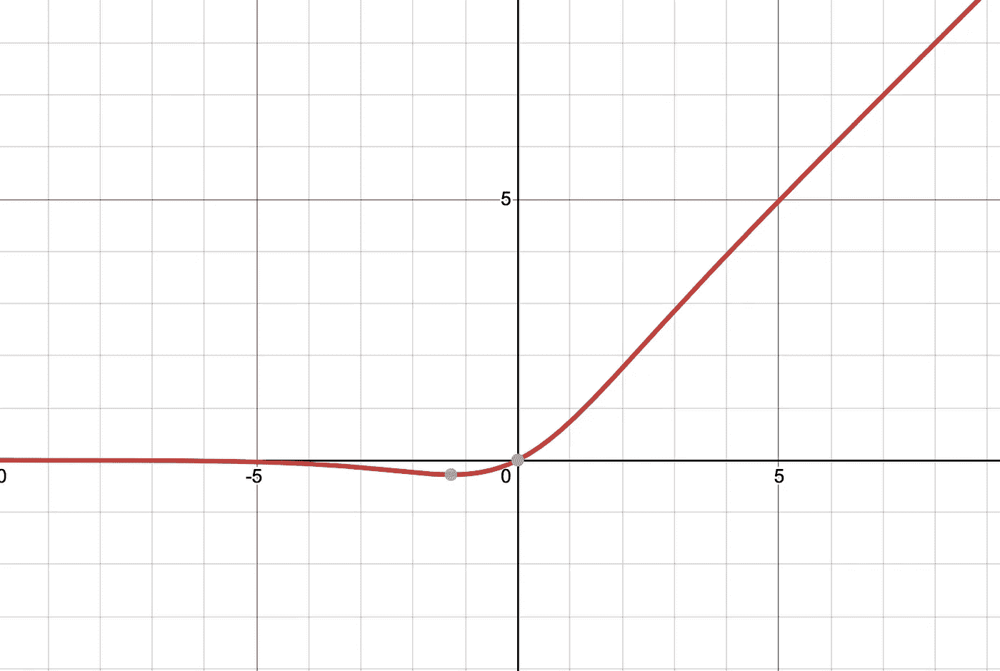

# 如何赢得一场 Kaggle 分类赛？

> 原文：<https://medium.com/analytics-vidhya/how-to-win-a-kaggle-classification-competition-bcf87273968e?source=collection_archive---------14----------------------->

声明:这篇文章是我的学习日志。

达雷布·贝克/盖蒂在[广告牌上的照片](https://www.billboard.com/photos/8030242/celebration-songs-about-winning-victory-success-dance-music)

Kaggle 是世界上最大的机器学习爱好者竞争和争光的平台之一。对于机器学习初学者来说，这也是一个很好的平台，可以学习和证明他们在行业中应用数据科学角色时的能力。

这篇文章包含 6 个简单的提示和技巧，帮助你在下一次 Kaggle 比赛(分类任务)中提高你的表现。

# 1.使用不同的优化器

Tensorflow 和 pyTorch 上都有许多不同类型的优化器。在他们当中，亚当乐观主义者和它的变体，那达慕通常是开始训练的好选择。Adam optimiser 一直被吹捧为一个高效快速的具有自适应特性的优化器。那达慕是简单的亚当与内斯特罗夫的势头。内斯特罗夫加速梯度(NAG)是由尤里·内斯特罗夫于 1983 年提出的。NAG 不是在局部位置测量损失函数的梯度，而是在动量方向稍微靠前的位置测量。这通常会导致更快、更准确的收敛。关于 NAG 的更多信息，请查看这篇文章:【https://dominikschmidt.xyz/nesterov-momentum/

但是，亚当和那达慕优化器并不是能够保证最佳性能的神奇优化器。就验证准确性而言，新币+动量或新币+动量+内斯特罗夫通常比亚当和那达慕表现得更好。因此，我建议你在训练的早期阶段总是从亚当/那达慕开始，在训练的后期阶段切换到新币+动量/新币+动量+内斯特罗夫。请查看这篇文章，了解不同优化者之间更详细的比较:[https://Shao anlu . WordPress . com/2017/05/29/SGD-all-the-one-is-the-best-optimizer-dogs-vs-cats-toy-experiment/](https://shaoanlu.wordpress.com/2017/05/29/sgd-all-which-one-is-the-best-optimizer-dogs-vs-cats-toy-experiment/)

图 1:不同优化器对猫和狗分类任务的验证准确性。图片摘自:[https://Shao anlu . WordPress . com/2017/05/29/SGD-all-the-one-is-the-best-optimizer-dogs-vs-cats-toy-experiment/](https://shaoanlu.wordpress.com/2017/05/29/sgd-all-which-one-is-the-best-optimizer-dogs-vs-cats-toy-experiment/)

# 2.使用不同的增强技术

在训练中采用不同的增强技术以允许模型学习输入数据的不同变化以及防止过度拟合是非常重要的。网上有太多花哨的增强技术，我将简要地提到其中的几个，它们通常对图像分类任务非常有用。警告:使用太多或错误类型的增强技术会损害你的表现。

## 2.1 随机剪切/剪切混合

随机剪切是一种随机阻挡部分输入图像技术。这种易于实现的技术可以有效地防止您的模型过度拟合输入数据。如果你的输入数据包含很多噪音信息，如价格标签、产品名称等，这种技术非常有用。

Cutmix 是一种技术，它从你随机选取的同一类的两幅图像(A 和 B)中随机剪切出一个小区域，并交换它们以生成两幅混合图像。

图 2:剪切混合技术。图片摘自:[https://forums . fast . ai/uploads/default/original/3X/d/0/d0c 959 C1 d 585438 e 9095 E1 ba 7 ee 3 deb 608 edec 9 a . JPEG](https://forums.fast.ai/uploads/default/original/3X/d/0/d0c959c1d585438e9095e1ba7ee3deb608edec9a.jpeg)

## 2.2 频道转换

频道偏移是一种通过从用户指定的范围中选择的随机值来随机偏移频道值的技术。如果你的分类任务中的主题可以有不同类型的颜色，这是很有用的。例如，狗、猫、塑料杯和汽车可以有许多不同的颜色。对于具有通用颜色的对象(如乌鸦)来说，这不是很有用。

为了保持这篇文章的简短，我不会涉及那些基本但有用的增强技术，比如旋转、剪切、缩放等等。请随意查看这篇令人惊叹的帖子以了解更多信息:[https://towards data science . com/exploring-image-data-augmentation-with-keras-and-tensor flow-a 8162d 89 b 844](https://towardsdatascience.com/exploring-image-data-augmentation-with-keras-and-tensorflow-a8162d89b844)

这些是我经常使用的一些图像增强资源:

1.  [https://github.com/albumentations-team/albumentations](https://github.com/albumentations-team/albumentations)
2.  [https://github.com/yu4u/cutout-random-erasing](https://github.com/yu4u/cutout-random-erasing)

# 3.Swish 激活功能

对于不同的机器学习任务，有许多不同种类的激活函数。通常，人们会选择 ReLU 激活函数或者它的变体，比如 leaky ReLU。然而，当涉及到非常深的网络的分类或机器翻译任务时，Swish activation 可能是比 ReLU 更好的选择。

Swish 激活函数:y = x * sigmoid(x)

图 3: Swish 激活功能

仔细观察，Swish 激活功能在 0 附近没有 ReLU 那样的突变。相反，它有一个非常平滑的曲线过渡。Swish 激活函数是 Ramachandran 等人在这篇[论文](https://arxiv.org/pdf/1710.05941v1.pdf)中提出的。作者声称，通过他们的大量实验，他们成功地证明了 Swish 在应用于各种挑战性领域(如图像分类和机器翻译)的深度网络上始终匹配或优于 ReLU。因此，在你未来的 Kaggle 比赛中，尝试一下 Swish 可能是个好主意。

# 4.蒙特卡洛辍学

辍学是深度学习中常用的正则化技术。它在训练阶段随机地使一部分神经元失活或“脱落”。这可以有效地减少相邻神经元之间的相互依赖性，迫使它们更有效地学习。通常，退出技术仅在培训阶段实施，在验证和测试阶段停用。

蒙特卡洛漏失是一种在测试阶段保持漏失层活动并集合 N 个预测结果的技术。这个想法听起来可能很奇怪，为什么我需要在验证和测试阶段移除部分神经元？嗯，你可以这样想。随机移除模型中的一些神经元将导致不同的网络结构。在测试阶段，将对每个样本进行 N 次预测。然而，由于漏失被激活的事实，N 个预测不是由同一模型做出的。实际上，对一个样本的预测是 N 个略有差异的不同模型的聚合结果。

Monte Carlo dropout 的美妙之处在于，它可以很容易地实现到任何具有 dropout 层的训练模型。这意味着不需要重新培训/修改。酷吧？

# 5.测试时间增加(TTA)

与上述数据扩充类似，TTA 对测试图像进行随机修改。测试数据集中的每个样本将增加 N 倍，并馈入模型以产生每个样本的 N 个不同预测。这 N 个不同的预测(在这种情况下是 softmax 概率)将被平均并产生最终的猜测。这个概念非常类似于系综的思想，将几个预测组合起来产生一个强有力的预测。

# 6.焦点损失和标签平滑

通常，当涉及多类分类问题时，使用类别交叉熵(CCE)损失函数。当数据集平衡时，CCE 很有用，这意味着每个类都有几乎相同数量的样本。然而，对于真实世界场景，这通常是不正确的。在现实世界中，收集的数据集通常是不平衡的。不平衡数据集会给训练带来麻烦，因为样本较少的类会被忽略，而更多的注意力会放在样本较多的类上。

焦点损失可以通过对难以分类的类别增加权重来克服这个问题，并减少对容易正确预测的影响。为了实现这一点，在 CCE 函数中增加了一个比例因子。该因子的值将随着预测置信度的上升(下降)而上升(下降)。这类似于人眼将注意力从背景转移到前景主体，因此称为焦点丢失。

当模型过度拟合和过度自信时，标注平滑很有用。标签平滑仅在实现交叉熵损失函数并且在最终层中使用 softmax 激活函数时适用。标签平滑将通过减少“1”的值并给其余部分一个非零值来平滑向量，而不是给每个样本仅一个“1”并给其余部分一个“0”。下面的公式说明了标注平滑:

> *y _ s*=(1—*α*)**y _ hot*+*α*/*K*

α是控制平滑程度的参数，而 K 是类的数量。α值越高，平滑程度越大，模型越不会过度自信。

> 过度自信的模型没有被校准，它的预测概率总是高于准确性。例如，对于精度仅为 0.6 的输入，它可能会预测 0.9。请注意，测试误差较小的模型仍然可能过于自信，因此可以从标签平滑中受益。(引自[来源](https://towardsdatascience.com/what-is-label-smoothing-108debd7ef06))

这就是我第一篇关于深度学习的中帖的结尾。机器学习是一个非常庞大且进展迅速的课题。如果这篇文章中有任何困惑或错误，请随时告诉我。如果你喜欢我的内容，请关注我并为我鼓掌。