# 机器学习中如何处理屏蔽数据？

> 原文：<https://medium.com/analytics-vidhya/how-to-work-with-masked-data-in-machine-learning-c2c040d6feca?source=collection_archive---------7----------------------->

如果你认为用标签数据推导有意义的关系和建立预测模型是困难的。

如果您拥有的数据由于某种原因被屏蔽，并且您不了解类别、标签或字段名称，该怎么办？。

长话短说——探索性数据分析和特征工程，但由于解决方案最好在问题得到解决时理解，我将向您介绍我对使用屏蔽数据的 kaggle 竞赛的解决方案。

卡格尔竞赛-梅赛德斯-奔驰绿色制造。

问题陈述-你能减少一辆奔驰花在测试台上的时间吗？。

性能指标- R 值，也称为[决定系数](https://en.wikipedia.org/wiki/Coefficient_of_determination)。

现在让我们看一看我们手头的数据。

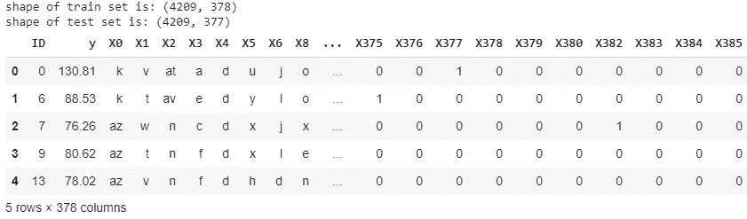

在上面的屏幕截图 ID 中，X0 到 X385 是数据集的特征，y 是输出变量(在测试台上花费的时间)。正如您所注意到的，特性名称是匿名的，想象一下另一种情况，其中给出了特性名称，然后它们可能会给我们提供非常有用的见解，例如:-特性可以是 4WD(1 或 0)测试一辆具有 4WD 的汽车可能需要在测试台上花费更多的时间，因为在这里不是这样，我们必须依靠统计测量来找到有用的特性。

该数据集也遭受维数灾难，因为数据集(377)中的特征数量相对于行数(4209)而言较高。

很多方法更关注建模部分，但是你应该记住垃圾输入就是垃圾输出。我们将执行下面列出的任务来解决这个问题。

1.  对数据执行 EDA，并获得尽可能多的见解
2.  因为我们有大量的维度，所以我们应该试着消除不需要的/不太重要的特征。
3.  通过利用从 EDA 中获得的知识来开发新功能。
4.  准备模型和评估解决方案。

**1。探索性数据分析:-**

从输出变量中移除异常值

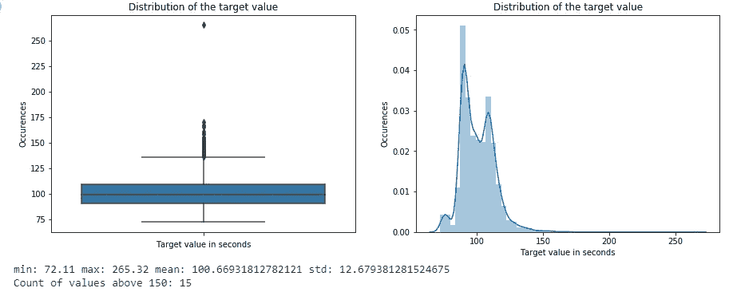

输出变量“y”的分布

从上面的图中我们可以看到，大多数点位于 75-150 之间，只有极少数点在 150 以上，因此我们认为这是所有数据点的上限。

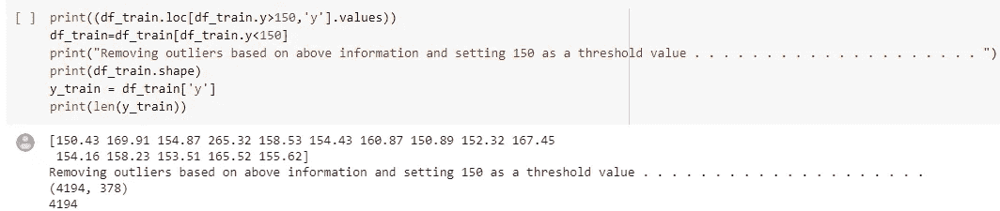

将输出变量的上限设置为 150。

特征的类型

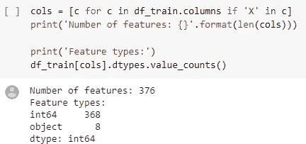

从上面的单元格中，我们可以看到特征的总数是 376，其中 368 个是数字的，8 个是分类的，还有一个输出变量。

现在让我们看看这些特征中有多少是二元的，有多少是恒定的。

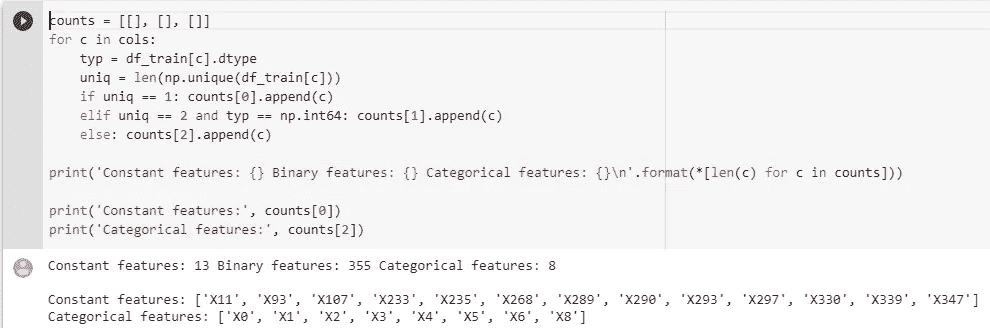

当有一个二元特征时，它总是有机会保持不变，因此对其进行检查是很重要的。在上面的单元格中，我们可以看到有 13 个常量特征，因为这些特征在我们的监督学习方法中没有价值，我们可以简单地删除这些特征。

单变量分析

分类变量的箱线图+条带图

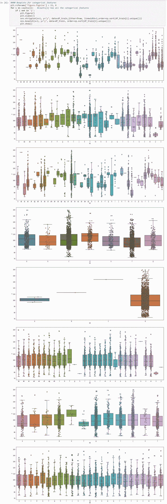

分类变量相对于输出变量的可视化

从上面的图中我们可以观察到以下情况:

1.  特征“X0”在不同类别之间的输出变量范围中具有良好的变化。
2.  一些类别，如功能“X1”中的“y”和功能“X5”中的“x ”,是测试时间短的良好指标。
3.  特征‘X4’不是非常有用，因为它没有给出好的区分。
4.  像“X3”、“X6”和“X8”这样的特征显示了大量的重叠，因此可能不是很有用。

检查功能“ID”是否有用

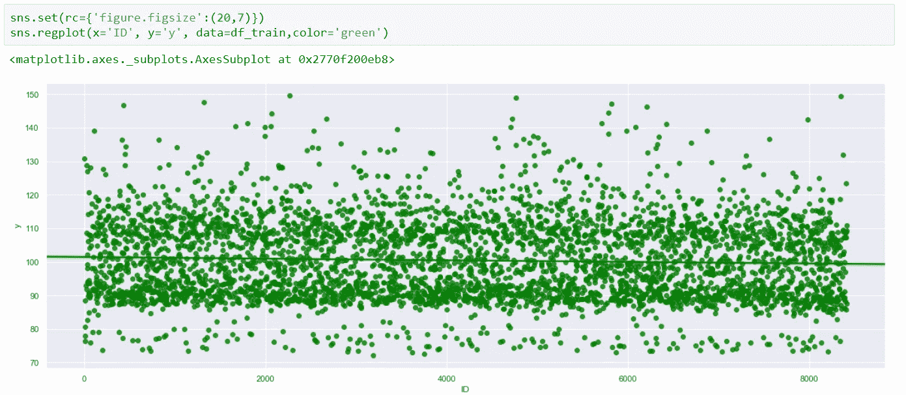

特征“ID”与输出变量的关系图

我们可以观察到，随着“ID”值的增加，输出变量有轻微下降的趋势，因此我们将在分析中考虑这一特征。

**2。特征移除(EDA 的扩展)。**

删除显示输出变量最小变化的分类特征。

从箱线图中可以注意到，分类特征 X8、X6、X4、X3 在类别之间几乎是不可区分的。

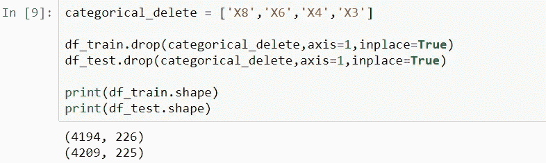

我们知道数据集中的大多数特征是二进制的，因此我们可以检查每个特征的方差，例如，如果有一个特征对于 99%的数据点是“1 ”,而对于其余的数据点是“0 ”,那么这个特征在我们的分析中可能不是非常有用，因此我们将移除所有方差非常低的特征。

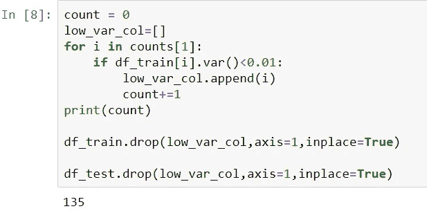

删除方差低的列

从上面的代码中我们可以看到，总共有 135 个特性有很大的差异。

移除重复的特征和与数据帧中的其他特征非常相似的特征。

可能会出现数据集中的要素重复或非常相似的情况，非常相似的一个例子是，如果我们有两个要素，其中一个是“混合动力”(判断汽车是否是内燃机和电动机的混合动力)，另一个是“电池组”(判断汽车是否有电池组)，现在可以肯定的是，每辆混合动力汽车都将有一个电池组，像这样的要素可能非常相似。

有许多相似性度量可供选择，参考[的论文](https://pdfs.semanticscholar.org/3d37/772bbc1823977ee584ecf559f2fdfacf8271.pdf)
[选择罗杰斯-坦莫托距离](https://docs.scipy.org/doc/scipy/reference/generated/scipy.spatial.distance.rogerstanimoto.html)，它非常类似于 Jaccard 距离，但它使用逐位运算。

为每对二元特征计算 Rogers-Tanmoto 距离并绘图。

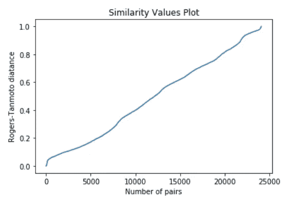

从上面的图中我们可以看到，在小于 0.1 的非常低的值处，存在一个拐点，我们将选择 0.006 作为阈值。

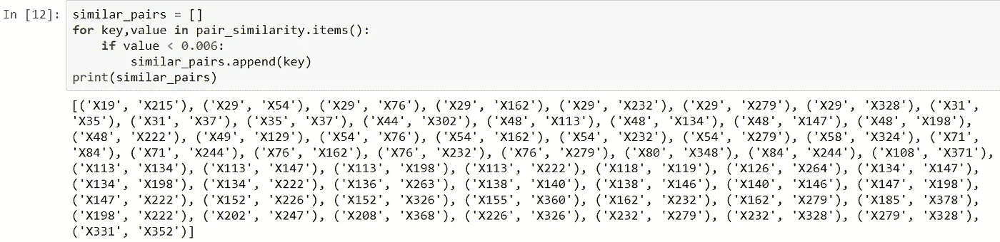

彼此非常相似的几对特征。

从每对要素中删除一个要素后，数据集中只剩下 192 个要素，与开始时的 376 个相比，这是一个相当大的下降。

**3。特征工程。**

功能“X0”聚类标签。

我们已经看到特征“X0”非常有用，因此我们将尝试使用该特征来对数据点进行聚类，以便每个数据点聚类可以代表一定范围的输出变量。使用 KNN 算法将数据点聚集在特征‘X0’上，总共形成四个聚类。“cluster_target_encoder()”负责在 KNN 模型上拟合数据。

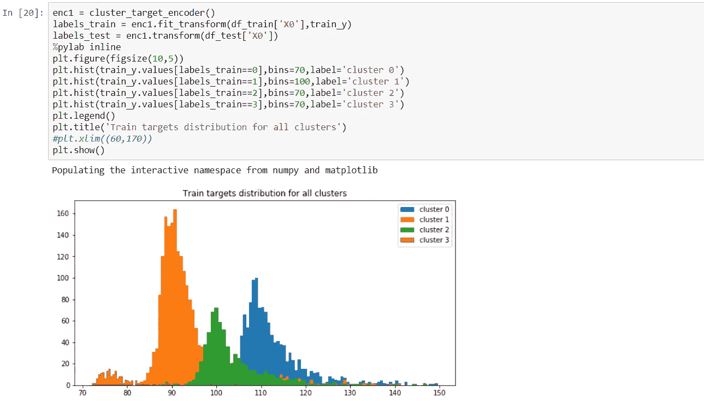

从上面的单元格中，我们可以看到，这些聚类有一些重叠，因此聚类标签可以用作一个新的特征。

特色学习者。

取所有的数字列(二进制)并形成它们的对或三元组，并找出这些对/三元组的和以形成潜在的新特征，新特征将基于其与输出变量的相关性进行评估。相关性最高的要素将作为新要素添加到我们的数据集中。为了比较连续变量(输出)和分类/二元变量，我们将使用[点-双列相关系数](https://docs.scipy.org/doc/scipy-0.14.0/reference/generated/scipy.stats.pointbiserialr.html)。

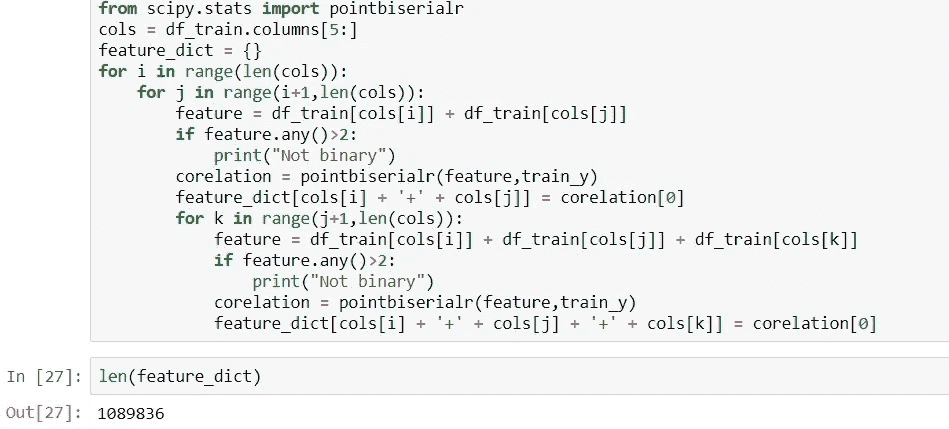

上述代码片段显示了新特征的形成和每个新特征与输出变量的点-双列相关系数的计算，该信息随后存储在字典“feature_dict”中，其中关键字是新特征的名称，值是点-双列相关系数值。

然后，我们选择具有高相关性的功能，下面的截图显示了添加的新功能。

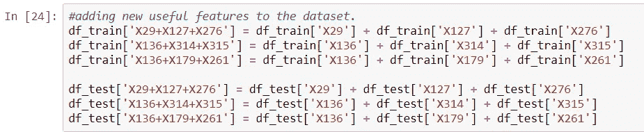

现在，为了测试我们新添加的特性是否有用，我们将使用一个简单的随机森林回归模型，并绘制特性的重要性。

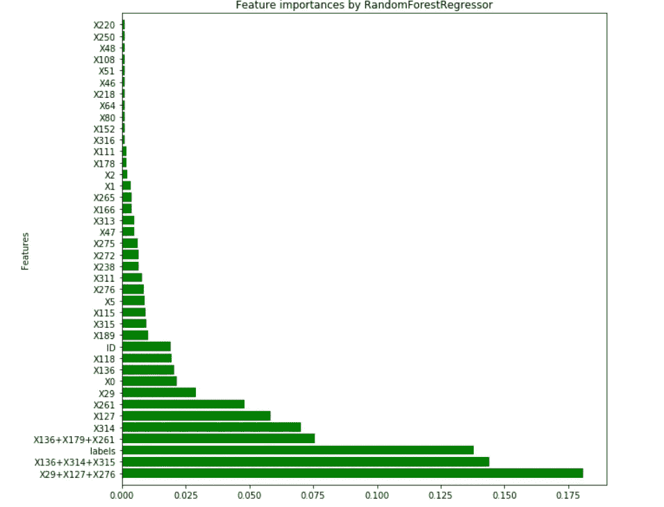

特征重要性

从上面的图中可以明显看出，工程特征，如三元组、由簇形成的标签，甚至 ID 特征，都属于最有用的特征。

相信我，最困难的部分已经完成了。

现在剩下的就是将数据输入到模型中，并进行一些基本的超参数调整。

**4。准备模型和评估解决方案。**

这里选择一个调优的 XGBoost 回归器作为模型，这里有一个例子说明调优是如何进行的。

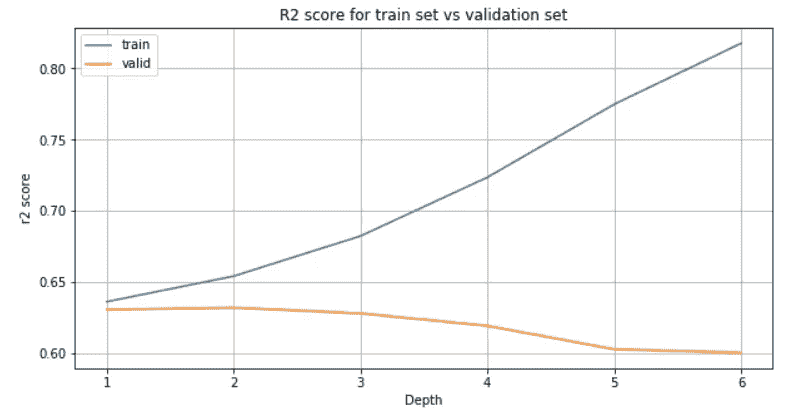

从上面的图中我们可以看到，深度越低(范围为 1-3)将产生最好的结果。类似地，树的数量、列样本 _ 字节树和伽玛也是我们最终得到的模型。

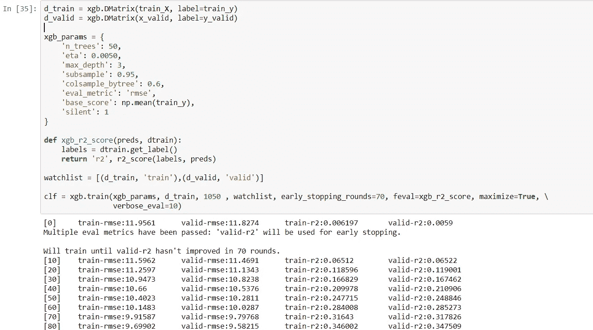

最终 XGBoost 模型

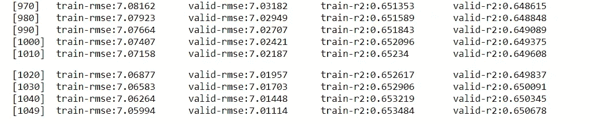

模型训练结束时的分数。

现在，为了评估该解决方案有多好，我们可以始终使用 kaggle 的私有和领导板作为参考(我们更关注私有领导板，因为我们希望我们的数据在大多数看不见的数据上表现良好)

该解决方案获得的分数位于排行榜的前 4%,显然这不是最佳解决方案，但请记住，我们在没有使用堆叠技术的建模部分只投入了很少的精力。

这表明，即使我们屏蔽了数据，EDA 和特征工程也是数据科学中的两个关键工具，可以用来获得良好的结果。这个解决方案的完整代码在这个 [github 链接](https://github.com/akashsambhangi/Mercedes-Benz-Greener-Manufacturing)中

**参考文献:-**

1.  【https://www.appliedaicourse.com/ 

2.[https://www . ka ggle . com/anokas/Mercedes-EDA-xgboost-starter-0-55](https://www.kaggle.com/anokas/mercedes-eda-xgboost-starter-0-55)

3.[https://www.kaggle.com/daniel89/mercedes-cars-clustering/](https://www.kaggle.com/daniel89/mercedes-cars-clustering/)

4.[https://www . ka ggle . com/deads kull 7/78 th-place-solution-private-l b-0-55282-top-2](https://www.kaggle.com/deadskull7/78th-place-solution-private-lb-0-55282-top-2)

**你可以找到我的 LinkedIn 个人资料——用** [**这个链接**](https://www.linkedin.com/in/akash-sambhangi-41498396/)