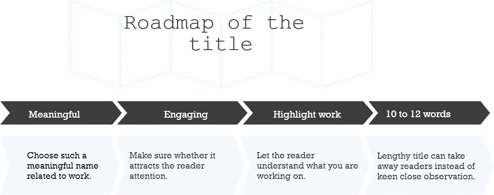

# 如何写科学手稿:初学者的基本指导

> 原文：<https://medium.com/analytics-vidhya/how-to-write-a-scientific-research-paper-fundamental-instruction-for-beginner-e86074761018?source=collection_archive---------17----------------------->

[https://unsplash.com/](https://unsplash.com/)

如果你是一个初学者，在写一篇研究论文时，你将不得不经历许多问题。当我还是一名四年级本科生的时候，我陷入了两难的境地，因为我对研究的兴趣越来越大。作为一个初学者，我并没有真正理解如何写一篇研究论文。虽然网上也有很多文章，但我已经尽最大努力说明了科学手稿背后的步骤。在这篇文章中，你将学习研究论文的大纲以及如何安排每个模块。

# **开始前的几句话**

**首先，**为了做一个稿子，你必须得准备一个假设。如果你对这个术语**、**、**、**不熟悉，请浏览我之前的文章《将你的创新转化为研究》。给你:[https://medium . com/@ eliashossain 9111/turn-your-innovation-into-research-8534 e 290474 a](/@eliashossain9111/turn-your-innovation-into-research-8534e290474a)

**其次，**根据你的研究选择一个你想投稿的期刊或会议。在选择期刊或会议时，确保它是否与你的研究领域相关。

**最后，**仔细遵循他们提供的大纲和格式的日志说明。基本上，典型的研究论文通常遵循一些共同的大纲(图 1 ),每一部分都有特定的目的。

# 研究概述

> 一篇典型的研究论文有一个共同的大纲，例如，标题、摘要、关键词、引言、方法论、结果、讨论、结论、参考文献。虽然提纲取决于具体的期刊或会议形式，但是，这些使用得更多。图 1 显示了研究大纲。

图 1:典型的研究论文大纲

# 标题

> 标题非常重要，它能吸引读者的注意力。换句话说，一篇好的研究论文标题一般都围绕 ***10 到 12*** *几个字长起，冗长的标题反而会带走读者敏锐的近距离观察。所以一定要记住，它是否能反映你的研究。图 2 显示了标题的路线图。*

图 2:标题的路线图

# 摘要

> 通常，摘要反映了研究的总结。一般来说，摘要反映了研究的本质。用不超过 300 字的 5-6 句话来说明你在研究中取得的成果。另一方面，一些主要的点可以突出出来，例如，研究的总体 ***目标*******问题*** *，研究的基本* ***方案*** *，你从你的实验中得到的***，你的解释和结论的总体轮廓。仔细观察图 3，其中突出显示了抽象轮廓。***

****

****图 3:摘要概要****

# **关键字**

**关键词是包含论文实质内容的词，可以让你的论文更容易理解，并确保你得到更多的参考。通过这种方式，关键是要加入最相关的关键词，让不同的作者能够发现你的论文。3-8 个关键字之间的日志请求。尽管如此，我认为准备 4-5 个关键词是一个好主意，根据期刊或会议的前提条件包括更多的关键词。**

# **介绍**

**最关键的部分是研究导论。如果这一部分不吸引人，读者就不会再读下去了。此外，为了进行引人入胜的介绍，斯坦福大学的信息实验室提供了一个公式。还有一点我想提一下:你必须在写作的时候做一个**引用**因为它证明了每一个解释的合法性。看看下面就知道简介的基本结构了。**

*   ****第一段:**什么是问题？**
*   ****第二段:**为什么这个问题意义重大？**
*   ****第三段:**为什么这么难解决？**
*   **第四段:其他人是如何解决的，为什么他们的解决方案效果不好？**
*   ****第五段:**你是怎么解决的，为什么比别人好？**
*   ****第六段:**动机还是背景？**

****

****图 4:介绍提纲:斯坦福大学信息实验室制作****

**该部分的下一部分是**文献综述。**这一节可以是单独的一节，也可以坐在动机或背景部分之后。在文献综述部分，你需要举例说明其他研究者是如何完成的。为了证明你的研究的新颖性，你必须从逻辑上展示为什么你的解决方案比现有的工作表现得更好。这里应该提到的是，写文献综述时要有礼貌，不要批评别人的工作。**

# **方法学**

> **在这一部分，你必须描述你在研究中使用了哪种方法**。研究方法包括分析&研究可用于执行研究的不同方法。为了理解清楚，请看下图 5****

****

****图 5:研究方法****

**你是否对**方法**和方法论感到困惑？。通常，研究方法是技术、过程或方法，称为“步骤”。**举例来说，**为了**煮**米饭，你遵循什么步骤？。以下是一些步骤:**

> ****选择米类数量→用水清洗→放入烤箱****

**因为你按照我上面展示的一些步骤来煮饭，就像在研究中一样，并且按照一些步骤被称为**方法**。图 6 显示了研究方法概要。仔细看看**图 6** 就知道的一清二楚。**

****

****图 6:研究方法****

# **结果和讨论**

> ***在本节中，研究实验输出已经进行了论证。你的研究结果应该在这里用相关的图表展示出来。必须进行必要的统计分析。* ***换句话说，*** *研究得出的结果这里需要说明一下，应该看到你的研究的同化是真实的。***

# **结论**

> ***你需要说明你通过实验发现了什么，结果讨论的要点是什么&。另一方面，你需要简要说明你研究的局限性是什么，你未来想做什么。***

# **参考**

> **你从所有地方获得的信息应该以链接的形式在这里给出。应该提到的是，您必须按照期刊或会议格式中的说明使用参考文献。根据不同的期刊或会议，参考文献有很多种。**

**祝你的研究之旅好运。**

**请关注我:**

****领英:**[https://www.linkedin.com/in/elias-hossain-b70678160/](https://www.linkedin.com/in/elias-hossain-b70678160/)**

**【https://www.researchgate.net/profile/Elias_Hossain7】研究门: [研究门](https://www.researchgate.net/profile/Elias_Hossain7)**