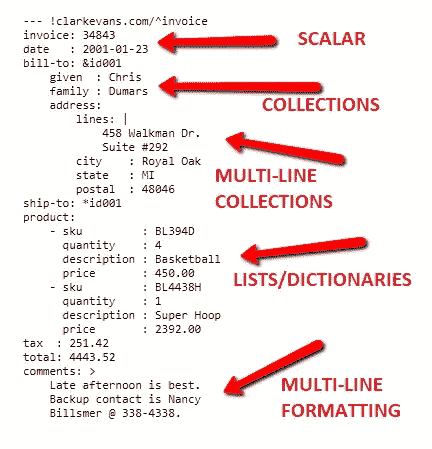

# 如何在你的机器学习项目中写配置文件？

> 原文：<https://medium.com/analytics-vidhya/how-to-write-configuration-files-in-your-machine-learning-project-47bc840acc19?source=collection_archive---------0----------------------->

## 用配置文件管理参数和初始设置。


图片由来自[皮克斯拜](https://pixabay.com/?utm_source=link-attribution&utm_medium=referral&utm_campaign=image&utm_content=374058)的[亚瑟·丹尼柳克](https://pixabay.com/users/webar4i-292628/?utm_source=link-attribution&utm_medium=referral&utm_campaign=image&utm_content=374058)拍摄

在从事机器学习项目时 ***灵活性*** 和 ***可重用性*** 非常重要，可以让你在开发解决方案时的生活变得更加轻松。当您是初学者或项目变大时，找到组织项目文件的最佳方式可能会很困难。有时候，你可能会重复*或*重写*你项目中的某个部分，而这对于数据科学家或机器学习工程师来说并不专业。*

一个简单的例子是，当运行不同的机器学习实验来寻找你试图解决的问题的最佳模型时，大多数时候人们倾向于直接从源代码中改变不同参数的*值*，并一次又一次地运行实验。他们重复这个过程，直到他们得到最好的结果。这不是一个好的方法或技术，你可能会忘记你以前做过的不同实验。

使用配置文件可以帮助您解决这个问题，并可以为您的机器学习项目增加价值。

看完这篇文章，你会知道:

*   使用配置文件的重要性。
*   YAML 文件介绍。
*   YAML 文件的基本语法。
*   创建 YAML 文件的规则。
*   如何撰写你的第一份 YAML 档案？
*   如何用 python 加载 YAML 文件？
*   如何在你的机器学习项目中使用 YAML 文件(*作为配置文件*)。

让我们开始吧。

# 那么配置文件是什么呢？

来自 Wikipedia 的定义*在计算中，配置文件(或 config 文件)是用于配置某些计算机程序的参数和初始设置的文件。它们用于用户应用程序、服务器进程和操作系统设置。*

维基百科解释了定义配置文件时的两个要点，即*参数和初始设置*。这些参数和初始设置可以是在运行时应在您的系统中应用的特定值。例如，在机器学习中，您可以将 *batch_size、optimizer、learning rate、test_size 和 evaluation metric* 设置为配置文件的一部分。

在简单的定义中，配置文件(通常简称为 config 文件)定义了应用于系统、基础设施设备和应用程序的参数、选项、设置和首选项。

> ***“配置文件的用途就是设置应用程序应该如何运行。”***

这意味着您可以在您的机器学习项目中使用配置文件。通过这样做，它将帮助你灵活地运行你的项目，并且容易地管理你的系统源代码，例如当运行不同的机器学习实验时。

有不同的文件类型可以用作配置文件，例如 YAML、JSON、XML、INI 和 python 文件。在本文中，您将了解更多关于最流行的配置文件 YAML，以及如何在您的机器学习项目中使用它。

# YAML 配置文件

*[*YAML*](https://yaml.org/)*(YAML 不是标记语言)是一种人类可读的数据序列化语言。它通常用于配置文件，但也可用于存储数据的许多应用程序中。*来自维基百科。*

***YAML** 文件格式已经成为配置的大众最爱，大概是因为它们的可读性。YAML 相对容易写。在简单的 YAML 文件中，没有数据格式项，如大括号和方括号；项目之间的大多数关系都是使用缩进来定义的。*

*YAML 的缩写是另一种标记语言的简写。但是维护者将其重命名为 YAML Ain not 标记语言，以更加强调其面向数据的特性。*

# *YAML 文件的基本语法*

*YAML 文件有一个非常简单的语法，任何人都更容易学习，这是我选择 YAML 文件而不是其他类型的配置文件的主要原因。以下基本语法可以帮助您开始使用 YAML 作为配置文件:-*

## ***(一)备注***

*在 YAML，文件注释以井号开始。*

*示例:*

```
*# my first comment*
```

## ***(b)键值对***

*像 Python、Perl 和 javascript 等其他编程语言一样，YAML 中的数据类型采用键值对的形式。*

*键总是字符串，值可以是任何数据类型。*

*例子*

```
*learning_rate: 0.1
evaluation_metric: rmse*
```

## ***(c)数值数据***

*YAML 识别并支持不同的数字数据类型，如整数、十进制、十六进制或八进制。*

*举例。*

```
*test_size: 0.2
epochs: 50
scientific_notation: 1e+12*
```

## ***(d)弦***

*在 YAML 写字符串非常简单，你不必用引号把它们括起来。然而，他们可以。*

*举例。*

```
*experiment_title: find the best model by using f1 score*
```

## ***(e)布尔型***

***YAML** 表示**布尔值**，关键字 True、On、Yes 表示真，false 表示 False、Off、No*

*举例。*

```
*cross_validation: True
save_model: False*
```

## ***(f)数组***

*YAML 支持在一行中创建数组或列表。*

*举例。*

```
*ages: [24,76,45,21,45]
labels: ["class_one","class_two”,"class_three"]*
```

**

*您可以使用更多 YAML 语法*

# *创建 YAML 文件的规则*

*在创建 YAML 文件时，你必须遵循一些非常重要的基本规则。*

*   *文件应该有**。yaml** 为分机。*
*   *YAML 区分大小写。*
*   *创建 YAML 文件时不要使用制表符。*

# *写你的第一个 YAML 文件。*

*要创建一个 YAML 文件，打开你喜欢的文本编辑器，比如 *sublime，vs code，或者 vim* 。然后创建一个新文件，并用您选择的名称保存它。**我的 _ 配置**并添加**。YAML**扩展名结尾。现在你有了你的第一份 YAML 文件。*

*您可以开始在您的***my _ configuration . YAML***文件中写入不同的参数和初始设置值。*

*这里有一个简单的例子让你理解它是什么样子的。*

## ***如何在机器学习项目中使用 YAML 文件。***

*到目前为止，你已经掌握了 YAML 文件的基本语法和如何编写的新知识。让我们看看如何在机器学习项目中使用 YAML 文件作为配置文件。*

***数据集** 对于这个简单的机器学习项目，我将使用**乳腺癌威斯康星州(诊断)数据集。这个 ML 项目的目标是预测一个人是否患有良性或恶性肿瘤。***

*关于数据集的更多信息可以在这里找到:[乳腺癌数据集](https://archive.ics.uci.edu/ml/datasets/Breast+Cancer+Wisconsin+%28Original%29)。*

*从上面的源代码中，它显示了如何运行这个简单的机器学习项目，从*加载数据集，处理缺失值，删除列，训练和测试模型，最后保存模型*。但是我们没有设置和使用任何配置文件来运行这个项目。*

*您可以在源代码中看到许多*参数和初始设置*，我们可以将它们全部放入一个配置文件中。*

*那么我们可以在配置文件中添加哪些*参数和初始设置*？。*

*   *数据目录。*
*   *数据名称。*
*   *要删除的列。*
*   *目标变量名。*
*   *测试尺寸比。*
*   *分类器的参数(KNN)。*
*   *型号名称。*
*   *模型目录。*

*现在我们已经确定了哪些参数和初始设置，那么我们就可以编写我们的配置文件了，命名为***my _ config . YAML***。*

**my_config.yaml* 包含在我们的 ml 项目中运行的[K-最近邻算法](https://www.datacamp.com/community/tutorials/k-nearest-neighbor-classification-scikit-learn)的所有重要初始设置和参数。*

***如何用 Python 加载 YAML 文件？** 为了在 python 中加载 YAML 文件，需要安装并使用 [PyYAML 包](https://pypi.org/project/PyYAML/)。PyYAML 包是 Python 的 YAML 解析器和发射器。YAML 的安装过程相当简单，用 Python 安装 YAML 库最简单的方法是通过 [pip](https://pypi.org/project/pip/) 包管理器。如果您的系统中安装了 pip，请运行以下命令下载并安装 YAML:*

```
*pip install pyyaml*
```

*要读取 python 中的 YAML 文件，首先，导入 YAML 包`import yaml`，然后打开你的 YAML 文件`my_config.yaml`，用`yaml`模块中的`safe_load()`方法加载内容。*

*现在你知道如何在 python 中加载 YAML 文件，让我们添加我们已经确定的配置，并将它们放入我们的机器学习项目中。*

*我们的项目源代码看起来更漂亮，可读性更好，我们不需要直接从源代码中更改参数或初始设置，我们有一个配置文件来完成这些工作。我们首先导入重要的 python 包，包括 YAML 包，使用`load_config()`函数加载配置文件，并在我们的项目中添加初始设置和参数。*

*如果您想要更改*数据集名称、要删除的列、测试大小比率或分类器的参数*，您可以在配置文件中进行更改。有时，您可以创建一个新的配置文件，使用相同的初始设置和参数名称，但使用不同的值，并运行您的 ML 实验。*

# *包裹*

*现在你明白在你的机器学习项目中使用配置文件的重要性了。在本文中，您学习了什么是配置文件，配置文件在机器学习项目中的重要性，如何创建 YAML 文件并在 ML 项目中使用。现在，您可以开始在下一个[机器学习项目](https://medium.mybridge.co/30-amazing-machine-learning-projects-for-the-past-year-v-2018-b853b8621ac7)中使用该配置文件。*

*本文的数据集和源代码可以在 Github 上找到。*

*[](https://github.com/Davisy/Machine-Learning-Project-with-Configuration-File) [## davisy/带有配置文件的机器学习项目

### 如何写一个 YAML 配置文件，并在你的机器学习项目中使用它。…

github.com](https://github.com/Davisy/Machine-Learning-Project-with-Configuration-File) 

如果你有兴趣了解更多关于 YAML 文件的知识，我推荐你阅读教程中的在线资料。

[](https://www.tutorialspoint.com/yaml/index.htm) [## YAML 教程

### YAML 是“YAML 标记语言”的缩写形式，是一种数据序列化语言，旨在…

www.tutorialspoint.com](https://www.tutorialspoint.com/yaml/index.htm) 

如果你学到了新的东西或者喜欢阅读这篇文章，请分享给其他人看。也可以随意发表评论。在那之前，下一篇文章再见！也可以通过 Twitter [@Davis_McDavid](https://twitter.com/Davis_McDavid) 找到我

***最后一件事:*** *在以下链接阅读更多类似这样的文章。*

[](/@Davis_David/how-to-enter-your-first-zindi-competition-3e9ce335d34b) [## 如何参加你的第一次津迪比赛

### 预测谁最有可能拥有银行账户。

medium.com](/@Davis_David/how-to-enter-your-first-zindi-competition-3e9ce335d34b) [](https://towardsdatascience.com/the-six-key-things-you-need-to-know-about-scikit-plot-119cbd869adb) [## 关于 Scikit-plot 你需要知道的六件关键事情

### 向 scikit-learn 对象添加绘图功能的直观库。

towardsdatascience.com](https://towardsdatascience.com/the-six-key-things-you-need-to-know-about-scikit-plot-119cbd869adb) [](https://towardsdatascience.com/how-to-practice-logging-in-python-with-logzero-82e4f9842a5c) [## 如何用 Logzero 练习 Python 中的日志记录

### 为您的 Python 项目提供强大而有效的日志记录。

towardsdatascience.com](https://towardsdatascience.com/how-to-practice-logging-in-python-with-logzero-82e4f9842a5c)*