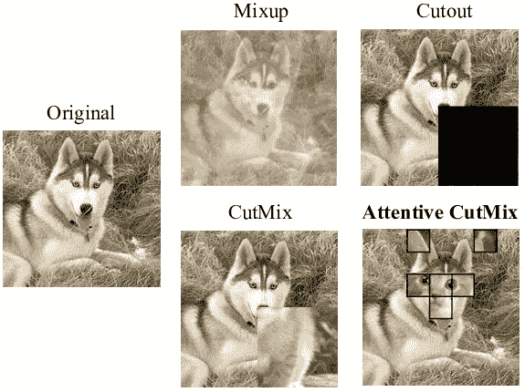

# 如何用 TensorPipe 在 Keras/Tensorflow 中编写高效的 DataPipeline？

> 原文：<https://medium.com/analytics-vidhya/how-to-write-efficient-datapipeline-in-keras-tensorflow-with-tensorpipe-3391b4be191d?source=collection_archive---------20----------------------->


在 [Unsplash](https://unsplash.com?utm_source=medium&utm_medium=referral) 上由 [Samuel Sianipar](https://unsplash.com/@samthewam24?utm_source=medium&utm_medium=referral) 拍照

# TensorPipe:用 core TensorFlow 编写的高性能、灵活的数据管道。

> 为什么要让你宝贵而聪明的模型等待愚蠢的数据。

【github.com/kartik4949/TensorPipe 

**作者。**

Kartik Sharma，我是 TensorPipe 的创造者。

**LinkedIn**:[*https://www.linkedin.com/in/kartik-sharma-aaa021169/*](https://www.linkedin.com/in/kartik-sharma-aaa021169/)

**GitHub**:*github.com/kartik4949*

**让我们潜入 TensorPipe，**

在 TensorFlow 中，开发灵活且高性能的**数据管道**是一项痛苦的任务。

艺术发展水平的增强是以一种非常笨拙的方式编写的，你没有必要在 Tensorflow 中找到它的版本。

[**TensorPipe**](http://github.com/kartik4949/TensorPipe) 以**高性能**填补了这一“空白”，在 core TensorFlow 编写的一个软件包中灵活地加载了计算机视觉领域可用的所有 SOTA 增强功能。

**Github 链接:**github.com/kartik4949/TensorPipe

TensorPipe 支持对象检测、关键点、分类和分段数据集。

# 一些增强列表:

**混合**:用给定的 alpha 值将两幅随机采样的图像混合成一幅。

**CutMix:** 将一个调整大小的图像完全重叠在另一个随机图像上。

**马赛克:**用随机采样的四幅图像构建类似马赛克的图像。

**GridMask:** 在给定的输入图像上屏蔽网格状屏蔽。

**随机选择酶:**从给定图像中删除随机矩形。



# 配置

*   **image_size** —输出管道的图像尺寸。
*   **batch_size** —管道的批量。
*   **转换** —与相应关键字参数一起应用的转换字典。
*   **分类编码** —分类数据的编码— ('labelencoder '，' onehotencoder ')。

# 初学者 Keras 用法

在本例中，我们将使用配置创建一个 **TensorPipe** 管道，并将使用该管道训练 **VGG16** 网络。

**步骤 1:** 让我们从导入和创建我们使用所需的配置开始。

图像大小应为(100，100)，批次大小为 2，分类编码为标签编码器。

```
import tensorflow as tf
from pipe import Funnel

"""
Create a Funnel for the Pipeline!
"""

config = {
    "batch_size": 2,
    "image_size": [100, 100]}
```

要应用于数据管道的转换。

1.  左右翻转、网格遮罩和随机旋转。

```
"transformations": {
        "flip_left_right": None,
        "gridmask": {prob: 0.5},
        "random_rotate": {rotate: 10},
    },
```

**步骤 2:** 让我们用给定的配置为我们的管道创建一个漏斗。

```
import tensorflow as tf
from pipe import Funnel

"""
Create a Funnel for the Pipeline!
"""

config = {
    "batch_size": 2,
    "image_size": [100, 100],
    "transformations": {
        "flip_left_right": None,
        "gridmask": {prob: 0.5},
        "random_rotate": {rotate: 10},
    },
    "categorical_encoding": "labelencoder",
}
pipeline = Funnel(data_path="testdata", config=config, datatype="categorical")
# Created a Funnel with given config.
```

在上面的例子中，我们创建了一个具有灵活配置的数据管道，所有优化都将在 TensorPipe 内部处理。

**第三步:**让我们从给定的数据集中获取训练数据集。

```
pipeline = pipeline.dataset(type="train")
```

**步骤 4:** 创建一个 Keras 模型。

```
# Create Keras model
model = tf.keras.applications.VGG16(
    include_top=True, weights=None,input_shape=(100,100,3),
    pooling=None, classes=2, classifier_activation='sigmoid'
)

# compile
model.compile(loss='mse', optimizer='adam')

# pass pipeline as iterable
```

**步骤 5:** 最后让我们用给定的数据管道训练 Keras 模型。

```
import tensorflow as tf
from pipe import Funnel

"""
Create a Funnel for the Pipeline!
"""

config = {
    "batch_size": 2,
    "image_size": [100, 100],
    "transformations": {
        "flip_left_right": None,
        "gridmask": None,
        "random_rotate": None,
    },
    "categorical_encoding": "labelencoder",
}
pipeline = Funnel(data_path="testdata", config=config, datatype="categorical")
pipeline = pipeline.dataset(type="train")

# Create Keras model
model = tf.keras.applications.VGG16(
    include_top=True, weights=None,input_shape=(100,100,3),
    pooling=None, classes=2, classifier_activation='sigmoid'
)

# compile
model.compile(loss='mse', optimizer='adam')

# pass pipeline as iterable
model.fit(pipeline , batch_size=2,steps_per_epoch=5,verbose=1)
```

**请启动我的存储库，将其用于分类数据集，因为当前 bbox 和关键点支持是 WIP。**

[github.com/kartik4949/TensorPipe](http://github.com/kartik4949/TensorPipe)