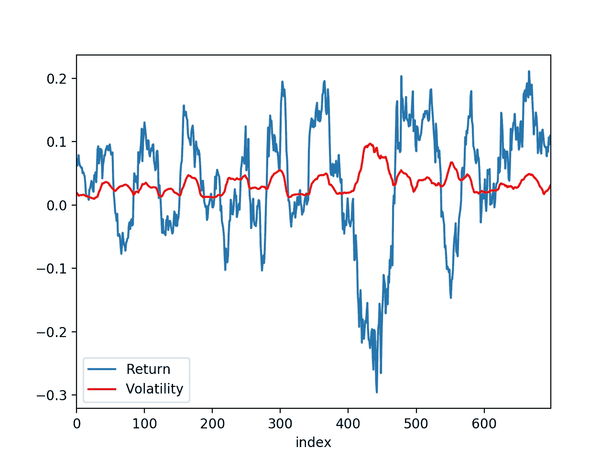
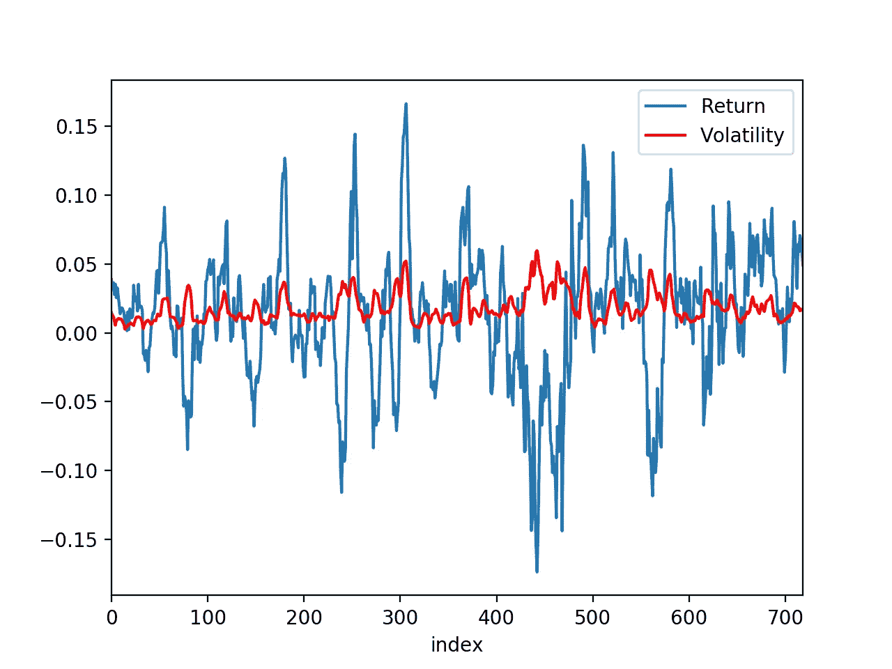
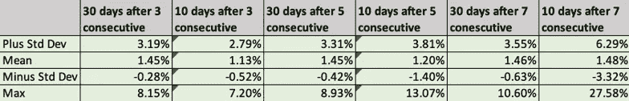
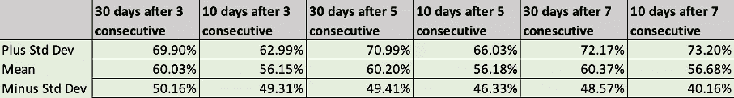

# 波动性如何影响股票回报:用 Python 测试

> 原文：<https://medium.com/analytics-vidhya/how-volatility-affects-a-stocks-return-tested-with-python-cdf7470d3808?source=collection_archive---------7----------------------->

找到一个有效的交易策略是少之又少。有数不清的概念、比率和术语很容易让人迷失。今天我将集中讨论一个术语:**波动性。**

由[马库斯·斯皮斯克](https://unsplash.com/@markusspiske?utm_source=unsplash&utm_medium=referral&utm_content=creditCopyText)在 [Unsplash](https://unsplash.com/s/photos/stocks?utm_source=unsplash&utm_medium=referral&utm_content=creditCopyText) 上拍摄的照片

> 波动性是对给定证券或市场指数的回报率离差的统计度量。- [Investopedia](https://www.investopedia.com/terms/v/volatility.asp)

在英语中，波动性是指股票价格在一段时间内预计会上涨或下跌的幅度和频率，用标准差来衡量。

例如，如果我的股票今天的价格是 100.00 美元，在过去 5 年的收盘价上有 10.00 美元的标准差，我可以合理地预计接下来的 *n* 个收盘价的 68%在 90.00 美元和 110.00 美元之间。

我最近读了一篇关于定义波动性的媒介以及如何在交易中使用它的文章。这篇文章很好地解释了什么是波动性，并涵盖了一些关于交易的观点和观察。下面是文章的链接:

 [## 什么是波动性:定义，如何在交易中使用

### 波动性是你每天在市场上听到的术语之一，但它经常被误解。在本帖中，我们…

medium.com](/@supriyo3.14/what-is-volatility-definition-how-to-use-it-in-trading-da4dfc296729) 

我发现最有趣的是以下想法:

> **现在波动性低。如果订单平衡，只要数量不变，价格就不会有太大变化。然而，如果卖方或买方突然增加，价格可能会急剧变化；**
> 
> **现在波动很大。**交易活动很少的非流动性资产通常具有较高的波动性，因为每个大订单都会改变价格；
> 
> **波动性递减。**当价格上涨时，低波动性和波动性下降是牛市的常见现象。如果波动性继续下降，这可能是一个看涨的信号；
> 
> **波动性增大。**波动性趋向于回归均值，在低波动期后上升，在高波动期后下降

作为一个致力于拓展我对股票市场及其趋势的知识的人，我想知道上述观点是否属实。

我用过去两年 500 多只股票的数据做了以下计算和观察。我将在文章的结尾包含一个指向我的代码的链接。

# 高波动性和低波动性与回报

我首先想绘制出一个基本模型，显示相对于波动性的回报，看看我们是否能看到任何基本模式。如前所述，我们可以预期更高的波动性会产生更剧烈的回报变化。

让我们以苹果公司为例。如果我们使用 30 天的时间框架来计算回报和波动性，结果看起来像这样:

这是 10 天内的同一张图表:

我们可以清楚地看到，不考虑时间框架的差异，更大的波动幅度如何影响股票回报的大小。所有股票都是如此。这似乎是常识，但是我认为有一个视觉会很有趣。有趣的部分来了！

# 波动率与回报率

如果连续几天波动性下降，这实际上是看涨未来的信号吗？我如何衡量和测试这一点？

## 制定

经过一段时间的思考，我想出了下面的方法来测试这个假设:

1.  我可以通过找出连续 n 天中标准差减少的次数来衡量波动率的下降
2.  在连续下跌 *n* 天后，记录下一个 *m* 天的价格。
3.  计算连续 *n* 天收益递减后每 *m* 天的平均收益和正收益的百分比。

正如我之前提到的，我使用 python 编写了一个适合这些条件的算法。我用 500 多只股票和过去两年的历史数据进行了测试。为了不影响平均值，我剔除了所有不存在波动性下降期的股票。

我用*n*=【3，5，7】和*m*=【10，30】进行了测试。

## 结果

我的第一个测试是找出平均回报率:

注:将每个 10 天的回报乘以 3，以匹配 30 天的时间段

值得指出的趋势:

1.  在 30 天的时间周期内，平均回报率始终为 1.45%或增长缓慢，而当连续几天的波动性下降时，10 天的时间周期以更快的速度增长。
2.  我收集数据的所有股票的最大回报是最高的，连续几天的波动性下降时间最长，之后收集的收盘价时间最短。但是，这是值得注意的，有一个大得多的标准差，表明风险更高。
3.  通过 [ycharts](https://ycharts.com/indicators/sp_500_2_year_return) 计算，过去两年的市场回报率为 14.23%，相当于每月 1.18%。这个数字与平均回报惊人地相似，表明这些正回报可能是由于整体市场增长。

我进行的第二个测试是，在连续 *n* 天波动性下降后，找出有正回报的次数的百分比:

这些数字稍微乐观一些。如果你用前三列的 *n* 和 *m* 投资，只有 18%的时间(低于平均值不到一个标准差)你有 50%的可能性获得正回报。

第三列，连续 5 天之后的 30 天，显示了 71%的正回报可能性。

然而，值得注意的是，正如前面的测试结果所提到的，这可能部分是由于市场的自然增长，而不是使用这种策略进行投资。

## 结论

当谈到一只股票的回报可能会如何反应时，波动性是一个有趣的概念。众所周知，高波动性会导致严重的波峰和波谷，而低波动性则平缓得多。

当考虑波动性下降和上升的时期时，可能有机会持续获得正回报。然而，对于这是否反映了总体市场回报，可能还需要做更多的研究。

其他可能性和未来的测试可能包括改变这些测试的公式或改变 *n* 和 *m* 以反映更大或更小的范围。我也在考虑测试波动率是否是均值回归。

感谢阅读！希望你喜欢这篇文章并从中有所收获，因为我在创作它的时候学到了很多。

GitHub 库:[https://github.com/danerbrear/volatility-study](https://github.com/danerbrear/volatility-study)