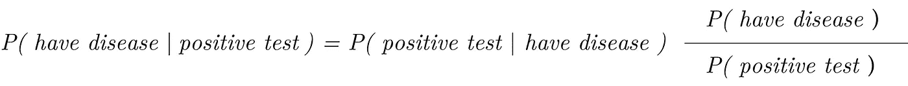
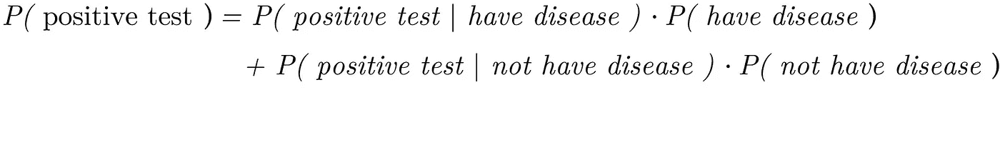
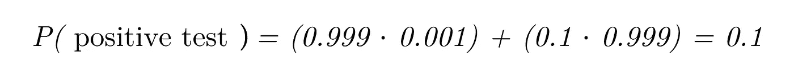

# 你应该有多担心？

> 原文：<https://medium.com/analytics-vidhya/how-worried-should-you-be-473da145d9cf?source=collection_archive---------20----------------------->

## 一种数学框架，用于量化在获得阳性诊断后患疾病的可能性。

想象一下:有一天你回到家，感觉不舒服。没有特别的症状，只是感觉有些不对劲。你去看医生，医生会给你做一系列检查。一周过去了，结果发现你被诊断出患有一种罕见的疾病，这种疾病只影响到很小一部分人，在 **1000** 人中有 **1** 人。

看完测试结果，你的胃掉到了你的脚上，你开始害怕了。**数学**可以帮你回答的一个问题是，你应该有多担心。或许极度担心，或许根本不担心——原因如下。

一个好的起点是反思这种疾病有多罕见。我们应该做的第二件事是量化测试结果的准确性。

这种情况有四种可能的结果:

**1** 。测试呈阳性，你受疾病影响(**真阳性** )
**2** 。测试是阴性的，你没有受到疾病的影响(**真阴性)**
**3** 。测试呈阳性，你没有受到疾病的影响(**假阳性** )
**4** 。测试是阴性的，你受到了疾病的影响(**假阴性**)

所以你需要问自己的问题是:

> 鉴于我刚刚收到阳性检测结果，我患这种疾病的概率是多少？

这个问题的答案可以追溯到 18 世纪，当时一位名叫**托马斯·贝叶斯**的英国长老会牧师提出了一种直观的方法来寻找**基于条件的先验知识和观察到的证据**的事件概率——这就是所谓的条件概率。

托马斯·贝叶斯的肖像，国际监测系统公报，第 17 卷(1988)

**贝叶斯定理**可以帮助我们根据已知的和不变的属性来可视化最可能的结果，例如诊断的准确性、对实验测试结果使用的程序，以及一般情况下患病和未患病的人的概率。这就是所谓的 [**贝叶斯推断**](https://en.wikipedia.org/wiki/Bayesian_inference#targetText=Bayesian%20inference%20is%20a%20method,and%20especially%20in%20mathematical%20statistics) 。

让我们假设医学测试正确地识别了 99%的患病者。

出于戏剧性的原因，我们正在考虑一种非常罕见的疾病，这种疾病只影响相对较小比例的人群( **0.1%)。**

最后但同样重要的是，我们需要计算**检测阳性**的概率。得到a **阳性检测结果**的可能性，是得了病被正确诊断的概率，没得病被误诊的概率。

如果我们假设 **10** 中的 **1** 人被误诊为该病(**假阳性**)，那么被误诊的概率为 **0.1** 。

既然我们已经知道了患病的概率( **0.001** )和假设你患病检测呈阳性的概率( **0.009** )，我们就可以计算出得到**阳性检测结果**的可能性。

那么在得到阳性诊断后，你应该有多担心呢？我们的计算表明，你患这种疾病的几率是**1**100。