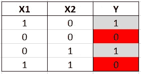
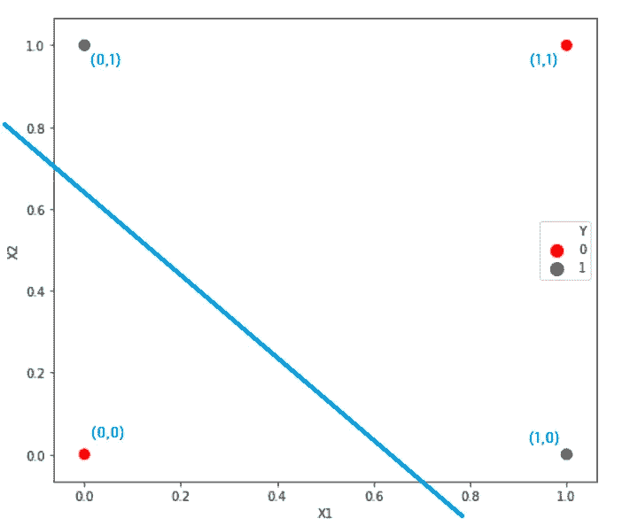
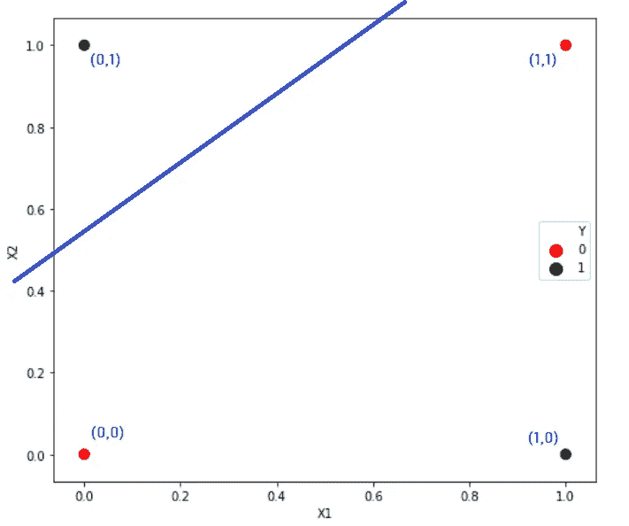
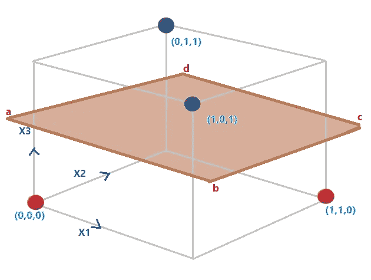
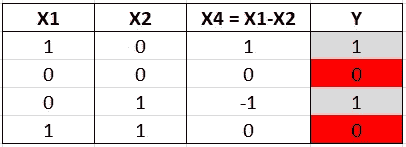
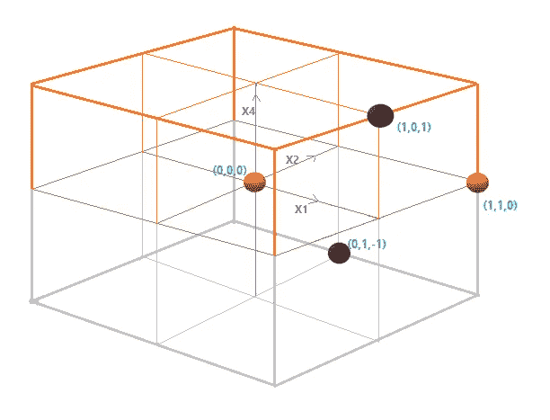

# 特征工程是如何工作的？

> 原文：<https://medium.com/analytics-vidhya/how-would-feature-engineering-work-in-ml-471895fb4808?source=collection_archive---------27----------------------->

[偷偷摸摸的手肘](https://unsplash.com/@sneakyelbow?utm_source=medium&utm_medium=referral)在[的 Unsplash](https://unsplash.com?utm_source=medium&utm_medium=referral) 上拍照

**特征工程**是利用[领域知识](https://en.wikipedia.org/wiki/Domain_knowledge)通过[数据挖掘](https://en.wikipedia.org/wiki/Data_mining)技术从原始[数据](https://en.wikipedia.org/wiki/Data)中提取[特征](https://en.wikipedia.org/wiki/Feature_(machine_learning))的过程。这些特性可以用来提高[机器学习](https://en.wikipedia.org/wiki/Machine_learning)算法的性能。维基说。

特征工程已经成为数据科学中改进机器学习算法的重要实践。它需要对领域和数据有深入的了解。创建一个新特征有多种方法，但我想直观地说明特征工程如何帮助我们获得更好的结果。在进入直觉之前，我要感谢[马赫什·阿南德先生](https://www.linkedin.com/in/mahesh-anand-s-a5ba299/)，他是一位伟大的导师，激励我开始用媒介写作。

这种直觉用一个基本的线性分类模型来解释。我们有一个数据集，其中包含两个独立要素 X1，X2 和一个包含两个类(1，0)的从属要素 Y。

让我们画出因变量 Y 相对于自变量 X1 和 X2 的实例。

在绘制了因变量之后，我们可以看到它们不能用线性方法进行分类。当我们试图通过一条决策线时，其中一个因变量会被错误地分类，这可以通过使用非线性模型来克服。

让我们尝试创建一个新的功能 X3，这将是 X1 和 X2 之间的绝对差异。

现在有了三个独立的特征 X1、X2 和 X3，我们可以在 3D 中绘制从属特征 Y。

0 的两个实例现在都在 3D 绘图的底部，而 1 的实例在 3D 绘图的顶部。现在，我们可以看到，通过经过 2D 平面' *abcd* '，线性模型可以预测所有的因变量，为我们提供所需的结果。

现在用另一个新特征 X4 代替特征 X3，这是 X1 和 X2 之间的区别。

利用特征 X1、X2 和 X4，在 3D 绘图中绘制从属特征 Y 的实例。

形成的图是立方体，极值为 1 和-1。在该图中，我们可以看到属于实例 0(红色)的因变量位于立方体块的中间，而属于实例 1(黑色)的因变量位于立方体的顶部和底部，仍然是线性不可分的。没有单个线性 2D 平面可以帮助我们，即使在添加新特征(X4)之后，线性分类模型算法也不会给出更好的结果，促使我们去寻找非线性模型。

由此，我们可以推断，模型的性能可以通过从原始数据中提取新的特征来提高，但这需要有适当的领域知识。随机创建新特征无助于改进模型。如果您缺乏领域知识，请咨询专家，否则您可能不得不求助于多特征工程技术的试验/试错，这可能会徒劳无功。