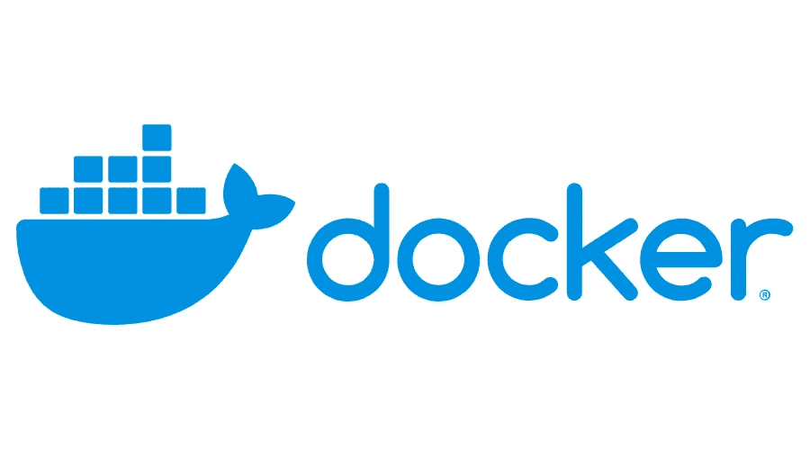
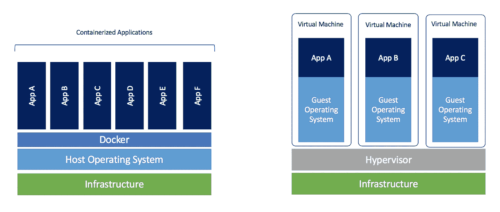

# 如何使用 Docker 在不到一分钟的时间内建立机器学习环境

> 原文：<https://medium.com/analytics-vidhya/how-you-can-use-docker-to-setup-machine-learning-environments-in-less-than-a-minute-ff37ca32ccf7?source=collection_archive---------12----------------------->

我经常在不同版本的 Linux 之间切换，有时甚至在 Windows 之间切换，因为过一段时间后我会厌倦使用同一个操作系统，设置整个环境曾经是一件痛苦的事情，也是我曾经害怕的事情。但那是在我发现 Docker 之前。在 Docker 的初始设置之后，我可以在不到一分钟的时间内设置一个机器学习环境，包括我需要的所有包。



码头工人

[**Docker**](https://docker.com) 是一组平台即服务(PaaS)产品，使用 OS 级虚拟化来交付称为容器的软件包中的软件。容器是相互隔离的，捆绑了它们自己的软件、库和配置文件；他们可以通过明确定义的渠道相互交流。所有容器都由单个操作系统内核运行，因此使用的资源比虚拟机少。

迷茫？让我试着用人类的语言解释一下 Docker 对你来说是什么，这样你就能更好地理解我们在本教程中将会做什么。

这篇文章将涵盖你使用 Docker 需要知道的一切，并教你如何在眨眼之间在你的计算机上设置机器学习环境。我们开始吧！

# 但是 Docker 是什么？(对人类而言)

想象一下，你正在和一个 10 人的团队一起做一个项目。这个团队的所有成员现在都必须在家工作，因为正在进行的疫情，所以他们都有不同的笔记本电脑、不同的系统规格、不同的操作系统等。

现在有一天，一个团队成员给 GitHub 推了一个新的变化，给你的项目增加了一些新的功能。不幸的是，这些新的变化对一些人不起作用，可能是因为不同的计算机上安装的软件版本不同。所以你有一个非常普遍的问题，许多团队经常面临。“这对他有效，但对我无效”

Docker 就是为了解决这个问题而专门制作的。你可以把 Docker 理解为类似于 VM(虚拟机)的东西，尽管要轻得多。在本教程中，我不会深入介绍 Docker 是什么，但是如果你想了解更多关于 Docker 的知识，以及它是如何工作的，你可以查看[这个](https://youtu.be/0qotVMX-J5s) YouTube 视频，它详细解释了 Docker 是如何工作的(它实际上解释了容器化，但这是 Docker 工作的主要原则】。



容器和传统虚拟机的区别

# 实际使用 Docker

我不会向你展示如何在你的电脑上设置 Docker，因为文档在这方面做得更好。然而，我*将*向您展示在您的计算机上设置机器学习环境所需的步骤。真的很简单！

1.  从[这里](https://docs.docker.com/get-docker/)在您各自的机器上安装和设置 Docker。
2.  这就是有趣的地方。Jupyter(制作 Jupyter 笔记本的人)有一堆预建的映像，这些映像包含了您可能需要开箱安装的所有依赖项。有多种图像可以满足您的需求。从[这里](https://jupyter-docker-stacks.readthedocs.io/en/latest/using/selecting.html#)选择一个适合您的目的并继续。这个教程我会选择 jupyter/tensorflow-notebook。
3.  在终端中运行以下命令，在您的计算机上获取 Docker Hub 上托管的映像。

```
# Use the image that you chose here.
docker pull jupyter/tensorflow-notebook
```

5.运行最后一个命令来完成您的设置

```
docker run -it -v "$PWD":/home/jovyan/work --name <any name you want> -p <any free port>:8888 jupyter/tensorflow-notebook bash
```

如果除了第一个单词，您没有理解这个命令中的任何内容，不要担心，您并不孤单。

`run`用于当你想开始运行一个容器时

标志`-it`为您分配一个伪 TTY，以便您可以在容器中执行命令。

`-v “$PWD”:/home/jovyan/work`也是这个命令中非常重要的一部分。`-v `并不像许多人可能认为的那样代表详细输出。它实际上代表体积。如果没有这个标志，当容器退出时，您所做的所有工作都将消失。这个标志将您当前的工作目录($ term)挂载到容器上的/home/jovyan/work。Docker 在笔记本服务器退出后销毁容器，但容器中写入`~/work`的任何文件在主机上保持不变。

`--name`标志用于在将来简化引用容器的过程。如果没有设置，那么你将不得不在任何时候使用容器 id 来处理容器。

`-p <any free port>:8888`是命令的必要部分。默认情况下，Jupyter Lab 在 localhost:8888 上运行，但是当您启动没有此标志的容器并导航到 localhost:8888 时，您将无法访问它。记住我一开始说的话。Docker 就像一个 VM，所以 Jupyter Lab 运行在 VM 上的端口 8888 *上。`-p <任何空闲端口> :8888 `将虚拟机上的端口 8888 发布到主机上的选定端口。有了这个标志，您将能够导航到本地主机:<主机上的任何空闲端口>。*

`jupyter/tensorflow-notebook` 只是图像的名称。

`bash`是将在伪 TTY 中运行的命令。这将使您能够访问容器内部的外壳。

一旦您执行了这个命令，您应该会看到您的终端提示符字符串发生了变化。这表明您现在已经成功地启动了容器。您现在可以启动 Jupyter Notebook，只需在 shell 中键入命令`jupyter notebook`。如果你想退出 Jupyter 笔记本服务器，Ctrl+C 会帮你完成，如果你想退出容器的外壳，只需输入命令`exit`，你应该会看到你的提示字符串变回原来的值。

上面的命令也将创建一个容器，你可以每次都使用它，而不是每次你想编码的时候都输入这么长的命令。您可以在任何时候使用下面的一组命令启动容器。

```
docker start <name you provided to the --name flag in the previous command>
docker exec -it <name you provided to the --name flag in the previous command> bash
```

第一个命令启动容器，因为`docker exec` 命令需要一个正在运行的容器。

第二个命令运行容器中的命令`bash`。标志`-it`为您打开一个伪 TTY，以便您可以在容器中执行命令。像往常一样，你可以在这里输入`jupyter notebook`, Jupyter 笔记本服务器就会启动。

# 一些你可以使用的图片

1.  jupyter/tensor flow-notebook-包括流行的 Python 深度学习库。
2.  jupyter/scipy-notebook —包括来自科学 Python 生态系统的流行包。
3.  jupyter/datascience-notebook —包括来自 Julia、Python 和 R 社区的数据分析库。
4.  anandrajaram 21/jupyter-environments:deep-learning——这是我自己的图像，建立在 jupyter/tensorflow-notebook 图像的基础上，但包含一些我添加的包，如 plotly，用于更好地可视化，keras-tuner，用于调整我的模型，以及 streamlit，用于轻松制作漂亮的 web 应用程序。你可以在这里找到它

# 为什么 Docker v/s Python 的 venv

我有 4 个理由来解释你为什么想用 Docker 而不是 Python 的 venv

1.  Docker 比使用 Python 的 venv 灵活得多，因为它允许在您的机器上有多个映像，每个映像都有不同版本的包，并且还提供了一个公共位置来使用 Docker CLI 管理它们，不像 venv，您必须导航到文件夹，激活 venv，然后管理依赖项。
2.  Docker 使开发人员能够轻松地将任何应用程序打包、运输和运行为一个轻量级、可移植、自给自足的容器，几乎可以在任何地方运行。
3.  不需要安装 Python。一些 Docker 镜像，比如 jupyter/data-science one，可以为您节省大量的设置时间，因为它们已经安装了 Python、R 甚至 Julia。你不必担心任何东西会搞乱你的电脑。如果出了问题，你总是可以启动一个新的容器。
4.  Docker 是 CI/CD(持续集成/持续部署)中必不可少的一部分

# 结论

发现 Docker 后，它已经成为我工作流程中不可或缺的工具。它使用起来非常简单，而且还有一个额外的好处，就是不会让你的实际操作系统中塞满不需要的包和库。我强烈推荐使用 Docker 来创建机器学习环境，因为你不必经历安装不同软件包的麻烦，因为你从 Jupyter 选择的映像会为你做所有这些。你甚至不需要在你的系统上安装 python。你所要做的就是安装 Docker。一旦 Docker 安装完毕，你不到一分钟就可以开始运行。

# 额外资源

1.  码头工人文件—[https://docs.docker.com/](https://docs.docker.com/)
2.  Jupyter 码头工人书库—【https://jupyter-docker-stacks.readthedocs.io/en/latest/# 
3.  码头枢纽—【https://hub.docker.com/ 
4.  streamlit—[https://www.streamlit.io/](https://www.streamlit.io/)—强烈推荐它，因为它使构建机器学习 web 应用程序比传统方法容易得多。