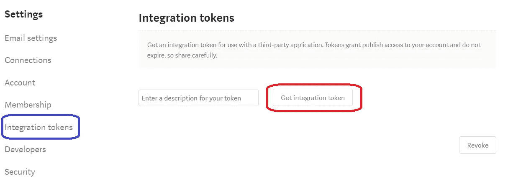
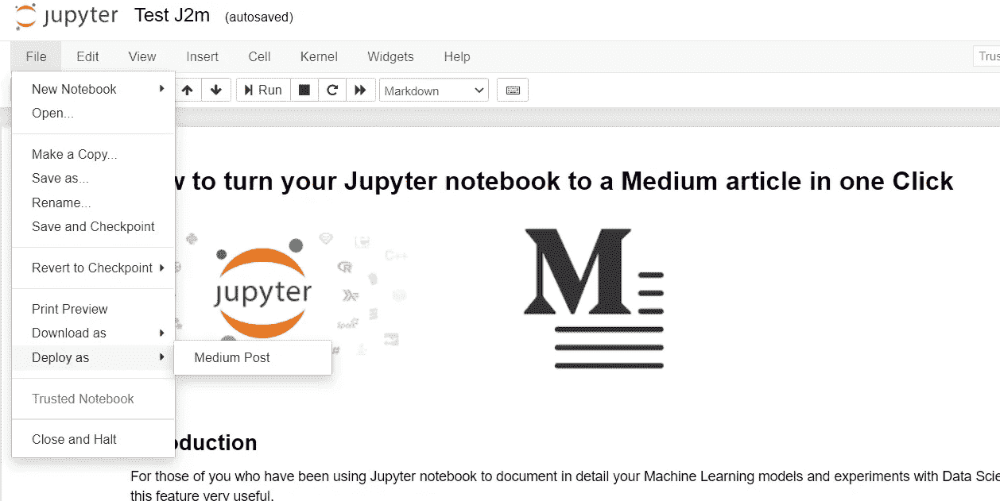
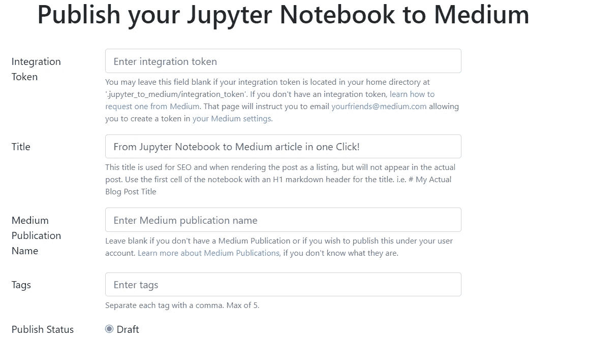
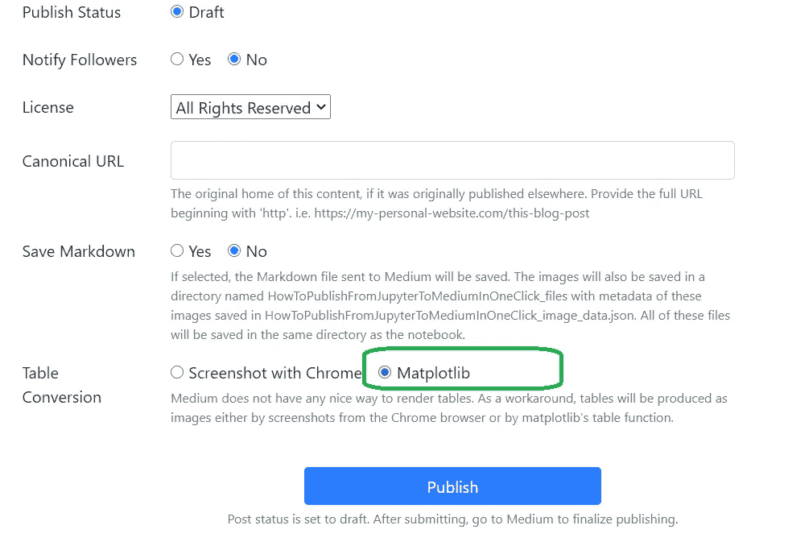
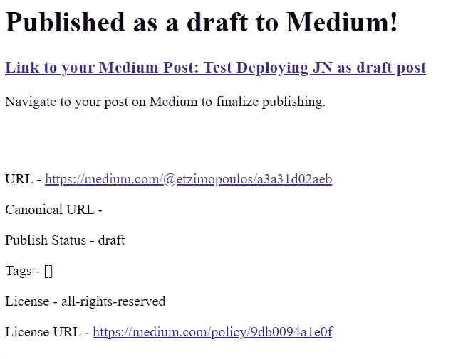
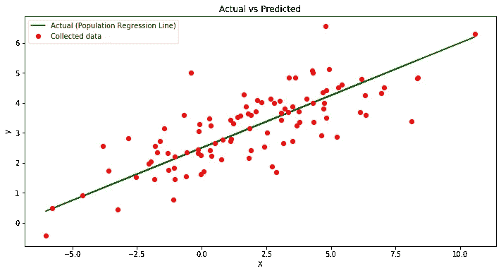

# 如何一键将你的 Jupyter 笔记本变成中号文章

> 原文：<https://medium.com/analytics-vidhya/howtopublishfromjupytertomediuminoneclick-b28f682fef8f?source=collection_archive---------22----------------------->


## 介绍

对于那些一直在使用 Jupyter notebook 详细记录机器学习模型和数据科学实验的人来说，你会发现这个功能非常有用。

我曾经尝试过通过编辑图片、导入、整理格式等方式为媒体重新编写内容来发布笔记本，这是一个非常繁琐的过程，会占用开发笔记本本身的注意力和时间。

## 步骤 1-获得图书馆

幸运的是 [Ted Petrou](https://medium.com/u/cf7f60f2eeb3?source=post_page-----b28f682fef8f--------------------------------) 已经发布了一个可以一键完成的库，猜猜它的名字:“jupyter-to-medium”。

要安装，请在 Linux shell 下运行以下命令:

`pip install jupyter-to-medium`

## 步骤 2 —媒体集成令牌

首先，您需要从 Medium 获取一个集成令牌。转到您的设置并选择“集成令牌”部分。在那里，您可以自行颁发令牌，并按照下面的屏幕截图对其进行描述:



这就是所谓的“自发行”访问令牌，下面将详细描述(摘自 Medium 的 API 文档[https://github . com/Medium/Medium-API-docs):](https://github.com/Medium/medium-api-docs):)

**如果您不符合这些标准，您不应该请求用户给您一个集成令牌。在 Medium 中，用户将被警告像对待密码一样对待集成令牌，并被劝阻不要让它们普遍可用。**

*用户可以通过向 yourfriends@medium.com 发送电子邮件来申请访问令牌。然后，我们将在他们的媒体帐户的设置页面上授予访问权限。*

*您应该指示您的用户访问此 URL，并从集成令牌部分生成一个集成令牌。您应该建议对此令牌进行描述，通常是您的产品或功能的名称，并对所有用户一致使用。*

*自行颁发的访问令牌不会过期，尽管用户可以随时撤销它们。*

或者，您可以在基于验证的**浏览器上检查同一页面，以编程方式完成**

## 保存您的令牌

生成令牌后，需要将其保存在本地主目录的以下文件夹中:

`.jupyter_to_medium/integration_token`

## 第 3 步—通过笔记本发布

完成工作后，导航至菜单`File --> Deploy as --> Medium Post` :



这将在您的浏览器中启动一个新选项卡，在中型网站上显示以下屏幕:



根据说明，如果您已经执行了上述步骤 2，则不必手动输入令牌。

最后，有两个选项可用于库保存您的图像:

*   Chrome 截图
*   Matplotlib

我一直在用第二个，Matplotlib，它工作得很好！



然后，一旦你更新你的标题，点击发布，把你的笔记本变成一个草稿出版物。

完成后，您将收到一条确认消息和一个链接，可导航至您的帖子:



## 步骤 4-线性回归示例

让我们在一个带有熊猫表和一个情节的简单例子中看看它是如何工作的。

在下面的示例中，我们将:

*   基于线性方程 y = aX + b 创建一个样本回归线
*   通过添加噪声来模拟 X，y 对的样本数据集，从而生成样本 X 和 y
*   将数据集存储到 Pandas 数据框架中，并显示前 5 行—图片 1 在发布时自动生成
*   绘制回归线和抽样总体-图 2 在发布时自动生成

```
import numpy as np
import pandas as pd
from numpy import array
from matplotlib import pyplot as plt# Number of Samples
n = 100

# Create r and r1, random vectors of 100 numbers each with mean = 0 and standard deviation = 1
r = np.random.randn(n)
r1 = np.random.randn(n)

# Create random Input vector X using r
# mean = 3
# stddev = 2
X = 3 * r + 2

# Create random Residual term Res using r
# mean = 0
# stddev = 0.8
res = 0.8 * r1 

# Generate Y values based on the simulated regression line and error/noise
# Population Regression Line
yreg = 2.5 + 0.35 * X 
# Adding noise/error
y = yreg + res                  

# Storing Population Regression Line "RegL", data points X and y in a data frame
rl = pd.DataFrame(
    {'X': X,
     'y': y,
     'RegL':yreg}
)

# Show the first five rows of our dataframe
rl.head()
```


```
# Plot regression against actual data
plt.figure(figsize=(12, 6))
# Population Regression Line
plt.plot(X,rl['RegL'], label = 'Actual (Population Regression Line)',color='green')
# Least squares line
#plt.plot(X, ypred, label = 'Predicted (Least Squares Line)', color='blue')     
# scatter plot showing actual data
plt.plot(X, y, 'ro', label ='Collected data')   
plt.title('Actual vs Predicted')
plt.xlabel('X')
plt.ylabel('y')
plt.legend()
plt.show()
```



## 参考

更多关于 *Jupyter_to_medium* 图书馆的细节可以在这里找到——[https://github.com/dexplo/jupyter_to_medium](https://github.com/dexplo/jupyter_to_medium)

或者随时联系这个伟大工具的作者 [Ted Petrou](https://medium.com/u/cf7f60f2eeb3?source=post_page-----b28f682fef8f--------------------------------) 。