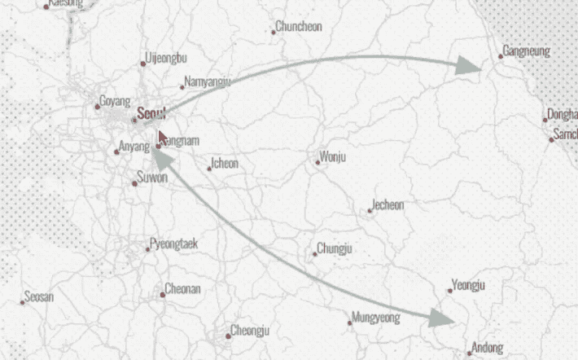
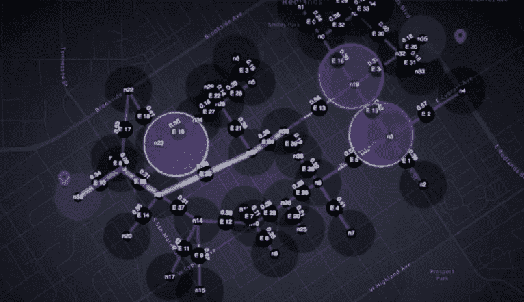
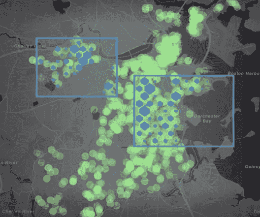
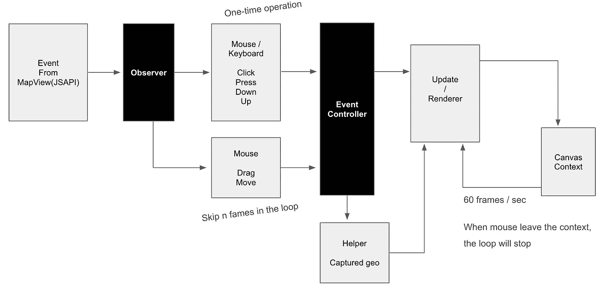

# 用 JSAPI 优化地图绘制的渲染循环

> 原文：<https://medium.com/analytics-vidhya/html-canvas-optimization-of-rendering-loop-with-jsapi-for-drawing-on-map-71cb0500a213?source=collection_archive---------14----------------------->

您是否有兴趣开发一种工具来绘制形状或在地图上可视化数据？您可能想知道如何使用 ArcGIS 的 [JSAPI 优化您的自定义渲染器，那么这篇文章就是您的了。](https://developers.arcgis.com/javascript/)

**为什么是 HTML 画布？**

没有什么特别的理由表明 [HTML 画布](https://www.w3schools.com/graphics/canvas_intro.asp)是在网络浏览器上绘图的最佳方式，相比之下 [WebGL](https://developer.mozilla.org/en-US/docs/Web/API/WebGL_API) 或 [SVG](https://developer.mozilla.org/en-US/docs/Web/SVG) 也可以被认为是绘图工具。然而，它提供了在 Web 环境中进行动态绘制的简单而直接的方法。Canvas 被认为是在 Web 浏览器上绘制或可视化的一种简单的交互式方式。

**为什么要用 JSAPI 来映射和可视化数据**

ESRI 的地图产品 JSAPI 为我们提供了许多强大的 API，使我们能够在地图上进行分析、可视化和绘制。HTML 画布和来自 JSAPI 的投影，我们可以在地图上构建一个定制的绘图工具。使用 JSAPI 中的 Map 和 MapView 对象，我们可以创建一个基于地理位置和屏幕位置坐标系的动态绘图工具。

在本文中，尽管在 JSAPI 中使用 HTML Canvas 有很多方面(稍后我会介绍更多有趣和令人兴奋的东西)，但本文主要分享在 JSAPI(MapView object)实时图形中使用 HTML Canvas 的几种优化方法。

让我们回顾一下 HTML Canvas 的传统和众所周知的优化技术，我们可以采用它来最小化渲染循环中的计算和绘图。

1.  减少渲染循环
2.  避免使用`context.shadowBlur`等阴影。
3.  避免使用 API: `context.save()`和`context.restore()`
4.  在不同的情况下使用多个画布:静态或动态场景。
5.  使用 requestAnimationFrame，而不是`setTimeout`或`setInterval`
6.  越来越…

虽然'`requestAnimationFrame`'有很多渲染循环的优化，但有一些空间我们可以显式地优化计算。

**控制渲染循环**

除了上面我提到的，还有更多，但是，不用说，我们不想在没有交互的时候做渲染循环。例如，当鼠标离开 div 或 HTML 画布上下文时，或者在它渲染某些循环以完成开始的动画后，我们可以在不清除画布的情况下停止循环。因此，我们仍然可以看到地图上的形状或图像。

甚至进一步优化，可以控制帧速率。例如，当缩放或平移地图时，渲染循环的低帧速率会显示某种锯齿状的动画，不能很好地附着在地图上。显然这对实时图形没有好处。在这种情况下，我们可以根据 MapView 对象的平移或缩放事件动态切换渲染循环的帧速率。

**区分任务**

大多数实时图形环境，如 Unity、Unreal 等，有三个不同的步骤:在单个循环中的(1)初始化，(2)更新，和(3)渲染阶段的步骤。利用每一步在优化计算和循环中起着重要的作用。不希望在每个渲染循环中计算相同的数据。在这种情况下，我们将这个计算放在初始化阶段。因此，就开发架构中的管道而言，我们需要仔细设计一组数据流，以便在必要时进行控制。

在更新阶段，我们可以计算有意义的计算，如检查距离、动力学物理、悬停效果等等。在帧速率降低的情况下，我们可以跳过一定数量的帧来计算，因为它与渲染无关，在渲染中它在我们可以看到的屏幕上绘制实际的形状。有些函数每秒钟执行 15 或 10 次是可以的。

让我们来看看渲染步骤，我们可以根据计算机系统的能力自由调节帧速率，因为更新阶段与渲染无关。从功能强大的机器到移动设备，我强烈建议你安装一种观察器来监控和改变渲染循环中的帧速率。根据形状或可视化实体的数量，或者根据平移或缩放等事件，我们可以应用不同的帧速率。此外，由于 GPU 的并行处理，绘制特定的操作在渲染阶段进行。我的意思是，关注点或任务的分离和隔离总是可以被认为是一个良好的实践，以便在一定的架构复杂度内进行调试和优化。

**挑选形状**

对于图形来说，选择是一个非常重要和广泛的操作。尽管拾取通常是一个根本不同的故事，但它也会影响渲染循环。想想这样一种情况，每当你移动鼠标、点击或拖动某物时，我们需要在渲染循环的同时跟踪和计算管道中的事件。当然，在当前渲染循环之上，我们不希望为循环中的事件添加额外的计算。但不幸的是，没有办法避免处决。否则，什么都不会发生。

为了最小化拾取的计算量，有许多方法可以通过诸如[四叉树](https://en.wikipedia.org/wiki/Quadtree)、屏幕外渲染或简单的数学如距离检查来实现拾取。但同样，我们需要最小化循环本身，这是维持循环条件的基本帮助。

鼠标按下、按下、单击、双击事件在渲染循环中作为一次性操作发生。在这种情况下，无法在循环时跳过执行。然而，我们可以通过跳过鼠标事件中的某些帧来优化循环。例如，在移动鼠标时，有必要检查指针是否悬停在某个形状上。我们不需要一秒钟执行 60 次这种庞大的操作。或者每一帧。

更复杂的情况是，在地图上拖动多边形的顶点时，我们可以检查形状的最近顶点，以将所选顶点捕捉到最近的顶点。在这个操作中，我们可以不在单个循环中计算检查操作，而是在循环的每一个偶数帧或每五帧中计算检查操作。然后，我们捕捉形状的最近顶点，并在鼠标释放时重用捕捉到的顶点。现在你可以看到我们可以减少多少帧来计算运算。

**处理渲染循环中的事件**

在渲染循环期间，有许多管道和输入来触发执行计算。比如键盘或者 UI 按钮或者滑动条。持续启动这些函数会影响性能。作为一种保护措施，我们可以安装一些功能来监听事件，并智能地插入或跳过其中的一些事件，如果相同的事件根据场景和 MapView 的状态持续快速出现的话。

我相信在整个架构中，在纳米、微米和宏观层面上有很多优化的技巧。在这篇文章中，我分享了用 JSAPI 的 MapView 减少渲染循环次数的技巧。作为一个例子，我建议访问[story map](https://storymaps.arcgis.com)(【https://storymaps.arcgis.com】T2)并鼓励你体验我在上面应用了这些方法的 Expressmap，以及更多。