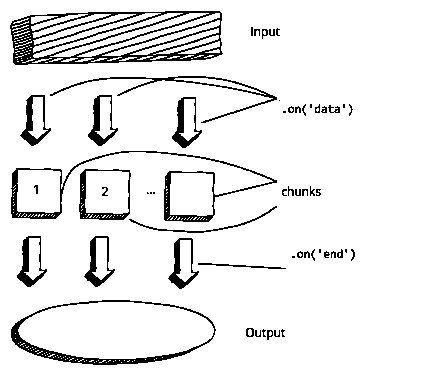

# 带有节点的 HTTP 客户端。射流研究…

> 原文：<https://medium.com/analytics-vidhya/http-client-with-node-js-c94f75f11c2a?source=collection_archive---------4----------------------->


[来源](https://db.httpandssl.com/t/what-is-http-a-brief-introduction/30)

如何执行简单的 GET 和 POST 请求

在构建 web 应用程序时，我们经常希望向其他服务发出 HTTP 请求。

> 为了做出这样的请求，我们使用核心模块' **http** '。该模块使用[事件发射器](/analytics-vidhya/event-emitters-in-node-js-d93084441974)模式

# 简单的 GET 请求

> GET 请求是指我们从服务器获得的请求

有两种方法可以做到这一点，

## 1.没有缓冲

一次向终端打印一行新的响应。

对代码的解释在评论中

```
const http = require('http') //require http core module
const url = "http://nodeprogram.com" //url to get data//perform GET request
http.get(url, (response) => {
response.on('data',(chunk)=> { //on data event(we are getting data) //,perform the function
console.log(chunk.toString('utf8')
})response.on('end' ,()=> { //all of the data has been recieved
console.log("response has ended")})
.on('error' , (error)=> { //error with the request
console.log(error.message) //print error in case error received
})
```

## 2.带缓冲器

接收到的数据被一次性打印

```
const http = require('http')const url = 'http://nodeprogram.com' //URL to send data to //perform get request
http.get(url, (response) => {let rawData = '' //save all the data in this variableresponse.on('data', (chunk) => {rawData += chunk //all new lines are saved here}) response.on('end', () => {console.log(rawData) //print out data once request is completed})})
.on('error', (error) => {console.error(`Got error: ' + error.message)})
```

## **步伐**

****

**资料来源:阿扎特·马尔丹关于 EDX 的 NodeJS 课程简介**

## **在缓冲变量中保存数据的用例是什么？**

**这个用例在解析 JSON 文本时很实用。让我们在下一节做吧**

## **解析 JSON 数据**

```
const https = require('https')const url = 'https://gist.githubusercontent.com/azat-co/a3b93807d89fd5f98ba7829f0557e266/raw/43adc16c256ec52264c2d0bc0251369faf02a3e2/gistfile1.txt' //JSON  texthttps.get(url, (response) => {let rawData = ''response.on('data', (chunk) => {rawData += chunk}) response.on('end', () => { //when request completes,try {const parsedData = JSON.parse(rawData) //function for parsing data console.log(parsedData) //print out data} catch (e) {console.error(e.message) //print out error }})})
.on('error', (error) => {console.error(`Got error: ' + error.message)})
```

****解析需要在 *try/catch 块*内部进行，以处理由于 JSON 输入格式错误**而可能发生的任何故障**

# **简单的发布请求**

> **POST 请求是指我们**向服务器发送**请求。**

**举个例子，让我们向*mockbin.com*发送数据，然后从站点接收响应。**

```
const http = require('http')const postData = JSON.stringify({ foo: 'bar' })//define options for requests
const options = {hostname: 'mockbin.com',port: 80,path: '/request?foo=bar&foo=baz',method: 'POST',headers: {'Content-Type': 'application/x-www-form-urlencoded','Content-Length': Buffer.byteLength(postData)}}//define requestconst req = http.request(options, (res) => {res.on('data', (chunk) => {console.log(`BODY:` + chunk) //receive response})res.on('end', () => {console.log('No more data in response.')})})req.on('error', (e) => {console.error(`problem with request: ${e.message}`)})req.write(postData) //send data to the serverreq.end()
```

# **上传并删除**

**这些请求使用相同的 POST 请求格式，只是相应地更改了***options . method***的值**

**在接下来的文章中，我们将使用 Node.JS 制作 HTTP 服务器，感谢您的阅读。回头见！**