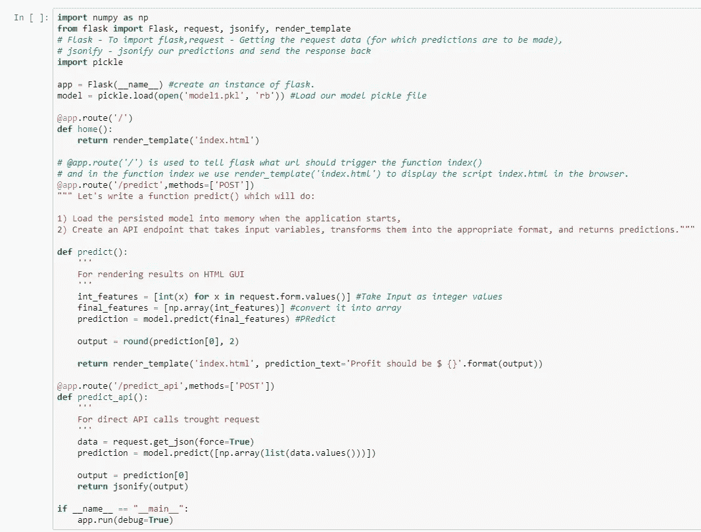

# 构建第一个 Flask Python web 应用框架

> 原文：<https://medium.com/analytics-vidhya/https-medium-com-chirag6891-build-the-first-flask-python-e278b52473f3?source=collection_archive---------7----------------------->

## 当用 Python 开发一个 web 应用程序时，你可能会利用一个框架。Python 有很多框架，我们现在将从中学习 [Flask](http://flask.pocoo.org/) 。这篇文章将成为你使用 Flask web 框架开发全功能网站的完整权威指南。

# **本文详解**:

1)安装烧瓶

2)创建机器学习模型

3)保存机器学习模型

4)使用 Flask 创建 API

5)创建前端应用程序

6)在个人服务器上托管

# 环境设置

REST API 使用 Flask

**Flask 是一个 web 框架，**为我们提供工具、库和技术，让我们*构建一个 web 应用*。这个 web 应用程序可以是任何网页或博客，也可以像商业网站一样大。

**在 Anaconda 发行版中安装烧瓶:**

pip 安装烧瓶

# 使用 Flask 解释数据流

使用 Flask 的数据流

**要采取的步骤:**

1)训练机器学习模型

2)将训练好的机器学习模型对象保存为 pickle 文件(序列化)

3)构建一个 flask 环境，该环境将具有一个 API 端点，该端点将封装我们训练过的机器学习模型，并使其能够通过 HTTP/HTTPS 上的 GET 请求接收输入(特征),然后在解序列化早期序列化模型后返回输出

4)上传 flask 脚本以及经过训练的机器学习模型

5)通过网站或任何其他能够发送 HTTP/HTTPS 请求的应用程序向托管的 flask 脚本发出请求

# 机器学习模型

## 训练我们的机器学习模型

创建 Python 文件 model.py

机器学习模型

这里，在运行上述代码后，使用 dump 创建了一个名为“model.pkl”的文件，dump 是经过训练的机器学习模型，可以传输到任何地方，并在使用 load 进行反序列化后使用。

# 烧瓶设置

让我们首先在本地主机上设置 flask 服务器，然后在 python 上部署它。

以下脚本在本地主机和默认端口(5000)上启动 flask 服务器，创建 URL:[http://127 . 0 . 0 . 1:5000/](http://127.0.0.1:5000/)(http://127 . 0 . 0 . 1:5000/)

app.py

应用内路由 app.route decorator 用于指定 flask 应用在 web 上的路由。

1.  “/”简单地表示是“http://127 . 0 . 0 . 1:5000/”(http://127 . 0 . 0 . 1:5000/)的家
2.  2)“/predict/”表示[http://127 . 0 . 0 . 1:5000/predict/](http://127.0.0.1:5000/predict/)(http://127 . 0 . 0 . 1:5000/predict/)

# **路由**

在初始化 app.py 文件后，我们必须告诉 Flask 在网页加载后我们想做什么。python 代码 [@app](http://twitter.com/app) 。route("/"，methods = ["GET "，" POST"])告诉 Flask 当我们加载网站主页时要做什么。在方法中:GET 方法是我们的 web 浏览器在访问网页的 URL 时将发送给网站的请求类型。不要担心 POST 方法，因为它在这个部署过程中与我们没有太大的关联。

# 设置 HTML 文件

index.html

## 保存 model.py、app.py 和 index.html

在 anaconda 提示符下运行 app.py

复制网址[http://127 . 0 . 0 . 1:5000/](http://127.0.0.1:5000/)(http://127 . 0 . 0 . 1:5000/)并粘贴到您的浏览器中

几秒钟后，这将显示在浏览器中。

机器学习 API

## 将数据输入不同的类别

## 然后按预测按钮

你可以看到我们预测了我们的利润，注意到页面的 URL 变成了[http://127 . 0 . 0 . 1:5000/predict](http://127.0.0.1:5000/predict)(http://127 . 0 . 0 . 1:5000/predict)。

这是我的第一篇文章，希望你喜欢，所有文件的 Github 链接都在这里:[https://github.com/chiragsamal/flask_tutorial](https://github.com/chiragsamal/flask_tutorial)