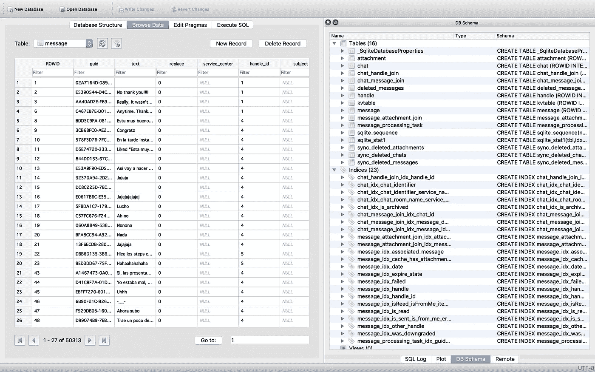
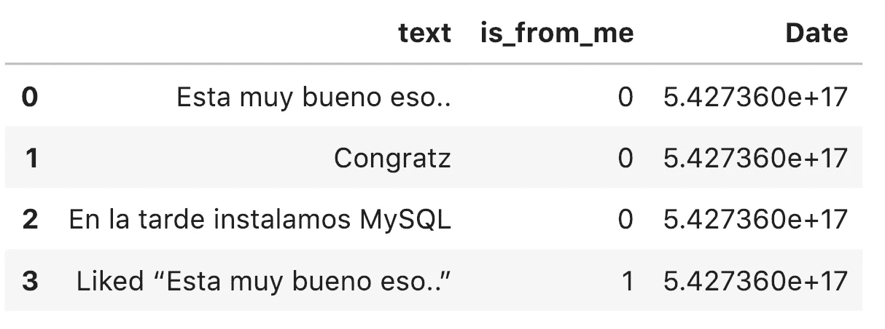
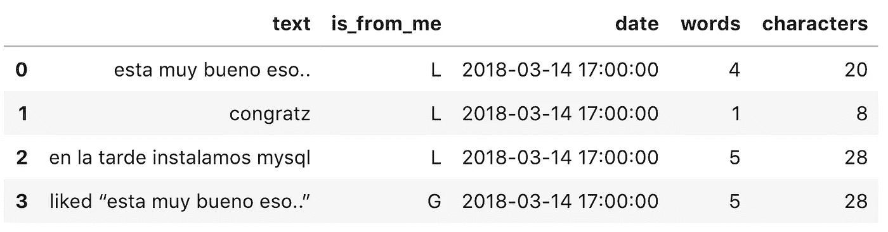
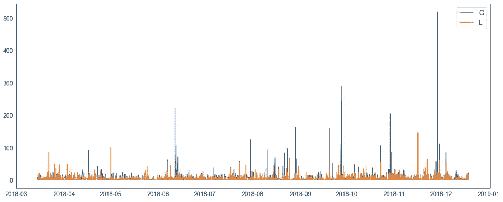
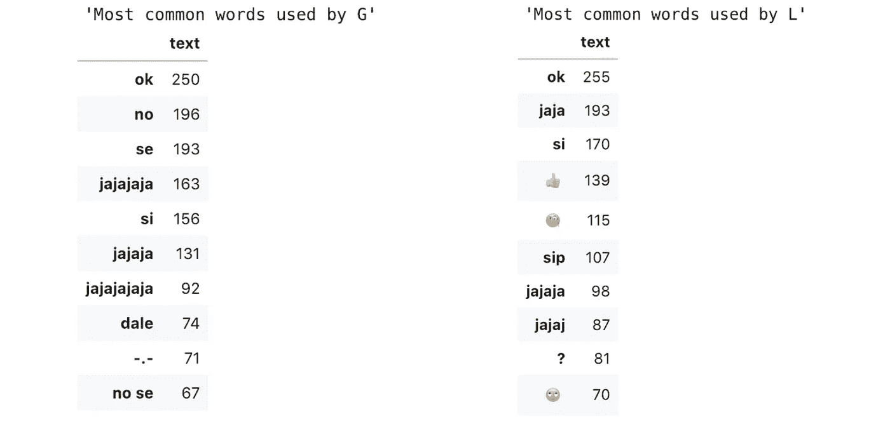
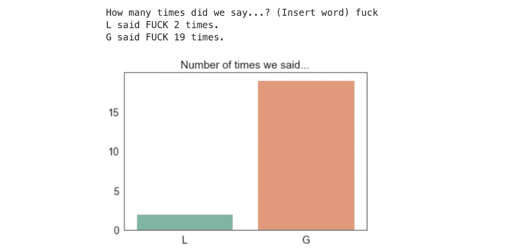
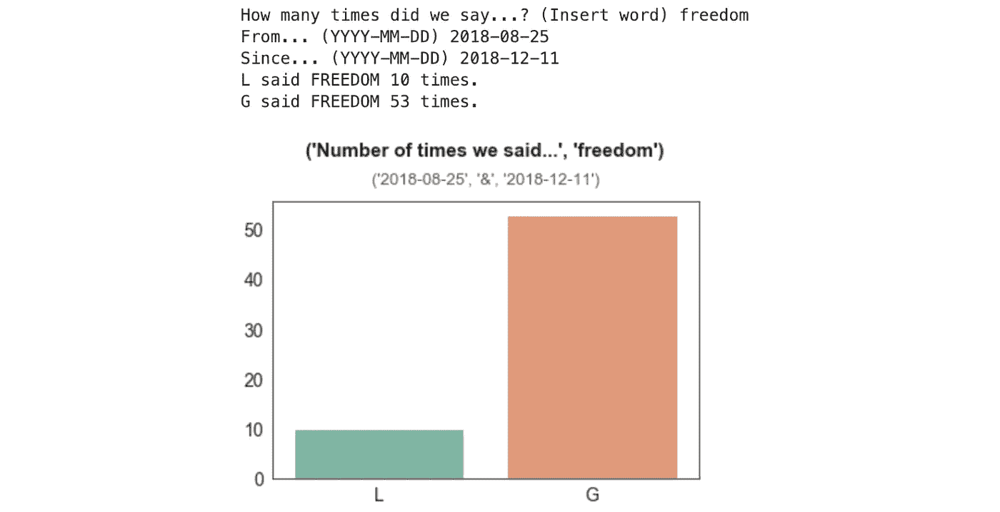

# YAiM——又一个 iMessage 挖掘

> 原文：<https://medium.com/analytics-vidhya/https-medium-com-gss-yaim-yet-another-imessage-mining-1bb0d812b002?source=collection_archive---------1----------------------->

## TLDR:是的，我用 Python 分析了我和我最好朋友的 iMessage 对话。但我保证不止如此。

B 在我进入编码部分之前，这里有一个简短的背景故事，关于我如何最终试图掌握使用 Python 分析 iMessage 上的对话的复杂艺术…

我一直是那种不喜欢做礼物的人。不管是圣诞节、你的生日，还是你刚刚生了一个孩子；我不会给你买任何东西。郑重声明，这不代表我不喜欢/不爱你。我不喜欢的另一件事是收到礼物。我有时觉得我不需要它，或者它只是增加了混乱…但我不是愚蠢的女孩。如果你带着一包哈里波的令人兴奋的 Goldbä ren 或一块好巧克力来，我会感到飘飘然。

我为什么要告诉你这些？我最好的朋友在 12 月满 25 岁，我觉得应该送他一份生日礼物——但我不知道具体是什么。我在 Illustrator 中为他设计一些东西和跑到最近的书店买我看到的第一本书之间摇摆不定。但我想到，如果我最终设法将我的一些 Python 和数据仓库技能结合起来，我将能够对我们在 iMessage 上的对话进行某种分析。

就这样开始了。

# 你到底是怎么…

## …查看您的 iMessage 短信？！

在阅读了许多文章和博客后，我花了几个小时才弄明白这一点。你可以在这里找到最有用的棋子[，在这里](https://apple.stackexchange.com/questions/321521/can-i-access-contact-names-in-chat-db)找到[。](http://osxdaily.com/2010/07/08/read-iphone-sms-backup/)

首先，我在我所有的苹果设备上同步了我的短信。我是这样做的。这样做之后，名为`chat.db`的文件就自动在我的 Mac 上创建了。那个文件是苹果保存你所有 iMessage 数据的地方。这是文件的路径:`~/Library/Message`。

我发现在`chat.db`中访问数据的最简单的方法之一是使用 SQLite (DB4S)的 *DB 浏览器。DB4S 允许您添加、删除和浏览数据库中的记录，还有其他功能。你可以在这里下载[。很安全，我保证。](https://github.com/sqlitebrowser/sqlitebrowser)*

chat.db 已加载到 SQLite 的 db 浏览器中

如果您想做同样的事情并使用 DB4S 检索数据，下面是一个简短的分步指南。

1.  运行 DB4S
2.  点击*打开数据库*并加载`chat.db`
3.  点击*浏览数据*并从下拉菜单中选择*消息*。
4.  *文本*栏包含您发送和接收的所有文本的预览。查看该列，确定您想要分析的文本，并从从左到右的第六列获得 *handle_id* 。记住那个数字。你以后会用到它。
5.  点击*执行 SQL* 并运行以下代码:

6.一旦运行它，您将看到下面的输出。将其导出为`csv`和……*瞧*！

## …阅读。Python 中的 csv？！

我在我的 JupyterLab 中导入了所有必需的包，并阅读了`csv`。

哇！这是数据帧前四行的预览。`text`包括所有交换过的信息——是的，那是西班牙语——，`is_from_me`表示是我(1)还是其他人(0)发送的信息，`Date`给出了信息发送的时间。您可能注意到了，日期不是人类可读的格式。我必须改变这一点。

## …处理那些日期？！

我会说这是最耗时的。我不得不浏览大量的博客、文章和软件文档，想出一个简单的方法来格式化`Date`列。你可以在这里[这里](https://stackoverflow.com/questions/10746562/parsing-date-field-of-iphone-sms-file-from-backup)[这里](https://www.timeanddate.com/date/durationresult.html?d1=1&m1=1&y1=1970&d2=1&m2=1&y2=2001&h1=0&i1=0&s1=0&h2=0&i2=0&s2=0)[这里](https://cr.yp.to/libtai/tai64.html)找到帮我解决这个[的文章。](https://stackoverflow.com/questions/1832714/18-digit-timestamp)

长话短说:显然，苹果使用 Mac 绝对时间(MacTime)来表示自 2001 年 1 月 1 日起的*纳秒*，而不是基于 Unix 的自 1970 年 1 月 1 日起的*秒*的其他类型的日期。在整整四个小时毫无意义的阅读和编写代码之后，我最终将最初的 MacTime 日期除以 1，000，000，000，转换成秒。我还添加了 978，307，200 秒(31 年)，因为一旦日期转换为 UnixTime，就会缺少 31 年(2001 年 1 月 1 日-1970 年 1 月 1 日)。以下是一步一步的步骤:

## …开始分析文本？！

在开始分析文本之前，我必须对数据框架做一些调整:识别发送者(G & L)，删除不必要的行和列，等等。

我继续创建了一个列来表示每条消息中的字数，另一个列包括每条消息中的字符数。我还把单词改成了小写，以避免重复计算。

准备好数据框架后，我开始做一些探索性的数据分析。我将数据帧按`is_from_me`列分组，看看哪个发送者使用了更多的字符和单词。我是这样编码的:

哪一天发送的消息最多？

最常发送的信息是什么？

然后我创建了一个函数，调用任何单词作为输入，并返回每个发送者说这个单词的次数。第一个功能——`iWantToCountWords`——要求用户键入一个单词。第二个是`count`——统计并绘制每个发送者说这个词的次数。

但是如果一个人想在一定的时间范围内计算和绘制一个单词呢？首先，我定义了一个函数，它需要一个单词、一个开始日期和一个结束日期作为输入。这个函数是`iWantToCountWordsInTime`，它返回第二个函数——`countDate`——进行计数和绘图。对于第二个函数，我使用了一个掩码来根据选择的日期过滤`g`和`l`数据帧。

对像这样的数据集进行更深入的分析还有很大的空间。如果对话包括两个以上的人，可以查看对话动态、谁回复谁的网络分析、探索消息的情感、识别主题等。

现在，如果你决定开始分析你的 iMessage 数据，我希望这篇教程能帮助你理解如何检索数据和处理那些乱七八糟的 MacTime 日期。

黑客快乐！