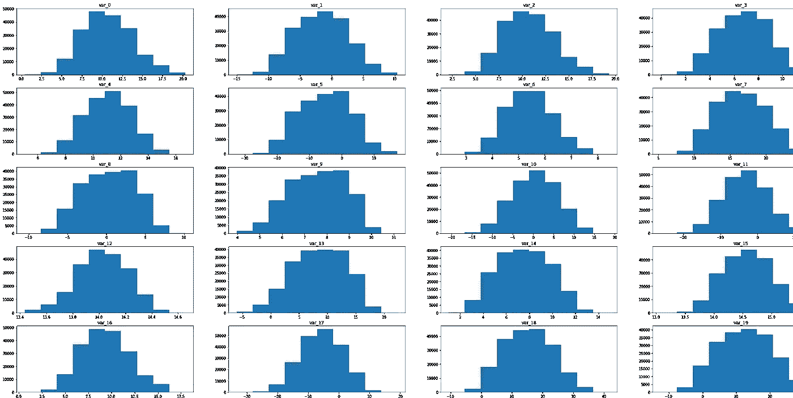
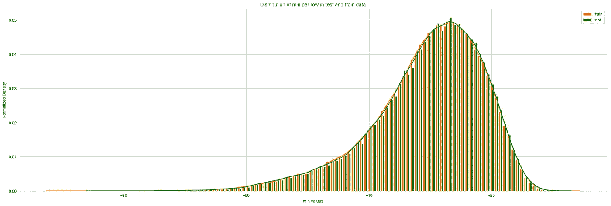

# 使用 LightGBM 进行客户交易预测

> 原文：<https://medium.com/analytics-vidhya/https-medium-com-kushagrarajtiwari-customer-transaction-prediction-3191c6c634dc?source=collection_archive---------1----------------------->

## 使用 LightGBM 对不平衡数据进行探索性数据分析和建模。


[来源](https://www.pexels.com/photo/working-macbook-computer-keyboard-34577/)

## 我正在学习 Python 进行数据分析，并希望将这些概念应用到真实的数据集上——然后我发现了[这个问题。](https://www.kaggle.com/c/santander-customer-transaction-prediction)

在这个问题中，我们需要确定哪些客户将在未来进行特定的交易，而不考虑交易的金额。

训练数据是一个匿名数据集，包含 200 个数字特征变量、二进制目标列、字符串 ID_code 列和 2，00，000 个观察值。测试数据包括 200 个匿名数字变量和一个字符串 ID_code 列以及 2，00，000 个观察值。这是一个监督机器学习算法下的二元分类问题。任务是预测测试集中目标列的值。

在这篇文章中，我将讨论这个问题的一般商业意义是什么？如何发掘数据？以及如何通过调整模型参数来建立一个轻量级的 GBM 模型来解决不平衡数据的分类问题。本文使用的 Python 代码在这里是[。](https://github.com/KUSHAGRARAJTIWARI/Santander-Customer-Transaction-prediction-/blob/master/santander%20customer%20prediction_final.ipynb)让我们开始这段旅程吧👇。

# **一般业务意义**

该项目可以在以下方面帮助公司-

1.将客户细分为小组，并根据实际行为来解决单个客户的问题，而不是硬编码任何使客户彼此相似的先入为主的概念或假设，也不是只查看隐藏了单个客户重要事实的汇总数据。

2.使用预测性客户行为建模技术准确预测客户的未来行为(例如，交易预测)，而不是只看历史数据的后视镜。

3.使用高级计算来确定每个客户的客户终身价值(LTV ),并以此为基础做出决策——而不是只看客户可能给组织带来的短期收入。

4.根据客观的衡量标准，准确地知道现在应该为每个客户做什么营销活动，以最大化每个客户的长期价值。

5.使用营销机器学习技术，该技术将揭示洞察并提出建议，以改善人类营销人员自己不太可能发现的客户营销。

# **探索性数据分析**

探索性数据分析主要包括缺失值分析、异常值分析、相关性分析、描述性分析和可视化，以从数据中获得洞察力。

首先，让我们检查训练数据中少数和多数类的数量。


典型的不平衡数据

少数民族阶层几乎是训练数据中 10%的目标变量。

**处理不平衡数据集**

在为这个数据集建模之前，让我们了解如何处理分类问题的不平衡数据集。当面对不平衡数据集时，传统的机器学习算法往往产生不令人满意的分类器。对于任何不平衡数据集，如果要预测的事件属于少数类，且事件发生率小于 10%，通常称为罕见事件。当面对不平衡数据集时，传统的模型评估方法不能准确地测量模型性能。像决策树和逻辑回归这样的标准分类算法偏向于具有大量实例的类。他们倾向于只预测多数类数据。少数类的特征被当作噪音，常常被忽略。因此，与多数阶级相比，少数阶级被错误分类的可能性很高。分类算法的性能由混淆矩阵来衡量，混淆矩阵包含了实际类别和预测类别的信息。因此，我们需要处理这个不平衡的数据集。

下面是[处理不平衡数据](https://towardsdatascience.com/methods-for-dealing-with-imbalanced-data-5b761be45a18)进行分类的一些方法。

训练和测试数据中没有缺失值。

让我们通过绘制每个变量的直方图来检查训练数据中前 20 个数字特征的分布。(关于完整功能的发布，请点击[这里](https://github.com/KUSHAGRARAJTIWARI/Santander-Customer-Transaction-prediction-/blob/master/distribution%20of%20numeric%20variables.png)。)



训练数据中前 20 个变量的分布。

观察直方图的形状，我们可以很容易地得出结论，几乎所有的数字变量都遵循正态分布。

根据 Chauvenet 的标准，我决定看看数据集中是否有异常值。在去除异常值(总观察值的 0.87%)后，我们在训练数据中有 1，98，264 个观察值，在测试数据中有 1，98，250 个观察值。

现在让我们检查两个目标类的训练数据中前 20 个变量的分布。(要检查所有变量的分布，请到[这里](https://github.com/KUSHAGRARAJTIWARI/Santander-Customer-Transaction-prediction-/blob/master/Distribution%20of%20column%20per%20each%20class.png)。)


训练数据中每类前 20 个变量的分布。

从上面的图中我们可以看到，对于不同的目标类别，一些变量显示出不同的分布。但是使用基于树的算法可以处理目标类中的这些不同分布，因为恢复 0 和 1 正是基于树的分类模型所做的。对于每个观察值，模型可以指定该观察值属于 0 的概率和该值属于 1 的概率。

训练和测试数据中前 20 个数值变量的分布。(完整的发行版请点击[这里。](https://github.com/KUSHAGRARAJTIWARI/Santander-Customer-Transaction-prediction-/blob/master/Distribution%20of%20train%20and%20test%20data..png))


训练和测试数据中前 20 个变量的分布。

就数字变量的分布而言，训练和测试似乎是平衡的。

可视化分类描述性统计，如训练数据的平均值、中值、标准差、最小值、最大值、峰度和偏斜度，我绘制了以下图表。峰度和偏斜度给出了关于数据分布形状的信息。(要了解这些形状变量的重要性，请点击[这里](https://www.spcforexcel.com/knowledge/basic-statistics/are-skewness-and-kurtosis-useful-statistics)。)

训练数据中均值的分类分布


训练数据中中位数的分类分布


训练数据中标准偏差的分类分布


训练数据中偏度的分类分布


训练数据中峰度的分类分布


训练数据中最小值的分类分布


训练数据中最大值的分类分布


将训练和测试数据的平均值、中值、标准差、最小值、最大值、峰度和偏斜度等描述性统计数据可视化，我绘制了以下图表。

训练和测试数据的均值分布


训练和测试数据中值的分布


训练和测试数据中标准偏差的分布


训练和测试数据中的偏态分布


训练和测试数据中峰度的分布


训练和测试数据中最小值的分布



训练和测试数据中最大值的分布


**我们可以在这里做一些观察:**

对于训练和测试变量数据，标准差相对较大。然而，训练和测试数据的最小值、最大值、平均值、中值、标准偏差值看起来非常接近。平均值分布在很大的范围内。而且，均值和中位数有相似的分布。训练和测试数据都是极端的和负偏态的。

现在检查数值变量之间的相关性，训练数据中数值变量之间的最小和最大相关性分别为-0.009839 和 0.009676。这表明数值数据之间的相关性接近于零。这意味着大多数数字数据在它们之间几乎是不相关的。

此时，我将进行主成分分析(PCA ),以检查是否所有 200 个变量都有用，或者我们可以在此时减少特征。为此，我将绘制从 PCA 获得的经验方差。如果它形成一条斜率为 1 的直线，那么我们可以得出结论，数据集已经经过了主成分分析。(了解更多 PCA [这里](https://towardsdatascience.com/a-step-by-step-explanation-of-principal-component-analysis-b836fb9c97e2)。)


解释了对应于不同数量数值变量的方差图。

因此，我们必须使用所有 200 个特征。

# 特征工程

添加行描述性统计，即均值、中值、标准差、最小值、最大值、峰度、偏斜度和总和，作为训练数据集中的独立特征。我在最初的 200 个特征的基础上创建了 200 个新特征，其中这些新特征的新值是特定变量的每个单元中该值唯一出现的次数(频率)。频率中通常会有相关信息，这取决于类别是如何划分的。但我们在添加功能时必须小心谨慎。我们应该检查训练和测试数据中的重复观测值。在测试数据中发现有 1，000，000 个重复的观察值。

现在我在训练数据集中有 410 个变量，在测试数据集中有 409 个变量。

在建模之前，让我们先了解一些关于分类评估指标 AUC-ROC 得分的资料(需要对[混淆矩阵](https://towardsdatascience.com/understanding-confusion-matrix-a9ad42dcfd62)有很好的理解。).它是检查任何分类性能的最重要的评估指标之一。也可以写成 AUC-ROC(受试者操作特征下的面积)。AUC-ROC 曲线是在各种阈值设置下对分类问题的性能测量。ROC 是概率曲线，AUC 代表可分性的程度或度量。它告诉我们模型在多大程度上能够区分不同的类。AUC 越高，模型预测 0 为 0 和 1 为 1 的能力越强。ROC 曲线用真阳性率(TPR)对假阳性率(FPR)作图，其中 TPR 在 y 轴上，FPR 在 x 轴上。


中华民国的代表。

**为什么要用轻型 GBM** ？

正如我们在本文前面所讨论的，我们的数据集是不平衡的，因此我们不应该使用传统的模型，如逻辑回归。朴素贝叶斯的想法是好的，但我们应该确保预测变量的独立性，因为我们有几乎不相关的预测变量，但不能确保它们之间的独立性。

Light GBM 一次构建一棵树，其中每个新的树都有助于纠正先前训练的树所犯的错误。它在函数空间(而不是参数空间)中执行优化，这使得自定义损失函数的使用更加容易。与装袋和自适应增压相比，它在速度和精度上也更快。与 XGBOOST 相比，它能够在训练时间显著减少的情况下，在大型数据集上表现得同样出色。但是除了这些优点之外，LGBM 还有一个最不利的特点，即 LightGBM 中的[参数调整。这件事应该仔细做。(了解更多](https://lightgbm.readthedocs.io/en/latest/Parameters-Tuning.html)[光 GBM 参数](https://lightgbm.readthedocs.io/en/latest/Parameters.html)。)

# **造型**

用标准参数 LightGBM 建模后，AUC 得分为 0.88576。在添加特征并在建模之前用相同的标准参数建模之后，我得到 AUC 分数 0.89968。在调整参数并使用 k=10 的 [K 倍分层交叉验证](/datadriveninvestor/k-fold-and-other-cross-validation-techniques-6c03a2563f1e)后，我得到 AUC 分数 9.0600。


具有缩放阈值的 ROC

最后，计算二元分类的其他度量。

```
Accuracy Score for LightGBM is  0.86031
Precision Score for  LightGBM is  0.777291272763459
Recall Score for LightGBM is  0.39970320335687237
f1 Score for LightGBM is  0.527930789767159
```

可通过以下方式进一步改善

使用并行处理和 LightGBM 算法。

尝试 XGBoost 以获得更快的速度。

关于这个问题的专家观点，请点击这里。

# **结尾注释**

这是一个典型的不平衡数据集上的二进制分类问题，没有丢失值。预测变量是匿名的和数字的，目标变量是分类的。可视化的描述性特征，最后我知道这些变量之间是不相关的。之后，我决定处理不平衡的数据集。使用 LightGBM 建模，使用具有特征工程数据的标准模型参数，我得到的 AUC 得分为 0.899，并且在使用 K 倍分层抽样调整参数后，AUC 得分的最终值为 0.90600。

# **参考文献**

我从[https://www . ka ggle . com/cdeotte/200-magic-models-Santander-0-920/notebook](https://www.kaggle.com/cdeotte/200-magical-models-santander-0-920/notebook)和本文提到的其他链接中获取了本文的参考资料。我相信这些技术会很有用，你会从这篇文章中有所收获。直到那时快乐的分析！😎。