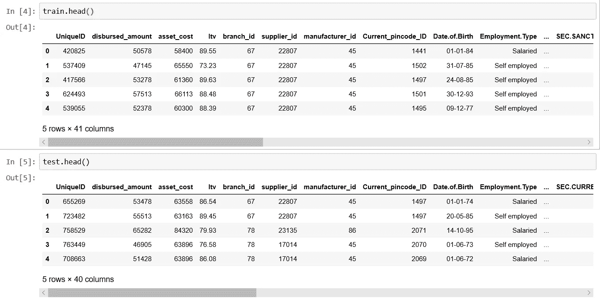

# 分析 Vidhya LTFS 竞赛的主要收获

> 原文：<https://medium.com/analytics-vidhya/https-medium-com-raghuginnu-ltfs-74deef86ba48?source=collection_archive---------3----------------------->

当你参加比赛时，你会学到很多东西，而这种实质性的学习来自于接触到其他人如何解决和你一样的问题，但却提出了不同的、更好的解决方案。

所以我在这里展示比赛中最精彩的部分

我写这篇文章的目的不是提供问题的解决方案，而是展示人们如何做不同的事情。代码中可能会有一些错误，因为我的目的是教授机器学习黑客马拉松的不同部分，不同代码如何做相同的工作，并展示最常见的特征工程和用户特定的特征工程。

## 在本文中，我使用了来自以下用户的代码片段:

1.  [@齐荣](https://datahack.analyticsvidhya.com/teams/zirons-team)
2.  [@Rajat5Ranjan](https://datahack.analyticsvidhya.com/user/profile/rajat5ranjan)
3.  [@TheGupta](https://datahack.analyticsvidhya.com/user/profile/TheGupta)
4.  [@Sandeepkumar121995](https://datahack.analyticsvidhya.com/user/profile/sandeepkumar121995)
5.  [@artem.dubinich](https://datahack.analyticsvidhya.com/user/profile/artem.dubinich)
6.  [@预测这个！](https://datahack.analyticsvidhya.com/teams/predict-this)
7.  [@sandeeppat](https://www.kaggle.com/sandeeppat/ltfs-top-3-5-kernel)

**机器学习竞赛的工作流程**

1.  [导入数据](#gjdgxs)
2.  [特征工程](#30j0zll)
3.  [异常值处理](#3znysh7)
4.  [缺失值处理](#2et92p0)
5.  [缩放数据](#tyjcwt)
6.  [采样](#3dy6vkm)
7.  [拆分数据](#1t3h5sf)
8.  [根据训练数据训练模型](#4d34og8)
9.  [对测试数据进行预测并提交结果](#2s8eyo1)。

**值得一读的解决方案**:

1.  齐伦的团队:这是我能看到的最高等级的解决方案，所以这里面有些东西。阅读顶级解决方案是一种享受
2.  [Sandeeppat](https://www.kaggle.com/sandeeppat/ltfs-top-3-5-kernel) :非常详细的内核。他深入地谈论了他的特性工程和一个整洁干净的内核

**代码:** [代码文件](https://github.com/rvt123/AV-Datahack_LTFS_2019/blob/master/AV%20LTFS%20Article%20Codes.ipynb)

**导入数据:【Hackathon 最棒的地方在于，你不必收集数据，相比之下，你的个人项目需要花费大量时间和精力来收集数据。数据收集可能是一件有趣的事情，但并不总是如此。在这里，你必须解压训练数据，导入到熊猫数据框中。**

**特征工程**

前 20 名排名的差异背后的原因仅仅是运气，但前 20 名和前 100/200 名背后的原因是特征工程。特征工程并没有一个简单可靠的诀窍，人们在适当的时候会学到的。有些人创建一个功能来创建他们常用的特性，许多人根据竞争来创建动态特性，两种方法都一样好一个给速度，另一个给可定制性。在这里，我将展示一些几乎每个人都创建的功能，但有所不同，还有一些功能是用户独有的。

**1。** **年龄**

在我读到的每个解决方案中，这是最常见的特征

年龄计算为支付日期栏和出生日期栏之间的差值。

大多数人都注意到了出生日期栏的小故障，你呢？

问题是熊猫把出生日期“01-01-74”读成了“01-01-2064”，而这个日期应该是“01-01-1964”。我将列出人们用来解决这个故障的不同方法:

**方法一**

**方法二**

**方法三**

**方法四**

**方法五**

**2。** **付款日期和出生日期**

两者都是“日期”类型的格式，但是它们不能以它们现在的形式使用，所以最常用的方法是提取“月”、“日期”和“年”，但是也可以提取其他特征，例如“是月的开始、中间还是结束”、“日期中的某一天”、“一年中的某个季度”、“星期号”、“从 1970 年 1 月 1 日开始的绝对日期”。

**方法 1(原始)**

**方法 2(使用功能)**

**3。** **从“平均帐龄”和“信用历史长度”中提取月份和年份**

大多数人从列中提取“月”和“年”,但是有些人也为列计算“月的总时间”,但是很高兴看到每个人都以自己的方式这样做，有些人使用正则表达式，有些人使用 split，有些人使用 created used，所以您可以自由地使用您认为容易的方法。

**方法 1**

**方法二**

**方法三**

**方法四**

**方法五**

**方法六**

**4。** **执行 CNS 评分描述(局报告)**

不用看，这是一个重要的特征，人们使用不同的策略来减少类别的数量，我将尝试列出它们，你可以尝试所有的组合，并保留产生最佳结果的组合:

**方法一**

**方法二**

**方法三**

**方法四**

**方法五**

**5。** **执行 CNS 评分**

许多人保留了本列的值，但有些人试图使用“pd.cut”或“pd.qcut”来绑定值，但有些人也使用他们的定义来绑定变量。

**6。** **基于“一级账户”、“二级账户”、“ltv”、“已支付金额”的特性。**

大多数人都使用基于主要账户、次要账户和支付金额组合的功能，我尝试收集了一些最常见的功能，您可以尝试一下，并选择适合您的功能。

**7。** **来自所有内核的一些独特特性:**

**7.1 特征——基于异常分支:**

异常分支机构—跟踪分支机构，从这些分支机构开始，某些贷款得到批准，然后在远离该银行的展厅进行购买，甚至可能在不同的州或城市。如果一笔贷款得到分行的批准，可以通过查看通常的陈列室进行跟踪。在此列表中检测到的某些异常已经在此功能中进行了跟踪。

**7.2** **未结清余额账户**

这背后的想法是，客户拥有的未结余额越多，他的可信度就越低。

**7.3 一次 Def、二次 Def、总 Def 和最近六个月的 Def**

主要违约

次级违约

完全违约

过去六个月的违约

**8。由 Groupby 函数创建的特征:**

这些类型的特性在黑客马拉松中被广泛使用，它们提供了很好的结果，但是有代价。代价是我们不知道哪个特征是好的还是坏的，除非我们训练一个模型并获得特征重要性，所以我们必须创建许多特征，然后对它们进行特征选择。这里我使用了 Ziron 团队创造的特性。

**9。** **支出金额中的异常值**

人们经常忘记，准确性经常会因为一两个异常点而降低，我们过度拟合我们的模型以减少误差，这使得我们的模型对测试数据不太稳健，消除异常是必要的，但我只看到一个人这样做，甚至我忘记了这样做，向那个人致敬:

支出金额中的异常值

**10。** **雇佣类型中缺少值**

只有一列缺少值“雇佣类型”。几乎每个人都为缺失创建了一个新的类别，原因是缺失值并没有那么少需要填充。

**11。** **缩放数据**

进行缩放是因为我们具有高度变化的特征，并且因为大多数机器学习算法在其计算中使用两个数据点之间的欧几里德距离，所以我们需要将所有特征带到相同的幅度级别，但是只有少数内核实现了缩放。一些常用的缩放技术是标准缩放器、最小最大缩放器、鲁棒缩放器。但令我惊讶的是，其中一个内核使用了[分位数变换](https://scikit-learn.org/stable/modules/generated/sklearn.preprocessing.quantile_transform.html)来缩放数据，这对我来说也是全新的。

分位数定标器/转换器

**12。采样**

采样是为了解决不平衡类的问题。在这种情况下，属于一个类别的观察值的数量显著低于属于其他类别的观察值的数量。在这种情况下，使用传统机器学习算法开发的预测模型可能会有偏差和不准确。

1.  [随机欠采样](https://imbalanced-learn.readthedocs.io/en/stable/generated/imblearn.under_sampling.RandomUnderSampler.html)
2.  [随机过采样](https://imbalanced-learn.readthedocs.io/en/stable/over_sampling.html)

**拆分数据**

根据选择，数据通常以 75: 25 或 80:20 的比例在训练和测试之间分割，这样做是为了我们可以在一个集合上训练我们的模型，并在另一个集合上测试它。

大多数情况下，拆分是基于使用 train_test_split 实现的类来完成的:

**分层分裂**:不使用类别标签作为分层，使用训练集和测试集之间的相似性作为分层的参数可能会给出更好的模型，考虑到该模型获得了关于训练集和测试集中的数据点有多相似/不相似的想法。

**14。训练模型:**

内核中最常用的模型是使用 k 重交叉验证的 [Catboost](https://tech.yandex.com/catboost/) 和 [LightGBM](https://lightgbm.readthedocs.io/en/latest/) 。具有好的训练和测试分数并且训练和测试分数之间的差异不显著的模型被认为是好的模型。这里我展示了 Ziron 团队使用的训练方法，但是你可以根据你的喜好来训练你的模型。

**15。提交文件**

提交文件是对我们的模型进行评估的测试数据的输出，并根据评估指标给出分数，例如 ROC 曲线下面积、RMSE(均方根误差)、RMSLE(记录值的均方根)。投稿文件多为 Excel 或 CSV 文件。