# 决策树直觉

> 原文：<https://medium.com/analytics-vidhya/https-medium-com-shashi-kiran-ai-decision-tree-intuition-92f708f13f33?source=collection_archive---------14----------------------->

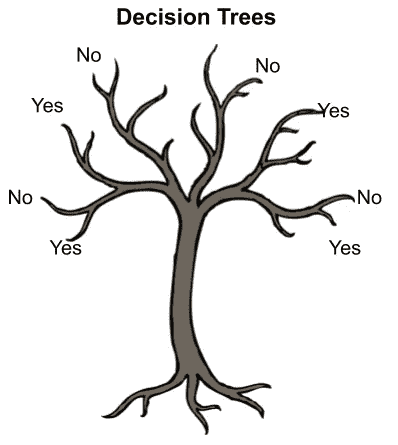

D 决策树容易&实现简单&解释。决策树是一种图表(流程),用于预测行动过程或概率。决策树的每个分支代表一个结果、一个决定或一个反应。决策树可以在从个人到复杂的各种情况下实现。这些步骤的顺序会让你更容易理解。

在编程中，我们经常使用 If-else 条件，甚至决策树的工作过程也类似于 If-else 条件。

# 让我们看看决策树是什么样子的

下面的树显示了决策树中不同节点的简单实现。

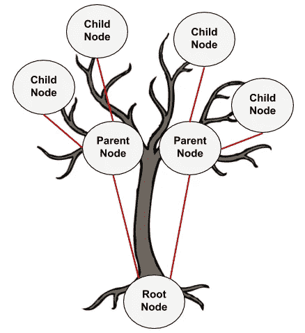

1.  **根节点:**根节点是具有基本特征的顶层节点。
2.  **父节点:**从一个根节点获得其来源的节点，或者这可以被表示为一个决策节点，在该节点处发生是/否、真/假或预测转折的决策。
3.  **子节点:**这些节点从父节点获得它们的原点。如果父节点做出的决定不令人满意，那么将创建这些节点。直到我们到达我们在一个类中具有纯支配地位的最终节点(是/否)意味着直到我们到达叶节点。
4.  **叶节点:**也可以称为终端节点或最终决策节点，我们将在此做出结论。

# 现在让我们看看决策树是如何以几何方式表示的？

下面是一个虹膜数据的简单决策树

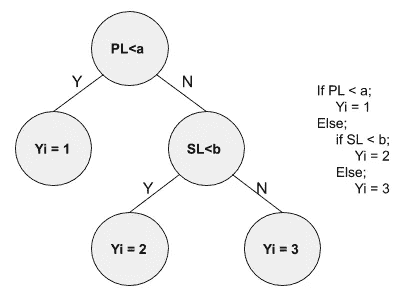

> 注:a & b 分别是萼片&花瓣的长度。

让我们看看如何在几何上表示同一个决策树。

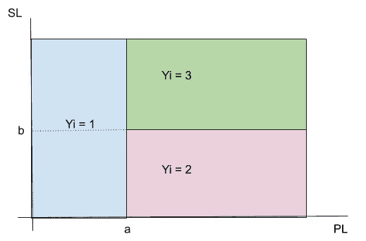

几何上我们看到决策边界是轴平行的&每个叶节点(Yi)都有一个决策面。

# 如何拆分决策树中的一个节点？

一个节点的分裂需要找到一个个体阶级统治的纯粹性(是/否)。直到我们达到一个纯度，我们应该分裂的数据。我们有下面提到的一些方法来根据概率将数据分割到不同的节点。

## 熵(ID3)

熵是随机性的一种度量。换句话说，这是对不可预测性的一种衡量。我们将在这里花点时间给出二元事件的熵(就像掷硬币，输出可以是两个事件中的任何一个，正面或反面)

熵的概念起源于热力学，是对分子无序度的一种度量。

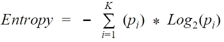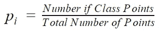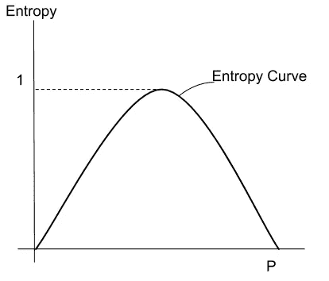

## 信息增益(ID3)

信息增益基于在属性上分割数据集后熵的减少。构建决策树就是要找到返回最高信息增益的属性(即最相似的分支)。

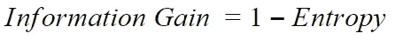

## 基尼杂质(CART)。

基尼系数的计算方法是从 1 中减去每一类概率的平方和。它倾向于更大的分区。信息增益将类别概率乘以该类别概率的对数(基数=2)。信息增益倾向于具有许多不同值的较小分区。最终，您必须试验您的数据和分割标准。

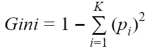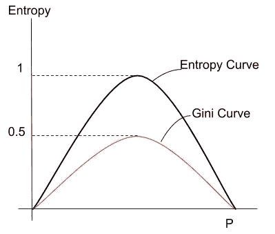

# 我们可以在哪里使用决策树(哪类问题)？

决策树可以用于回归和分类问题。实现方法非常不同，因为回归问题以实数为目标变量，而分类问题以二元或离散目标变量为目标变量。

## 回归

被最小化以选择分裂点的成本函数是落在矩形内的所有训练样本的误差平方和。回归目标值将被视为阈值(分割器关注值，以获得基尼系数和熵纯度，因此，如果已知值位于指定限制内，则被视为给定类别。简单的图表如下所示。

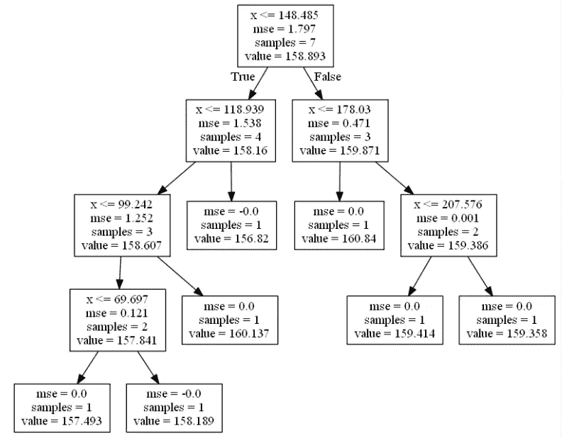

资料来源:botbark.com

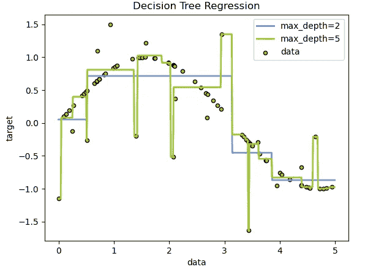

资料来源:scikit-learn.org

## 分类

使用基尼成本函数，其提供了节点纯度的指示，其中节点纯度是指分配给每个节点的训练数据的混合程度。

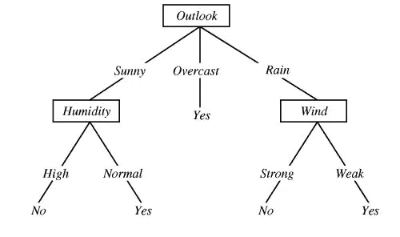

来源:打网球示例

# 基尼 vs 熵，用什么来分裂节点？

没有很大的区别，因为它们导致相似的树。相对而言，基尼系数的计算速度比熵更快，因为在熵中实施对数运算会使分割速度相对较慢。默认情况下，选择基尼指数法。

即使使用 sci-kit learn 库也使用 Gini 作为默认值，要使用熵，我们需要超参数模型作为标准。

基尼不纯倾向于隔离树分支中最频繁出现的类，而熵倾向于产生一个稍微平衡的树。

感谢阅读。

**查看** [**中型简介**](/@Shashi.Kiran.AI) **查看更多类似博客**

您可以通过以下方式联系到我:

领英:[https://www.linkedin.com/in/shashikiranc/](https://www.linkedin.com/in/shashikiranc/)