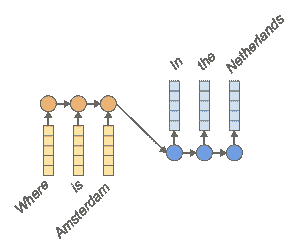
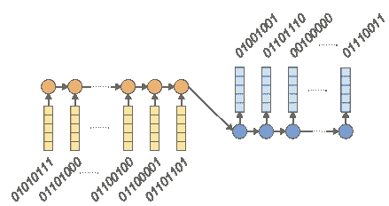

# 为什么应该关注 NLP 中的字节级序列到序列模型

> 原文：<https://medium.com/analytics-vidhya/https-medium-com-tomkenter-why-care-about-byte-level-seq2seq-models-in-nlp-26bcf05dd7d3?source=collection_archive---------1----------------------->


[原图](https://www.pexels.com/photo/two-women-sitting-on-chairs-beside-window-1181719/)由【Pexels.com】的[克里斯蒂娜·莫里路](https://www.pexels.com/@divinetechygirl)拍摄

序列到序列模型在自然语言处理中普遍存在。它们被应用于各种问题，从词性标注到问答系统。通常，它们处理的文本被视为一个单词序列。虽然这被证明是强大的，但单词级模型也有自己的问题。

例如，在任何给定的语言中都有许多不同的单词，因此单词级模型应该维护非常大的词汇表。这可能会变得太大，不适合计算机内存，这可能会使模型难以在智能手机等较小的设备上运行。此外，可能还会遇到不认识的单词，如何处理它们还不是一个解决的问题。最后，一些语言中同一个词有许多不同的形式(形态变体)。单词级模型将它们都视为不同的单词，这不是最有效的处理方式。

这就是字节级模型的用武之地。虽然字节级序列模型最近在 NLP 中获得了更多的关注，但是对于一大群 NLP 研究人员和实践者来说，它们仍然是相对未知的。这是每个人的损失，因为字节级模型将高度可取的属性与上述长期存在的问题的优雅解决方案结合在一起。

这篇博客文章解释了字节级序列到序列模型是如何工作的，这如何带来它们所具有的好处，以及它们与其他模型——特别是字符级和单词级模型——的关系。

为了使事情更具体，我们将关注一个特定的用例:序列到序列模型，带有递归神经网络(RNNs)。
我们将使用机器阅读的任务——一项计算机阅读一份文件并回答相关问题的任务——作为贯穿全文的运行示例。

下面的内容是基于我在[谷歌研究院](https://research.google.com/)实习期间所做的研究，最终形成了[这篇论文](http://www.tomkenter.nl/pdf/kenter_byte-level_2018.pdf)。

# 为什么要关心字节级的序列到序列模型？

让我们从带回家的信息开始。为什么我们要使用字节？事实证明，一个字节一个字节地读写文本内容——而不是一个单词一个单词地，或者一个字符一个字符地——有相当多的优势:

✅小输入词汇→结果，小模型尺寸

✅没有超出词汇量的问题

✅以优雅的方式处理每个单词的许多词形变体

另外，bytes 为我们提供了一个跨语言的通用编码方案，并且允许在不同型号之间进行比较。

那么，是不是一切顺利，除了蓝天什么都没有？！？很遗憾，没有……

字节级模型有一个缺点，那就是:

RNN 模型的❌展开长度更长→结果:可以读取的输入更少

向前跳一点，字节级模型实际上与字符级模型非常相似，它们的性能通常与单词级模型相当(正如我在[这篇文章](http://www.tomkenter.nl/pdf/kenter_byte-level_2018.pdf)中关于机器阅读任务所证明的)。这可能会让你认为，嗯，在这种情况下，也许他们根本没有什么太令人兴奋的？但这可能没有抓住重点。

如果我们再次考虑上面列出的第一点，即更小的模型尺寸，它实际上是用更少的参数获得了更好的性能。这是非常好的消息！

此外，在与英语有很大不同的语言上——例如，俄语和土耳其语在形态学上比英语丰富得多，因此单词作为输入单元不太适合——字节级模型比单词级模型更有优势。这是更好的消息！

简而言之，许多优点和理想的计算特性。让我们来解释一下字节级模型是如何工作的。之后，我将展示上面提到的每一点——小输入词汇和模型大小，
没有词汇外问题，处理每个词的许多形态变体的优雅方式，以及 RNN 模型的更长展开长度——是如何得出的。

另外，我们将看到 bytes 如何为我们提供跨语言的通用编码方案，以及它们如何允许在不同型号之间进行比较。

## 字节级模型是如何工作的？

在讨论字节之前，首先让我们看看典型的字级编码器-解码器或序列到序列模型是什么样的:



图一。单词级序列对序列模型，用于回答问题。

图 1 底部的输入是代表单词的向量(也称为*单词嵌入*)，用黄色方块的列表示。它们由用橙色圆圈表示的循环细胞处理，这些细胞将单词向量作为输入，并保持一种内部状态，跟踪迄今为止读取的所有内容。蓝色单元格以最后一个橙色单元格的内部状态作为输入。它们有单词嵌入作为输出，对应于答案中的单词。黄色/橙色位就是所谓的*编码器*。蓝色位是*解码器*。

从图中可以推断出，模型需要访问单词嵌入的字典。输入中的每个单词和输出中的每个单词都对应于字典中的一个唯一的单词向量。处理英语文本的模型通常存储 100，000 个不同单词的向量。

现在让我们看看这在字节级是如何工作的:



图二。字节级序列到序列模型。

这里，在图 2 中，我们看到一个字节级的序列到序列模型。输入是嵌入，就像单词级模型一样，但是在这种情况下，嵌入对应于字节。第一个字节对应于字符“W”，第二个对应于“h”，依此类推。

这里要明确一个细节，因为这有时会引起混淆，字节本身是嵌入的 ***而不是*** 。相反，它们被用作嵌入矩阵条目的索引。因此，字节 0000 0010 对应于嵌入矩阵中的第三行(如果索引是从 0 开始的)，它本身是一个，比方说，200 维向量。

简而言之:输入中的每个字节和输出中的每个字节都对应于字典中的一个唯一向量，即嵌入矩阵。由于有 256 个可能的字节，每个字节级模型存储 256 个向量作为其字典。

## 输入词汇少→因此，模型规模小

这立即给我们带来了字节级模型的第一个优势:它们的词汇表大小为 256，对应于所有可能的字节。这比单词级模型小得多，比如说，单词级模型必须为其词汇表中的每个单词存储 100，000 个嵌入。

对于 200 的典型嵌入大小，字节级模型在其嵌入矩阵中有 256 ×200 = 51，200 个值。然而，单词级模型需要跟踪 100，000 × 200 = 20，000，000 个值。我认为可以肯定地说，这是一个实质性的区别。

## 没有词汇之外的问题

当一个词级模型遇到一个词不包括在它的 10 万个词的词汇里会发生什么？事实证明，这是一个很难解决的问题，也是很多研究的主题。人们已经提出了许多解决方案，例如保留一组未使用的嵌入，作为未知单词的占位符。当未知单词需要作为输出时，我们可以简单地从输入中复制它。人物级别的模特也会遇到意想不到的人物。即使我们处理的是维基百科的数据，仅仅是维基百科的英文部分，一个维基百科页面可能包含一些中文文字，或者如果是关于数学的，可能是一些希腊符号。虽然占位符机制非常强大——尤其是在几乎没有词形变化、没有格等的语言中。—奇怪的一对未知字符可能会被忽略，有趣的是，当模型读取字节时，超出词汇表的输入是不可能的，因为 256 字节的集合太大了。

当然，这并不意味着所有问题的终结——例如，字节级模型可能仍然不擅长处理数学方程——但它确实让一个问题变得不那么令人担心了。

> 当模型读取字节时，不可能进行词汇外输入，因为 256 字节的集合非常庞大

顺便提一下，有一些混合模型，它们执行单词级的读写，但是当遇到词汇表之外的单词时，会求助于字符级或字节级的读取。无需在此详述，本文中显示的[是该车型在英国数据中表现最佳。然而，在土耳其的数据上，一个完全字节级的模型表现得更好。](http://www.tomkenter.nl/pdf/kenter_byte-level_2018.pdf)

## 处理单词的许多形态变体

更小的词汇表，通用的编码方案，没有词汇表之外的问题……所有这些对于字节级模型来说当然很好，但同样，单词级模型也可以工作。那么，真的……为什么我们要避免把单词作为输入呢？这就是上面提到的形态丰富的语言发挥作用的地方。

在英语(以及类似的语言，如荷兰语、德语、法语等)中。)，单词携带相对原子的意义单位。举个例子，就拿*椅*这个词来说吧。单词 ***椅子*** 的意思和*椅子*的意思一样，只是多了几个。

类似地， *walk* 表示某种活动，在单词*walk****ed***中也是差不多的活动，其中 *-ed* 部分表示过去发生过。

> “那么，真的……为什么我们要避免把单词作为输入呢？”

现在，对比一下土耳其。

在土耳其语中， *kolay* 一词的意思是“容易”。单词*kolaylat rabiliriz*的意思是“我们可以让它变得更容易”，而*kolaylat ram yoruz*的意思是“我们不能让它变得更容易”。同样， *zor* 的意思是“艰难”或“困难”，*zorlatrabiliz*的意思是“我们可以让它更难”，而*zorlatramyoruz*的意思是“我们不能让它更难”。

这里，土耳其语说明了作为一种形态丰富的语言意味着什么。
简而言之，英语中很多本来可以用单独的词来表达的东西，在土耳其语中是通过‘变形’这个词来表达的；改变其形状，例如在词干上附加后缀。突然之间，*一词的概念在这里有了不同的变化。土耳其语中的单词是什么，我们可能会认为是英语中的一个短语或一个完整的句子。*

让我们再次将它与序列模型联系起来。一个处理英语的模型将有一个单词嵌入到*椅子*中，另一个单词嵌入到*椅子*中。这就是单词*椅子*的两种形式的两种嵌入。如上图所示，在土耳其语中，像 *kolay* 这样的单词有很多很多的形式。因此，我们将不得不存储更多的内容，而不是每个单词只存储两个嵌入。
事实上，土耳其语中一个单词(或者词干，真的)可以构成的单词数或多或少是无限的，就像英语中有无限多的句子一样。

对于有很多格的语言，例如俄语，也可以进行类似的论证。每个词干都有许多不同的形式，对应于不同的情况。为了覆盖俄语中与英语中相同数量的词干，需要一个大一个数量级的词汇。对于通用模型来说，这可能会变得非常昂贵，或者说得直白一点，太大而不适合内存。

最后，虽然在单词级模型中，*chairs*和 *chairs* 的语义信息在它必须为这两个单词维护的两个单词向量之间是重复的，但是这些单词之间共享的许多信息可以存储在字节级维护的矩阵中，这甚至可以允许它在打字错误( *chairss* )或训练期间没有观察到的不常用单词形式( *This couch 相当 chairy)的情况下进行归纳).*

## RNN 车型的展开长度更长→因此:可以读取的输入更少

要阅读句子“阿姆斯特丹在哪里”，单词级模型需要 3 个步骤，每个单词一个步骤。字节级或字符级模型需要 18 个。平均单词长度因语言而异，但字符级模型不可避免地需要比单词级模型更多的步骤，字节级模型需要相同的数量，甚至更多。如果要处理很长的输入，这可能会成为一个障碍。

## 奖励 I:跨语言的通用编码方案

现在，在这一点上，你可能会想，到目前为止所说的大部分不都是针对字符的吗，就像针对字节一样？

答案是，在一定程度上，是的。

事实上，对于英语来说，使用 ASCII 编码时，读取字符或字节是没有区别的。ASCII 编码字符的方式允许编码 256 个字符，并且(令人惊讶地…)这 256 个可能的字符被存储为字节。

然而，我们都知道，但有时会忘记，英语不是世界上唯一的语言。还有其他语言，如荷兰语、德语和土耳其语，使用 ASCII 字符集中没有的字符，如*、*和*。此外，用俄语书写时，人们使用完全不同的字母表，包括西里尔字母。***

***为了对所有这些非 ASCII 字符进行编码，人们发明了无数编码方案，如 UTF-8、UTF-16、ISO-8859–1 等，所有这些方案都扩展了 ASCII 码集中的 256 个字符。***

> ***"我们都知道，但有时会忘记，英语不是世界上唯一的语言."***

***字符级模型，顾名思义，以字符为输入输出单位。要做到这一点，他们必须选择一种编码方案和一组他们希望处理的特殊字符。现在，如果我们可以不用做这些决定，那不是很好吗？如果我们可以用一种格式，一种跨语言的通用编码方案来表示所有的语言和字母，会怎么样？***

***答案是，当然，通过使用字节，我们可以做到这一点，这在这一点上并不奇怪。***

***当我们读取字节作为输入时，使用什么编码方案对输入进行编码并不重要，是 UTF-8、ISO-5589–1 还是其他。编码器 RNN 会解决这个问题。解码器也是如此，它必须输出遵循训练材料中提供的特定编码方案的字节。幸运的是，对于一个 RNN 来说，这些都是要完成的琐碎任务，在我看到的所有实验结果中，在最初几次训练迭代之后，我从未遇到过一个编码错误。***

## ***奖励二:不同型号之间的比较***

***字节级模型允许模型之间的公平比较。这一点与上一个问题密切相关，即字节提供了跨语言的通用编码方案。任何单词级别的模型都有一个词汇表，更重要的是，可以选择将哪些单词包含在词汇表中。即使两个研究人员使用相同的数据，他们也不太可能在其模型的词汇表中使用完全相同的单词。***

> ***“即使两个研究人员使用相同的数据，他们也不太可能在他们的模型词汇中找到完全相同的单词。”***

***这也适用于角色级别的模型，尽管程度较低。模型可以处理哪些角色？预期会有哪些音调符号？有哪些标点符号被认为是？制表符可以作为空白字符出现吗？***

***虽然可以为任何模型提供合理的默认值，但值得注意的是，当比较两个不同架构的字节级模型时，它们在性能方面的任何差异都不可能是由于它们在输入/输出词汇方面的选择不同。性能上的差异*与*架构上的差异有关。***

# **最后**

**上面，我试图解释字节级模型背后的直觉，以及为什么我对它们充满热情。**

**字节级模型提供了一种处理词汇外问题的优雅方式。在英语上，字节级模型的性能与最先进的单词级模型相当，在形态学上更复杂的语言上甚至可以做得更好。这是个好消息，因为字节级模型的参数要少得多。
总之:读取输出字节真的管用；-)

这并不意味着字节级模型是上述问题的唯一解决方案。有一些非常有趣的工作是关于语素级别的模型，甚至是处理单词任意部分的模型，这些模型自己找出拆分单词的最佳方式。**

> **"简而言之:读取和输出字节确实有效."**

**所有这些模型的共同点是，它们允许处理非常复杂的形态学现象，而不需要求助于复杂的基于规则的系统，或者用于形态学分析的机器学习模型，这些模型可能需要大量的人工精选数据集来进行训练。

最后，我不得不承认我跳过了很多(嗯，*非常多*)细节。虽然我并不是这样想出所有这些的。**

**这篇博文基于我在加州山景城的谷歌研究院实习期间所做的工作，发表在 AAAI 18 年的论文中，如果你想引用的话，其内容是:**

```
**[@inproceedings](http://twitter.com/inproceedings){byte-level2018kenter,
  title={Byte-level Machine Reading across Morphologically Varied Languages},
  author={Tom Kenter and Llion Jones and Daniel Hewlett},
  booktitle={
    Proceedings of the Thirty-Second AAAI Conference on Artificial Intelligence (AAAI-18)
  },
  year={2018}
}**
```