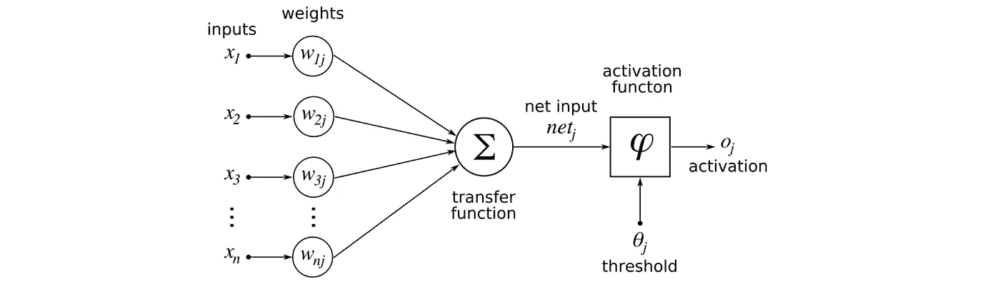

# 神经网络中激活函数的类型

> 原文：<https://medium.com/analytics-vidhya/https-medium-com-types-of-activation-functions-in-neural-network-504ddba28e35?source=collection_archive---------8----------------------->

什么是激活函数？

**激活函数**通常是代表细胞内动作电位发放速率的抽象概念。在最简单的形式下，这个函数是二元的——也就是说，要么神经元在放电，要么不放电。

激活函数在神经网络中的作用是什么？

激活函数的目标是将非线性引入神经元的输出。

为什么我们需要非线性激活函数？

如果你使用线性激活函数(身份激活函数，例如:y=ax)，那么神经网络只是输出输入的线性函数。换句话说，无论网络有多少层，它的行为就像一个单层感知器，因为将这些层相加只会给你另一个线性函数。

激活功能的类型:

有许多类型的激活功能。在本文中，我们将看到我在项目中使用的函数以及每个函数的 python 实现。

1.  乙状结肠的
2.  双曲正切
3.  热卢
4.  卢瑟
5.  Softplus
6.  软设计

**乙状结肠功能:**

我们熟悉这个函数，因为我们在逻辑回归中使用过它。

**数学方程式:f(x)=** 1/(1+e^(-x)

值的范围是从 0 到 1。

Python 实现:请参考**Github link "**[https://github.com/vivekpandian08/activation-function](https://github.com/vivekpandian08/activation-function)

**双曲正切函数:**

正切双曲函数。它比使用 s 形函数给出更好的结果，但不是最好的。

**数学方程:f(x)=** (2/(1 + e-2x))-1

值的范围是从-1 到 1。

**Relu 功能:**

整流线性单元。由于它的非线性性质，它是隐藏单元中最常用的激活函数。

**数学方程:f(x)=** max(0，x)

当 x 为正时，它给出 x 的值，否则给出 0。

值的范围是从 0 到无穷大。

**卢瑟功能:**

比例指数线性单位。它支持深度神经网络，因为没有消失梯度的问题。

**数学等式:f(x) =** λ*x 对于所有 x > 0，λ*αe(x)α否则。

值的范围是从-无穷大到无穷大。

**软加功能:**

郑等人(2015)的研究论文“使用 softplus 单元改进深度神经网络”表明，softplus 比 ReLU 函数为深度神经网络提供了更多的稳定性和性能。

**数学方程式:f(x) =** log(exp(x)+1)

值的范围是从-无穷大到无穷大。

**软标记功能:**

Softsign 是神经网络双曲正切激活函数的替代方案。尽管 tanh 和 softsign 函数密切相关，但重要的区别是 tanh 以指数方式收敛，而 softsign 以多项式方式收敛。

**数学方程式:f(x)=x/abs(x)+1**

值的范围是从-1 到+1。

在下一篇文章中，我们将介绍其他重要的高级激活函数，如 reaky relu、parametric relu 等。

Git hub 链接:【https://github.com/vivekpandian08/activation-function 

感谢阅读。