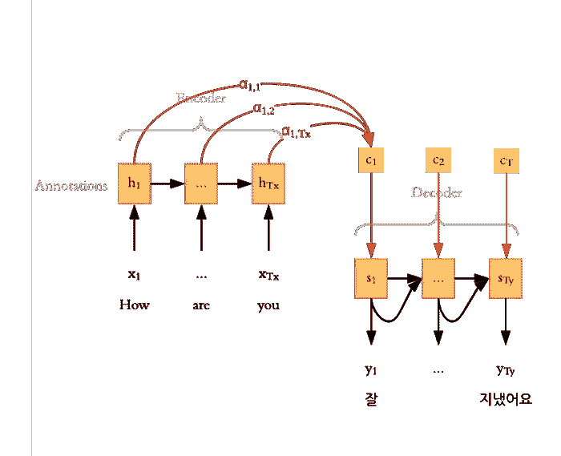
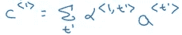
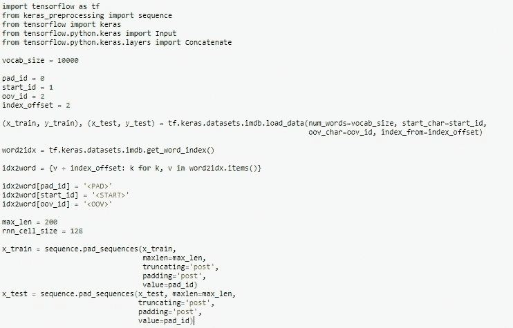
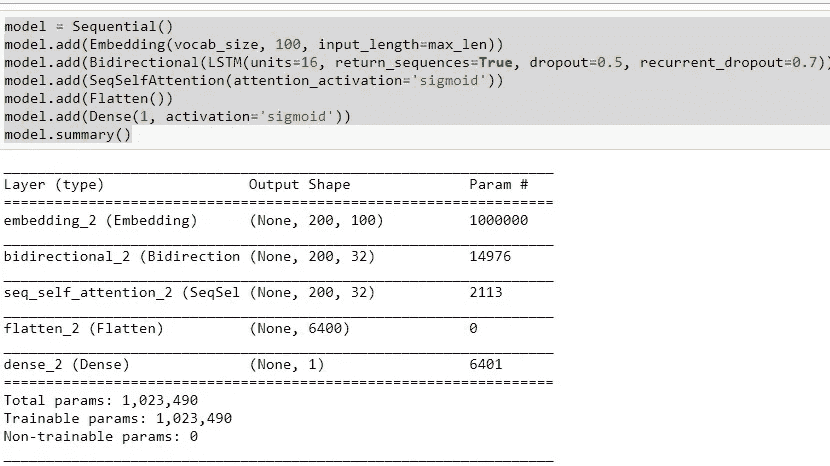
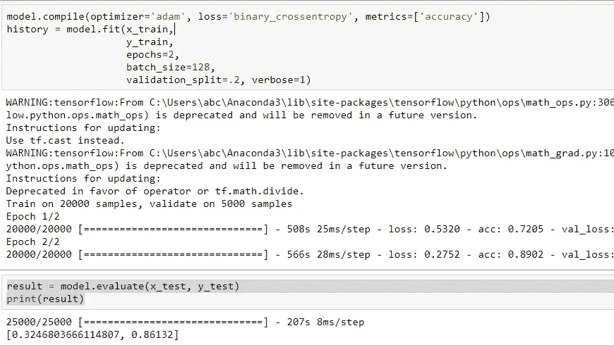
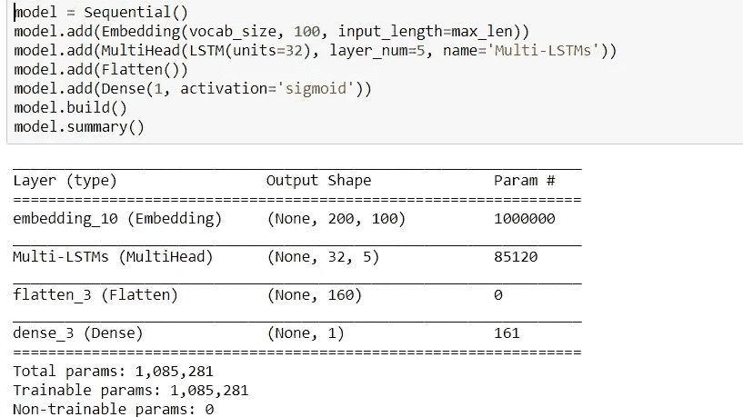
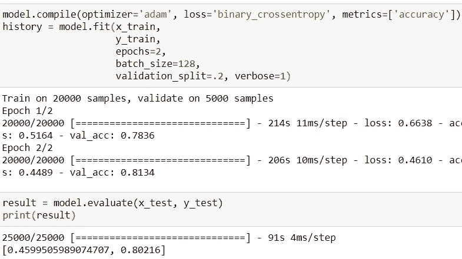
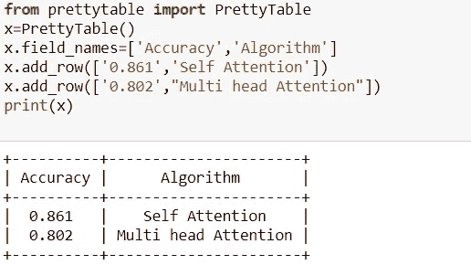

# 理解注意机制:自然语言处理

> 原文：<https://medium.com/analytics-vidhya/https-medium-com-understanding-attention-mechanism-natural-language-processing-9744ab6aed6a?source=collection_archive---------1----------------------->

# 目录

1.  介绍
2.  注意力模型
3.  注意力是如何工作的？
4.  代码走查
5.  结论
6.  参考

# 1.介绍

注意机制是深度学习领域的最新进展之一，尤其适用于机器翻译、图像字幕、对话生成等自然语言处理任务。这是一种为提高编码器解码器(seq2seq) RNN 模型的性能而开发的机制。在这篇博文中，我将尝试解释文本分类任务的注意力机制。

# 2.注意力模型

提出关注作为对编码器-解码器模型的限制的解决方案，该模型将输入序列编码为一个固定长度的向量，从该向量在每个时间步长解码输出。这个问题被认为是解码长序列时的一个问题，因为它使得神经网络难以处理长句，尤其是那些比训练语料库中的句子更长的句子。

> 注意力被提出来作为一种对齐和翻译的方法。

当模型试图预测下一个单词时，它会在源句子中搜索最相关信息集中的一组位置。该模型然后基于与这些源位置和所有先前生成的目标单词相关联的上下文向量来预测下一个单词。

注意力模型不是将输入序列编码到单个固定的上下文向量中，而是开发一个上下文向量，该向量专门针对每个输出时间步长进行过滤。

# 3.注意力是如何工作的？

Attention 的基本思想是，每次模型试图预测输出单词时，它只使用输入中最相关的信息集中的部分，而不是整个句子，即它试图给予少数输入单词更多的重要性。让我们看看它是如何工作的:

注意机制图解:英语到韩语的翻译

注意，编码器的工作方式类似于编码器-解码器模型，但解码器的行为不同。正如你从图片中看到的，解码器的隐藏状态是用上下文向量、先前的输出和先前的隐藏状态计算的，并且它对每个目标单词都有单独的上下文向量 c_i。这些上下文向量被计算为向前和向后方向上的激活状态和字母的加权和，并且这些字母表示输入对输出单词的生成给予了多少关注。

输出字 1 的上下文向量

这里，“a”表示向前和向后的激活，α表示每个输入单词给予输出单词的注意。

# 4.注意力机制的代码走查

我采用了包含 50，000 条电影评论文本的 [**IMDB 数据集**](https://www.tensorflow.org/api_docs/python/tf/keras/datasets/imdb) 。它已经被预处理，使得单词序列已经被转换成整数序列，其中每个整数代表字典中的一个特定单词。

# 4.1 自我关注

现在，创建一个自我关注层，把输入的句子作为数字的向量嵌入。有两种主要方法来执行这种嵌入预训练嵌入，如 [Word2Vec](https://render.githubusercontent.com/view/ipynb??) 或 [GloVe](https://render.githubusercontent.com/view/ipynb??) 或随机初始化。这里，我使用了随机初始化。我们将使用双向 RNN。这只是两个 rnn 的连接，一个从左到右处理序列，另一个从右到左处理。通过使用两个方向，我们可以获得更强的编码，因为每个单词都可以使用其两侧邻居的上下文进行编码，而不仅仅是单侧。

最后一层与单个输出节点紧密相连。使用 sigmoid 激活函数，该值是一个介于 0 和 1 之间的浮点数。一个模型需要一个损失函数和一个优化器来训练。我们的模型是一个二元分类问题，模型输出一个概率。我们将使用`binary_crossentropy`损失函数。以 128 个样本的小批量训练模型 2 个时期。

# 4.2 多头关注

现在，创建一个多头注意力层，输入 LSTM 单位，并嵌入输入的句子作为一个数字向量。有两种主要方法来执行这种嵌入预训练嵌入，如 [Word2Vec](https://render.githubusercontent.com/view/ipynb??) 或 [GloVe](https://render.githubusercontent.com/view/ipynb??) 或随机初始化。这里，我使用了随机初始化。

最后一层与单个输出节点紧密相连。使用 sigmoid 激活函数，该值是一个介于 0 和 1 之间的浮点数。一个模型需要一个损失函数和一个优化器来训练。我们的模型是一个二元分类问题，模型输出一个概率。我们将使用`binary_crossentropy`损失函数。以 128 个样本的小批量训练模型 2 个时期。

# 4.3 自我和多头注意机制的比较

# 5.结论

注意机制是 NLP 任务中非常有用的技术，因为它增加了准确性和 bleu 分数，并且可以有效地用于长句。注意机制的唯一缺点是非常耗时并且难以并行化。

# 6.参考

1.  [https://machine learning mastery . com/how-does-attention-work-in-encoder-decoder-recurrent-neural-networks/](https://machinelearningmastery.com/how-does-attention-work-in-encoder-decoder-recurrent-neural-networks/)
2.  [https://towards data science . com/intuitive-understanding-of-attention-mechanism-in-deep-learning-6c 9482 aecf 4 f](https://towardsdatascience.com/intuitive-understanding-of-attention-mechanism-in-deep-learning-6c9482aecf4f)
3.  【https://medium.com/@joealato/attention-in-nlp-734c6fa9d983 
4.  [https://www . coursera . org/lecture/NLP-sequence-models/attention-model-intuition-RDXpX](https://www.coursera.org/lecture/nlp-sequence-models/attention-model-intuition-RDXpX)
5.  [https://arxiv.org/abs/1409.0473](https://arxiv.org/abs/1409.0473)
6.  [https://androidkt . com/text-class ification-using-attention-mechanism-in-keras/](https://androidkt.com/text-classification-using-attention-mechanism-in-keras/)