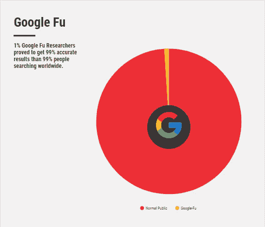
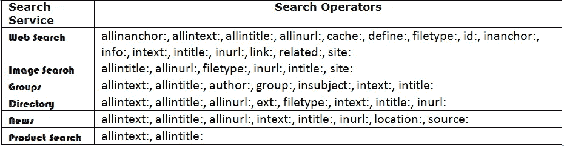
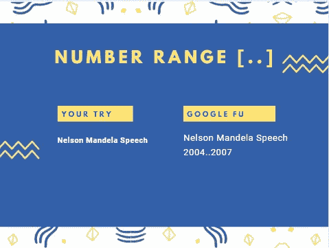
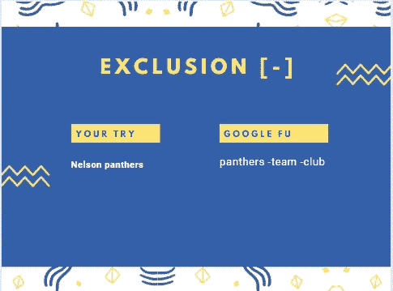
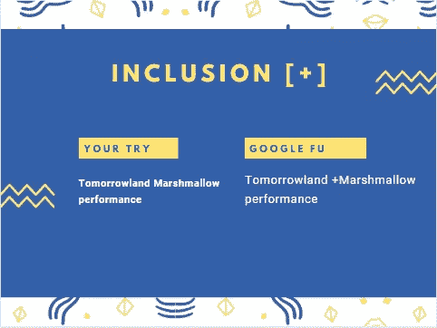
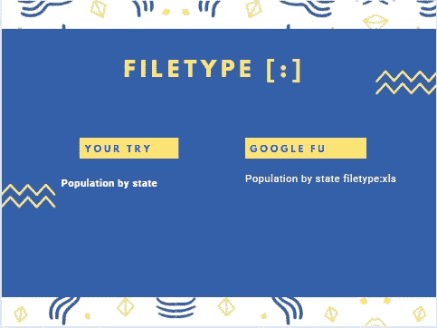

# Google-Fu 初学者指南？成为 Google-Fu 黑带的 10 个诀窍|

> 原文：<https://medium.com/analytics-vidhya/https-medium-com-what-is-googlefu-tips-and-tricks-to-be-googlefu-advanced-powersearching-with-google-f7e5661a8bca?source=collection_archive---------0----------------------->

Google-Fu 初学者指南

> Google-Fu 是什么？
> 
> Google-Fu 被定义为在 Google 搜索引擎中使用的一种技能，用于访问大量准确的信息(结果)。此外，成为 Google-Fu 听起来很酷，就像某种漫威人物。如果一个人知道所有的谷歌运营商，并能实际使用，他就能成为谷歌的铁杆粉丝。

随着**数据科学家**的创新，谷歌搜索引擎随着时间的推移发生了巨大的变化。由科学家&推动的谷歌运营商和谷歌支持的程序员一直在尽最大努力为**的内容战略家、**的商业开发者和**的市场研究员**分发可访问的数据。**对*内容感兴趣的作者****和**作者**可以帮助他们在研究和撰写特定领域的期刊、博客和文章时有所作为。*

*如果你是一个精通技术的人，如果你想让谷歌搜索唾手可得，那么我将告诉你如何成为谷歌的“黑带”——一个让你与众不同的大师，即使每天有 1.5 亿次搜索，250 万个网页提供 50 多种语言。我试着把所有的细节都写下来，以此来提高你的 google-fu。*

## *关于 **Google Power 搜索引擎的 5 个事实和神话***

*1-在这个星球上，只有 1%的人可以正确地在谷歌上搜索。*

**

*2-如果一个人知道如何正确使用 ***谷歌操作符*** ，他就可以成为大师。*

*“如果你知道如何使用谷歌操作符，那么你就是 ***大师*** 。”*

*3-***Google Commands***可以帮助你做**研究，获取数据，商业分析，建立项目**等等。*

*4-你不需要知道*代码*就能成为一个谷歌符。唯一的要求就是你的 ***热情*** 和你的 ***兴趣*** 去深入搜索你的知识，访问相关的数据、话题和信息。*

*5-就我个人而言，凭借 Google-Fu 的技能，我发现自己能够脱颖而出，制定内容策略，并获得大量的信息。*

# *在你的搜索查询中什么是重要的？*

**

*搜索查询的重要提示*

*1- **字字珠玑**:试着搜索一下[ [***谁***](https://www.google.com/search?q=who&rlz=1C1CHBF_enIN760IN761&oq=who&aqs=chrome..69i57&sourceid=chrome&ie=UTF-8) ]， [***那个谁***](https://www.google.com/search?q=the+who&rlz=1C1CHBF_enIN760IN761&oq=the+who&aqs=chrome..69i57j69i64&sourceid=chrome&ie=UTF-8) 】和[ [***一个谁***](https://www.google.com/search?q=a+who&rlz=1C1CHBF_enIN760IN761&oq=a+who&aqs=chrome..69i57j69i64l3&sourceid=chrome&ie=UTF-8) ]。*

*2- **订单事项**:尝试搜索[ [***蓝天***](https://www.google.com/search?q=blue+sky&rlz=1C1CHBF_enIN760IN761&oq=blue+sky&aqs=chrome..69i57&sourceid=chrome&ie=UTF-8) ]和[ [***天蓝***](https://www.google.com/search?q=sky+blue&rlz=1C1CHBF_enIN760IN761&oq=sky+blue&aqs=chrome..69i57j69i64&sourceid=chrome&ie=UTF-8) ]。*

*3- **大写**不要紧:尝试搜索[ [***巴拉克奥巴马***](https://www.google.com/search?q=barack+obama&rlz=1C1CHBF_enIN760IN761&oq=barack+obama&aqs=chrome..69i57&sourceid=chrome&ie=UTF-8) ]和[ [***巴拉克奥巴马***](https://www.google.com/search?q=Barack+Obama&rlz=1C1CHBF_enIN760IN761&oq=Barack+Obama&aqs=chrome..69i57&sourceid=chrome&ie=UTF-8) ]。*

*4- **标点**不要紧:试试搜索[ [***红色:好吃！苹果？***](https://www.google.com/search?q=red%3A+delicious!+apple%3F&rlz=1C1CHBF_enIN760IN761&oq=red%3A+delicious!+apple%3F&aqs=chrome..69i57j69i58&sourceid=chrome&ie=UTF-8) 】和 [***红色美味苹果***](https://www.google.com/search?q=red+delicious+apple&rlz=1C1CHBF_enIN760IN761&oq=red+delicious+apple&aqs=chrome..69i57j69i64&sourceid=chrome&ie=UTF-8) 。*

*5-有一些**例外**！*

# ***所有谷歌运营商列表:***

**

*谷歌搜索有九个基本操作符:*

## *1-精确短语(" "):当您对要搜索的主题有把握时，此运算符可帮助您获得精确的答案。*

**

***原话***

****举例*** :*

***你的尝试** : [卖法拉利的和尚](https://www.google.com/search?q=The+Monk+who+sold+his+Ferrari&rlz=1C1CHBF_enIN760IN761&oq=The+Monk+who+sold+his+Ferrari&aqs=chrome..69i57j69i64&sourceid=chrome&ie=UTF-8)*

***Google-Fu** : [《卖法拉利的和尚》](https://www.google.com/search?q=%E2%80%9CThe+Monk+who+sold+his+Ferrari%E2%80%9D&rlz=1C1CHBF_enIN760IN761&oq=%E2%80%9CThe+Monk+who+sold+his+Ferrari%E2%80%9D&aqs=chrome..69i57&sourceid=chrome&ie=UTF-8)*

## *2-数字范围(。。):此运算符帮助您在搜索结果中设置一系列数字。*

**

***编号范围***

****举例*** :*

***你试试** : [曼德拉演讲](https://www.google.com/search?q=Nelson+Mandela+Speech&rlz=1C1CHBF_enIN760IN761&oq=Nelson+Mandela+Speech&aqs=chrome..69i57&sourceid=chrome&ie=UTF-8)*

*2004 年纳尔逊·曼德拉的演讲..2007 年*

## *3- Exclusion (-):该操作符帮助您排除关键字。*

**

***排除***

****例题*** :*

***你试试** : [黑豹](https://www.google.com/search?q=panthers&rlz=1C1CHBF_enIN760IN761&oq=panthers&aqs=chrome..69i57&sourceid=chrome&ie=UTF-8)*

***谷歌-傅** : [黑豹-球队-俱乐部](https://www.google.com/search?q=panthers+-team+-club&rlz=1C1CHBF_enIN760IN761&oq=panthers+-team+-club&aqs=chrome..69i57&sourceid=chrome&ie=UTF-8)*

## *4-相似词(~):该操作符帮助您获得与实际结果相似的结果，这意味着它给出了与查询相关的答案。*

**

***相似词***

****例题*** :*

***你试试** : [房子着火](https://www.google.com/search?q=House+on+fire&rlz=1C1CHBF_enIN760IN761&oq=House+on+fire&aqs=chrome..69i57&sourceid=chrome&ie=UTF-8)*

***Google-Fu**:[~着火的房子](https://www.google.com/search?q=~House+on+fire&rlz=1C1CHBF_enIN760IN761&oq=~House+on+fire&aqs=chrome..69i57&sourceid=chrome&ie=UTF-8)*

## *5- Inclusion (+):该运算符有助于您包含关键字，方法是在精确使用该运算符后，为单词赋予优先级。*

**

***内含物***

****举例*** :*

***你的尝试** : [明日世界 Marshmello 演出](https://www.google.com/search?rlz=1C1CHBF_enIN760IN761&sxsrf=ACYBGNSTGcLXJJZio4j3p1nL2A_kb-jezQ:1573894620603&q=Tomorrowland+Marshmello+performance&spell=1&sa=X&ved=0ahUKEwi4kJmuru7lAhXCdn0KHRT7CZUQBQgtKAA&biw=1707&bih=781)*

***Google-Fu** : [明日世界+Marshmello 表演](https://www.google.com/search?rlz=1C1CHBF_enIN760IN761&sxsrf=ACYBGNQY-OEL0XToS4feZ-tP3oo8ACTDkA:1573894625683&q=Tomorrowland+%2BMarshmello+performance&spell=1&sa=X&ved=0ahUKEwjinc-wru7lAhXTfSsKHf0gCeUQBQgtKAA&biw=1707&bih=781)*

## *6-填写空白(*):当您不确定自己的查询是否合适时，这个操作符可以帮助您获得结果。*

**

***填空***

****例题*** :*

***你的尝试** : [加纳最受欢迎](https://www.google.com/search?q=most+popular+in+ghana&rlz=1C1CHBF_enIN760IN761&oq=most+popular+in+ghana&aqs=chrome..69i57&sourceid=chrome&ie=UTF-8)*

***Google-Fu** : [加纳最受欢迎的*](https://www.google.com/search?q=most+popular+*+in+ghana&rlz=1C1CHBF_enIN760IN761&oq=most+popular+*+in+ghana&aqs=chrome..69i57&sourceid=chrome&ie=UTF-8)*

## *7-多个单词(OR):当你感到困惑时，这个操作符帮助你得到可能的结果。*

**

***多个单词***

****例题*** :*

****你尝尝*** :头尾/ [披萨汉堡](https://www.google.com/search?rlz=1C1CHBF_enIN760IN761&sxsrf=ACYBGNQamHzexH4xPxsGcjHlV__mX-8Jmg%3A1573894766832&ei=brrPXe-3Msz8rQGFoLewDA&q=burger+pizza&oq=burger+pizza&gs_l=psy-ab.3..0j0i7i30j0j0i7i30l4j0l2j0i7i30.66184.69321..70159...0.1..0.246.924.2-4......0....2j1..gws-wiz.......0i71j0i22i30j0i22i10i30.SzMB0CTTnxk&ved=0ahUKEwjvpvbzru7lAhVMfisKHQXQDcYQ4dUDCAs&uact=5)*

**:头还是尾/ [披萨还是汉堡](https://www.google.com/search?rlz=1C1CHBF_enIN760IN761&sxsrf=ACYBGNQxXjO1yNr0mWIuCw_H1qCJMWkwNA%3A1573894775352&ei=d7rPXbGJFY-CrtoPnrkO&q=burger+or+pizza&oq=burger+OR+pi&gs_l=psy-ab.3.0.0l6j0i22i30j0i22i10i30j0i22i30l2.19684.27882..29883...0.1..0.354.3595.0j1j14j1......0....1..gws-wiz.......0i71j0i273j0i131j0i67j0i10.o6KWvLqSH4s)**

## **8- site:这个操作符帮助你只从一个特定的网站或给定的域中搜索网页。**

****

****地点****

*****例题*** :**

****你试试** : [从亚马逊网上购买衬衫](https://www.google.com/search?q=buy+shirts+from+amazon+online&rlz=1C1CHBF_enIN760IN761&oq=buy+shirts+from+amazon+online&aqs=chrome..69i57&sourceid=chrome&ie=UTF-8)**

****Google-Fu** : [网站:亚马逊衬衫](https://www.google.com/search?q=site%3Aamazon.com+shirts&rlz=1C1CHBF_enIN760IN761&oq=site%3Aamazon.com+shirts&aqs=chrome..69i57j69i58&sourceid=chrome&ie=UTF-8)**

## **9- filetype:这个操作符帮助你得到 pdf 格式的答案。移动，。doc，。xls 和许多其他多重扩展。**

****

****文件类型****

*****例题*** :**

****你试试** : [按州人口](https://www.google.com/search?q=Population+by+state&rlz=1C1CHBF_enIN760IN761&oq=Population+by+state&aqs=chrome..69i57j69i59&sourceid=chrome&ie=UTF-8)**

****Google-Fu** : [各州人口文件类型:xls](https://www.google.com/search?q=Population+by+state+filetype%3Axls&rlz=1C1CHBF_enIN760IN761&oq=Population+by+state+filetype%3Axls&aqs=chrome..69i57&sourceid=chrome&ie=UTF-8)**

# ****成为 Google-Fu 的 20 大优势****

**单轨 ***火车、航班、*公交车**上下班方便。**

**2-跟踪你的 ***包*** 。**

**3-通过自行车找到 ***谷歌方向*** ，步行&公交。**

**4-跟踪你的 ***股票*** 价格。**

**翻译不同语言的单词和句子。**

**6-转换 ***货币*** 。**

**7-为竞争做一个 ***深度分析研究*** 。**

**8-查找关于 ***当地餐馆&生意*** 的信息。**

**9-在指尖找到音乐 ***标签和歌词*** 。**

**10-寻找 ***假期*** 为即将到来的事件&节日。**

**11-查找即将上映的电影、游戏等的 ***发布日期*** 以及你的邮政编码。**

**12-你下一篇博客和文章的策略内容。**

**13-查找任意城市或国家的 ***当前时间*** 。**

**14-查找 ***定义&同义词*** 。**

**15-查找任何游戏的 ***实况比分*** 。**

**16-获取 ***天气预报*** 。**

**17- ***算*** 几乎什么都算。**

**18-通过过滤数百万个网站和网页，找到 ***准确答案*** 。**

**19-查找任何格式的 ***数据***pdf、doc、word、xls。**

**20-最后但同样重要的是，当你说你是一个“GOOGLE-Fu”时，听起来很酷。 **-** “嘿谷歌傅，怎么了？”**

# **20 种含义和技术可以用来改进你强大的谷歌搜索**

****

**Google-fu [强力搜索技术](https://support.google.com/websearch/answer/2466433?ctx=topic&hl=en&topic=1221265&visit_id=637091801898831117-419867625&rd=1)**

**我给 Google-Fu 列出了所有重要的提示和技巧，因为有数百种 ***搜索查询操作符*** 和技巧。所以为了节省时间，我把它们都剪短成几个，这样就可以很容易地用于日常活动，也可以让你养成习惯。**

## **1- site:它告诉 Google 在特定的 web 域中搜索页面。**

****例子** : [网站:ebay.com/gadgets](https://www.google.com/search?rlz=1C1CHBF_enIN760IN761&sxsrf=ACYBGNSqOKmR95MpVfgpsVXZcaMfGiDMbA%3A1573825364531&ei=VKvOXfqOH4zTz7sPvM2SwAs&q=site%3Aebay.com%2Fgadgets&oq=site%3Aebay.com%2Fgadgets&gs_l=psy-ab.3...3889.8859..9637...0.0..0.227.2586.0j9j4......0....1..gws-wiz.KI-Ohzhd_Vk&ved=0ahUKEwj6iKmurOzlAhWM6XMBHbymBLgQ4dUDCAs&uact=5)**

## **专业提示:“[+www . ebay .+com](https://www.google.com/search?q=%2Bwww.ebay.%2Bcom&rlz=1C1CHBF_enIN760IN761&oq=%2Bwww.ebay.%2Bcom&aqs=chrome..69i57j69i65&sourceid=chrome&ie=UTF-8)”——(告诉你你的网站有多少页面被谷歌索引)**

## **2- intitle:它告诉 Google 在给定的词内搜索结果。**

****示例** : [intitle:Oneplus](https://www.google.com/search?q=intitle%3AOneplus&rlz=1C1CHBF_enIN760IN761&oq=intitle%3AOneplus&aqs=chrome..69i57j69i58&sourceid=chrome&ie=UTF-8)**

## **3- inurl:它告诉 Google 在结果中搜索 url 中的某个单词。**

****例子** : [inurl:JBL 耳机](https://www.google.com/search?q=inurl%3AJBL+headphones&rlz=1C1CHBF_enIN760IN761&oq=inurl%3AJBL+headphones&aqs=chrome..69i57j69i58&sourceid=chrome&ie=UTF-8)**

## **4- intext:它告诉 Google 在任何可用的内容中搜索 word，尽管你可以使用其他操作符。**

****举例** : [正文:切尔诺贝利](https://www.google.com/search?q=intext%3Achernobyl&rlz=1C1CHBF_enIN760IN761&oq=intext%3Achernobyl&aqs=chrome..69i57j69i58&sourceid=chrome&ie=UTF-8)**

## **5-金融锚:它告诉谷歌搜索结果的锚文本与入站链接。**

****例子** : [金融家:谷歌 Chromebook](https://www.google.com/search?q=inanchor%3A+Google+Chromebook&rlz=1C1CHBF_enIN760IN761&oq=inanchor%3A+Google+Chromebook&aqs=chrome..69i57j69i58&sourceid=chrome&ie=UTF-8)**

## **6- allintitle:当你想了解竞争对手时，它告诉谷歌搜索一个产品或一个利基市场的结果。**

****示例**:[all title:chrome book](https://www.google.com/search?q=allintitle%3Achromebook&rlz=1C1CHBF_enIN760IN761&oq=allintitle%3Achromebook&aqs=chrome..69i57j69i58&sourceid=chrome&ie=UTF-8)**

## **7- allinurl:它告诉 Google 搜索 url 中包含的所有单词的结果。**

****例子** : [allinurl:谷歌 chromebook](https://www.google.com/search?q=allinurl%3Agoogle+chromebook&rlz=1C1CHBF_enIN760IN761&oq=allinurl%3Agoogle+chromebook&aqs=chrome..69i57j69i58&sourceid=chrome&ie=UTF-8)**

## **8-all text:它告诉 Google 搜索包含网页中所有单词的结果。**

****举例**:[allin text:Google chrome book](https://www.google.com/search?q=allintext%3Agoogle+chromebook&rlz=1C1CHBF_enIN760IN761&oq=allintext%3Agoogle+chromebook&aqs=chrome..69i57j69i58&sourceid=chrome&ie=UTF-8)**

## **9- filetype:它告诉 Google 以查询中给定的任何格式提供结果。**

****示例** : [文件类型:pdf 人口州美国](https://www.google.com/search?q=filetype%3Apdf+population+state+USA&rlz=1C1CHBF_enIN760IN761&oq=filetype%3Apdf+population+state+USA&aqs=chrome..69i57j69i58&sourceid=chrome&ie=UTF-8)**

## **10- ext:类似于 Filetype**

****示例** : [ext:pdf 人口州美国](https://www.google.com/search?q=ext%3Apdf+population+state+USA&rlz=1C1CHBF_enIN760IN761&oq=ext%3Apdf+population+state+USA&aqs=chrome..69i57j69i58&sourceid=chrome&ie=UTF-8)**

## **11- daterange:它告诉 Google 搜索给定日期范围或年份的结果。**

****例子** : [迈克尔·杰克逊 1995..2005 年](https://www.google.com/search?q=Michael+Jackson+1995..2005&rlz=1C1CHBF_enIN760IN761&oq=Michael+Jackson+1995..2005&aqs=chrome..69i57&sourceid=chrome&ie=UTF-8)**

## **12 日期:类似于日期范围**

****例子** : [迈克尔·杰克逊 1995–2005](https://www.google.com/search?q=Michael+Jackson+1995-2005&rlz=1C1CHBF_enIN760IN761&oq=Michael+Jackson+1995-2005&aqs=chrome..69i57&sourceid=chrome&ie=UTF-8)**

**注意:尽管结果不同。**

## **13- weather:它告诉 Google 搜索给定地点或邮政编码的天气预报。**

****举例** : [天气:84180](https://www.google.com/search?q=weather%3A84180&rlz=1C1CHBF_enIN760IN761&oq=weather%3A84180&aqs=chrome..69i57&sourceid=chrome&ie=UTF-8) 或[天气:德国](https://www.google.com/search?q=weather%3Agermany&rlz=1C1CHBF_enIN760IN761&oq=weather%3Agermany&aqs=chrome..69i57j69i58&sourceid=chrome&ie=UTF-8)**

**14- **Around(x):大多数情况下，它告诉谷歌将搜索结果限制在包含搜索单词的页面内，这些搜索单词之间的距离不超过 X 个单词。x 只是定义了单词的范围或数量。****

****举例** : [谷歌富绕⑤手法](https://www.google.com/search?q=googlefu+Around(5)+technique&rlz=1C1CHBF_enIN760IN761&oq=googlefu+Around(5)+technique&aqs=chrome..69i57j69i59&sourceid=chrome&ie=UTF-8)**

## **15- Stocks:它告诉 Google 搜索关于股票的结果。**

****举例** : [股票:facebook](https://www.google.com/search?q=stock%3Afacebook&rlz=1C1CHBF_enIN760IN761&oq=stock%3Afacebook&aqs=chrome..69i57j69i58&sourceid=chrome&ie=UTF-8)**

## **16- map:它告诉 Google 搜索特定地点的结果。**

****举例** : [地图:巴塞罗那](https://www.google.com/search?q=map%3Abarcelona&rlz=1C1CHBF_enIN760IN761&oq=map%3Abarcelona&aqs=chrome..69i57j69i58&sourceid=chrome&ie=UTF-8)**

## **17- movie:它告诉 Google 搜索电影的结果。**

****举例** : [电影:钢铁侠](https://www.google.com/search?q=movie%3AIron+man&rlz=1C1CHBF_enIN760IN761&oq=movie%3AIron+man&aqs=chrome..69i57j69i58&sourceid=chrome&ie=UTF-8)或[电影:【zip code】](https://www.google.com/search?rlz=1C1CHBF_enIN760IN761&sxsrf=ACYBGNSooK7h__sXf-IBtdXFLMsJclhJQg%3A1573825932186&ei=jK3OXZ_5CuDFz7sP99GzwA0&q=movie%3A713304&oq=movie%3A713304&gs_l=psy-ab.3...16801.19964..20244...0.2..0.278.2237.0j7j4......0....1..gws-wiz.......0i71j0i273j0i67j0j0i131.6X-oP-tSNGs&ved=0ahUKEwif74C9ruzlAhXg4nMBHffoDNgQ4dUDCAs&uact=5)**

## **18- convert:它告诉 Google 转换货币和单位。**

****例** : [换算:美元..inr](https://www.google.com/search?q=convert%3A+usd..inr&rlz=1C1CHBF_enIN760IN761&oq=convert%3A+usd..inr&aqs=chrome..69i57j69i58&sourceid=chrome&ie=UTF-8) 或[换算:吨..kg](https://www.google.com/search?q=convert%3Aton..kg&rlz=1C1CHBF_enIN760IN761&oq=convert%3Aton..kg&aqs=chrome..69i57j69i58&sourceid=chrome&ie=UTF-8)**

## **19- source:它告诉 Google 查找一个主题或一篇文章的来源。**

****例子** : [来源:如何成为一名谷歌人](https://www.google.com/search?q=source%3Ahow+to+be+a+google-fu&rlz=1C1CHBF_enIN760IN761&oq=source%3Ahow+to+be+a+google-fu&aqs=chrome..69i57j69i58&sourceid=chrome&ie=UTF-8)**

**20- **Hastags:它告诉谷歌去寻找被某人标记的文章、照片、博客。****

****例子**:[#友谊目标永远的朋友](https://www.google.com/search?q=%23friendshipgoals+friends+forever&rlz=1C1CHBF_enIN760IN761&oq=%23friendshipgoals+friends+forever&aqs=chrome..69i57&sourceid=chrome&ie=UTF-8)**

**P ro 提示:如果你想获得各种尺寸、形状和颜色的免许可证照片，请使用[谷歌高级图片搜索](https://www.google.com/advanced_image_search)。**

> ****如何做 Google-Fu 黑带？****
> 
> ****如果你真的有兴趣成为一名被称为谷歌赋艺术的黑带谷歌赋，请报名参加** [**谷歌**](https://coursebuilder.withgoogle.com/sample/unit?unit=2&lesson=3) **提供的课程，并在最后进行评估考试。另外，如果你想了解更多关于使用谷歌操作符的策略，那么**[**Moz**](https://moz.com/blog/25-killer-combos-for-googles-site-operator)**确实有一篇简短的文章。****

**谷歌-富黑带**

****最后的想法**:如果你注意到从搜索谷歌的技巧到窍门的每一个细节，这将是多么有趣啊，在这里我向你呈现一本*的书，作者是名为“ [Rael Dornfest](https://twitter.com/rael?lang=en) ”的计算机程序员和名为“[**Tara CALIS hain**](https://twitter.com/ResearchBuzz?ref_src=twsrc%5Egoogle%7Ctwcamp%5Eserp%7Ctwgr%5Eauthor)**”的搜索引擎专家。只是一个想法，如果智人可以被称为人类，为什么不被谷歌 fuening-成为这项技术的一部分。让我们携起手来，通过准确地搜索查询，节省时间，让我们的生活变得更美好。正如俄罗斯人 ***所说，“如果你不能打败他们，那就加入他们。”********

## **“如果你不能打败谷歌，那就学习谷歌”——谷歌加油**

**声明:来源谷歌和 Canva。**