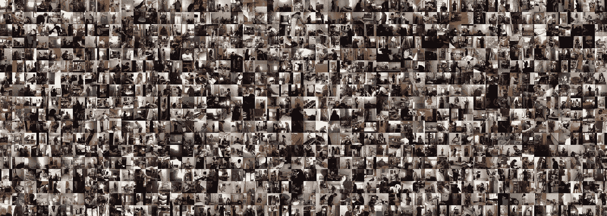
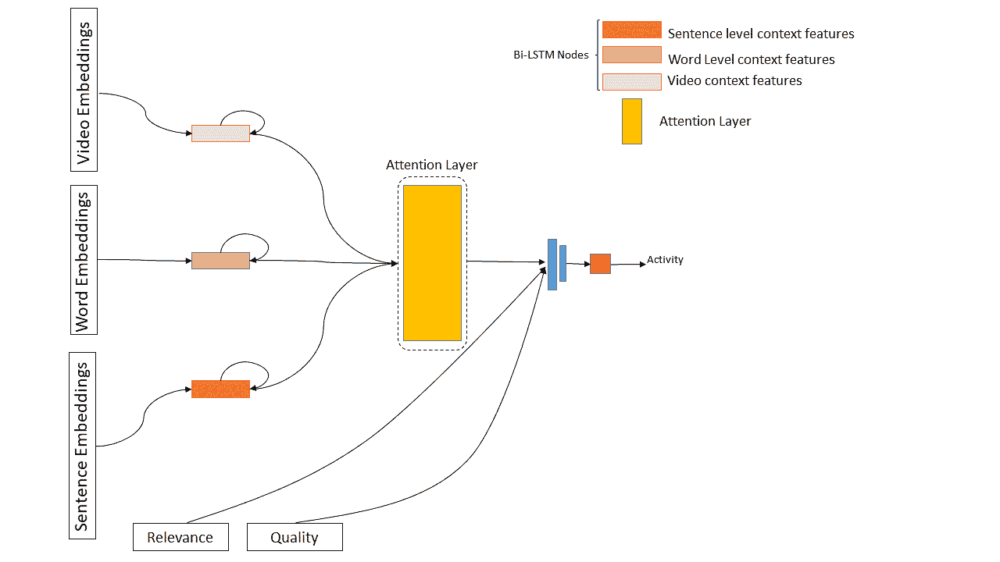
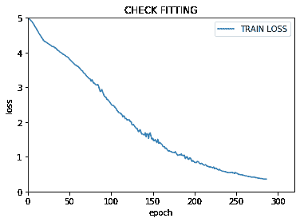
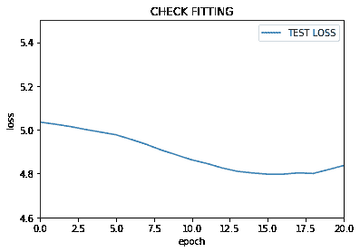
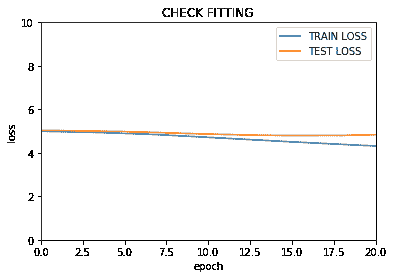
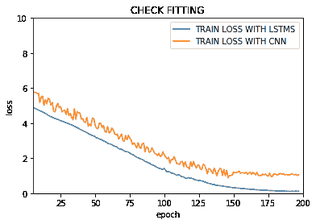
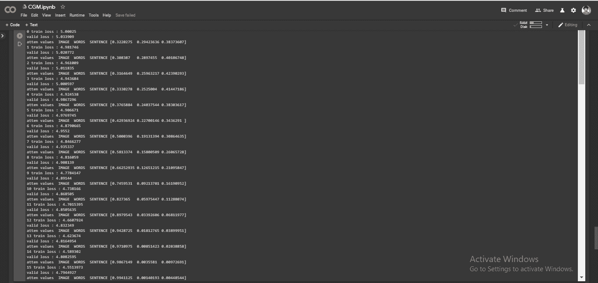

# 使用多模态注意的人类活动识别(HAR)

> 原文：<https://medium.com/analytics-vidhya/human-activity-recognition-har-using-multi-modal-attention-8c81ceff6745?source=collection_archive---------7----------------------->

> “机器学习的一个突破抵得上 10 个微软”
> 
> 比尔·盖茨

# 什么是 HAR，为什么它很重要？

了解视频、直播流、电影等中发生的事情是一项有趣且有益的任务。这可以帮助我们更好地理解大量的可用内容。2012 年，每天消耗的数据量超过 7.6。这个数字每天都在增长，所消耗的数据变得更加密集和复杂，对于一个人来说，浏览如此丰富的内容并分享他们的理解几乎是不可能的。

这就是我们需要自动化系统帮助的地方。主要在计算机视觉和自然语言处理领域的深度学习的进展使我们能够解决这个问题，并理解丰富的多模态数据。

人体动作识别的目标是识别日常环境中的人体活动。由于人类行为的多样性和复杂性，活动识别是一个具有挑战性的问题。鉴于我们的认知能力，这项任务对人类来说是微不足道的，但由于这项任务的巨大复杂性，对任何机器来说都是一项困难的任务。尽管由于深度学习的出现，我们在过去几年中看到了图像任务方面令人难以置信的进展，但视频任务的架构进展缓慢。

活动识别是一个有可能帮助理解视频流的问题，它可以用于从废弃物体检测到 CCTV 监控、异常检测和攻击行为检测的各种应用中。

# 相关作品

## *注意:多模态人体活动识别的多级注意机制*

马等人提出使用传感器级数据(加速度计、陀螺仪等。)来预测人类的活动识别。多模态由子网级注意处理。这是通过使用 CNN 上的注意力子网和 GRU 上的单独注意力来实现的，并且这进一步用于对动作进行分类。

## *用于自我中心活动识别的多模态多流深度学习【9】*

基于光流、单帧等的 CNN 融合与基于传感器数据的 LSTMs 融合一起使用。分数融合都被合并，并且使用 softmax 值。

## 使用多模态的人体动作识别；

Carter 等人[2]提出了一种对人体行为可疑行为的多模式数据进行合并分析的方法。这些模态包括 RGB 视频、深度视频、骨骼位置，以及来自 Kinect 摄像头和可穿戴惯性传感器的惯性信号，用于一套全面的 27 种人类动作[1]。

# 哑谜数据集

哑谜数据集由数百人表演给他们的动作的视频组成。

哑谜数据集由 9848 个室内活动视频组成，这些视频是通过亚马逊机械土耳其人收集的。给用户一个句子，并要求他们录制一段视频来表演这个句子，类似于一种猜字谜游戏。每个视频都使用训练集上的 4 个工作人员和测试集上的 8 个工作人员的共识进行了注释。

该数据集包含 157 个动作类的 66，500 个时间注释、46 个对象类的 41，404 个标签和视频的 27，847 个文本描述。该数据集包含使用 ffmpeg 以 H.264 / MPEG-4 编码的视频。视频保持其原始分辨率和帧速率。它还包含从 24 fps 的视频中提取的 jpeg 帧。

训练数据包括附加特征，例如:

1.  质量:- 7 分制，7 表示最高，由注释者评判。
2.  相关性:- 7 分制，7 表示最高，由注释者判断。
3.  脚本:-生成视频所基于的句子。
4.  已验证:-注释器是否成功验证了视频与脚本匹配。
5.  描述—观看视频的注释者的描述列表。

# 我们的方法和新颖性

使用多模态多级模型来实现该任务。多模态指的是使用一种以上的模态，例如:图像+音频或音频+文本等。如上所述，我们的模态是文本(对应于动作的脚本)和动作的视频。

多模态架构

[https://gist . github . com/rsk 97/e2f 35 f 069 ad 2046506 c 01 DC 8 e 3 Fe 9 e](https://gist.github.com/rsk97/e2f2f35f069ad2046506c01dc8e3fe9e)(网络架构)

句子的文本嵌入生成

## 程序概述

1.  对提取的视频帧(在数据集中可用)进行处理，以确保没有冗余。
2.  然后将这些帧作为输入提供给 MobileNet_V2 和 Inception 模型来计算嵌入。
3.  还对可用的脚本文件进行处理，并从中提取多级特征。

*   脚本被分成句子，相应的嵌入使用 USE(通用句子编码器)来计算
*   在 GLoVe 的帮助下，句子被进一步分成单词，并且提取相应的单词嵌入。

4.这些提取的嵌入被馈送到多个 BiLSTMs 中，并且句子嵌入到前馈神经网络中，并且其结果被作为注意层的输入给出。

5.从输入到具有相关性和质量的分类值的下一层注意力建立了剩余连接。

6.这些特征一起用于输出预测。

# 结果

交叉熵损失相对于时期数(训练集)作图

交叉熵损失相对于时期数(测试集)作图

比较测试集和训练集的损失

将训练损失与 LSTM 和 CNN 进行比较

多种形式的注意力得分

# 结论

我们可以从结果中看到，基于多模态的方法比基于简单 CNN 的模型给出了更好的预测准确性。更丰富的输入表示(如视频和句子(子单词级别))使模型能够概括更新的环境或看不见的数据。基于注意力的方法有助于有效地简化给予不同模态相当大的权重的过程。

# 未来作品

*   通过在 LSTM 时间步长之间引入注意，这项工作可以进一步扩展。
*   所使用的注意块可以用自我注意来改变(被限制只能访问过去，类似于《变形金刚》的解码器层)。
*   元学习技术可以用来识别相似的任务，这有助于解决数据缺乏的问题。
*   基于强化学习的注意力模型可以用来更好地适应新的数据集。
*   可以使用来自各种其他网络的图像和文本嵌入。
*   组合多个摄像机视图(以自我为中心，广角等)，这可以结合使用，以更好地理解注释。

# 参考

1.  C. Chen、R. Jafari 和 N. Kehtarnavaz，“UTD-MHAD:利用深度相机和可佩戴惯性传感器进行人体动作识别的多模态数据集”，正在进行中。IEEE Int。糖膏剂图像处理。(ICIP)，2015 年 9 月，第 168–172 页。
2.  *C. Chiu，J. Zhan，F. Zhan，“从部分配对和不完整的多模态数据中发现可疑活动”，IEEE Access，第 5 卷，第 13689-13698 页，2017 年。*
3.  *夏若迪，吴廷通，杨庆，王，“多模态多部分学习在深度视频动作识别中的应用”，中国电机工程学会会刊。肛门模式。马赫。智能。，第 38 卷，第 10 期，第 2123–2129 页，2016 年 10 月。*
4.  Fortin，Mathieu Pagé和 Brahim Chaib-draa。"使用图像、文本和标签的多模态多任务情感识别."WCRML '19 (2019)。
5.  张士卿、、黄铁军和。2016.用于视听情感识别的多模态深度卷积神经网络。2016 年 ACM 多媒体检索国际会议论文集(ICMR '16)。美国纽约州纽约市 ACM，281–284。
6.  *陈光诚、裴东光、方振聪、王志军和 r .内瓦蒂亚。AMC:用于图像搜索的注意力引导的多模态相关学习。2017 年在 CVPR。*
7.  *Hori，c .，Hori，t .，Lee，T.Y .，Zhang，z .，Harsham，b .，Hershey，J.R .，Marks，T.K .，Sumi，k .:基于注意力的多模态融合用于视频描述。In: 2017 IEEE 计算机视觉国际会议(ICCV)。*
8.  *马、、、小张、高松成、陆桑璐。"注意力:用于多模态人类活动识别的多级注意力机制."《第 28 届国际人工智能联合会议论文集》，第 3109-3115 页。AAAI 出版社，2019。*

没有我的队友们的贡献，这项工作是不可能完成的:[罗汉·苏库马兰](https://github.com/rsk97)、[阿尔温德·德什拉杰](https://github.com/arvinddeshraj)、[西达尔特·库马尔](https://github.com/sid-kumar-iyer)和[朱奈德·NZ](https://github.com/junaidnz97)。他们在这方面的专业知识是这项工作成功的关键。