# 人类活动跟踪系统

> 原文：<https://medium.com/analytics-vidhya/human-activity-tracker-system-2435b532b05e?source=collection_archive---------8----------------------->

在 [Unsplash](https://unsplash.com?utm_source=medium&utm_medium=referral) 上由 [Chander R](https://unsplash.com/@chanderr?utm_source=medium&utm_medium=referral) 拍摄的照片

# ***动机***

随着智能设备(如手机和健身手表)的出现和普遍存在，数据挖掘研究和数据挖掘应用开辟了一个令人兴奋的新领域。这些设备具有强大的传感器，如 GPS 传感器、音频传感器、方向和加速度传感器，如加速度计和陀螺仪，能够非常准确地实时读取和处理数据。

我一直想知道智能手机和健身手表是如何知道我在跑步、散步、骑自行车或只是昏昏欲睡了一段时间。该项目旨在揭开这一神秘面纱，并构建一个系统，该系统可以使用来自加速度计(尤其是陀螺仪)的一些传感器数据来准确检测活动。

之前在这方面已经做了很多工作，例如在 Android 上使用 LSTMs 的[人类活动识别—黑客 TensorFlow(第六部分)](/@curiousily/human-activity-recognition-using-lstms-on-android-tensorflow-for-hackers-part-vi-492da5adef64)和使用手机加速度计的[活动识别](http://www.cis.fordham.edu/wisdm/includes/files/sensorKDD-2010.pdf)等等。

这有大量的应用。有可能为手机和手表等智能设备提供高度个性化和定制化的体验。还可以确定用户是否遵循健康的锻炼程序。让我们看看我们的模型根据传感器数据预测活动的准确性。兴奋地探索这个！

数据集链接—[https://archive . ics . UCI . edu/ml/machine-learning-databases/00507/](http://With the advent and now ubiquitous presence of smart devices such as cellular phones and fitness watches around us, an exciting new area of data mining research and data mining applications have been opened up. These devices have powerful sensors like GPS sensors, audio sensors, direction and acceleration sensors like accelerometers and gyrometer, which are capable of reading and processing the data quite accurately and in real time. I have always wondered how the smartphones and fitness watches know when I am running, walking, cycling or just have been lethargic for a while . The project is aimed to demystify this and build a system which can accurately detect the activity using some of the sensor data from the accelerometer and gyrometer in particular. A lot of previous work has been done in this regard like Human Activity Recognition using LSTMs on Android — TensorFlow for Hackers (Part VI) and this Activity Recognition using Cell Phone Accelerometers, to quote a few. This has a large number of applications. There is a possibility of providing a highly personalized and customized experience of smart devices like phones and watches. Also it can be determined if the user is following a healthy exercise routine or not. Let’s see how accurately our model is able to predict the activity based on the sensor data.Excited to explore this! Datasetlink - https://archive.ics.uci.edu/ml/machine-learning-databases/00507/)

# ***问题陈述***

任务是将用户活动分成三组(**非面向手的活动**如跑步、慢跑、**面向手的活动-一般**如拍手、叠衣服、**面向手的活动-吃东西**如吃食物、喝水)，这三组活动由基于传感器数据的 18 个给定活动组成。在机器学习领域，这是一个多类分类和监督学习问题。该想法是建立一个系统(模型)，该系统从手表和手机中的加速度计和陀螺仪等传感器获取输入，并准确预测用户活动组。

# 评估指标

将对分类模型的准确性进行评估。在检测人体活动时，准确性是一个重要因素。期望该系统尽可能高精度地预测活动，以便依赖于它的其他系统可以采取适当的动作作为响应。准确度衡量分类器做出正确预测的频率。它是正确预测的数量与预测总数(测试数据点的数量)的比率。在多类分类问题的情况下，可以使用下面的公式从混淆矩阵计算准确度。

## **精度=总和(对角线(矩阵))/总和(矩阵))**

# 数据集特征和描述

原始加速度计和陀螺仪传感器数据以 20Hz 的速率从智能手机和智能手表中收集。它是在 51 名测试对象进行 18 项活动时收集的，每项活动持续 3 分钟。传感器数据用 10 秒的窗口表示。

更多信息可参考该文件— [交易/常规文件标题](https://archive.ics.uci.edu/ml/machine-learning-databases/00507/WISDM-dataset-description.pdf)

# 数据探索

这些文件分布在手机和手表文件夹中，并进一步分离为陀螺仪和加速度计文件夹。作为第一步，我必须将这些文件夹中的所有文件组装到一个数据框中。基于初步数据分析，以下是观察到的元信息。

●记录总数:75，099

●特征总数:93

●类别总数:18

●空白行数:无

●数据类型:浮点型、字符串型以及正值和负值的混合

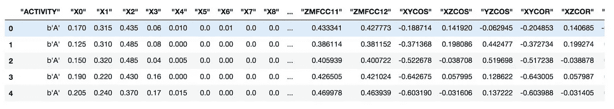

活动数据集一瞥

# 数据清理

**ACTIVITY** 列和 class 列需要被格式化，以删除不必要的引号和附加在它后面的变量(b)。activity 列也有关联的 ACTIViTY 代码，我们创建一个新列 activity_name 以更好地可视化数据集。

映射是从 activity_key.txt 文件中读取的。映射是 activty _ map = { ' A ':'行走'，' B ':'慢跑'，'楼梯'，' D ':'坐着'，' E ':'站立'，' F ':'打字'，' G ':'牙齿'，' H ':'汤'，' I ':'薯片'，' J ':'意大利面'，' K ':'喝酒'，' L ':'三明治'，' M ':'踢'，' O ':'接住'，' P ':'运球'，'写字'，' R ':'拍手'，' S ':'折叠' }

# 数据可视化

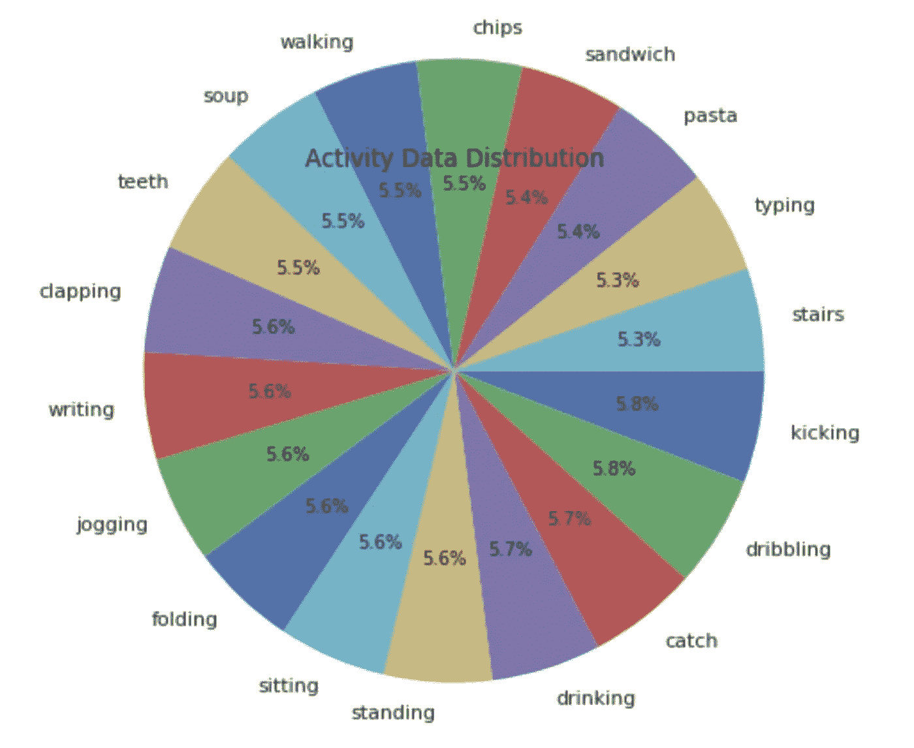

活动数据分布

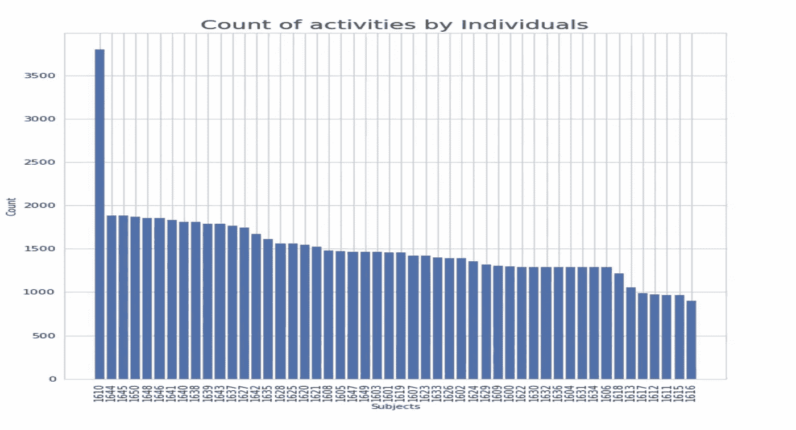

个人活动计数

*受试者 id 为 1610 的个人似乎在数据收集阶段非常活跃，而受试者 id 为 1616 的个人似乎没有得到足够的报酬来参与。*

# 算法和技术

为任何数据科学任务选择正确的模型都是一项棘手的工作。基于以前的工作和经验，我们可以在决定从数据集获得洞察力的正确技术方面做出明智的决定，从而做出决策。数据集中的要素是数值数据，而标注是分类变量。

为了处理这个分类问题，研究了以下算法。

1.  线性学习者
2.  线性 SVC
3.  近邻分类器

[**亚马逊 sagemaker**](https://aws.amazon.com/sagemaker/) 用于结果的构建、训练、部署和推断。Scikit-learn 库用于实现不同的其他分类器。Amazon sagemaker 提供了开箱即用的支持。

线性学习者的工作原理是一个对所有的原理。这种策略包括为每个类安装一个分类器，因此在计算上是可行的。线性学习器使用 softmax 损失函数来训练多类分类器。该算法为每个类别学习一组权重，并预测每个类别的概率。该算法相对较快且易于实现。早期它用于二元分类，但现在 sagemaker 有了超参数，可以指定它用于多类分类器。因此，选择它来创建基础模型就成了一个自然的选择。

根据过去的经验和研究，已知支持向量机(SVM)在多类分类方面表现良好。进一步研究了线性 SVC 和 KNeighborsClassifier，以提高基本模型的精度。

线性 SVC 再次以一对一原则工作。它类似于参数 kernel='linear '的 SVC，但根据 liblinear 而不是 libsvm 实现，因此它在选择惩罚和损失函数方面具有更大的灵活性，并且可以更好地扩展到大量样本。(在我们的例子中约为 75000)与 SVC 相比。

就分类而言，KNeighborsClassifier 似乎是一个极好的选择。KNeighborsClassifier 是一种非参数的惰性学习算法。它本质上的意思是，它没有对数据集分布做任何假设，这与真实世界的数据非常相似。此外，它不需要任何训练数据点来生成模型。测试阶段使用的所有训练数据。我们在调优阶段使用超参数 **n_neighbors** 来获得良好的精度

# 基准

对于这个问题，基准模型是线性学习者模型。它是用训练数据和将预测器类型的超参数设置为“多类分类器”来训练的。然后探索了比该模型更精确的进一步算法。

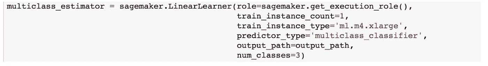

萨格马克估计量

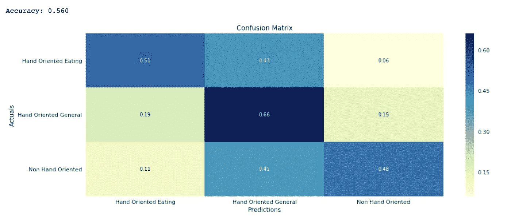

线性学习者模型的混淆矩阵

> **基准准确率得分约为 56%**

# 数据预处理

这涉及到一些列名清理，从列值中删除不必要的字符，如""、''、b。数据点被分为 18 个不同的类别或活动数量。

对于本项目，这些类别进一步分为以下三类。

**0:(非面向手的活动)**{行走、慢跑、爬楼梯、站立、踢腿}

**1:(手部为主的活动——一般)**:{运球、玩接球、打字、写字、拍手、刷牙、叠衣服}

**2:(面向手的活动——吃):**{吃面食、喝汤、吃三明治、吃薯片、喝酒}目标变量是活动，其值可以是 0、1 或 2。其被进一步映射到相应的组。

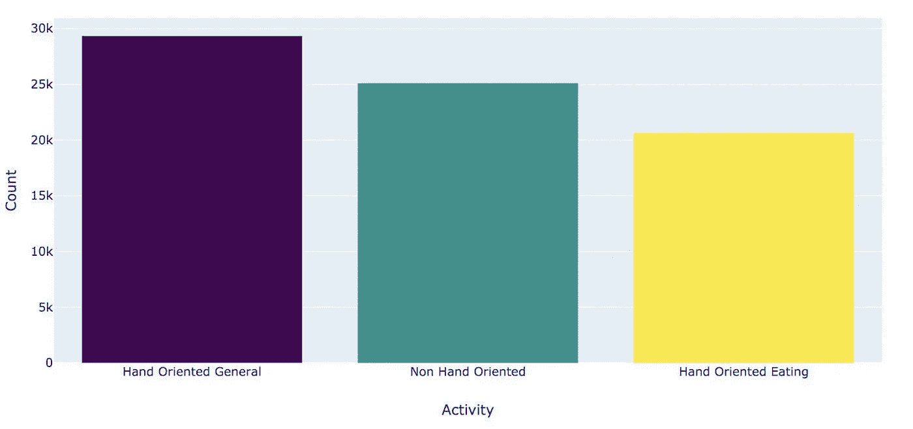

人类活动标签分布

# 数据标准化

在探索阶段，我们发现列值或特性的范围很大。值的范围从负数到大正数。对于好的模型，必须缩放特征，使值介于 0 和 1 之间。

来自 scikit-learn 的 MinMaxScaler 用于单独缩放和翻译每个特征，使得它在训练集的给定范围内，例如在 0 和 1 之间。

# 特征选择

因为在这种情况下有太多的特征，总共 91 个，所以需要选择特征。它能够选择对预测类别贡献最大的那些特征。

**单变量选择**用于选择 10 个最重要的特征。它通过基于单变量统计测试选择最佳特征来工作。它可以被看作是估计器的预处理步骤。SelectKBest 算法会删除除 10 个最高得分特征之外的所有特征。以下是基于分数的 10 大重要特征。

**卡方统计得分**可用于从特征列表中选择测试卡方统计值最高的 n_features 特征，该列表必须仅包含相对于类的非负特征，例如布尔或频率(例如，文档分类中的术语计数)。该测试测量随机变量之间的相关性，因此使用该函数“剔除”最有可能独立于类别并因此与分类无关的特征。

以下是功能选择的输出:

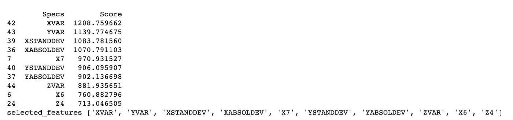

# 履行

该工作流程在 jupyter notebook 和 amazon sagemaker 中实现。

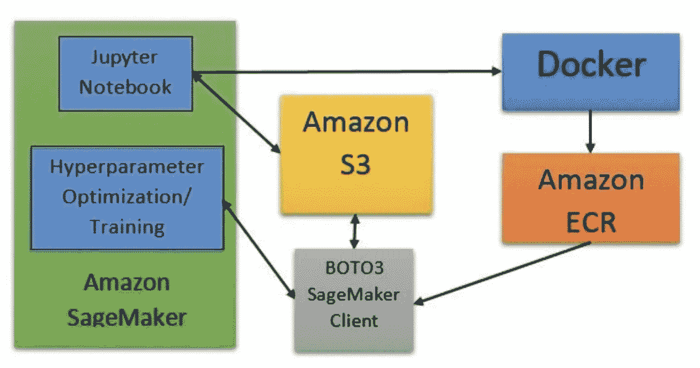

Sagemaker 工作流程

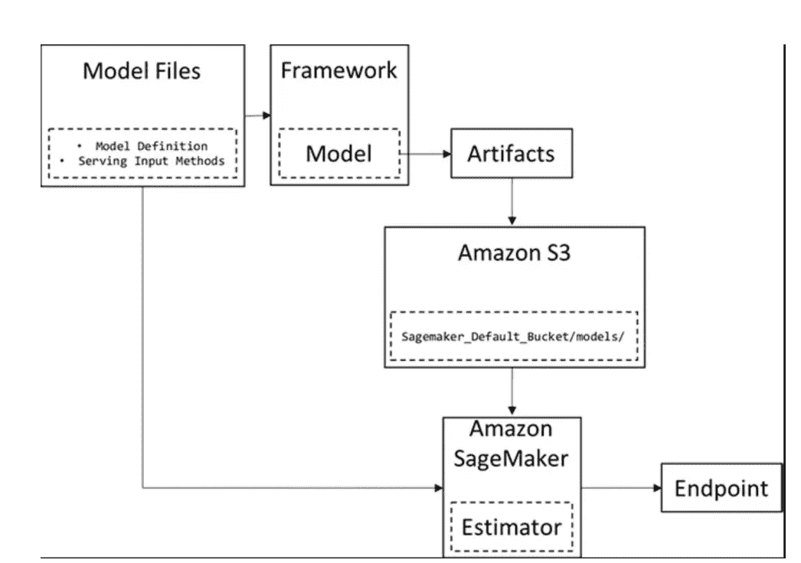

实施可以分为以上步骤

# 基本模型实现

首先，我们使用 Amazon SageMaker 线性学习器实现了实现多类的基本模型

●拆分训练、验证和测试数据:使用 sckit-learn 库中的 Train_test_split 实用程序将数据拆分为 80%的训练数据、10%的验证数据和 10%的测试数据。

●为线性学习者创建 sagemaker 估计器:我们提供执行角色、将用于训练模型的实例类型，将 predictor_type 指定为 multiclass_classifier，以告诉算法这是多类分类的情况，将 num_classes 指定为 3，这是类/标签的数量。

●拟合模型(训练)和部署:我们创建用于训练、验证和测试的记录集，并训练模型，最后使用 sagemaker 进行部署

●检查准确性:模型的准确性为 56%。

# SKLearn 模型实现(线性 SVC 和 KNeighborsClassifier)

接下来，我们使用 scikit-learn 库和该库提供的线性 svc 和 KNeighborsClassifier 来实现对当前基本模型的改进。

流程是:

●使用 create_csv 函数将训练和测试数据保存在本地库中。

●当 sagemaker estimator 从 s3 存储桶读取数据时，将数据上传到 S3 存储桶。

●创建一个 sagemaker 估计器，指定训练脚本的入口点，该入口点在这两种算法中都是不同的。

●训练脚本(train.py)具有用于加载已训练模型的 model_fn 和 __name__ == '__main__ '块，其中我们使用超参数进行模型训练。

●训练数据用于训练模型，并部署到 sagemaker 端点，进一步用于对测试数据进行预测

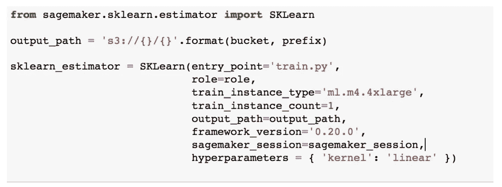

萨格马克估计量

# 精炼

基本模型线性学习器基于 vs rest 策略，并以 56%的准确度预测该类。然后，我们继续使用线性 SVC 来检查早期的模型是否可以细化或改进，但没有得到改进。准确率为 46%。

与基础模型相比，线性 SVC 得分不好。然后我评估了 **KNeighborsClassifier** 。

在 **KNeighborsClassifier** 的情况下，我们不使用默认的超参数，而是调整像 **n_neighbors** 这样的超参数来提高模型性能。

这是一个改进，因为 n_neighbors 从 3 变为 5，再变为 7。

# 结果

根据存储在测试目录中的测试数据对训练好的模型进行测试。找到每个算法的准确度分数，并制作描述结果的混淆矩阵。

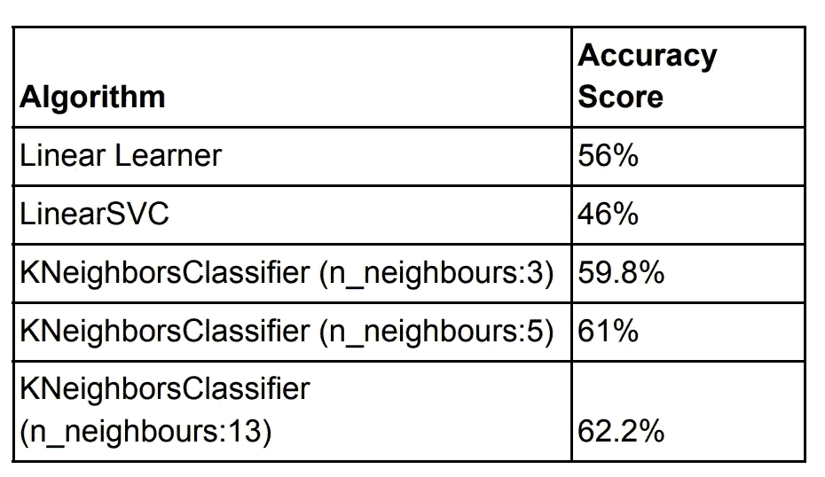

不同型号的准确度得分

# 混淆矩阵和算法准确度分数

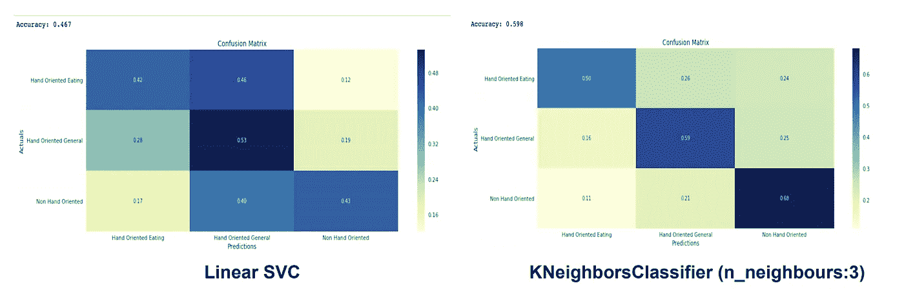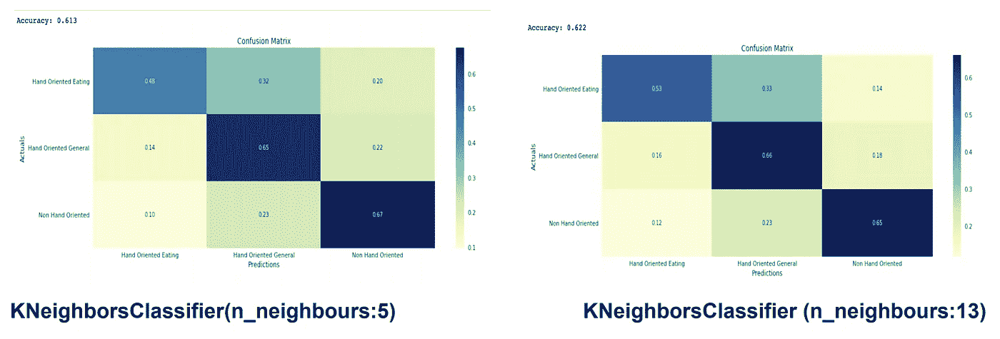

# 注意事项:

●使用 KNeighborsClassifier(n _ neighbors = 13)制作的最终模型在准确性方面比我们的基准模型表现得更好。我们将把这作为我们的最终模型。

●该型号在精确度方面比基本型号提高了 10%。

# 结论

基于传感器数据跟踪用户活动的想法是一个有趣的领域，因为我们每次都带着手机和手表，让我们能够访问大量的数据。这只是从中做出正确的推论。

该过程从收集和细化传感器数据开始。对数据进行预处理以使其具有标准化形式，且进行特征选择以保留最相关的特征。

该模型使用 sagemaker 估计器进行训练，并部署到端点。终点进一步用于对测试数据进行预测，最终我们验证了模型的准确性。

Amazon Sagemaker 是一个非常方便的工具，尤其是对于刚开始学习 ML 的人来说。使用 sagemaker，我们可以访问强大的资源、仪表盘、见解等。这使得培训、部署和预测过程变得轻而易举。

在识别正确的特征方面，项目有一些困难的方面。此外，在使用 tsne 时，2D 空间中存在类重叠的问题，因此预测可能不是非常准确。

最终模型 KNeighborsClassifier(n _ neighbors = 13)具有 62.2%的精度，随着我们收集更多数据并进行进一步改进，该精度足以用于设备。为了将来的增强，该模型可以被认为是基础模型。

# 丰富

●通过使用神经网络进行建模，我看到了当前设置的进一步改进。

● Sagemakere 超调作业可用于进一步微调模型。

●转换后的数据用于本项目，我们可以使用时间序列数据或原始数据建立一个更好的模型。

# 参考

●[https://archive.ics.uci.edu/ml/index.php](https://archive.ics.uci.edu/ml/index.php)

●[http://www . cis . Fordham . edu/wisdm/includes/files/sensor KDD-2010 . pdf](http://www.cis.fordham.edu/wisdm/includes/files/sensorKDD-2010.pdf)

●[https://towards data science . com/feature-selection-techniques-in-machine-learning-with-python-f 24 e 7 da 3 f 36 e](https://towardsdatascience.com/feature-selection-techniques-in-machine-learning-with-python-f24e7da3f36e)

●基于智能手机和智能手表的生物识别技术，利用日常生活活动。IEEE 访问，2019 年 9 月 7 日:133190–133202

> 你可以在 Github 链接上找到代码:[https://github.com/anshul2209/Human-Activity-Tracker](https://github.com/anshul2209/Human-Activity-Tracker)

如果你觉得这很有用，别忘了点击👏。