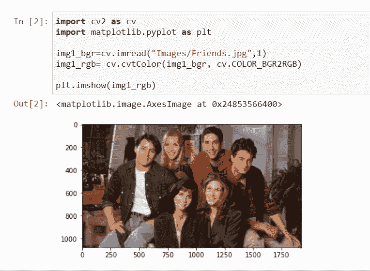
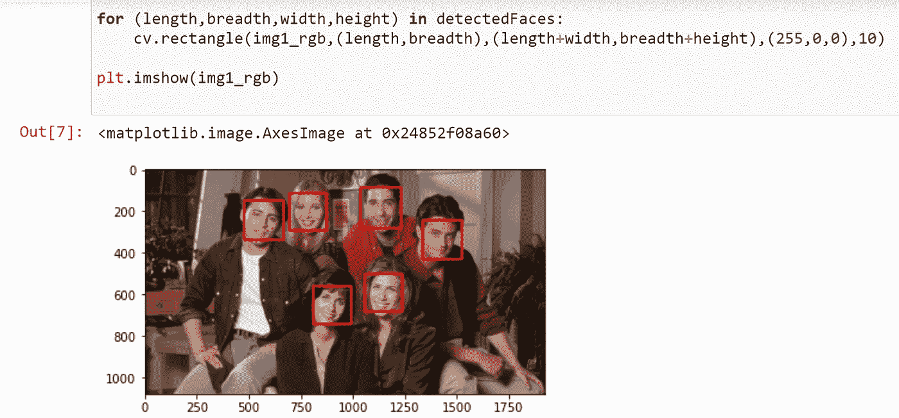
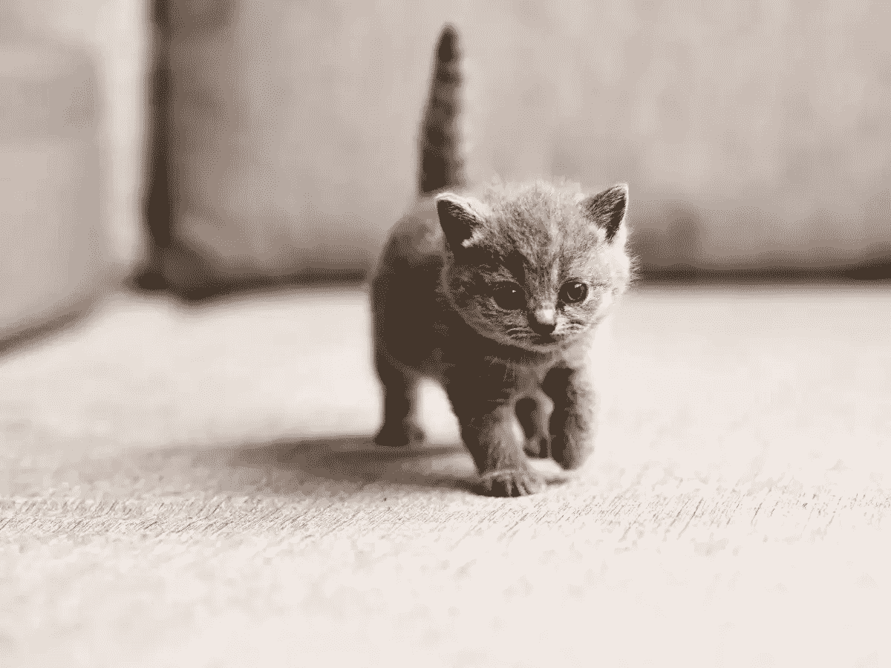
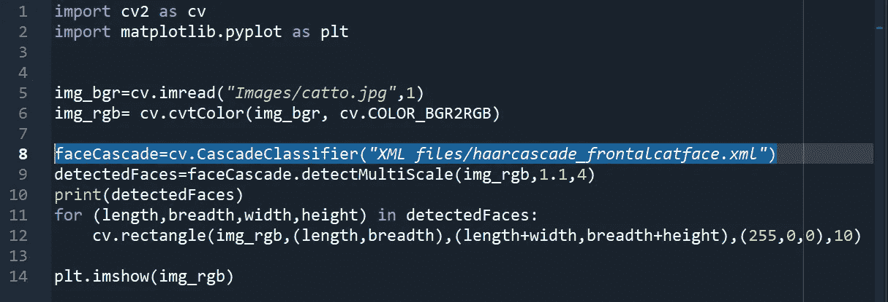
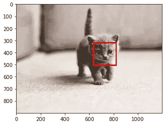

# 基于 OpenCV 的人脸和猫脸检测

> 原文：<https://medium.com/analytics-vidhya/human-and-cat-face-detection-using-opencv-92601ddfe2e9?source=collection_archive---------11----------------------->

OpenCV 中检测对象的一个主要方法是使用一个叫做“**级联分类器**”的东西。级联分类器可以按以下方式定义:

> “这是一种基于机器学习的方法，其中从大量正面和负面图像中训练级联函数。然后用它来检测其他图像中的物体。”

所谓正面图像，我们指的是我们想要探测的物体。

所谓负面形象，我们指的是所有我们想要避开的物体。

在我们的例子中，我们将使用人脸作为我们的对象。因此，首先，我们将需要大量正面图像(包含人脸的图像)和负面图像(没有人脸的图像)来训练分类器。

OpenCV 自带训练器和检测器，如果我们愿意，我们可以自己训练分类器。但是在我们的例子中，我们将使用以 XML 文件形式存在的训练好的分类器，这些文件可以在 [***OpenCV 的 github 页面***](https://github.com/opencv/opencv/tree/master/data/haarcascades) ***获得。***

所以让我们开始识别人脸。

# **人脸检测:**

让我们考虑这个图像，并尝试识别所有的面孔。

# **第一步:**

让我们导入必要的库，读取图像，然后绘制它

图像读取和绘图

如果你不熟悉阅读图像的步骤，可以看看我的博客。

# 第二步:

OpenCv 有一个名为" **CascadeClassifier"** 的函数，在这个函数中，我们将传入我们的训练器分类器的文件路径，然后执行这个函数的结果被存储在一个名为" **faceCascade"** 的变量中。

# **语法:**

简历。级联分类器(路径)

# **参数:**

已训练分类器 XML 文件路径

现在，为了最终检测人脸，我们将使用名为“**detect multi scale”**的方法，然后将结果存储在名为“**detected faces”**的变量中，然后打印出该变量。

# 语法:

> obj=cv。cascade classifier . detect multi scale(image，scaleFactor，minNeighbour)

# **参数:**

**图像:**我们要使用的图像

**比例因子:**参数，指定在每个图像比例下图像尺寸缩小多少。

**邻居:**指定一个候选矩形应该有多少个邻居。

# 结果

执行的结果实际上是一个矩阵，包含在提供的图像中表示我们的脸的矩形的长度、宽度、宽度和高度。仔细看看上图中的矩阵。

# 第三步:

现在，我们将遍历矩阵，并在所有检测到的对象周围绘制一个矩形。

[***如果你想了解更多关于使用 OpenCv***](https://faiizii992.medium.com/drawing-and-writing-on-images-using-opencv-5bb73bf0bb8e) ***在图像上绘制形状的知识，请访问这个博客。***

因此，在这种情况下，我们用红色标记检测到的人脸，并最终显示带有所有注释的更新图像。

# 猫脸检测:

这些步骤与人脸检测的步骤完全一样，但在这种情况下，我们必须使用不同的经过训练的分类器 XML 文件，以便在猫中进行人脸检测。

# 图片:

用于人脸检测的参考图像

# 代码:

猫脸检测代码

如果我们浏览代码，然后注意到突出显示的文本，我们会发现唯一的区别是 XML 文件的名称，其余的都是一样的。

# **输出:**

检测到猫脸

[*查看我的 Github 库获取代码*](https://github.com/Faizii992/OpenCv-Practise)