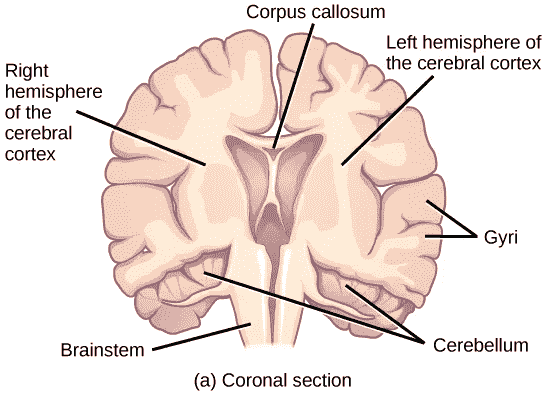
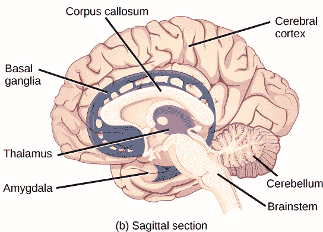
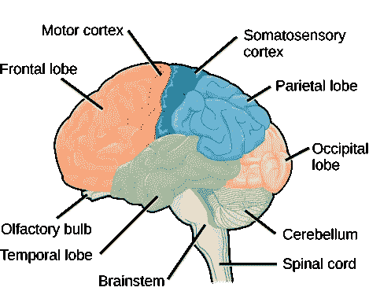
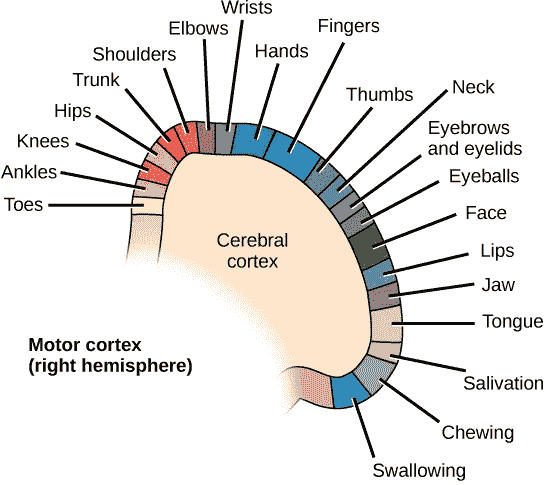
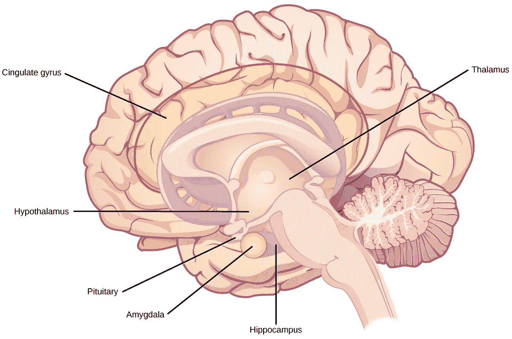

# 人脑——宇宙智慧的仓库

> 原文：<https://medium.com/analytics-vidhya/human-brain-the-warehouse-of-universal-wisdom-86bd66df104a?source=collection_archive---------28----------------------->

美国宇航局在 Unsplash 上拍摄的照片

威廉·罗斯·阿什比，英国人，主要是精神病学家，在他 1956 年的作品《大脑的设计》中，详细阐述了人脑的人工模型。分析是完全科学的，重点是适应性。生物的适应能力是一种由大脑学习能力不断驱动的机制。虽然我们的机器学习模型展示了来自学习行为的智能和决策能力，但它们很少足够狡猾以适应蓬勃发展。适应性是思维机器的一个核心方面。我们未来的钢铁世界公民将拥有这一特征来维系他们的种族，就像他们的生物同类一样。这使得我们对人脑的理解变得至关重要。

大脑是照亮世界、唤醒我们、通向并通过宇宙真理之门的唯一伟大器官。

然而，阿什比在他的书中没有触及心灵和物质之间的调和。尽管如此，他的工作只是从我们所处的位置迈出的第一小步，我们可以跨过栅栏去驯服未知的黑暗泥潭。将系统建模为其内部和(外部)环境变量的相互关系总是有意义的，因此根据这些相互关系来决定其行为。我们将以类似的方式开始分析神经系统，更重要的是大脑。阿什比的工作将是我们未来讨论的主题。此外，了解大脑的生物结构及其功能对于理解大脑在进化过程中的重要地位是必不可少的。

**神经系统**

神经系统是高等动物与低等动物的区别，它显示了生物行为的自发性。我们的神经系统构成了一个高度复杂的系统，除了像温度调节、心跳等自主活动之外，它还控制和协调我们的刺激感觉和运动反应。神经系统分为两类:

*   周围神经系统
*   中枢神经系统

中枢神经系统是神经系统的发电厂。它接受、处理、转换并发出控制和协调我们活动的电脉冲信号。PNS 构成了传输线，将这些脉冲从 CNS 和我们身体的各个部分(器官和肌肉)传入传出。

中枢神经系统由大脑和脊髓组成。然而，除此之外，作为一个复杂神经回路的迷宫，中枢神经系统在我们称为大脑的生物器官中增加了 1000 亿个神经元的复杂性。大脑是感知和想象的场所。它是生物体生物学和进化过程中最重要的组成部分。这就是动物王国在智能能力上的分类——也是它的研究对人工智能不可或缺的原因。

**思想**

思想或想象是生物神经系统的必然行为。指出这一现象的理论是双重的——还原论和整体论。还原论是把一个复杂的现象分解或简化成它不可分割的组成部分，而整体论支持一种从统一的整体中，从它的相互联系和相互关系中涌现出来的新行为。认知科学研究我们思想背后的心理过程。来自德国莱比锡的马克斯·普朗克人类认知和脑科学研究所(MPI CBS)和挪威特隆赫姆的卡维利系统神经科学研究所的科学家在 2018 年提出了一个新的提议——人类使用大脑的导航系统进行思考。

当我们在环境中导航时，大脑中有两种重要的细胞类型活跃。海马体中的位置细胞(详情参见*大脑皮层*)和邻近内嗅皮层中的网格细胞形成了一个允许定向和导航的回路。科学家小组提出，这个系统也是“思考”的关键，解释了为什么我们的知识似乎是以空间的方式组织的。

> “我们认为大脑将我们周围的信息储存在所谓的认知空间中。这不仅关系到地理数据，还关系到物体和体验之间的关系，”MPI CBS 的主任克里斯蒂安·多勒尔解释道。

**认知空间**

术语“认知空间”指的是我们在其中安排经验的思维地图。我们遇到的每样东西都有物理属性，不管是人还是物体，因此可以沿着不同的维度排列。根据兴趣的维度，个体可能在精神上被储存得更近或更远。根据 Doeller:

> 例如，如果我想到汽车，我可以根据它们的发动机功率和重量对它们进行排序。我们会有引擎强劲、重量较轻的赛车，也有引擎较弱、重量较重的房车，以及介于两者之间的所有组合。我们可以用类似的方式思考我们的家人和朋友；例如，根据他们的身高、幽默或收入，将他们编码为高或矮、幽默或不幽默或富有。这些过程对于对新的物体或情况做出推论特别有用，即使我们从未经历过它们。

利用现有的认知空间地图，人类可以通过将新事物与现有维度联系起来，来预测它与已知事物有多相似。如果他们已经见过老虎、狮子或黑豹，但从未见过豹子，我们会把豹子放在与我们认知空间中其他大型猫科动物相似的位置。基于我们对“大猫”这一概念的了解，已经储存在心理地图中，我们可以对遇到豹子做出适当的反应。雅各布·贝尔蒙德说:“我们可以归纳出我们经常面临的新奇情况，并推断出我们应该如何行动。”

**结尾**

以下部分给出了大脑中各种功能块的高层次概述，以及它们的相互依赖性和相互关系。在低得多的水平上，神经元是集体执行职责的工作手。网络中神经元之间的通信是通过电脉冲实现的。这篇文章给出了人类大脑中的复杂性，这样我们就可以预期一个具有适应性的人工智能机器将会是怎样的，即使与人类相比只有最小的能力。在以后的文章中，我们会根据需要参考神经科学和人脑的其他方面。

**下周:** [**适应性智能**](/@machvolve/evolution-in-intelligence-f7a6c719519c)

**上周:** [**神经元——我们智力的基本要素**](/@machvolve/neurons-the-nuts-and-bolts-of-our-intelligence-8d30d1dc7c65)

**第一周:** [**机器能思考吗？**](/@machvolve/can-machines-think-2fcfc2ce8ef0)

**阑尾——大脑**

大脑包含在颅骨的颅腔中。它包括大脑皮层、边缘系统、基底神经节、丘脑、下丘脑和小脑。为了查看内部结构，有三种不同的方法可以对大脑进行切片:矢状切片从左到右切割大脑，冠状切片从前到后切割大脑，水平切片从上到下切割大脑。

**大脑皮层**

大脑最外面的部分是一片厚厚的神经系统组织，称为大脑皮层，它被折叠成称为脑回的小山和称为脑沟的山谷。大脑皮层由左右两个半球组成，被一条大的脑沟隔开。被称为胼胝体的粗纤维束连接两个半球，并允许信息从一侧传递到另一侧。虽然有些大脑功能更多地局限于一个半球而不是另一个半球，但两个半球的功能在很大程度上是多余的。

每个大脑皮层半球都包含被称为脑叶的区域，这些区域参与不同的功能。哺乳动物大脑皮层的每个半球可以分为四个在功能和空间上定义的脑叶:额叶、顶叶、颞叶和枕叶。图中显示了人类大脑皮层的这四个叶。

额叶位于大脑的前部，在眼睛上方。这个叶包含处理气味的嗅球。额叶还包含运动皮层，这对计划和执行运动很重要。运动皮层内的区域映射到不同的肌肉群，这个映射有一些组织，如图所示。例如，控制手指运动的神经元就在控制手运动的神经元旁边。额叶中的神经元还控制认知功能，如保持注意力、说话和决策。

顶叶位于大脑的顶部。顶叶的神经元参与说话和阅读。顶叶的两个主要功能是处理身体感觉——压力、疼痛、热、冷等触觉——和处理本体感觉——身体各部分在空间中的方位感。顶叶像运动皮层一样包含身体的体感图。

枕叶位于大脑的后部。它主要涉及视觉——观察、识别和辨认视觉世界。

颞叶位于耳朵旁边的大脑底部，主要负责处理和解释声音。它还包含海马体(希腊语中意为“海马”)——一种处理记忆形成的结构。海马体如图所示。通过研究一位著名的癫痫患者 [HM](https://en.wikipedia.org/wiki/Henry_Molaison) ，海马体在记忆中的作用得到了部分确定，该患者的两侧海马体都被切除以治愈其癫痫。他的癫痫发作消失了，但他不再能形成新的记忆(尽管他能记得手术前的一些事实，并能学习新的运动任务)。

**基底神经节**

被称为基底神经节的相互连接的大脑区域在运动控制和姿势中起着重要作用。基底神经节的损伤，如在帕金森氏病中，会导致运动障碍，如行走时的缓慢步态。基底神经节也调节动机。例如，当一名 25 岁的商人被黄蜂叮咬导致双侧基底神经节损伤时，他开始整天躺在床上，对任何事或任何人都不感兴趣。但是当他受到外部刺激时——比如有人要求和他一起玩纸牌游戏——他能够正常运作。有趣的是，他和其他类似的病人并没有对他们的状态感到厌烦或沮丧。

**丘脑**

如图所示，丘脑(希腊语“内室”)是进出大脑皮层的通道。它接收来自身体的感觉和运动输入，并接收来自皮层的反馈。这种反馈机制可以根据动物的注意力和觉醒状态来调节对感觉和运动输入的意识。丘脑有助于调节意识、觉醒和睡眠状态。一种叫做致命家族性失眠的罕见遗传疾病会导致丘脑神经元和神经胶质的退化。除其他症状外，这种疾病使受影响的患者无法入睡，并最终导致死亡。

**下丘脑**

丘脑下面是下丘脑。它通过向脑垂体发送信号来控制内分泌系统，脑垂体是一种豌豆大小的内分泌腺，分泌几种不同的激素，影响其他腺体和其他细胞。这种关系意味着下丘脑调节由这些激素控制的重要行为。下丘脑是身体的恒温器——它确保食物和水的摄入、能量消耗和体温等关键功能保持在适当的水平。下丘脑内的神经元也调节昼夜节律，有时称为睡眠周期。

**边缘系统**

边缘系统是一套相互连接的结构，调节情绪，以及与恐惧和动机相关的行为。它在记忆形成中起作用，包括丘脑和下丘脑以及海马体的部分。边缘系统中的一个重要结构是被称为杏仁核的颞叶结构(希腊语“杏仁”的意思)。两个杏仁核对于恐惧的感觉和识别恐惧的面孔都很重要。扣带回有助于调节情绪和疼痛。

**小脑**

小脑(拉丁语意为“小大脑”)位于脑干顶部的大脑底部。小脑控制平衡，并帮助协调运动和学习新的运动任务。有没有喝醉了摇摇晃晃地走路？小脑受到摄入数量和功能低下的影响。

*有酗酒问题？立即找到并拨打* [*帮助热线*](https://aa-intergroup.org/oiaa/meetings/) *，加入数百万像你一样的人群。你的生活可以更丰富！*

**脑干**

脑干通过脊髓连接大脑的其余部分。它由中脑、延髓和脑桥组成。运动和感觉神经元通过脑干延伸，允许大脑和脊髓之间的信号中继。提升神经路径在大脑的这一部分交叉，允许大脑的左半球控制身体的右侧，反之亦然。脑干协调从大脑发送到身体的运动控制信号。脑干控制身体的几个重要功能，包括警觉性、觉醒、呼吸、血压、消化、心率、吞咽、行走以及感觉和运动信息整合。

**许可证和属性**

上述文章依赖于 CNX open StAX 网站提供的内容，网址为[https://cnx . org/contents/GFy _ h8cu @ 10.8:JOhgnBan @ 4/The-Central-neurosury-System](https://cnx.org/contents/GFy_h8cu@10.8:JOhgnBan@4/The-Central-Nervous-System)

许可证:CC BY 4.0:归属 https://creativecommons.org/licenses/by/4.0/

许可条款:在[http://cnx . org/contents/185 CBF 87-c72e-48 F5-b51e-f14 f 21 b5 eabd @ 10.8](http://cnx.org/contents/185cbf87-c72e-48f5-b51e-f14f21b5eabd@10.8)免费下载

马克斯& # 183；普朗克人类认知和脑科学研究所。"导航我们的思想:思考的基本原则."