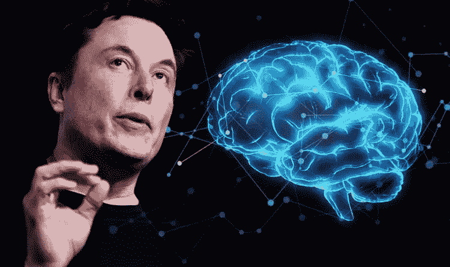
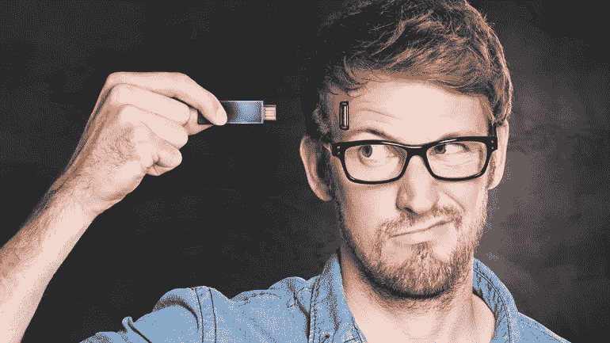
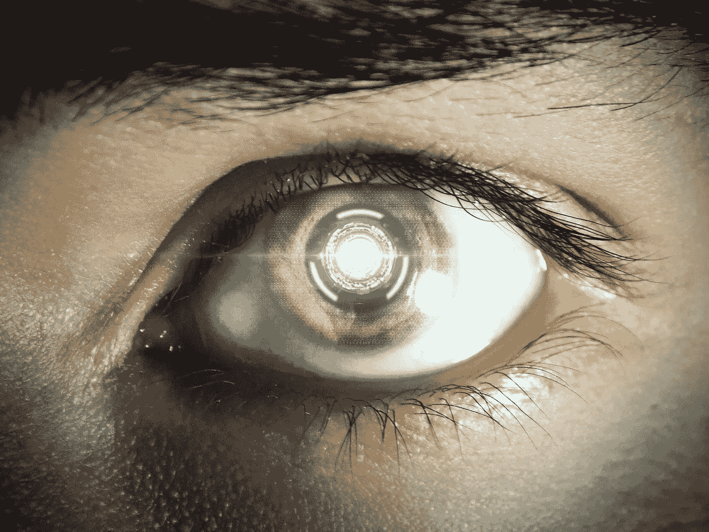
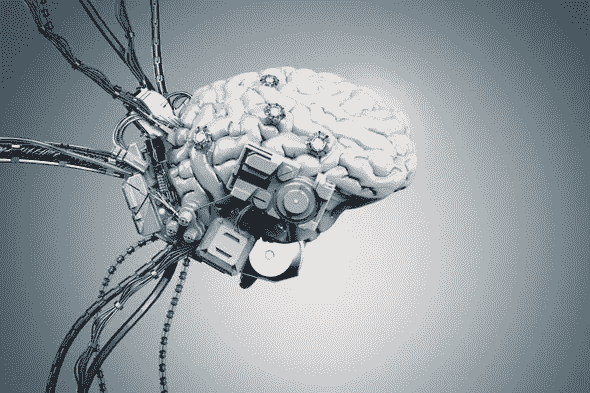
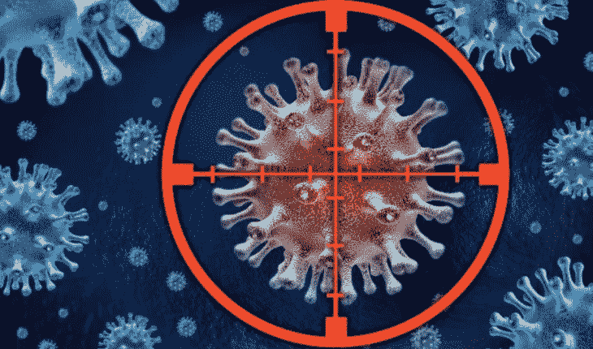
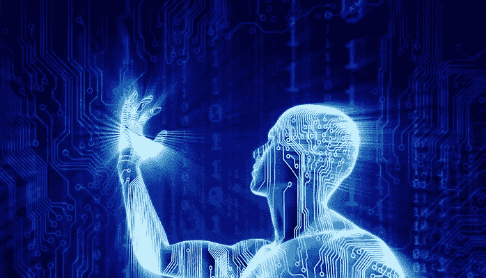

# 人类进化到了！NeuralLink 芯片的应用。

> 原文：<https://medium.com/analytics-vidhya/human-evolution-is-here-applications-of-neurallink-chip-9fd3dec5276c?source=collection_archive---------19----------------------->

来源:https://www.express.co.uk/

看完[埃隆马斯克](https://twitter.com/elonmusk)的[直播](https://www.youtube.com/watch?v=DVvmgjBL74w&feature=youtu.be)流 [neurallink](https://www.neuralink.com/) 芯片的介绍和演示，我想到的第一个教训就是“进化来了！”

这个博客有你需要知道的关于 neurallink 芯片及其用例的一切。如果您对硬件架构或任何其他信息感兴趣，您可以访问此[链接](https://www.youtube.com/watch?v=DVvmgjBL74w&feature=youtu.be)。

NeuralLink 是一种将被植入我们头骨的设备，用于交流和监控我们的大脑活动。多棒啊..不是吗？我的意思是，你可以在你的大脑中植入一个可编程的设备，你可以使用代码在任何层面上扩展它的功能！只有这句话让我起了强烈的鸡皮疙瘩。

想想这项技术有多神奇。一段时间后，超人不仅会出现在电影里，还会在街上走动。:D

我想在这里讨论的主要问题是 neurallink 如何在很多很多方面对我们有用。

因此，根据 Elon 的演示和整个问答部分，我想将应用程序分为几个领域。每个领域都有自己的用例。你可以把这些领域看作是人类大脑的基本组成部分。

**1。存储域**

来源:[https://notife.com/](https://notife.com/422039-puede-colapsar-el-cerebro-al-taparse-de-informacion/)

人脑储存大量信息。有时我们称这些信息为“记忆”。

随着年龄的增长，这些记忆变得模糊。我们不记得童年时非常精确的时刻。特别是那些不重要的时刻。

我们只记得重要的一次，也许过一段时间我们也会忘记，也许不会。但是，如果我们可以将所有的记忆储存在某个地方，并在我们想要的时候恢复它，那又会怎么样呢！就像做后援一样。

NeuralLink 芯片将能够备份我们的记忆，并在任何需要的时候恢复它们。这种方法也可以帮助治疗与记忆丧失相关的疾病。

**2。视觉领域**

来源:[https://pixabay.com/](https://pixabay.com/)

根据 neurallink 的一名团队成员的评论，芯片将帮助人类从失明或永久性眼睛损伤中恢复。该芯片可以与内部视觉皮层集成在一起，帮助恢复视力或治愈视力问题。

如果眼睛有一些严重的损伤，视觉皮层可以与外部相机集成，人们可以使用这种芯片修改视觉系统，就像终结者一样！

对此的扩展个人可以通过添加热感或基于传感器的摄像机来扩展视觉能力。

因此，这不仅仅是承诺治愈或解决现有的问题，他们的目标是改善和进一步发展！

**3。处理域**

来源:https://pixabay.com/

neurallink 芯片将能够读写信息或信号给大脑或神经元。凭借这种优越的能力，这种芯片将能够帮助患有精神疾病和相关疾病的患者。

这种芯片可以将数据写入大脑，这意味着它可能能够控制大脑的情绪。

例如，如果我的腿因为使用这种芯片而骨折了，我可能能够控制疼痛，在它被修复之前没有任何感觉。因为毕竟痛苦是一种情绪。

你也可以控制焦虑和抑郁问题，因为这些也与情绪有关。像失眠这样的问题也可以通过一个团队成员在问答部分的添加来解决。

简而言之，这种芯片可能能够控制人类大脑的情绪和思想处理，并消除现有的相关问题。

**4。这些控制域**

来源:[https://pixabay.com/](https://pixabay.com/)

这种芯片可能会引发一场新的进化，在这场进化中，当今世界的一些主要疾病将被彻底根除。

其中一些是瘫痪、脊髓损伤、失明、记忆丧失、抑郁、焦虑、失眠、大脑功能障碍、身体部分替换等。

除此之外，这种芯片还能够监测人体的其他部分，如心脏和肺。因此，这可能会在非常早期阶段遇到任何即将到来的疾病。

一旦这种芯片获得成功，将有大量的应用可以实现，许多现存的主要问题也将得到解决。

**5。杂项域**

来源:[https://pixabay.com/](https://pixabay.com/)

在[视频](https://www.youtube.com/watch?v=DVvmgjBL74w&feature=youtu.be)中提到了一些应用，听起来不可能，属于“超人”范畴。

有些是，

1.  从植入的芯片或大脑控制你的智能设备
2.  增强大脑的处理能力
3.  智能车身部件更换和与芯片的集成

和其他人。

在结尾部分，我想说，

截至目前，neurallink 团队正在受控环境中对猪进行实验。

让我们拭目以待，看看他们如何实现他们的里程碑，使这在人类身上成为可能，并把我们带到下一次进化！

像任何其他项目一样，有一些额外的好处，如可行性、安全性和完整性。

但是，我们能做的就是抱最好的希望。

向埃隆·马斯克和他的团队致敬。

> 领英:[*https://www.linkedin.com/in/mihir-rajput/*](https://www.linkedin.com/in/mihir-rajput/)
> 
> insta gram:[T5【https://www.instagram.com/ai_dev_/】T6](https://www.instagram.com/ai_dev_/)
> 
> github:[https://github.com/mihir135/](https://github.com/mihir135/)
> 
> *谢谢，干杯！*