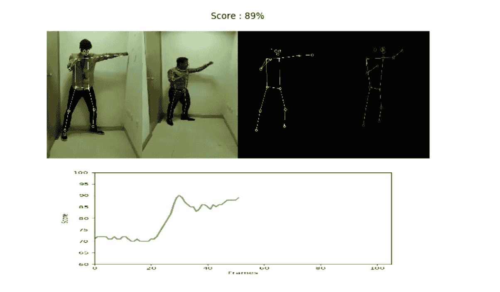
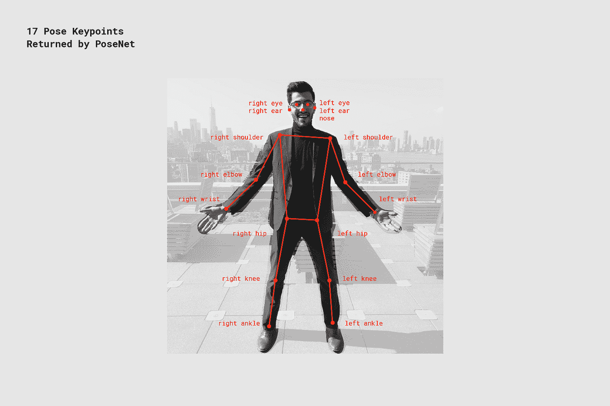
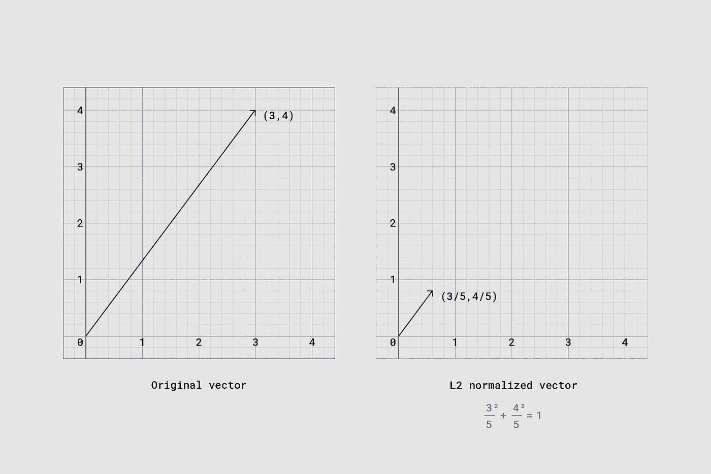
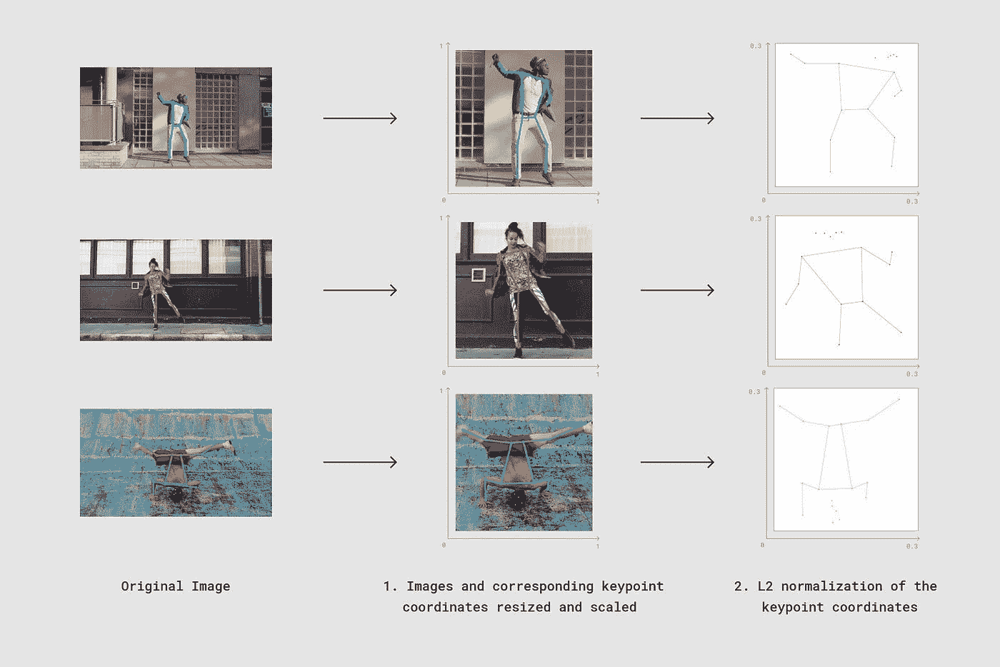
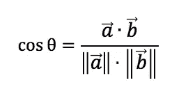
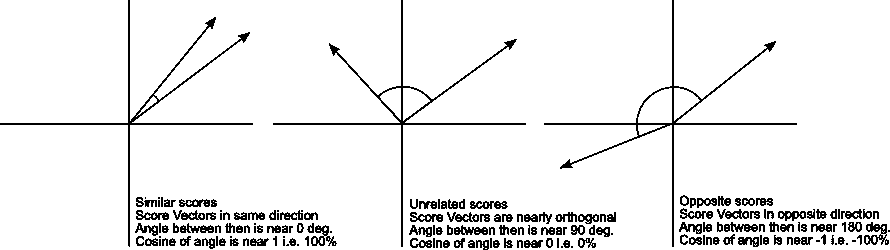
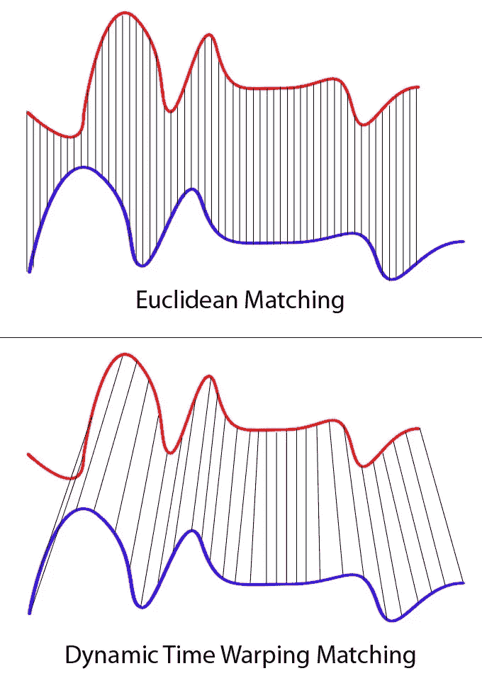

# 使用深度学习、OpenCV 和 Python 进行人体姿势比较和动作评分

> 原文：<https://medium.com/analytics-vidhya/human-pose-comparison-and-action-scoring-using-deep-learning-opencv-python-c2bdf0ddecba?source=collection_archive---------3----------------------->



> *关于如何运行的代码和说明，请访问:*【https://github.com/kr1210/Human-Pose-Compare 

姿势估计是神经网络的一个更优雅的应用，并且非常精确，有时，就像科幻小说里的一样。

例如，看看谷歌的 Move Mirror，这是一个浏览器内应用程序，它可以实时估计用户的姿势，然后显示一部演员保持相同姿势的电影。

然而，当我浏览它的时候，我有了一个主意。如果同样的方法可以用来比较两个人做的同样的动作会怎么样？这项技术可以用来远程教学！我立即开始工作，试图对谷歌使用的技术进行逆向工程。

令我失望的是，我找到了一些 Tensorflow.js 教程和理论，但 python 中没有。这是可以理解的，因为它是一个浏览器内应用程序，所以我决定将代码移植到 mighty Python。一些研究向我展示了他们使用 Posenet，一种快速而精确的模型来估算姿势。然后有几个引擎盖下的操作，以协助模型，我们将进入一点细节。

目标很简单:我想向前迈一步，将一个完整的动作(比如一拳或一脚)与一幅图像进行比较，并告诉我它的正确程度。

现在，让我们来看看所采取的所有步骤

1.  模型:正如我前面所说的，Google Mirror 使用了 PoseNet，这是一个深度学习模型，它指定了人体上的 17 个点。[我在这里找到了一个很好的 python 实现。](https://github.com/rwightman/posenet-python)



下一个挑战是定义相似性。当我们思考这个问题时，我们看到有许多不确定性需要解决:人类可能有不同的身高和体型，他们可能在照片的不同部分:一个人可能站在相机附近，另一个人可能在远处。为了输出正确的结果，必须解决所有这些问题。我决定采取谷歌遵循的所有步骤。

1.  一个新的边界框:从模型输出中，我们得到人体上 17 个关键点的坐标。该信息可以用于创建新的边界框，该边界框紧紧地覆盖图片中的人。这样就解决了人物出现在画面不同部位的问题。
2.  点的归一化:为了解决尺寸不一致的问题，我们对点进行 L2 归一化，以便将其转换为单位向量。L2 归一化向量的定义属性是平方和等于 1。



转换成单位向量



既然我们已经标准化了姿态向量，是时候选择一个相似性度量了。我选择余弦相似度作为这个例子，主要是因为我们使用的是向量。

# 余弦相似性

两个向量的余弦相似性定义如下:



这 17 个关键点被转换成一个向量，并在高维空间中绘制。这个矢量图与我们的基准图像中的另一个矢量图进行比较。

这里矢量的方向是姿态相似性的指示。方向相似的向量是相似的，而方向完全不同或相反的向量是不同的。

现在，给我们之前的一个男人出拳的视频，我简单地估计了每一帧的姿势，标准化了向量，并将它们存储在一个数组中。我已经保存了一个 pickle 文件，其中包含完美出拳姿势的标准化向量。现在，我所要做的就是计算每一帧中两者之间的余弦相似度，并取所有分数的平均值。

我们可以看到，在执行动作的人模仿图片中人的姿势的地方有一个峰值。看来我在某种程度上成功了。

但是缺点是显而易见的:

1.  该算法不考虑执行活动所花费的时间。这是一个严重的缺点，如果这是用于任何训练软件，如武术等。
2.  不可能获得 100%的分数:因为平均值是对一张照片取的，所以即使这个人正确地完成了动作，也不可能有 100%的分数。

由于这些因素，我不得不得出结论，这种方法只能用于定性分析，也许动作识别，但不能作为一个评分模块。必须以某种方式考虑时间信息。

由于我一开始没有太多的数据，任何类型的深度学习方法都被取消了。所以我开始思考替代方法和其他基于视觉的方法。对这类问题的快速研究使我得出结论，为了以有用的方式使用时间信息，必须采用某种基于光流的方法。

从这里看，这种方法似乎非常简单。我现在不是仅仅与一个动作的图像进行比较，而是将一个人执行的动作的视频与以正确方式执行的动作的视频进行比较——坦率地说，是一种基于查找的方法。

但这里的问题似乎也很多:

1.  这些帧没有特定的顺序:我根本无法推断早期的方法，因为我无法事先知道两个视频中的哪些帧需要相互比较。
2.  这些序列可以有不同的长度:另一个困扰我的问题是，即使我能以某种方式找出哪些帧可以相互比较，这两个视频也不需要有相同的持续时间。

除了其他问题，这些问题告诉我，我需要想出一个替代方法，该方法将接受一个人执行某个动作的视频、动作的名称以及查找中一个人以正确方式执行相同动作的视频作为输入，然后应该产生一个分数。

如果我们仔细思考，这些数据显示出某些描述特征:

1.  有 17 个点由它们的坐标跟踪
2.  坐标的值随时间变化

这些属性告诉我，我实际上可以将这些数据作为一个时间序列来处理，这样就可以使用各种其他方法进行比较。

# 动态时间扭曲

尽管这听起来像是一种科幻的时间旅行方法，但它真的不是。它只是一种用于比较不同长度的序列和图形的方法。它使用一对多匹配等方式匹配图形中的不同波谷和波峰，从而自动同步帧。



这种方法对我的用例来说似乎是理想的，因为在执行动作时，我对 17 个关键点中的每一个都有相似的图表。然后我可以用 DTW 来比较这些图表，并在 17 个关键点中的每一个上得到 17 分。然后将这 17 个分数的平均值作为总分数。

我使用了一个名为 [dtaidistance，](https://pypi.org/project/dtaidistance/)的包，当以 Numpy 数组的形式给出时，它用于计算两个序列之间的 DTW 分数。

通过这种方式，我能够使用从每一帧的姿势估计中获得的时间信息来比较两个人执行的动作。

例如，在“出拳”的例子中，我构建了一个查找表，其中包含了“出拳”动作的 17 个关键点在 3 个视图中的顺序——前、左、右。它以如下格式存储在 dict 中:

```
{'punch - side': array([[[5.15185672e+01, 8.93372620......)
 'punch - front': array([[[5.15185672e+01, 8.93372620......)
}
```

然后，我们之前用过的一个男人出拳的视频，和动作的名称和方向一起给出。这些是使用这种方法获得的分数的一些可视化。被跟踪的点后面有一条绿色路径:

> 【https://github.com/kr1210/Human-Pose-Compare】关于如何运行的代码和说明，请访问:

改进:

1.  自动识别执行的动作和方向:在我展示的代码中，动作和方向必须由用户指定。相反，我解释的第一种方法可以通过使用另一个查找来识别执行的动作和方向。
2.  使用置信度得分:我没有使用过 Posenet 返回的任何置信度得分。这些可以用来提高得分效率。
3.  指定要考虑的要点:根据要执行的动作，可以使用特定的要点来提高准确性。在拳击中，躯干的运动比腿的运动更重要。
4.  提供反馈:可以向用户提供关于哪个身体部位的运动和位置需要被纠正以提高分数的反馈。

参考资料:

1.  [https://medium . com/tensor flow/move-mirror-an-ai-experiment-with-pose-estimation-in-the-browser-using-tensor flow-js-2f 7 b 769 F9 b 23](/tensorflow/move-mirror-an-ai-experiment-with-pose-estimation-in-the-browser-using-tensorflow-js-2f7b769f9b23)
2.  [https://towards data science . com/dynamic-time-warping-3933 f 25 fcdd](https://towardsdatascience.com/dynamic-time-warping-3933f25fcdd)