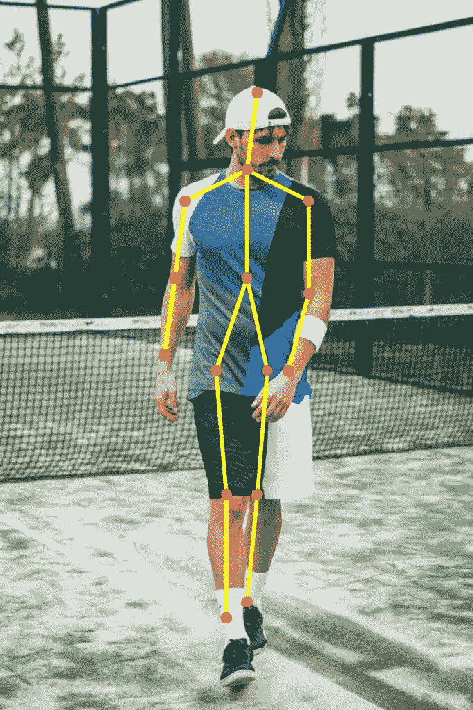
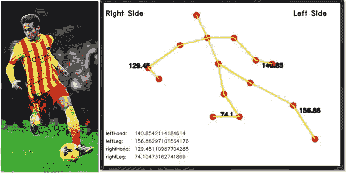

# 深度学习中基于 OpenCV 的人体姿态估计

> 原文：<https://medium.com/analytics-vidhya/human-pose-estimation-using-deep-learning-using-opencv-9d8edd5e8879?source=collection_archive---------10----------------------->

在这个帖子里，我讨论了我是如何使用 OpenCV 和 Tensorflow 开发人体姿态估计的。我试图用最简单的方式解释这个过程以及必要的实现部分。

让我们从输出的样子开始，也许这样你就能对我们试图理解的东西有一个整体的概念。这是实时估算的结果:



首先:**什么是姿态估计？**姿态估计是计算机视觉中的一个普遍问题，在这里我们检测物体的位置和方向。这通常意味着检测描述对象的关键点位置。

该概念背后的基本思想是在图像中找到 ***【身体上的标志】*** ，即:身体的主要部分/关节(例如，肩、踝、膝、腕等。).

如何开始建造它？项目的第一步，也可能是最重要的一步是找到合适的数据集。幸运的是，对于姿势估计，有几个很好的数据集可用:

1.  [**可可要点挑战**](http://cocodataset.org/#keypoints-2018)
2.  [**MPII 人体姿态数据集**](http://human-pose.mpi-inf.mpg.de/)
3.  [**VGG 姿态数据集**](http://www.robots.ox.ac.uk/~vgg/data/pose_evaluation/)

可可模型产生 18 分，而 MPII 模型输出 15 分。下图显示了一个人的输出。这些点是在通过卷积神经网络(CNN)对数据集进行处理和彻底训练时生成的。


现在我们知道了关键点的检测，让我们进入项目的核心:实现

# **实施:**

第一个也是最重要的部分将包括生成和处理包含神经网络中正向传递的随机权重的权重文件和包含关于神经网络层的信息的原型文件。然后我们把文件加载到网络上

```
# Specify the paths for the 2 files
protoFile = "pose/mpi/pose_deploy_linevec_faster_4_stages.prototxt"
weightsFile = "pose/mpi/pose_iter_160000.caffemodel"

# Read the network into Memory
net = cv2.dnn.readNetFromCaffe(protoFile, weightsFile)
```

现在对于检测部分，为了识别关键点，我们必须首先将帧转换成一个 ***斑点*** (斑点是一种可以存储二进制数据的数据类型。这不同于数据库中使用的大多数其他数据类型，如存储字母和数字的整数、浮点数、字符和字符串。因为 blobs 可以存储二进制数据，所以它们可以用于存储图像或其他多媒体文件)

```
# Prepare the frame to be fed to the network
inpBlob = cv2.dnn.blobFromImage(frame, 1.0 / 255, (inWidth, inHeight), (0, 0, 0), swapRB=False, crop=False)

# Set the prepared object as the input blob of the network
net.setInput(inpBlob)
```

我们都设置了先决条件，现在我们移动到训练模型和预测部分:一旦图像被传递到模型，就可以使用一行代码进行预测。OpenCV 中 DNN 类的 **forward** 方法通过网络进行前向传递，换句话说就是进行预测。

```
output = net.forward()
```

输出是 4D 矩阵:

1.  第一维是图像 ID(如果您向网络传递多个图像)。
2.  第二维表示关键点的索引。该模型产生置信度图和零件相似性图，它们都被连接起来。对于 COCO 模型，它由 57 个部分组成——18 个关键点置信度图+ 1 个背景+ 19*2 个部分相似性图。同样，对于 MPI，它产生 44 个点。我们将只使用与关键点相对应的前几个点。
3.  第三个维度是输出地图的高度。
4.  第四维是输出地图的宽度。

在反向传递完成后，系统有 **2D 置信度图或亲和度图**，其中包含目标身体部位图像中预测的**全局最大值**。置信图看起来像这样:


现在我们有了这些点的位置，我们只需要将它们绘制到图像上。所以剩下要做的就是**绘制姿态预测的骨架**。我已经预定义了身体部位对，这样就可以更容易地连接身体部位之间的线条。

我还加了一个功能**显示身体四肢之间的角度**。这样做的目的是，这些分析可能对那些试图在运动或跑马拉松时改善姿势的运动员有用

这是模型完全训练后输入图像的最终输出:



你可以在我的 **GitHub 资源库链接**中找到完整的源代码供你参考:

[***https://github.com/kunjshah2511/Human-Pose-Estimation***](https://github.com/kunjshah2511/Human-Pose-Estimation)

希望你已经发现这个指南是有用的，并且现在你已经对姿态估计模型的内部工作有了更深的了解。