# 基于张量流 Keras 的 Unet 人体图像分割

> 原文：<https://medium.com/analytics-vidhya/humans-image-segmentation-with-unet-using-tensorflow-keras-fd6cb43b06e5?source=collection_archive---------0----------------------->

# 我们想做的是-

我们希望通过使用现有的库和资源来创建人类的分段(现在只对人类)。因此，我们将为此使用 OCHuman 数据集和 Tensorflow。我们将在这篇文章中谈论所有这些事情。

我们将图像和他们的面具，以模型和模型将产生一个分割的面具的人给定的图像。我们可以使用这些分割结果来人为模糊图像的背景，在自动驾驶汽车中，改变图像的背景，图像编辑，检测图像中的人，以及许多可能性。

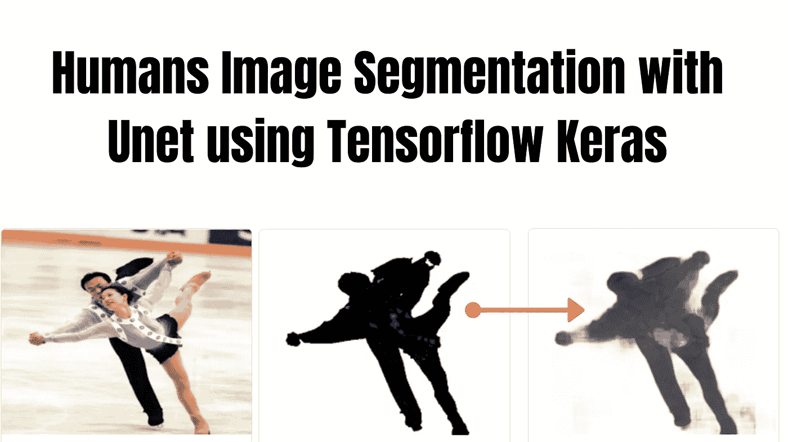

下面的图片是唯一的第 44 次训练的结果，文章中有很多东西要讨论。

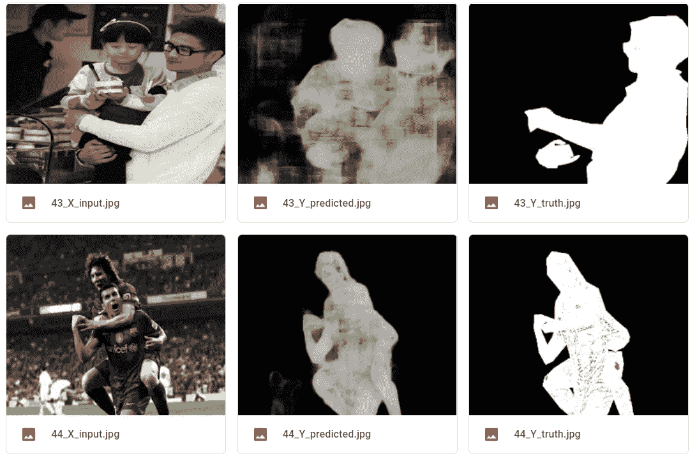

我们模型的预测

# 首先，我给你看一下这篇文章的重点。

1.  **什么是图像分割**
2.  **什么是 Unet，我们为什么使用 Unet**
3.  **为什么 TensorFlow**
4.  **我们使用的数据集**
5.  **我们如何预处理数据并创建自定义数据集**
6.  **使用不同的自定义数据集进行模型构建、训练和结果**
7.  **你可以尝试什么**
8.  **代码(GitHub)**

# 1.什么是图像分割

图像分割是机器视觉的一个广泛的部分，在图像分割中我们把图像的每一个像素归为一类。

例如:假设在下图中，我们高亮显示了猫的每个像素值。

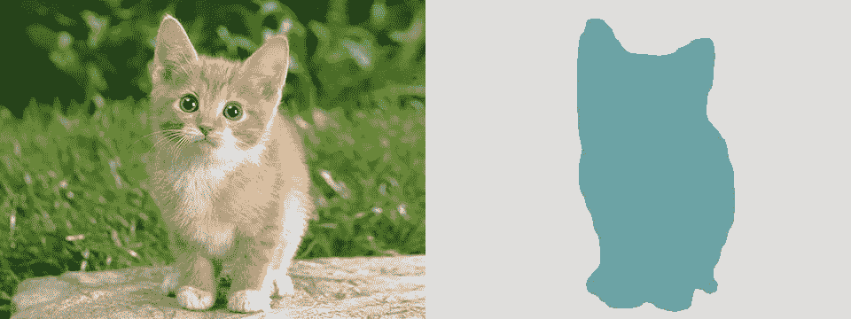

来源:[https://towardsdatascience.com/u-net-b229b32b4a71](https://towardsdatascience.com/u-net-b229b32b4a71)

正如你在上面看到的，图像是如何变成两段的，一段代表猫，另一段代表背景。

## **有两种类型的图像分割-**

***1。语义分割:*** *将每个像素分类成一个类别。*

例如:如果图片中有三只猫，我们将它们归类为一个实例，即猫。


例子:*语义切分*

**2。实例感知分割，也称为*同时检测:*** *在实例感知分割中我们找出每个对象的单独实例。*

例如:如果图片中有三只猫，我们可以分别识别它们。

自动驾驶汽车是图像分割的最大例子之一。在自动驾驶汽车中，我们可能需要对每个对象进行分类(人、汽车、自行车、道路、树木等。)单独来说。嗯，关于自动驾驶汽车，有很多事情可以谈论，如果你也想了解它们，请告诉我。

# 2.什么是 Unet，我们为什么使用 Unet

首先说一下 CNN。CNN 从图像中学习特征，并将图像压缩成特征向量，我们可以在图像分类和其他事情中使用它。

现在，谈谈 Unet- In 分割，我们需要从 CNN 创建的特征向量中重建图像。因此，这里我们将特征图转换成一个向量，并从这个向量中重建一个图像。

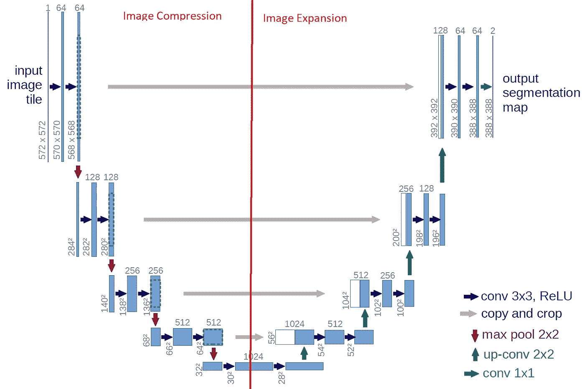

Unet

这个建筑看起来像一个 U 形。在这个架构中，我们有两个部分压缩和扩展。在压缩部分，我们有一些卷积层，最大池层。每个块之后的内核或特征图的数量加倍，以便架构可以学习复杂的结构。

类似地，在扩展块中我们有 CNN 层和上采样层。扩展块的数量与压缩块的数量相同。

图像分割中的损失计算？好吧，它在论文中被简单地定义了。

*“结合交叉熵损失函数，通过最终特征图上的逐像素软最大值来计算能量函数。”*

**我们用 Unet 是因为**它可以重建图像。我们将一些图像作为特征，将它们相应的蒙版图像作为标签添加到模型中。由于 Unet 的重建功能，Unet 也能够生成图像作为输出。这里我们使用的是监督学习方法。

# 3.为什么选择张量流

我们使用 Tensorflow 是因为该模型开发速度很快，无需更多地担心语法，更专注于网络的架构，并对模型进行微调。

TensorFlow 还提供了 Keras，因此我们可以使用它的 API 来创建数据生成器、模型和微调等。非常容易。

但是如果你愿意，你也可以使用 Pytorch。在 PyTorch 中，您还需要关注您的代码，并且需要编写更多的代码。但是 Pytorch 的优点是你可以和张量一起玩，并且在**训练时间**里获得的性能高不了多少。

# 4.我们使用的数据集

我们使用的数据集 [OCHuman](https://cg.cs.tsinghua.edu.cn/dataset/form.html?dataset=ochuman) 。该数据集聚焦于具有全面注释的严重遮挡的人类，包括**边界框、人类姿势和实例遮罩**。该数据集包含 5081 幅图像中的 13360 个精心标注的人类实例。平均每个人 0.573 MaxIoU，OCHuman 是与人类相关的最复杂和最具挑战性的数据集。

《Pose2Seg:无检测人体实例分割》中提出的数据集[【project page】](http://www.liruilong.cn/projects/pose2seg/index.html)[【arXiv】](https://arxiv.org/abs/1803.10683)@ cvpr 2019。

你可以从[这里](https://cg.cs.tsinghua.edu.cn/dataset/form.html?dataset=ochuman)下载数据集。

在应用**边界框、人类姿势和实例遮罩之后，来自数据集的样本图像-**


样本图像 OCHuman

此数据集包含以下文件-

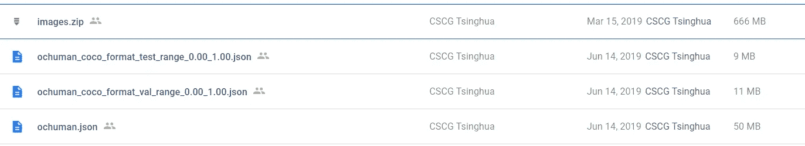

数据集 OCHuman

我们将只使用 images.zip 和 ochuman.json。

**Images.zip:** 内容大量图片**没有**任何包围盒，人类姿势，和实例遮罩。我们将提取它，我们将有一个名为“图像”的文件夹，其中包含图像，如-

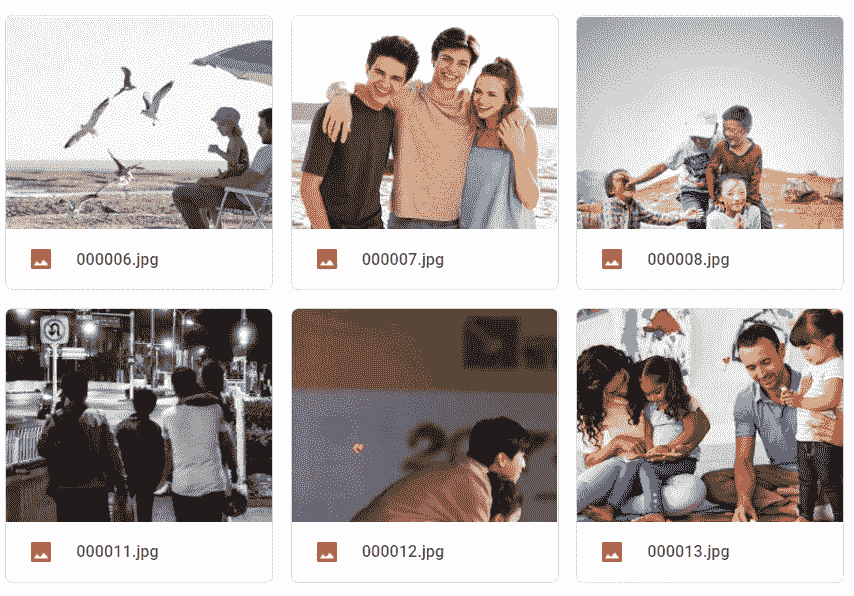

**ochuman.json:这是一个 json 文件，包含“images”目录中与图像相关的信息(**边界框、人物姿势和实例遮罩**)。**

有另一个数据集 [COCO](http://cocodataset.org/#home) 可用于相同的任务，但我们不想使用它，因为它除了人之外还有其他类型的分割，可能需要做更多的预处理。嗯，大约是 18 GB 的数据集。而 OCHuman 只有 700 MB 左右。如果我们有一些结果，那么我们也可以使用 COCO 数据集尝试相同的模型或不同的模型进行进一步的训练。

现在，你对我们的数据集、Unet 和任务有了一个基本的概念。现在，请稍微了解一下我们的自定义数据集。

# 5.我们如何预处理数据并创建自定义数据集

## 为什么我们创建了一个自定义遮罩(分段)？

我认为对于我们的任务，由数据集生成的分段不是很有用，所以我创建了自定义分段。因为我们希望将精确的分割掩模提供给模型，而不希望提供额外的或不相关的信息。

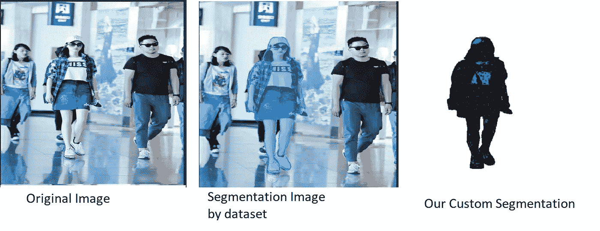

您可以通过更改下面的“new_mask”函数中的值来尝试不同类型的分段。

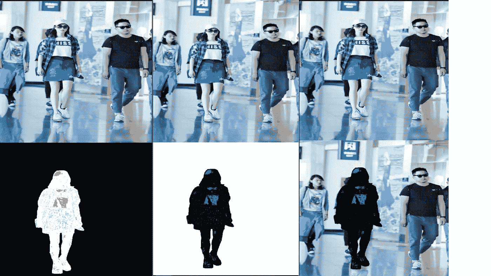

您可以生成不同种类的分段

**现在，在继续之前，让我向你展示我们使用 JSON 文件生成这些图像的遮罩和姿态的 API。**

*你可以去这个 GitHub 链接安装 API。*[https://github.com/liruilong940607/OCHumanApi](https://github.com/liruilong940607/OCHumanApi)

***注意:确保你已经下载了 images.zip 并解压为文件夹名“images”并且有“ochuman.json”。***

## 我们如何创造面具-

你可以写出比这更好的代码，但是现在，这是我所拥有的-

**5.1。安装 API-**

```
git clone https://github.com/liruilong940607/OCHumanApi
cd OCHumanApi
make install
```

**5.2。首先导入所有需要的库-**

**5.3。读取 ochuman.json 文件-**

我们设置 Fiter='segm '是因为我们想要图像的唯一分割。你可以使用不同的参数。API 的 GitHub repo 上提到的所有细节。

所以，现在我们有**个总图像:4731 个**在 **image_ids** 列表中，包含人类**的分割。**

**5.4。这是一个帮助函数，它将帮助我们只为图像创建一个分割-**

**5.5。我们创建的另一个助手函数，只是传递一个由 ochuman API 生成的原始图像和分割图像。**该功能将创建一个黑白**自定义蒙版**。您可以更改 append 函数中的值来生成不同种类的图像。稍后，您可以将生成的图像提供给模型。

阅读第 9 行和第 11 行的注释。

**new_mask:** 如果你想创建一个黑色背景和白色人类面具，反之亦然，使用此功能。

**new_mask_clr:** 如果你想创建彩色图像。例如，紫色背景和黄色的人面具，然后使用这个功能。阅读第 63、65、67 和 70、72 和 74 行的注释。只需改变 append 函数中的值来改变颜色。我们使用 BGR 格式，因为 OpenCV 可以读取 BGR 格式的图像。默认颜色是紫色背景和黄色遮罩(人类)。

**5.6。一些参数-**

更改这些参数可能需要更改代码中许多其他地方的值，请仔细理解代码的工作原理。

**5.7。创建黑白分割-**

你可以使用“new_mask_clr”(用于紫色和黄色遮罩)函数来代替第 9 行的“new_mask”(用于黑白遮罩)。

这个函数的输出是:(2，512，512，3) (2，512，512，3)

解释-这个函数将返回 x 和 y。这里 x 是一个形状为(2，512，512，3)的普通图像，没有任何分割、边界框等。y 是形状为(2，512，512，3)的黑白分割图像。

你可以看到这里的输出，你可能会想，为什么所有的人类没有被分割？是因为数据集。在 ochuman.json 文件中，我们没有这个图像中其他人的分割。我们在图像中只有一个人的分割。

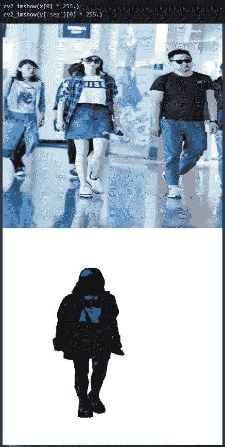

**5.8。现在生成所有的 4731 张图片-**

我们将遍历所有 4731 张图片。我知道它有点硬编码，但它对数据生成部分来说很好。

上面代码的输出-

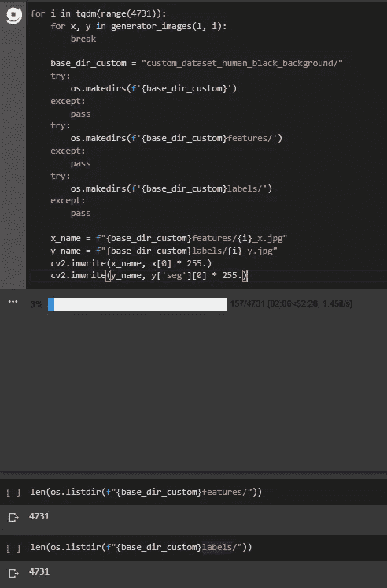

## 5.9.把这些放在一起-

以上所有代码都可以在我的 [GitHub](https://github.com/Dipeshpal) 中找到。

[点击此处](https://github.com/Dipeshpal/Image-Segmentation-with-Unet-using-Tensorflow-Keras/blob/master/img_create.ipynb)查看这款笔记本。本笔记本仅用于自定义数据生成部分，培训笔记本是不同的笔记本。我正在使用谷歌 Colab，所以你可能需要编辑一些东西，如更改目录等。

# 6.代码模型构建-

我们将使用 Unet 进行训练，因为它能够重新生成图像。

该模型可能学习其他东西，这意味着该模型可以学习输入图像到输出图像之间的颜色映射。它可能会学习一些颜色到另一些颜色的映射，所以这就是为什么我们创建了三个不同的数据集。我们将通过使用 Unet 的相同架构，将三种不同类型的图像数据集逐个输入到模型中。

使用上面第 5 点中的笔记本，我们创建了三个自定义数据集-

## 6.1.自定义数据集人类:黑色背景和白色物体-

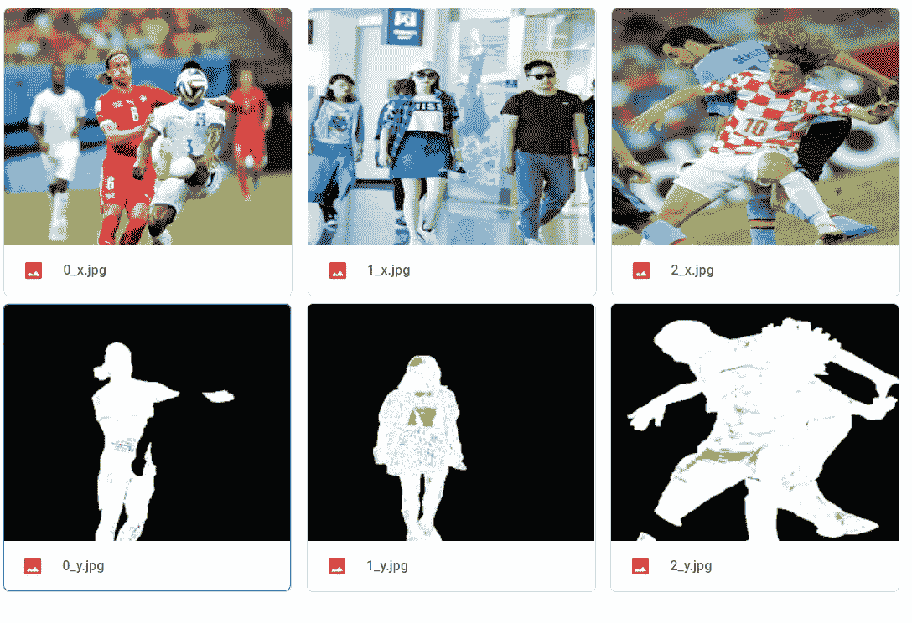

## 6.2.自定义数据集人类:白色背景和黑色对象-

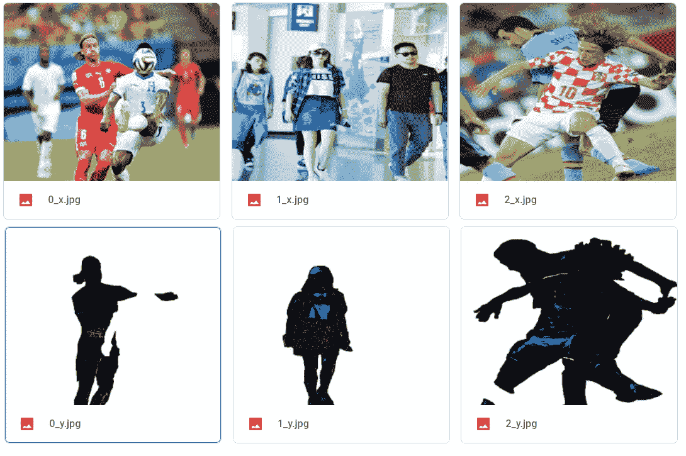

## 6.3.自定义数据集人类:紫色背景和黄色对象-

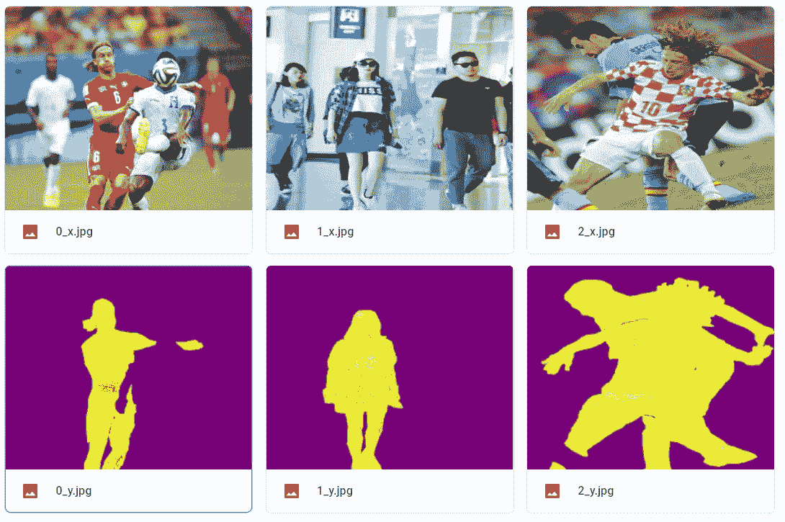

我们还将讨论数据生成器和其他东西，但在此之前，让我们先了解一下模型和结果。您可以使用不同的参数，如激活、内核初始化、时期、图像大小等。我们将对上述三个数据集使用相同的模型。我们创建的架构如下所示-

**模型总结-**

**训练结果-**

此输出结果是针对黑色背景数据集图像的。你可以看到损失从一个**损失:0.5708 减少到损失:0.3164** 。验证损失从 **val_loss: 0.5251 下降到 val_loss: 0.3122** 。准确度没有大的变化。

# 结果-

## **输出图像-**

您可以看到输出非常令人印象深刻，到 44 epoch 结束时，我们有以下结果。“epochNumber_x_input.jpg”是输入图像，“epochNumber_Y_truth.jpg”是遮罩输入图像(标签),“epochNumber_Y_predicted.jpg”是由模型生成的图像(预测图像)。

***结果 6.1:黑色背景的图像-***

**结果分析**:你可能会注意到，在 43 预测图像(43_Y_predicted.jpg)中，你可以看到我们有一个只针对右边那个人的遮罩(43_Y_truth.jpg)。该模型能够分割右边的人和女孩，以及左边戴黑帽子的人。44 纪元后，我们的谷歌实验室崩溃了。

**笔记本:**[https://github . com/Dipeshpal/Image-Segmentation-with-Unet-using-tensor flow-Keras/blob/master/training _ black _ background . ipynb](https://github.com/Dipeshpal/Image-Segmentation-with-Unet-using-Tensorflow-Keras/blob/master/training_black_background.ipynb)


***结果 6.2:白色背景的图像-***

**结果分析**:43 个纪元后 Colab 崩溃。这里的结果令人印象深刻。

**笔记本:**[https://github . com/Dipeshpal/Image-Segmentation-with-Unet-using-tensor flow-Keras/blob/master/training _ white _ background . ipynb](https://github.com/Dipeshpal/Image-Segmentation-with-Unet-using-Tensorflow-Keras/blob/master/training_white_background.ipynb)

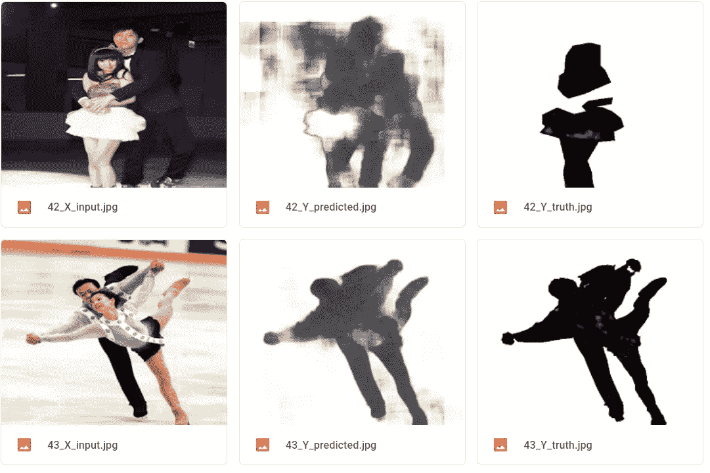

***结果 6.3:图片带紫色背景-***

**结果分析**:43 个纪元后，colab 再次崩溃。我们取得了以下成果。结果与黑色背景或白色背景的结果非常相似。

**笔记本:**[https://github . com/Dipeshpal/Image-Segmentation-with-Unet-using-tensor flow-Keras/blob/master/training _ purple _ background . ipynb](https://github.com/Dipeshpal/Image-Segmentation-with-Unet-using-Tensorflow-Keras/blob/master/training_purple_background.ipynb)

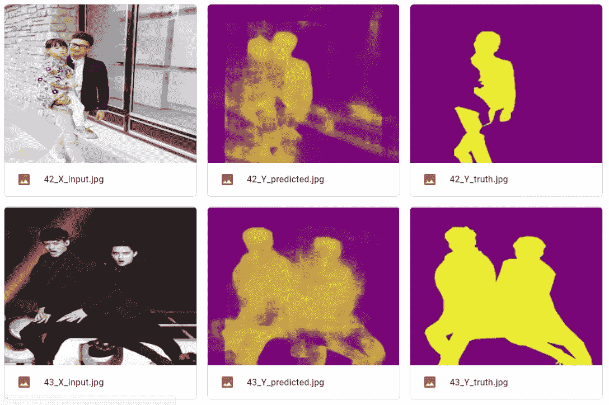

## 让我们来谈谈图像生成器、训练参数、回调、库和其他东西

代码解释了一切。我的 GitHub 上的其他内容。

以下**培训代码**对于所有笔记本都是相同的(对于我们已经创建的三个数据集)，唯一的变化是型号名称和目录。

***导入 OCHuman API-***

***其他进口-***

***阅读 JSON 注释(标签)-***

***参数和训练图像-***

***特性和标签-***

***列车，有效并测试拆分-***

***自定义 Keras 数据生成器-***

我们将在训练时调用使用该函数，它将给出(返回)所需的一批图像。

***可选，如果要打印" keras_generator_train_val_test "生成的图像-*-**

***型号-***

***训练时自定义回调生成中间输出-***

***获取模型并打印摘要-***

***让火车-***

## 让我们把它们放在一起-

上面代码的 GitHub 这里是[这里是](https://github.com/Dipeshpal/Image-Segmentation-with-Unet-using-Tensorflow-Keras/blob/master/training_black_background.ipynb)。我使用 Google Colab 进行培训，因此您可能需要根据自己的情况更改目录。顺便说一下，所有的代码(自定义数据集生成器和训练)也可以在这篇文章的“代码 GitHub”部分找到。

# 7.你可以尝试-

## 7.1.使用 Unet 进行迁移学习

你也可以在 Unet 上尝试迁移学习，是的，你没听错，你也可以使用迁移学习。还有一个预先训练好的 Unet 模型，如 vgg16 或 resnet50 等。迁移学习将有助于 Unet 的图像压缩块快速学习和学习更多。也许我会在其他文章中讨论这个问题。为此，您可能需要使用这个 [Github repo](https://github.com/divamgupta/image-segmentation-keras) (Keras Unet 预训练库)。

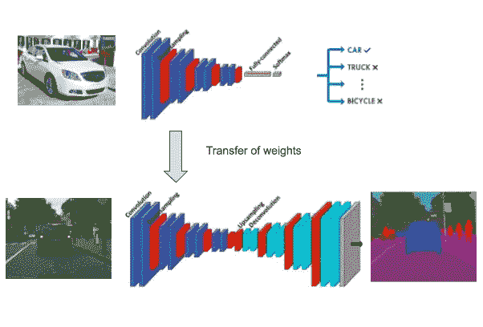

来源:[https://divamgupta . com/image-segmentation/2019/06/06/deep-learning-semantic-segmentation-keras . html](https://divamgupta.com/image-segmentation/2019/06/06/deep-learning-semantic-segmentation-keras.html)

## 7.2.尝试灰度图像

是的，您也可以尝试将灰度图像用作要素和标注。输入数据的维数将减少到(512，512，1)，因为灰度图像只有一个通道，而 RGB 图像有(512，512，3)个通道。所以，我的直觉是在色彩数据集(RGB)模型中可以学习一些色彩到色彩的映射。这可能是一个问题，所以你可以尝试灰度。但是请记住，在灰度图像中可能会出现相同的问题，因为输入要素和输入标注(掩膜)都是灰度，我不知道什么模型会学习，我没有尝试过。

## 7.3.一些其他架构或模型

有许多不同类型的模式可用，而不是使用 U-Net，你可以使用 R-CNN，FCN，VGG-16，ResNet 等。您也可以增加或减少 Unet 或这些其他模型中的可训练参数。在 Unet 中分别增加或减少压缩或扩展块。

## 7.4.使用 GAN(生成对抗网络)

是的，你可以用甘的。GAN 又是一个需要讨论的广泛领域，所以我不会说太多。你可以使用类似 GAN 系统的编码器-解码器来生成你想要模型生成的图像。记住 GANs 需要大量的计算能力，你可能需要高端的 GPU 或者让你的 Colab 运行几天或者几周，但是你不能。在你自己的系统中，你可以，但你家里可能没有**英伟达特斯拉 K80 GPU** 。

**7.5。你可以在这里评论或提及你所做的或创造的东西，这样其他人也可以了解新事物。**

# **7。代码(GitHub)**

您可以在本节中找到所有代码和有用的资源。你可以**随意使用我的代码**，如果你能提到**我的工作**的功劳，那将是可观的。

> ***你可以在我的网站上了解更多:***[***www.dipeshpal.com***](http://www.dipeshpal.com)
> 
> ***你可以了解我更多:***[***www . dipeshpal . I***](http://www.dipeshpal.in)***n***
> 
> ***你可以在 YouTube 上看我的科技视频:***[***https://www.youtube.com/DIPESHPAL17***](https://www.youtube.com/DIPESHPAL17)
> 
> ***Linkedin:***[***https://www.linkedin.com/in/dipesh-pal-a34952110/***](https://www.linkedin.com/in/dipesh-pal-a34952110/)
> 
> ***推特:***[***https://twitter.com/dipesh_pal17***](https://twitter.com/dipesh_pal17)
> 
> ***GitHub:***[***https://github.com/Dipeshpal***](https://github.com/Dipeshpal)

1.  **GitHub Code:**[https://GitHub . com/Dipeshpal/Image-Segmentation-with-Unet-using-tensor flow-Keras](https://github.com/Dipeshpal/Image-Segmentation-with-Unet-using-Tensorflow-Keras)(你可以使用这个模块在你的系统上运行，但我会推荐你使用 Google Colab)
2.  **资源-**

用 Unet 迁移学习:[https://divamgupta . com/image-segmentation/2019/06/06/deep-Learning-semantic-segmentation-keras . html](https://divamgupta.com/image-segmentation/2019/06/06/deep-learning-semantic-segmentation-keras.html)

使用 Unet 进行 GitHub 迁移学习:[https://github.com/divamgupta/image-segmentation-keras](https://github.com/divamgupta/image-segmentation-keras)

U-Net:用于生物医学图像分割的卷积网络:[https://arxiv.org/abs/1505.04597](https://arxiv.org/abs/1505.04597)

奥丘曼(被遮挡的人类)数据集 API:[https://github.com/liruilong940607/OCHumanApi](https://github.com/liruilong940607/OCHumanApi)

奥楚曼数据集:[https://cg.cs.tsinghua.edu.cn/dataset/form.html?dataset=ochuman](https://cg.cs.tsinghua.edu.cn/dataset/form.html?dataset=ochuman)

可可数据集:[http://cocodataset.org/#home](http://cocodataset.org/#home)

张量流:【http://tensorflow.org/ 

**对于任何学分，建议，改变，或任何事情，请在这里评论或联系我。**

> 非常感谢你的阅读，如果你觉得这有帮助，请分享。