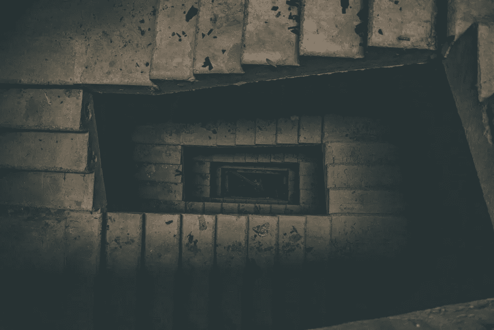
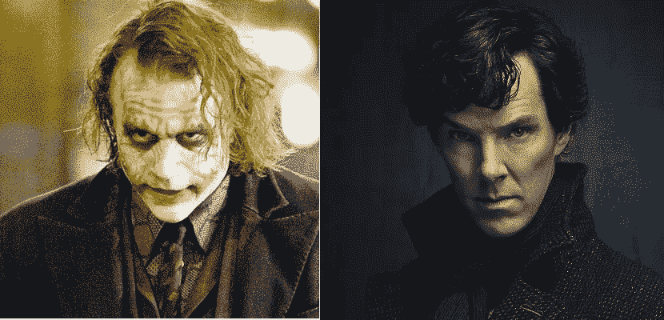
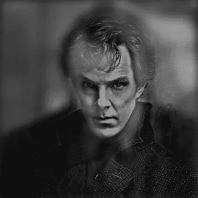

# 混合图像生成器——一种计算机视觉产品

> 原文：<https://medium.com/analytics-vidhya/hybrid-image-generator-a-computer-vision-product-4ea0f61a6972?source=collection_archive---------18----------------------->

当你排除了所有的不可能，无论剩下什么，无论多么不可思议，T2，都一定是真相？

# 感知二重性

当我还是个孩子的时候，我对某些人工制品的双重性质非常着迷，这些人工制品从远处看起来像是一件东西，而在近处看起来完全不同。我对它们荒诞的行为感到迷惑，我过去常常向我的家人和朋友讲述它们生动复杂的故事，只是为了寻求它们起源的解释和我自己创造它们的秘诀！

艺术家、设计师、摄影师和视觉科学家通常都在寻找方法，从一幅图像中创造出一种感觉，即除了眼睛看到的以外，还有更多东西要看。在本文中，我将讨论如何创建引人注目的混合图像，其中观察者在与这样的图像交互时会体验到不同的感知。

但是为什么我们现在需要这些图像呢？这些图像迫使我们看得更远，想象什么是必要的，就像夏洛克说的:“**当你排除了不可能，无论剩下什么，*无论多么不可能*，都一定是真相？**”。但就这样吗？当然还有更多！自从这些技术出现以来，组织已经逐渐向用于营销活动的数字多媒体平台发展。

# 技术特征渗透性

解决小丑的案子？这很简单，我亲爱的华生医生！只是从他的角度看世界

图像过滤技术允许图像相互叠加。基本思想是，当高频可用时，它往往会主导感知，但在远处，只能看到信号的低频部分。通过将一幅图像的高频部分与另一幅图像的低频部分混合，我们得到了一幅混合图像，在不同的距离上可以产生不同的解释。

下面，我简要描述了构建这样的映像应该遵循什么过程，并且还提供了一个到我的 [**Github repo**](https://github.com/pj263/Hybrid-Images) 的链接，从那里可以下载代码。

**步骤 1:** 计算 image-1 与 image-2(通常称为内核)的*互相关*，返回与输入图像尺寸相同的图像。

**步骤 2:** 确定图像-1 和图像-2 之间的 *2D 卷积*。2D 卷积可以被可视化为图像 1 和翻转图像 2 之间的互相关。

**步骤 3:** 为 image-2 构建一个*高斯模糊滤波器*，使其与 image-1 卷积产生一个高斯模糊图像。

**步骤 4:** 创建一个*低通滤波器*，抑制给定图像的高频成分。

**第五步:**创建一个*高通滤波器*，抑制给定图像的低频成分。

**步骤 6:** 建立一个*积分函数*，该函数将两幅图像相加，以根据用户定义的参数创建所需的混合图像。

小丑在远处，夏洛克在近处！

类似于左图所示的混合图像是一个图像的低通滤波版本和第二个图像的高通滤波版本的总和。夏洛克成功地进入了小丑的大脑。你说对了，华生医生！

可以为每个图像对调整自由参数(可以通过运行 **gui.py** 文件来访问)。这些调谐参数控制混合图像的特性。

# 价值创造同步性

构建混合映像很容易，难的是推销这样一种理念，即它可以被组织用来增强他们的核心价值主张。提议的技术要回答的最明显的问题是“ ***”我们如何优化广告牌的使用以实现高效广告？*** ”。这使得广告公司成为我们的目标客户。我们谈生意吧，宝贝！

**价值主张:**如果用于广告牌广告，这将是一项设计改进、前期投资最少、最终用户参与度更高的新技术。旅行者将在同一个广告牌上看到更多的信息，广告公司将通过减少在高速公路上竖立广告牌的数量来节省资金。

**主要活动及资源:**设置电脑机器制作混合图像广告海报，并与真实目标受众进行测试。

**客户关系和渠道:**广告代理商可以根据他们希望叠加的图像的海报大小和复杂程度来收费。从好的方面来看，这种模式将是直接面向消费者的。

主要合作伙伴:主要供应商可能是数字媒体机构，如 *Shutterstock* 他们是构建数字图像的专家。一个原因是要叠加的图像应该是高质量的，否则，就像他们说的，垃圾进——垃圾出，你看！

客户群:营销和广告机构将直接受益于这些图片。间接受益者可能是广告牌信息的消费者(旅行者和其他 9-5 岁的穷人！)谁将获得同一广告海报上的更多信息。耶！耶！他们离广告牌的距离将只是一个视觉错觉！

**成本结构和收入来源:**成本的主要差异在于构建/采购高分辨率数字图像，这些图像将被进一步处理以生成混合图像。但是嘿！税收是独裁者！混合图像增加了最终用户的参与度，这将导致广告公司更强的营销，这将导致每个广告牌更好的回报，这意味着更多的美元美元。

*如果你最终将这项技术用于你的广告牌广告，那么请记得与我分享你的利润***！**