# 海得拉巴 AQI 预测项目从无到有

> 原文：<https://medium.com/analytics-vidhya/hyderabad-aqi-prediction-project-from-scratch-to-deployment-63f64106745b?source=collection_archive---------5----------------------->

空气质量指数预测

目录:

㈠导言

㈡项目的动机

㈢数据收集

㈣数据预处理

㈤特征的重要性

㈥模型制作

㈦使用 streamlit 进行部署

㈧结论

㈨参考资料

# **(一)简介**

空气是许多气体和尘埃粒子的混合物。它是生物赖以生存和呼吸的透明气体。空气是由大约 78%的氮气、21%的氧气、0.9%的氩气、0.04%的二氧化碳和非常少量的其他气体组成的混合物。

**空气质量**用**空气质量** **指数(PM 2.5)** 来衡量

PM 2.5 是一种细小的颗粒物质，是一种空气污染物，当空气中的 PM 2.5 含量很高时，人们的健康就会受到影响。

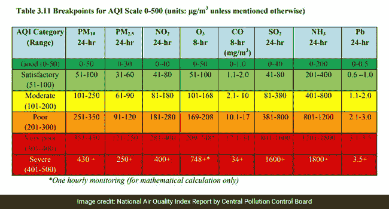

# **(二)项目动机:**

由于 COVID，世界上没有交通工具，因为空气非常新鲜。我目前住在海德拉巴，这是印度污染最严重的城市，但最近这里的空气也很清新，我在想，现在的空气是多么清新，去年的空气质量如何？去年的空气质量如何？从这个想法出发，这个项目诞生了。

# **(三)数据收集:**

我使用请求模块从 2013 年到 2018 年从[https://en.tutiempo.net/climate/ws-431280.html](https://en.tutiempo.net/climate/ws-431280.html)收集数据

我创建了一个函数来收集 HTML 格式的网站数据

```
import os 
import time
import sys
import requestsdef data_collection():
 for year in range(2013,2019): # for loop for year range
 for month in range(1,13): # for loop for month range
 if (month<10):
 # Condition for if month number below 10
 url=’[https://en.tutiempo.net/climate/0{}-{}/ws-431280.html'.format(month,year)](https://en.tutiempo.net/climate/0{}-{}/ws-431280.html'.format(month,year)) 
 else:
 # Condition for 10 to 12 months
 url=’[https://en.tutiempo.net/climate/{}-{}/ws-431280.html'.format(month,year)](https://en.tutiempo.net/climate/{}-{}/ws-431280.html'.format(month,year))

 collected_texts=requests.get(url) # using requests we get the html data into collected_texts variable
 collected_text_utf=collected_texts.text.encode(‘utf=8’) # our html contains so many data types so we use utf8 encoding

 # after getting data we need to store the data in a directory so for that we create Html_data directory with year directory
 if not os.path.exists(“Data_collection/Html_data/{}”.format(year)):
 os.makedirs(“Data_collection/Html_data/{}”.format(year))

 # To store that we need to open the directory
 with open (“Data_collection/Html_data/{}/{}.html”.format(year,month),’wb’) as Result:
 Result.write(collected_text_utf)

 sys.stdout.flush()if __name__==”__main__”:
 start_time=time.time()
 data_collection() # function calling 
 stop_time=time.time()
 print(‘Time Taken {}’.format(stop_time-start_time)) # Time taken to store the data
```

执行上述功能，我收集了 2013 年至 2018 年 HTML 格式的数据


执行上述函数会在该目录中创建目录 Html_data，我们将 2013 年至 2018 年的每年数据放在单独的文件夹中

在 Html 数据中，我们有 T =平均温度(°C)，TM =最高温度(°C)，Tm ==最低温度(°C)，SLP =海平面气压(hPa)，H =平均相对湿度(%)，VV =平均能见度(Km)，V =平均风速(Km/h)，VM =最大持续风速(Km/h)。

我们还需要 PM 2.5 值，PM 2.5 值是从 2013 年到 2018 年的付费 API 中收集的

如果你想要 PM 2.5 数据，请访问下面的 GitHub 链接

[https://github . com/jani-excel gy/Complete _ Data _ Science _ Life _ Cycle _ Projects/tree/master/Data _ collection](https://github.com/jani-excergy/Complete_Data_Science_Life_Cycle_Projects/tree/master/Data_collection)

PM 2.5 (AQI)是一个依赖特性

t，TM，Tm，SLP，H，VV。VM、V 是独立的特征

我们的从属特征属于实值，所以现在我们需要解决回归问题

我们有每小时的 PM 2.5 值，所以首先，我们需要将小时值转换为一天值

```
import pandas as pd
import numpy as np
import matplotlib.pyplot as plt
import seaborn as snsdef Day_values_2013():
 temp_i=0
 average=[]
 for rows in pd.read_csv(r’C:\Users\Unify\Desktop\janibasha\Complete Data Science life cycle\Data_collection\AQI\aqi2013.csv’,chunksize=24):
 add_var=0
 avg=0.0
 data=[]
 df=pd.DataFrame(data=rows)
 for index,row in df.iterrows():
 data.append(row[‘PM2.5’])
 for i in data:
 if type(i) is float or type(i) is int:
 add_var=add_var+i
 elif type(i) is str:
 if i!=’NoData’ and i!=’PwrFail’ and i!=’ — -’ and i!=’InVld’:
 temp=float(i)
 add_var=add_var+temp
 avg=add_var/24
 temp_i=temp_i+1

 average.append(avg)
 return averagedef Day_values_2014():
 temp_i=0
 average=[]
 for rows in pd.read_csv(r’C:\Users\Unify\Desktop\janibasha\Complete Data Science life cycle\Data_collection\AQI\aqi2014.csv’,chunksize=24):
 add_var=0
 avg=0.0
 data=[]
 df=pd.DataFrame(data=rows)
 for index,row in df.iterrows():
 data.append(row[‘PM2.5’])
 for i in data:
 if type(i) is float or type(i) is int:
 add_var=add_var+i
 elif type(i) is str:
 if i!=’NoData’ and i!=’PwrFail’ and i!=’ — -’ and i!=’InVld’:
 temp=float(i)
 add_var=add_var+temp
 avg=add_var/24
 temp_i=temp_i+1

 average.append(avg)
 return averagedef Day_values_2015():
 temp_i=0
 average=[]
 for rows in pd.read_csv(r’C:\Users\Unify\Desktop\janibasha\Complete Data Science life cycle\Data_collection\AQI\aqi2015.csv’,chunksize=24):
 add_var=0
 avg=0.0
 data=[]
 df=pd.DataFrame(data=rows)
 for index,row in df.iterrows():
 data.append(row[‘PM2.5’])
 for i in data:
 if type(i) is float or type(i) is int:
 add_var=add_var+i
 elif type(i) is str:
 if i!=’NoData’ and i!=’PwrFail’ and i!=’ — -’ and i!=’InVld’:
 temp=float(i)
 add_var=add_var+temp
 avg=add_var/24
 temp_i=temp_i+1

 average.append(avg)
 return averagedef Day_values_2016():
 temp_i=0
 average=[]
 for rows in pd.read_csv(r’C:\Users\Unify\Desktop\janibasha\Complete Data Science life cycle\Data_collection\AQI\aqi2016.csv’,chunksize=24):
 add_var=0
 avg=0.0
 data=[]
 df=pd.DataFrame(data=rows)
 for index,row in df.iterrows():
 data.append(row[‘PM2.5’])
 for i in data:
 if type(i) is float or type(i) is int:
 add_var=add_var+i
 elif type(i) is str:
 if i!=’NoData’ and i!=’PwrFail’ and i!=’ — -’ and i!=’InVld’:
 temp=float(i)
 add_var=add_var+temp
 avg=add_var/24
 temp_i=temp_i+1

 average.append(avg)
 return averagedef Day_values_2017():
 temp_i=0
 average=[]
 for rows in pd.read_csv(r’C:\Users\Unify\Desktop\janibasha\Complete Data Science life cycle\Data_collection\AQI\aqi2017.csv’,chunksize=24):
 add_var=0
 avg=0.0
 data=[]
 df=pd.DataFrame(data=rows)
 for index,row in df.iterrows():
 data.append(row[‘PM2.5’])
 for i in data:
 if type(i) is float or type(i) is int:
 add_var=add_var+i
 elif type(i) is str:
 if i!=’NoData’ and i!=’PwrFail’ and i!=’ — -’ and i!=’InVld’:
 temp=float(i)
 add_var=add_var+temp
 avg=add_var/24
 temp_i=temp_i+1

 average.append(avg)
 return averagedef Day_values_2018():
 temp_i=0
 average=[]
 for rows in pd.read_csv(r’C:\Users\Unify\Desktop\janibasha\Complete Data Science life cycle\Data_collection\AQI\aqi2018.csv’,chunksize=24):
 add_var=0
 avg=0.0
 data=[]
 df=pd.DataFrame(data=rows)
 for index,row in df.iterrows():
 data.append(row[‘PM2.5’])
 for i in data:
 if type(i) is float or type(i) is int:
 add_var=add_var+i
 elif type(i) is str:
 if i!=’NoData’ and i!=’PwrFail’ and i!=’ — -’ and i!=’InVld’:
 temp=float(i)
 add_var=add_var+temp
 avg=add_var/24
 temp_i=temp_i+1

 average.append(avg)
 return averageif __name__==”__main__”:
 lst2013=Day_values_2013()
 lst2014=Day_values_2014()
 lst2015=Day_values_2015()
 lst2016=Day_values_2016()
 lst2017=Day_values_2017()
 lst2018=Day_values_2018()
 plt.plot(range(0,365),lst2013,label=”2013 data”)
 plt.plot(range(0,364),lst2014,label=”2014 data”)
 plt.plot(range(0,365),lst2015,label=”2015 data”)
 plt.plot(range(0,365),lst2016,label=”2016 data”)
 plt.xlabel(‘Day’)
 plt.ylabel(‘PM 2.5’)
 plt.legend(loc=’upper right’)
 plt.show()
```

执行上述函数，我们得到每年每天的 PM 2.5 值

我们得到一个从属特征

现在我们需要从 Html 中提取独立的特征，为此我使用 Beautifulsoup 将 Html 数据解析成一个 CSV 文件

将独立特性收集到 CSV 中后，我们需要将相关特性 PM 2.5 添加到该 CSV 文件中

```
import pandas as pd
import numpy as np
import matplotlib.pyplot as plt
import requests
from Hours_to_Day import Day_values_2013,Day_values_2014,Day_values_2015,Day_values_2016,Day_values_2017,Day_values_2018
import sys
from bs4 import BeautifulSoup
import os
import csvdef html_scraping(month,year):

 # To scrap the data we need to give the path of flies
 file_path=open(‘Data_collection/Html_data/{}/{}.html’.format(year,month),’rb’)

 #After scraping the data we need to store it in a variable

 Scaraped_data=file_path.read()

 # Now I create two empty lists for future purpose

 Sample_data=[]
 Finale_data=[]# Now I intialise the beautifulsoup class beautifulsoup(Scrapedtext,filetype)

 soup=BeautifulSoup(Scaraped_data,”lxml”)

 # We need the table data from html so we loop through the table tag and it’s class from scraped html data

 for table in soup.findAll(‘table’,{‘class’:’medias mensuales numspan’}):

 # In table data we need body of the table to find the features so we loop through the table body

 for tbody in table:

 # In table body we need the rows to get features data so we loop through the table rows

 for tr in tbody:

 # Now we extract the row data 

 Extract_data=tr.get_text()

 # Now we append the row data into Sample_data list

 Sample_data.append(Extract_data)

 # If we manually check in the html we have 15 features so to check the if we are getting 15 features or not
 # No of row

 No_rows=len(Sample_data)/15

 # Now to get the feature values first we need to go through the rows so we loop through the rows
 for iterate in range(round(No_rows)):

 # Creating empty list store feature values of each rows

 lst=[]

 # we loop through the feature to get each value 

 for i in range(15):
 # we add the each row data in to empty lst

 lst.append(Sample_data[0])

 #Now we remove data from Sample_data

 Sample_data.pop(0)

 # Now we we add the each row values of 15 features in Finale list 

 Finale_data.append(lst)Length_Finale_data=len(Finale_data)

 Finale_data.pop(Length_Finale_data-1)
 Finale_data.pop(0)

 # Now we remove the empty features from table beacause this features doesn’t contain any value

 for feature in range(len(Finale_data)):
 Finale_data[feature].pop(6)
 Finale_data[feature].pop(13)
 Finale_data[feature].pop(12)
 Finale_data[feature].pop(11)
 Finale_data[feature].pop(10)
 Finale_data[feature].pop(9)
 Finale_data[feature].pop(0)

 return Finale_data# Once scrapiing the html table data
# html table features are independet variables
# Hours_to_Day PM2.5 feature is dependent features
# we need to combine both independent features and dependent features in csv file
# for that we write a datadef combine_dependent_independent(year, cs):
 for i in pd.read_csv(‘Data_collection/Html_scraping_data/real_’ + str(year) + ‘.csv’, chunksize=cs):
 df = pd.DataFrame(data=i)
 mylist = df.values.tolist()
 return mylistif __name__==”__main__”:

 # We need to create a directory to store the csv files 
 if not os.path.exists(“Data_collection/Html_scraping_data”):
 os.makedirs(“Data_collection/Html_scraping_data”)

 # After creating directory we need to write the csv file 
 # we need years from 2013 t0 2018 so for that we create loop for year
 for year in range(2013,2019):
 final_data=[]
 with open (“Data_collection/Html_scraping_data/real_”+str(year)+”.csv”,’w’) as csvfile:
 writting_csv=csv.writer(csvfile, dialect=’excel’)
 writting_csv.writerow([‘T’,’TM’,’Tm’,’SLP’,’H’,’VV’,’V’,’VM’,’PM2.5'])

 # To add the data to the csv files we call the html_scraping function 
 for month in range(1,13):
 temp=html_scraping(month, year)
 final_data=final_data+temp

 # To get PM2.5 avg values we need to call the corresponding function 
 # For the we dinamically write it with getattr

 dependent=getattr(sys.modules[__name__], ‘Day_values_{}’.format(year))()

 # To add the dependent feature PM2.5 to the independent features 
 for i in range(len(final_data)-1):
 final_data[i].insert(8,dependent[i])

 with open(‘Data_collection/Html_scraping_data/real_’ + str(year) + ‘.csv’, ‘a’) as csvfile:
 wr = csv.writer(csvfile, dialect=’excel’)
 for row in final_data:
 flag = 0
 for elem in row:
 if elem == “” or elem == “-”:
 flag = 1
 if flag != 1:
 wr.writerow(row)

 # We call the combine_dependent_independent function to combine the both 
 data_2013 = combine_dependent_independent(2013, 600)
 data_2014 = combine_dependent_independent(2014, 600)
 data_2015 = combine_dependent_independent(2015, 600)
 data_2016 = combine_dependent_independent(2016, 600)
 data_2017 = combine_dependent_independent(2017, 600)
 data_2018 = combine_dependent_independent(2018, 600)

 # combining the all years data into single csv
 total=data_2013+data_2014+data_2015+data_2016+data_2017+data_2018

 with open(‘Data_collection/Html_scraping_data/Real_Combine.csv’, ‘w’) as csvfile:
 wr = csv.writer(csvfile, dialect=’excel’)
 wr.writerow(
 [‘T’, ‘TM’, ‘Tm’, ‘SLP’, ‘H’, ‘VV’, ‘V’, ‘VM’, ‘PM 2.5’])
 wr.writerows(total)

df=pd.read_csv(‘Data/Real-Data/Real_Combine.csv’)
```

在将 PM 2.5 值删除并附加到 CSV 之后，我们得到了每个单独年份的 CSV 文件

我们将所有年份的数据合并到一个 CSV 中

现在，我们终于得到了 Real_combine.csv 文件

我们使用这些数据建立 ML 应用程序来预测未来 AQI

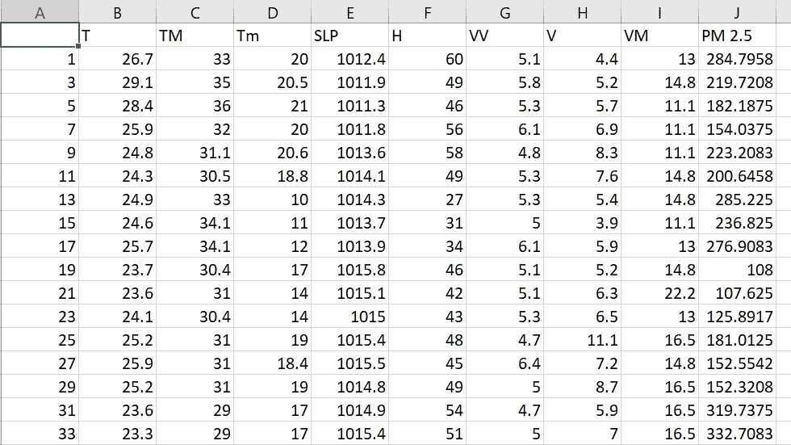

Real_combine.csv 示例数据

# **(四)数据预处理:**

```
import pandas as pd
import numpy as np
import matplotlib.pyplot as plt
import seaborn as sns# Reading csv filecombine_data= pd.read_csv(r'C:\Users\Desktop\janibasha\Complete Data Science life cycle\Data_collection\Html_scraping_data\Real_combine.csv') # checking no of numerical features
combine_data.info()# To get statistical information
combine_data.describe()# Now we need check null values
combine_data.isnull()
combine_data.isnull().sum()# we also visualize null with seabornsns.heatmap(combine_data.isnull(),yticklabels=False)
```

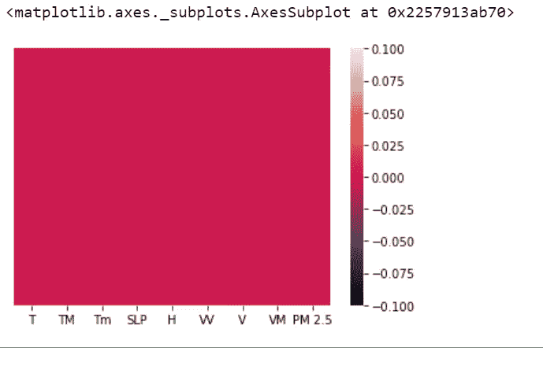

可视化数据框中的空值

通过可视化，我们了解到数据框中没有任何空值。

我们有所有的数字特征，没有分类特征，所以不需要编码

```
# checking outliers combine_data.boxplot(column=’Tm’)
plt.show()
```

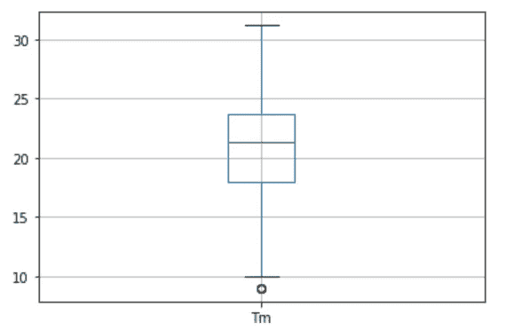

异常值检查

类似地，我们可以检查每个特性的异常值

```
# Multivariate anlaysissns.pairplot(combine_data)
```

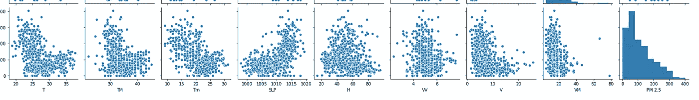

相关(y 轴)与独立(x 轴)特征之间的多元分析

如果我们观察上面的分析，在独立和从属特征之间没有线性关系，所以线性算法不会给出好的结果

```
# We also check the corelation between dependent and independent featurecombine_data.corr()
relation =combine_data.corr()
relation_index=relation.indexsns.heatmap(combine_data[relation_index].corr(),annot=True)
```

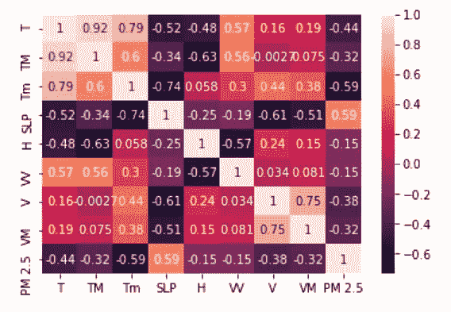

相关热图

从上面的热图中，我们了解了非独立要素(PM 2.5)和独立要素(T、Tm、TM、SLP、H、VV、V、VM)之间的关系

# **(五)特征重要性:**

我们有 8 个独立的特征，我们不知道哪个特征对预测 PM 2.5 值重要。

为了知道特征的重要性，我们使用 ExtraTreesRegressor(基于模型的特征选择)

```
from sklearn.ensemble import ExtraTreesRegressor
from sklearn.model_selection import train_test_split
from sklearn.metrics import accuracy_score as accreg= ExtraTreesRegressor()reg.fit(X_train,y_train)reg.feature_importances_feat_importances = pd.Series(reg.feature_importances_, index=X_train.columns)
feat_importances.nlargest(5).plot(kind='barh')
plt.show()
```

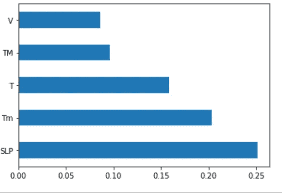

预测 PM 2.5 的五大特征(基于模型的特征选择)

# **(六)模型建筑:**

我们只有 8 个功能，所以对于模型的建立，我考虑所有的功能，并检查不同模型的性能

在部署时，我们针对前 5 大功能训练模型，并将其部署在任何云平台上

①KNN 回归量:

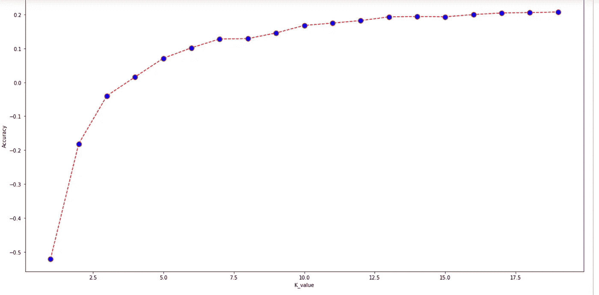

超参数调谐(K)

在 k=17 之后，有一个稳定的条件，所以我们取 K=17

```
# weighted knnweighted_tuned_reg = KNeighborsRegressor(n_neighbors=17,weights='distance')weighted_tuned_reg.fit(X_train,y_train)weighted_tuned_reg.score(X_train,y_train)
1.0# performance of model on test dataset
weighted_tuned_reg.score(X_test,y_test)
0.5238963653617966# cross validation 
from sklearn.model_selection import cross_val_score
score=cross_val_score(weighted_tuned_reg,X,y,cv=5) # cross validation perfomance
score.mean()
0.43669012578295# Model evalutation
prediction=weighted_tuned_reg.predict(X_test)# Comparing predicted PM2.5 and labeld PM 2.5
plt.scatter(y_test,prediction)print('MSE:', metrics.mean_squared_error(y_test, prediction))
MSE: 3247.1281849543693
```

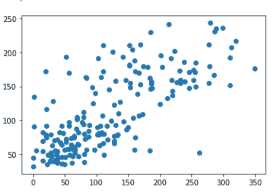

y 测试和 y 预测之间的散点图

(2)线性、套索和岭回归量:

线性回归器

```
from sklearn.model_selection import train_test_split
X_train, X_test, y_train, y_test = train_test_split(combine_data.iloc[:,:-1], combine_data.iloc[:,-1], test_size=0.3, random_state=0)from sklearn.linear_model import LinearRegression# creating linear regression modelreg_model=LinearRegression(normalize=True)# fit independent varaibles to the dependent variables
reg_model.fit(X_train,y_train)reg_model.score(X_train,y_train)
0.40996129270540077reg_model.score(X_test,y_test)
0.3894144479464322# for slopereg_model.coef_array([-8.71256785, -0.78565823, -0.64082652,  2.64932719, -1.44568242,0.27712587, -1.83610819, -1.01908448])# for interceptreg_model.intercept_
-2180.4321527938205# cross validationfrom sklearn.model_selection import cross_val_score
score=cross_val_score(reg_model,combine_data.iloc[:,:-1],combine_data.iloc[:,-1],cv=5)score.mean()
0.3229764710803792prediction=reg_model.predict(X_test)# checking predicted y and labeled y
plt.scatter(y_test,prediction)print('MSE:', metrics.mean_squared_error(y_test, prediction))
MSE: 4164.32350260401
```

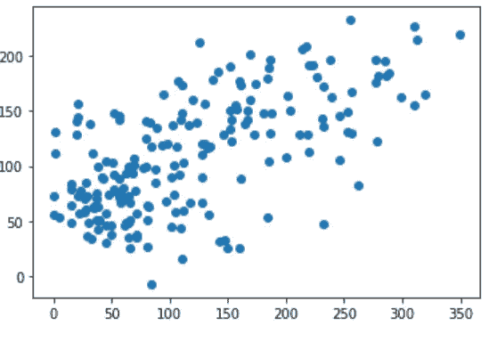

y_test 和 y_prediction 之间的离差

岭回归量

```
# Randomsearch cvfrom sklearn.model_selection import RandomizedSearchCVfrom scipy.stats import randint
parameters={'alpha':randint(1e-8,100)}ridge_reg_1=RandomizedSearchCV(reg_model_1,parameters,scoring='neg_mean_squared_error',cv=5)
ridge_reg_1.fit(combine_data.iloc[:,:-1],combine_data.iloc[:,-1])ridge_reg_1.best_score_
-4265.905962013921ridge_reg_1.best_params_
{'alpha': 75}prediction=ridge_reg_1.predict(X_test)plt.scatter(y_test,prediction)print('MSE:', metrics.mean_squared_error(y_test, prediction))MSE: 3912.4550098306554 
```

套索回归器

```
from sklearn.linear_model import Lasso
from sklearn.model_selection import GridSearchCV# Intializing the model 
reg_model_2=Lasso()# hyper parameter range 
hyperparameters_range={'alpha':[1e-15,1e-10,1e-8,1e-3,1e-2,1,5,10,20,30,35,40,45,50,55,60,65,70,75,80,85,90,95,100]}# Searching best hyper parameterlasso_reg=GridSearchCV(reg_model_2,hyperparameters_range,scoring='neg_mean_squared_error',cv=5)lasso_reg.fit(combine_data.iloc[:,:-1],combine_data.iloc[:,-1])lasso_reg.best_params_
{'alpha': 5}lasso_reg.best_score_
-4249.911163771522prediction = lasso_reg.predict(X_test)plt.scatter(y_test,prediction)print('MSE:', metrics.mean_squared_error(y_test, prediction))
MSE: 3922.586481270448
```

(3)决策树回归器:

```
from sklearn.tree import DecisionTreeRegressor# creating Decision tree regression modelreg_decision_model=DecisionTreeRegressor()# Hyper parameters range intialization for tuningparameters={"splitter":["best","random"],
            "max_depth" : [1,3,5,7,9,11,12],
           "min_samples_leaf":[1,2,3,4,5,6,7,8,9,10],
           "min_weight_fraction_leaf":[0.1,0.2,0.3,0.4,0.5,0.6,0.7,0.8,0.9],
           "max_features":["auto","log2","sqrt",None],
           "max_leaf_nodes":[None,10,20,30,40,50,60,70,80,90] }# calculating different regression metricsfrom sklearn.model_selection import GridSearchCVtuning_model=GridSearchCV(reg_decision_model,param_grid=parameters,scoring='neg_mean_squared_error',n_jobs=-1,cv=10,verbose=3)# function for calculating how much time take for hyperparameter tuningdef timer(start_time=None):
    if not start_time:
        start_time=datetime.now()
        return start_time
    elif start_time:
        thour,temp_sec=divmod((datetime.now()-start_time).total_seconds(),3600)
        tmin,tsec=divmod(temp_sec,60)
        print(thour,":",tmin,':',round(tsec,2))X=combine_data.iloc[:,:-1]y=combine_data.iloc[:,-1]from datetime import datetimestart_time=timer(None)tuning_model.fit(X,y)timer(start_time)tuning_model.best_params_{'max_depth': 9,
 'max_features': None,
 'max_leaf_nodes': 20,
 'min_samples_leaf': 8,
 'min_weight_fraction_leaf': 0.1,
 'splitter': 'random'}tuning_model.best_score_
-3621.0007087939457# Model Evaluationprediction=tuning_model.predict(X_test)print('MSE:', metrics.mean_squared_error(y_test, prediction))MSE: 4589.011220616968
```

(4)随机森林回归量

```
# Hyperparameter tuning with RandomizedSearchCVfrom sklearn.model_selection import RandomizedSearchCV# Hyparameter rangesfrom scipy.stats import randintparameters = {'n_estimators': randint(100,1200),
               'max_features': ['auto','sqrt'],
               'max_depth': randint(5,40),
               'min_samples_split': randint(2,30),
               'min_samples_leaf': randint(1,10)  }# Model for tuningbase_learner=RandomForestRegressor()# Tuningtuned_model= RandomizedSearchCV(estimator = base_learner, param_distributions = parameters,scoring='neg_mean_squared_error', n_iter = 100, cv = 5, verbose=2, random_state=42, n_jobs =-1)tuned_model.fit(X_train,y_train)tuned_model.best_params_{'max_depth': 5,
 'max_features': 'sqrt',
 'min_samples_leaf': 1,
 'min_samples_split': 16,
 'n_estimators': 901}tuned_model.best_score_
-3425.3665578465598# Predicting X_test values using tuned_model
prediction=tuned_model.predict(X_test)plt.scatter(y_test,prediction)print('MSE:', metrics.mean_squared_error(y_test, prediction))
MSE: 3308.584324808751
```

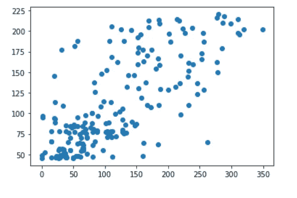

y 测试和 y 预测之间的散点图

(5) Xgboost 回归量:

```
import xgboost as xgb# Hyperparameter tuning with RandomizedSearchCVfrom sklearn.model_selection import RandomizedSearchCV# Hyparameter rangesfrom scipy.stats import randintparameters = {'n_estimators': randint(100,1200),
               'learning_rate': [0.001,0.002,0.003,0.005,0.01,0.04,0.05,0.1,0.2,0.3,0.4,0.5,0.6],
               'max_depth': randint(5,40),
               'subsample': [0.5,0.6,0.7,0.8],
               'min_child_weight': randint(1,10)  }# Model for tuningbase_learner=xgb.XGBRegressor()# Tuningtuned_model= RandomizedSearchCV(estimator = base_learner, param_distributions = parameters,scoring='neg_mean_squared_error', n_iter = 100, cv = 5, verbose=2, random_state=42, n_jobs =-1)tuned_model.fit(X_train,y_train)tuned_model.best_params_{'learning_rate': 0.005,
 'max_depth': 5,
 'min_child_weight': 8,
 'n_estimators': 611,
 'subsample': 0.6}tuned_model.best_score_
-3656.933662545248# Predicting X_test values using tuned_model
prediction=tuned_model.predict(X_test)print('MSE:', metrics.mean_squared_error(y_test, prediction))
MSE: 3458.1210809592762
```

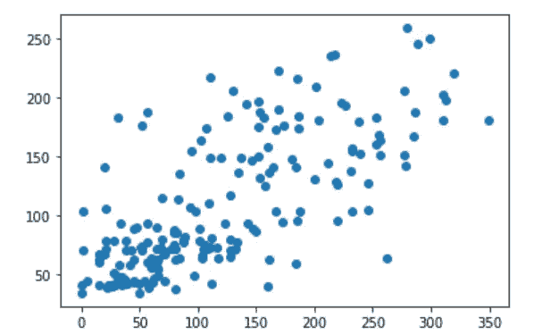

y 测试和 y 预测之间的散点图

# **(七)部署:**

比较所有模型的 MSE

KNN:18960 . 686868868686

线性回归:18960 . 688688868617

岭回归:19960.686868686616

套索回归:18960.688686868617

决策树回归器:18960.888688888617

随机森林回归量:18860.688686888617

Xgboost 回归方程:58360.88868888861

与 KNN 相比，随机森林是一个一般化的模型，因此我使用 streamlit 部署了具有前 5 大功能的随机森林回归器

前 5 个特征的随机森林回归

```
# Taking top 5 features for depolyment 
# top 5 features taken from the extratree regressorX_train, X_test, y_train, y_test = train_test_split(combine_data.iloc[:,[0,1,2,3,6]], combine_data.iloc[:,-1], test_size=0.3, random_state=0)# intializing modelrandom_forest_reg1=RandomForestRegressor(n_estimators=901, max_depth=5, min_samples_split=16, min_samples_leaf=1, max_features='sqrt', n_jobs=-1)# fitting modelrandom_forest_reg1.fit(X_train,y_train)random_forest_reg1.score(X_train,y_train)
0.650728501356922random_forest_reg1.score(X_test,y_test)
0.5218627277628385prediction=random_forest_reg1.predict(X_test)print('MSE:', metrics.mean_squared_error(y_test, prediction))
MSE: 3260.998026487038 
```

将模型倒入泡菜中

```
import pickle
pickle_out = open(“Random_forest_regressor.pkl”,”wb”)
pickle.dump(random_forest_reg1, pickle_out)
pickle_out.close()
```

简化框架

```
import pickle
import streamlit as stpickle_in = open(“Random_forest_regressor.pkl”,”rb”)
random_forest_regressor=pickle.load(pickle_in)def welcome():
 return “ welcome all”def predict_AQI(Average_Temperature,Maximum_Temperature,Minimum_Temperature,Atm_pressure_at_sea_level,Average_wind_speed):

 prediction=random_forest_regressor.predict([[ Average_Temperature,Maximum_Temperature,Minimum_Temperature, Atm_pressure_at_sea_level,Average_wind_speed]])
 print(prediction)
 return predictiondef main():
 st.title(“Hyderabad AQI prediction”)
 html_temp = “””
 <div style=”background-color:green;padding:20px”>
 <h2 style=”color:white;text-align:center;”>AQI prediction ML App </h2>
 </div>
 “””
 st.markdown(html_temp,unsafe_allow_html=True)
 Average_Temperature= st.text_input(“Average_Temperature “,”Type Here”)
 Maximum_Temperature = st.text_input(“Maximum_Temperature “,”Type Here”)
 Minimum_Temperature = st.text_input(“Minimum_Temperature “,”Type Here”)
 Atm_pressure_at_sea_level = st.text_input(“Atm_pressure_at_sea_level “,”Type Here”)
 Average_wind_speed = st.text_input(“Average_wind_speed “,”Type Here”)
 result=””
 if st.button(“Predict”):
 result=predict_AQI(Average_Temperature,Maximum_Temperature,Minimum_Temperature,Atm_pressure_at_sea_level,Average_wind_speed)
 st.success(‘The output is {}’.format(result))
 if st.button(“About”):
 st.text(“Lets LEarn”)
 st.text(“Built with Streamlit”)if __name__==’__main__’:
 main()
```

使用上述 streamlit 框架，我们可以将我们的模型部署到任何云平台中

# **(八)结论:**

感谢你对博客的兴趣。如果你有任何想法，请留下评论、反馈和建议

github:[https://github . com/jani-excel gy/Complete _ Data _ Science _ Life _ Cycle _ Projects](https://github.com/jani-excergy/Complete_Data_Science_Life_Cycle_Projects)

# ㈨参考资料:

维基百科:【https://simple.wikipedia.org/wiki/Air 

克里斯·纳伊克 youtube 频道