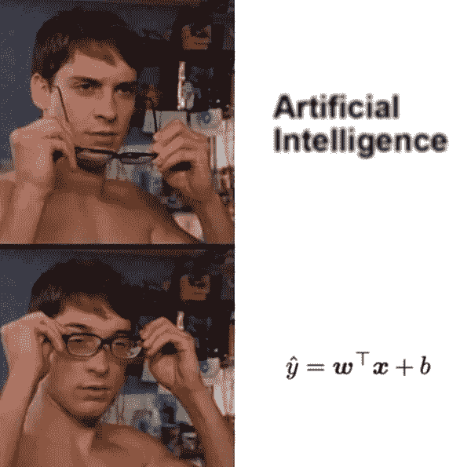
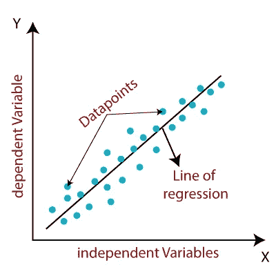
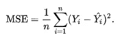
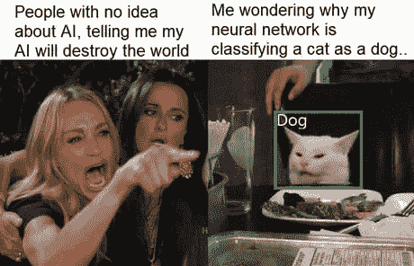

# 围绕机器学习大肆宣传

> 原文：<https://medium.com/analytics-vidhya/hype-around-machine-learning-1a80283d7655?source=collection_archive---------17----------------------->

在这篇文章中，我们将看到什么是关于机器学习的炒作和神话，机器学习到底是如何工作的，机器学习的局限性，以及接下来什么优于机器学习。

除了机器学习，其他领域的大多数人认为机器学习将取代人类，一切都将自动化，**不是这样的。**

机器学习和传统编程的区别在于，在传统编程中我们给出输入和规则(例如:1+2，其中 1 和 2 是输入+是规则)，而在机器学习中我们给出输入和输出，让它根据输入和输出之间的关系找到规则。所有机器学习算法的核心概念都来源于统计学和数学。

为了了解更多关于 ML(机器学习)的知识，我将采用最简单的 ML 算法，即**线性回归**，我们将看看它是如何工作的。线性回归的数学方程是 **Y= mx + c，**其中 Y 是基于给定的 **x** 值进行预测的值。c 是直线的截距，m 是直线的斜率。在机器学习术语中，m 和 c 被称为参数。

在我们上学的时候，我们已经学习了直线方程，同样的概念也适用于这里，只是做了一些修改。线性回归算法首先从随机线开始拟合数据点。拟合直线后，它通过使用损失函数(如均方误差(MSE ))来计算拟合直线和数据点之间的误差。

目的是减少误差，使参数 m 和 c 与数据点最佳拟合。为了减小误差，我们使用一种称为梯度下降的概念，它通过计算 m 和 c 相对于误差的导数来找到 m 和 c 的最佳参数。整个过程进行多次，直到误差达到最小。

然后，我们使用 R2 和调整后的 R2 等数学函数对训练好的模型进行评估。要了解更多线性回归背后的数学概念，请点击此 [**链接**](https://towardsdatascience.com/introduction-to-machine-learning-algorithms-linear-regression-14c4e325882a) **。**

从上面的 ML 算法我们可以明白，机器学习到底发生了什么。所以现在还不可能制造出接管人类的致命终结者。

机器学习算法在数字数据上表现良好，当涉及到图像和音频处理时，ML 算法则表现不佳。为了解决这个问题，使用了深度学习。深度学习是人工智能的子集。人工神经网络(ANN)是深度学习的基本架构。人工神经网络(ANN)受人类大脑中信息处理和分布式通信节点的启发。深度学习广泛应用于计算机视觉和自然语言处理领域。

数据科学家通常使用机器学习来寻找各种业务问题的解决方案。机器学习和深度学习的最大缺点是需要大量的计算能力和大量的数据。

所以不要担心人工智能不会接管我们，除非埃隆·马斯克提出新的想法:-)。受迷因启发写这篇文章。