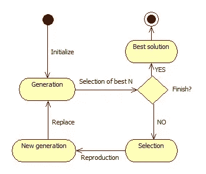
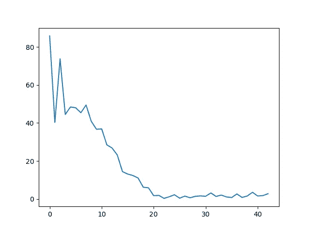

# 使用 EDAspy 进行超参数优化

> 原文：<https://medium.com/analytics-vidhya/hyper-parameter-optimization-using-edaspy-8b6490b953e3?source=collection_archive---------27----------------------->

调整机器学习超参数是一项乏味的任务，我们倾向于推迟到项目的最后。超参数无处不在，手动调谐几乎是不可能的。

假设我们只有一个超参数，我们想优化它。我们将不得不执行程序、脚本、算法或者我们正在调整的任何东西 N 次，N 是参数的可能值的数量。有了两个参数，我们将不得不为第二个参数的每次执行 N 次，因此，N**2。诸如此类。

超参数调整存在许多可能性。在这种情况下，我将解释一种来自进化算法的方法。特别是*分布估计算法(EDAs)。*类似于遗传算法。该算法的核心是迭代地提出一些解决方案，从中选择最适合我们要优化的代价函数的方案。从这些选择中，我们基于从它们构建的正态分布生成新的解决方案。图 1 显示了一个流程图。在每次迭代中，对具有一组解的一代进行采样。这被称为具有多个个体的一代。在最佳个体的选择中，选择这一代的一个百分比(α参数)

这种类型的算法可以用于进一步的任务，如特征选择(FS)或根据其他变量的一些进一步的固定值优化一些变量。以后的故事会谈到这个话题。



图一。分布估计算法(EDA)的流程图。

让我们看一个使用 Python 包 [EDAspy](https://pypi.org/project/EDAspy/) 解决的简单例子。要安装该软件包，只需:

```
pip install EDAspy
```

我们有一个如下的成本函数。我们要优化的三个超参数是 dictionary['param1']、dictionary['param2']和 dictionary['param3']。成本函数也包含一些权重。该算法必须找到超参数的最佳值，以便最小化成本函数。

```
weights = [20,10,-4]def cost_function(dictionary):
    function = weights[0]*dictionary['param1']**2 + weights[1]*(np.pi/dictionary['param2']) - 2 - weights[2]*dictionary['param3']
    if function < 0:
        return 9999999
    return function
```

该算法需要一个开始评估解的初始范围作为输入。可选地，该算法可以设置超参数的最大值和最小值。它们都在 pandas 表中设置，每个数据占一行，每个超参数名占一列。如果未设置最大值和最小值，则不要引入最大值和最小值行。

```
from EDAspy.optimization.univariate import EDA_continuous as EDAc
import pandas as pd
import numpy as np

wheights = [20,10,-4]

def cost_function(dictionary):
    function = wheights[0]*dictionary['param1']**2 + wheights[1]*(np.pi/dictionary['param2']) - 2 - wheights[2]*dictionary['param3']
    if function < 0:
        return 9999999
    return function

vector = pd.DataFrame(columns=['param1', 'param2', 'param3'])
vector['data'] = ['mu', 'std', 'min', 'max']
vector = vector.set_index('data')
vector.loc['mu'] = [5, 8, 1]
vector.loc['std'] = 20
vector.loc['min'] = 0
vector.loc['max'] = 100

EDA = EDAc(SIZE_GEN=40, MAX_ITER=200, DEAD_ITER=20, ALPHA=0.7, vector=vector, aim='minimize', cost_function=cost_function)bestcost, params, history = EDA.run()
print(bestcost)
print(params)
print(history)
```

在这种情况下，我们使用连续的单变量 EDA。优化时，超参数之间没有相关性。它们都是独立调谐的。作为算法的参数，我们将 SIZE_GEN 设置为个体的数量(每次迭代的解的数量)；MAX_ITER 为最大迭代次数；DEAD_ITER 作为没有最佳全局成本改进的迭代次数，在此之后算法将停止；α为我们从哪个样本中选择作为最佳个体来更新正态分布的一代的百分比；和成本函数。注意，ALPHA 和初始向量也可以根据需要进行调整。高 alpha 将选择大范围的解决方案，并且倾向于缓慢收敛(如果收敛的话)。较低的α值可能意味着会陷入局部最优。我建议在不同的执行中尝试不同的α值。

如果需要绘图，该算法将返回最佳成本、参数和历史记录。图 2 显示了一个曲线图。



图二。最佳全球成本演变。

未来的故事我将谈论与 EDAs 和这个惊人的优化包的其他方法的 FS！