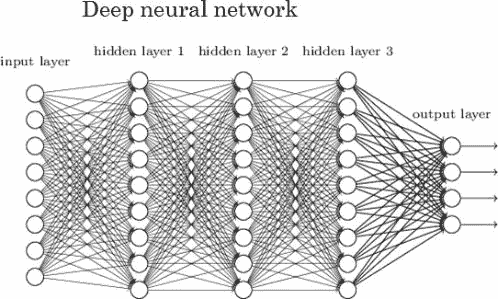
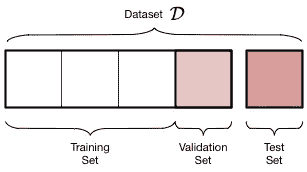
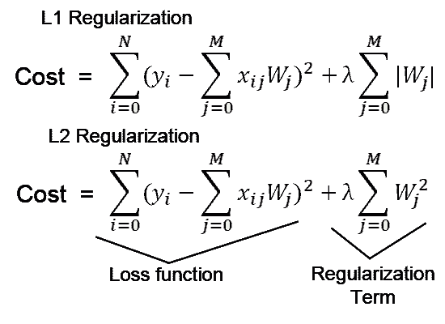
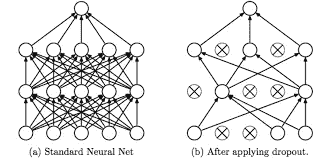

# 超参数调整-深度神经网络。

> 原文：<https://medium.com/analytics-vidhya/hyper-parameter-tuning-deep-neural-networks-592414c0a85c?source=collection_archive---------35----------------------->

让我们来谈谈如何调整超参数、正则化和优化来改进深度神经网络，而不需要太多的数学细节，只需要理解概念。

[来源](https://www.kdnuggets.com/2020/02/deep-neural-networks.html)

应用 ML 是一个非常迭代的过程，包括层、隐藏单元、学习速率、激活函数。

众所周知，在训练神经网络之前，我们必须将数据分成**训练**、**测试**和**验证**(开发|维持)。许多人认为这没什么必要。但的确有影响。根据您拥有的数据数量，将其分为训练、测试和验证是非常重要的，这应该以这样的方式进行，即测试中必须有足够的数据，以确保网络的适当偏差和方差。为了找到适合您的数据和用例的最佳模型，您必须保留验证数据。有人用 60%、20%、20%作为比例。但这是基于数据的数量。在大数据的情况下，您不必坚持这个比率，但您可以选择获取数据，以便有足够的信心使用最佳模型。通常会出现一个常见的错误，即训练数据中的数据与您真正想要测试的数据完全不同。例如猫和狗的分类，应用程序中的猫图片可能是您想要处理的数据。但是你的训练数据将包含来自网页的图像。

[来源](https://dziganto.github.io/cross-validation/data%20science/machine%20learning/model%20tuning/python/Model-Tuning-with-Validation-and-Cross-Validation/)

第二件事是偏差，方差权衡。我们先来了解一下，在我们的神经网络中，什么是偏差和方差。

当模型试图给你**训练错误**，**验证错误**为:

1.  1% | 11% —高方差。也就是说，你的模型能够识别训练集中的几乎每一个数据，并且它确实过度适合训练数据。并且它不会给测试数据带来太多的性能。你可以做的是向训练集添加更多的一般数据，或者进行正则化处理，如 L1 正则化、L2 正则化或辍学正则化。此外，神经网络的选择也很重要。
2.  15% | 16% —高偏差。这是你的模型不能对你的训练数据和验证数据进行分类的情况。这基本上就是 fit 中提到的内容。在这种情况下我们能做的是？增加隐藏层的数量，也就是让你的网络更大，以使网络了解更多。你也可以训练更长的时间和更多的纪元来消除偏见。
3.  0.5% | 1% —低偏差低方差，真的很好！
4.  15% | 30% —高偏差和高方差，这真的很糟糕，您必须使用上述方法在两者之间进行权衡，以创建一个好的模型。

专业人士提到的一个基本渠道是:

**偏高**(训练数据表现？)> > **更大的网络** | **训练更大的** | **神经网络选择** > >如果再次偏高:重复这个 else: > > **高方差**(测试数据表现？)> > **更多数据** | **规则化** | **神经网络选择** > >如果再次出现高方差:重复此句:> > **搞定**

注意:你必须小心权衡偏差和方差。

## L1 和 L2 正则化

[来源](/analytics-vidhya/l1-vs-l2-regularization-which-is-better-d01068e6658c)

> *L1 正则化和 L2 正则化之间的主要直观区别在于，L1 正则化试图估计数据的中值，而 L2 正则化试图估计数据的平均值以避免过拟合。*

可以看到 **L1 正则化**通过添加权重(Wj)参数的绝对值在成本函数中添加惩罚项，而 **L2 正则化**在成本函数中添加权重(Wj)的平方值。

两者之间的区别在于，当采用梯度下降来更新权重以便更好地拟合时，损失函数被减少了上面针对相应正则化示出的因子。这将减少损失并影响权重的更新，从而不会过度适应训练数据。L1 试图通过从数据分布的中位数中减去损失来减少损失，而 L2 通过从数据分布的平均数中减去损失来减少损失。

> **退学正规化**
> 
> 通过在训练期间随机删除节点，可以使用单个模型来模拟具有大量不同的网络架构。这被称为 dropout，并提供了一种计算成本非常低且非常有效的正则化方法，以[减少过拟合并改善各种深度神经网络中的泛化误差](https://machinelearningmastery.com/introduction-to-regularization-to-reduce-overfitting-and-improve-generalization-error/)。

[来源](/@amarbudhiraja/https-medium-com-amarbudhiraja-learning-less-to-learn-better-dropout-in-deep-machine-learning-74334da4bfc5)

在训练期间，一些节点的一些输出被忽略。这使得每一层每次都具有不同类型和数量的节点。实际上，训练期间对层的每次更新都是用不同的视图来执行的。

可以在网络中的任何或所有隐藏层以及可见层或输入层上实现丢弃。它不用于输出层。

**标准化输入**:

1.  归一化平均值:归一化平均值是用全部数据的平均值减去每个数据的过程。
2.  归一化方差:用每个特征的方差划分数据的过程。

使用平均值和方差来规范化训练集和测试集。这对我们有什么帮助？当您的要素处于归一化比例时，成本函数很容易收敛到某一点或进行优化，从而为您提供更好的预测。

## 消失和爆炸渐变:

从名字本身我们就知道，当我们试图训练一个深度神经网络时，有时梯度变大，有时梯度成指数级变小。加入一个与激活函数相对应的合理的比例初始化权重，将有助于减少消失梯度和爆炸梯度的影响，使你能够长时间训练神经网络。

如果你有兴趣检查一下部分的**梯度检查**方法来检查你的神经网络。

思考**超参数优化**应该选择哪个**库**？看看这个博客。值得一读..

 [## Optuna vs Hyperopt:应该选择哪个超参数优化库？- neptune.ai

### 思考应该选择哪个库进行超参数优化？使用远视有一段时间了，感觉像…

海王星. ai](https://neptune.ai/blog/optuna-vs-hyperopt) 

参考资料:

1.  [https://machine learning mastery . com/dropout-for-regulating-deep-neural-networks/](https://machinelearningmastery.com/dropout-for-regularizing-deep-neural-networks/)
2.  [https://medium . com/@ amarbudhiraja/https-medium-com-amarbudhiraja-learning-less-to-learn-better-dropout-in-deep-machine-learning-74334 da 4 bfc 5](/@amarbudhiraja/https-medium-com-amarbudhiraja-learning-less-to-learn-better-dropout-in-deep-machine-learning-74334da4bfc5)