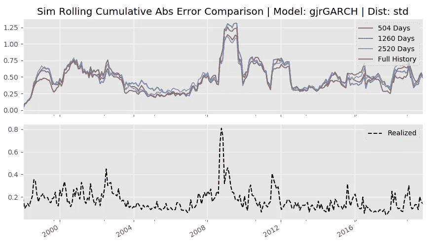

# GARCH 族 Vol 模型的超参数调整

> 原文：<https://medium.com/analytics-vidhya/hyper-parameter-tuning-for-a-garch-family-vol-model-942794cd5ea5?source=collection_archive---------8----------------------->

> 该职位的代码可在:[https://github.com/TRBD/demo_vol_tuning](https://github.com/TRBD/demo_vol_tuning)获得

# 概述:

这篇文章的目的是了解 GARCH(广义自回归条件异方差)模型的数据量的隐式超参数选择如何影响其结果。我的预期是，在 GARCH 模型的给定版本中提供整个价格/回报历史可能不是最佳的，因为在存在可能过去相关的数据的情况下，预测可能会被这些过程的长期记忆属性不必要地扭曲。为了验证这一点，我使用大约 50 年的完整数据集，通过 20 多年的前滚非重叠模拟，并使用 2 年、5 年、10 年和完整历史回顾来比较模型拟合。我比较了 GARCH 家族的三个成员，指数 GARCH (eGARCH)，GJR GARCH(gjr GARCH)和分量 GARCH 的结果。选择前两个模型是因为它们在对未来波动性有相反影响的正与负回报的程式化模式方面有吸引力的建模属性，第三个模型是因为它专注于区分长期和短期波动动态。

我发现，在调查期间，对于审查的数据集和运行的配置，总的来说，短期 eGARCH 和 gjrGARCH 模型表现更好。外性能的特点相当有趣。gjrGARCH 模型是总体赢家，但它的优异表现主要是在总体波动性最高的时期(即金融危机)取得的。在整体波动性较低的时期，eGARCH 模型表现更好。这表明需要进一步研究基于规则的条件性或基于状态的模型选择建模以及回望超参数的潜力。

这篇文章讲述了:

*   关于什么是 vol 模型、它们的用途以及各种基于历史的模型类型的概述的背景知识
*   三个特定 GARCH 系列相关模型的简要概述
*   总结研究的主要问题，历史长度的超参数提供给 GARCH 模型在影响其结果预测
*   附带的 github 回购项目概述
*   结果摘要

# 什么是 Vol 模型？

在这种情况下，vol 模型是在某个时间点使用现有数据的任何算法，以试图预测资产在某个未来(n_forecast)时间段内将实现的价格回报波动性的“公平”假设。最简单的版本是向前预测最近实现的波动率(周期性价格百分比变化的均方根)是多少。

# 它们是用来做什么的？

vol 模型有两个高度相关的领域:

*   投资组合风险管理:在单变量情况下，资产的估计未来波动性将是 VaR 系列计算的关键输入(无论是基于 n*σ还是基于蒙特卡罗)。在多变量情况下，估计方差/协方差是多种投资组合级别风险估计或优化的关键因素。
*   Vol 交易/ Vol 套利:Vol 套利是指卖出被认为“富有”的股票衍生品，买入被认为“廉价”的股票衍生品。vol 模型是一个基础，用于观察各种基础期权的范围，并确定隐含波动率(期权定价)是“丰富”(高于模型)还是“便宜”(低于模型)。也就是说，这只是一个起点，任何 vol 交易者都会有一本书，里面有许多头寸因为各种一次性原因与他们的模型相矛盾。

也就是说，vol 估计是传统投资组合风险管理技术的关键输入，也是整个资产类别交易的基础。这对那些需要它的人来说非常重要。

# 历史数据卷模型

在预测点之前仅采用资产价格/回报数据的模型:

*   n 天已实现波动率模型:简单地看一下估算时前 n 天的已实现波动率。通过足够长的回顾，这将反映长期平均水平，但是最近偏离该长期平均水平的行为将被相等的权重忽略。这里唯一的超参数是 n

*   指数加权移动平均波动率模型:采用观察到的平方收益进行估计，并对其应用指数递减权重，最近观察到的权重最大。EWMV 的优势在于更能反映最近发生的事情，然而，这是以长期平均行为为代价的。EWMV 唯一的超参数是衰变因子。这在金融领域的典型表现是:

t 时刻的方差是衰减因子乘以之前的方差和最近的平方收益之和

*   GARCH 族模型:这些模型的动机是金融资产显示*波动聚集*的趋势，即短期内较高/较低波动的时期会导致较高/较低波动的时期，同时也倾向于显示长期均值回归。这给上面的两个模型带来了麻烦，因为每个模型都倾向于解决一个单独的问题。由此诞生了 Bollerslev 的 GARCH(p，q)模型，该模型试图解决这种聚类(称为自回归条件异方差)。典型的 GARCH(1，1)模型是:

alpha 和 beta 参数是使用 MLE 从历史回报中估计出来的

β参数是一种“持续性”效应，从一个时期到下一个时期影响预测量的稳定性。阿尔法参数是一种“大小”效应，影响新观测对先前预测的干扰程度。当前方差预期最终接近的无条件方差由下式给出:

这就提出了一个关于利用 GARCH 模型的有趣问题。模型拟合产生的无条件方差最终将非常接近回报的完整时间序列方差(等权重)。问题是，在估计模型时，是否应该使用可用回报的全部历史。两个简单的例子说明了这一点:

*   道琼斯平均指数已经被追踪了 100 多年。在这段时间里，市场的结构发生了明显的变化。与拟合参数有循环关系的无条件方差是否应该受到可能与未来不太相似的市场行为的影响？
*   同样，在 1985 年，苹果是一只小盘股，一只疯狂的股票。在 2000 年，这是一个留给死亡的交易手榴弹。今天，它是一个万亿美元的巨人，有着完全不同的商业模式。基于资本化、流动性和缺乏财务估计差异，这些是非常不同的证券表现机制。

例如，下面显示了适合 S&P 的 eGARCH 模型的比较，一次是 2 年回顾，一次是 20 年回顾。模拟日期为 2019 年初。

绿线是 20 年回顾的适合条件卷，蓝线是 2 年的适合条件卷。他们显然是紧密结合的。然而，红线显示的是 20 年回顾的平均模拟远期条件成交量，而黑线显示的是 2 年的平均模拟远期条件成交量。预测 vol 从约 26%降至约 21%(20 年期)和从约 25%降至约 16%(2 年期)之间存在巨大差异。

# 感兴趣的 GARCH 族模型

原始的 Bollerslev 模型有许多扩展。我们将在这里看到的是精选的，因为它们有令人感兴趣的属性，第一个是“杠杆”参数(抑制正回报，放大负回报)，第二个是自回归截距组件。

指数 GARCH (eGARCH)模型:

这里，γ(正号)表示规模分量，α_ 1 表示杠杆分量，因为在正的ε上，ε馈通影响被抑制，在负的回报上，被增强

GJR GARCH (gjrGARCH)模型:

这里，指标函数与 nu_1 杠杆项一起使用。在负ε上，nu_1*eps_squared 值馈通，在正ε上，没有馈通。

分量 GARCH (csGARCH)模型:

这里，我们看到截距项 q_t 被建模为附加的 ARCH(1)过程，而不是杠杆项。这将有助于直接解决上述问题。

# 练习

这些模型本身没有超参数。然而，考虑到上面的讨论，选择包括完整的价格历史，或者截断该历史，是隐含的超参数。选择使用哪种 GARCH 口味也是一个隐含的超参数。本练习的目标是针对不同的滚动回顾窗口评估上述三个模型，并评估是否可以找到任何性能趋势。

# 方法

github repo 有运行这个练习的代码。

*   验证方法:时间序列交叉验证。
*   预测误差:模拟拟合后平均成交量与随后 n_forecast(此处为 21)天的实际波动率。
*   采样:从 1998 年到 2019 年，以 n_forecast 天为增量遍历数据集。
*   评分:单个试验窗残差的均方误差。
*   回顾测试:2 年，5 年，10 年，全部历史。
*   测试的模型:eGARCH、gjrGARCH、csGARCH。

# 实施说明:

为了适应 garch 模型，我使用了 R 语言的“rugarch”包，它在覆盖范围和为建模单变量 GARCH 族过程提供的能力方面是无与伦比的。然而，该练习的代码是用 Python 编写的。为了连接这些工作流，我使用了 python PypeR 项目，它提供了两个环境之间的接口。

“demo_vol_tuning”项目组织如下:

*   config.py 用户必须将 R_PATH 变量设置为指向他们首选的 R bin 文件夹，将 TMP_PATH 变量设置为指向文件缓存位置，还可以选择将 PLOT_PATH 变量设置为指向保存输出图像的位置。
*   脚本包:rGarch。R script 包含拟合 python 环境中的模型并返回结果集所需的唯一 r 函数。
*   r_garch 包:通过 PypeR 与 R 接口的实用函数
*   py_garch 包:vol_estimator 模块有处理练习参数所需的类，result_viz 模块有查看结果输出所需的类。
*   练习包:比较模块是一个脚本，用于运行所描述的练习，但是可以很容易地为任何想要运行不同配置的人进行修改。default_inputs 模块包含练习实现变量，可以根据需要进行更改。
*   数据目录:包含 sample_data.txt，是 1970 年到 2019 年 10 月之间的 SPX 指数价格历史。

# 输出

以下是均方预测误差的几种视图:

在各种分布和回顾中，gjrGARCH、eGARCH 和 csGARCH 的总体表现趋势是从最佳到最差。最短窗口、student-t 分布、eGARCH 和 gjrGARCH 模型总体表现最好。

相同数据的单独视图显示了一种模式，其中，对于每种配置，最短的窗口表现最好，然后 5 年回顾表现最差，随着更长的回顾而改善。这只是不存在于范数-距离 csGARCH 集合中。

这里的一个单独的视图显示，在较短的窗口中，student-t 分布表现更好，而在较长的窗口中，这种关系正好相反。

当观察平均绝对误差时，这些趋势通常会重复出现:

仔细看看 eGARCH 和 gjrGARCH 模型:

前两个图显示了 gjrGARCH 和 eGARCH、student-t 分布模型的预测时间序列与实际时间序列的对比。除了这些观点都提供了很好的相关结果之外，很难从这些观点中得到什么。

为了直观显示模型差异发生的位置，下面的图表绘制了 gjrGARCH 和 eGARCH 模型相对于已实现时间序列的滚动 12 期累积绝对预测误差。显而易见的是，短窗口模型在高容量环境中始终优于同行，在低容量环境中则不那么明显。GJR 在 2008 年表现突出(比较 y 轴)

另一种方法是将结果分成三个阶段。第二个时期的波动程度最高，第一个时期次之，最近一个时期最低。以下是这些分割的汇总 MSE 值:

在第一个窗口中，您可以看到短窗口 eGARCH 和 gjrGARCH 模型的出色表现程度。eGARCH 模型最终是这里的赢家。

在高度不稳定的第二个窗口中，可以再次看到短窗口模型的 out 性能，gjr 模型的 out 性能非常明显。将这里的 y 轴与上面和下面的图表进行比较。

在相对较低的第三阶段，gjr 模式的超表现特征开始失去形状，而 eGARCH 模式继续表现令人印象深刻。

结论是，对于这个特定的试验，短窗口 gjr 和 eGARCH 模型是最好的表现。eGARCH 模型在低容量环境中表现更好，而 gjrGARCH 在高容量环境中表现更好。这可能会在研究基于规则的转换模型或基于状态的模型的有效性时得出更多的结论。

# 参考资料:

优秀的“rugarch”项目[https://cran.r-project.org/package=rugarch](https://cran.r-project.org/package=rugarch)

各种波动率建模方法的概述:[https://OCW . MIT . edu/courses/mathematics/18-s096-topics-in-mathematics-in-applications-in-finance-2013/clash-notes/MIT 18 _ s096 f 13 _ lecnote 9 . pdf](https://ocw.mit.edu/courses/mathematics/18-s096-topics-in-mathematics-with-applications-in-finance-fall-2013/lecture-notes/MIT18_S096F13_lecnote9.pdf)

PypeR 项目网站:[http://bioinfo.ihb.ac.cn/softwares/PypeR/](http://bioinfo.ihb.ac.cn/softwares/PypeR/)