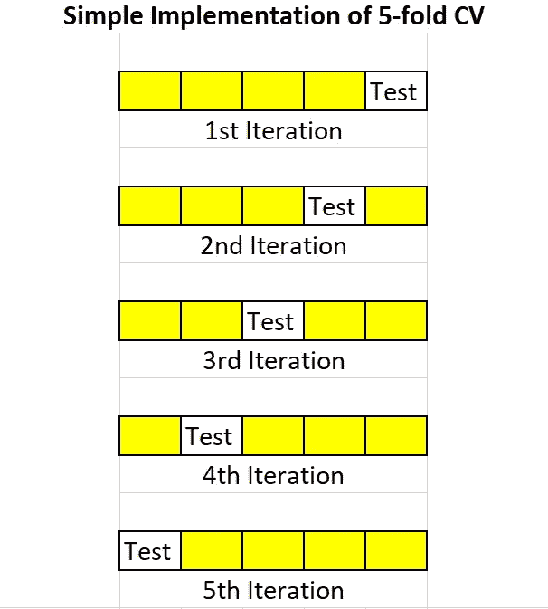
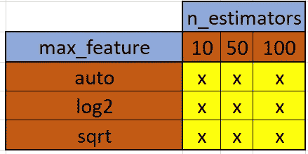

# 超级参数调整(GridSearchCV 与 RandomizedSearchCV)

> 原文：<https://medium.com/analytics-vidhya/hyper-parameter-tuning-gridsearchcv-vs-randomizedsearchcv-499862e3ca5?source=collection_archive---------3----------------------->

数据科学家经常在日常的机器学习实现中处理超参数调整。那么什么是超参数，我们为什么需要它们？我们将更多地讨论两种主要类型的超参数调整，即网格搜索 CV 和随机搜索 CV。


照片由[丹尼斯·莱昂](https://unsplash.com/@denisseleon?utm_source=medium&utm_medium=referral)在 [Unsplash](https://unsplash.com?utm_source=medium&utm_medium=referral) 上拍摄

> 什么是超参数？
> 
> 超参数更像是可用于控制用于建模的算法的输出或行为的手柄。它们可以作为参数提供给算法。例如:model = decision tree classifier(criterion = ' entropy ')，这里的标准熵是传递的超级参数。

函数 get_params()是用于获取任何算法的所有超参数列表的函数。

当超参数没有给算法时，选择默认值来运行模型。这使得超参数调整成为机器学习实现中涉及的关键步骤之一。

超参数调整中涉及的步骤

1.  为模型选择合适的算法
2.  决定参数空间
3.  决定搜索参数空间的方法
4.  决定交叉验证方法
5.  决定评估模型的评分标准

为了在超参数空间中搜索最佳值，我们可以使用

1.  GridSearchCV(考虑所有可能的超参数组合)
2.  RandomizedSearchCV(仅随机选择少量样本)

> **Cross** - **validation** 是一个用于评估机器学习模型的重采样程序。该方法具有单个参数 k，该参数指的是给定数据样本将被分割成的分区的数量。所以，它们通常被称为 **k 倍** **交叉** - **验证**。数据分为训练集、验证集和测试集，以防止数据泄露。因此，只有在使用训练和验证集拟合模型之后，才应该转换测试集。每次模型拟合训练数据时，都用测试数据对它们进行评估，评估分数的平均值用于分析整个模型。



作者图片

# GridSearchCV

网格搜索是使用的最基本的超参数技术之一，因此它们的实现非常简单。特定模型的超参数的所有可能排列被用于建立模型。评估每个模型的性能，并选择性能最好的一个。由于 GridSearchCV 使用每个组合来构建和评估模型性能，因此这种方法的计算成本非常高。随机森林算法 GridSearchCV 的 python 实现如下。

```
# Run GridSearch to tune the hyper-parameter
from sklearn.model_selection import GridSearchCV
rfr=RandomForestRegressor()
k_fold_cv = 5 # Stratified 5-fold cross validation
grid_params = {
 “n_estimators” : [10,50,100],
 “max_features” : [“auto”, “log2”, “sqrt”],
 “bootstrap” : [True, False]
 }
grid = GridSearchCV(rfr, param_grid=grid_params, cv=k_fold_cv, 
 n_jobs = 1, verbose = 0, return_train_score=True)
grid.fit(X_train, y_train)
print(‘Best hyper parameter:’, grid.best_params_) 
```

[](https://scikit-learn.org/stable/modules/generated/sklearn.model_selection.GridSearchCV.html) [## sklearn.model_selection。GridSearchCV-scikit-学习 0.24.0 文档

### 对估计量的特定参数值的穷举搜索。重要成员是适合的，预测。GridSearchCV…

scikit-learn.org](https://scikit-learn.org/stable/modules/generated/sklearn.model_selection.GridSearchCV.html) 

如果您注意到 grid_params，超参数 n_estimators 和 max_features 各有三个值。因此，仅这两个超参数就有 3 x 3 = 9 种组合。



作者图片

因此，超参数的所有排列将产生大量的模型，随着数据量的增加，计算速度急剧下降。这就是为什么数据科学家在处理庞大的数据集时更喜欢 RandomizedSearchCV 而不是 GridSearchCV。

# 随机搜索

在 randomizedsearchcv 中，我们提供了超参数的统计分布或列表，而不是提供一组离散的值来研究每个超参数。不同超参数的值从该分布中随机选取。随机森林算法 GridSearchCV 的 python 实现如下。

```
# Run RandomizedSearchCV to tune the hyper-parameter
from sklearn.model_selection import RandomizedSearchCV
rfr=RandomForestRegressor()
k_fold_cv = 5 # Stratified 5-fold cross validation
params = {
 “n_estimators” : [10,50,100],
 “max_features” : [“auto”, “log2”, “sqrt”],
 “bootstrap” : [True, False]
 }
random = RandomizedSearchCV(rfr, param_distributions=params, cv=k_fold_cv,
 n_iter = 5, scoring=’neg_mean_absolute_error’,verbose=2, random_state=42,
 n_jobs=-1, return_train_score=True)
random.fit(X_train, y_train)
print(‘Best hyper parameter:’, random.best_params_)
```

[](https://scikit-learn.org/stable/modules/generated/sklearn.model_selection.RandomizedSearchCV.html) [## sklearn.model_selection。randomized search cv-sci kit-learn 0 . 24 . 0 文档

### 超参数随机搜索。RandomizedSearchCV 实现了一个“fit”和一个“score”方法。它还实现了…

scikit-learn.org](https://scikit-learn.org/stable/modules/generated/sklearn.model_selection.RandomizedSearchCV.html) 

我们可以得出结论，GridSearchCV 只适用于小数据集。当涉及到更大的数据集时，RandomizedSearchCV 优于 GridSearchCV。

希望你能从这篇文章中得到一些启示。关注更多！

您可能还喜欢:

[](/analytics-vidhya/machine-learning-algorithms-logistics-regression-8ba38af531b3) [## 机器学习算法:逻辑回归

### Tom Mitchell 最著名的定义之一是将机器学习定义为“一个性能良好的计算机程序…

medium.com](/analytics-vidhya/machine-learning-algorithms-logistics-regression-8ba38af531b3) [](/analytics-vidhya/machine-learning-algorithms-support-vector-machines-ddfc413540d2) [## 机器学习算法:支持向量机

### 在机器学习算法系列的第三篇文章中，我将讨论最流行的监督学习算法

medium.com](/analytics-vidhya/machine-learning-algorithms-support-vector-machines-ddfc413540d2) [](/analytics-vidhya/machine-learning-algorithms-naïve-bayes-classifier-and-knn-classifier-266537e9c2f2) [## 机器学习算法:朴素贝叶斯分类器和 KNN 分类器

### 在机器学习算法的第二篇文章中，我将重点介绍朴素贝叶斯分类器和 KNN…

medium.com](/analytics-vidhya/machine-learning-algorithms-naïve-bayes-classifier-and-knn-classifier-266537e9c2f2)