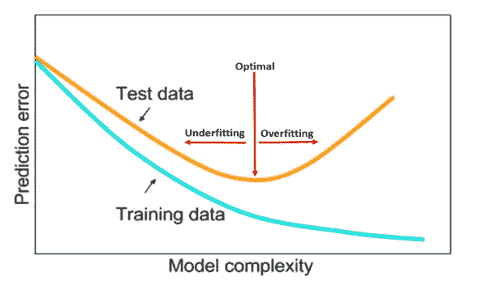
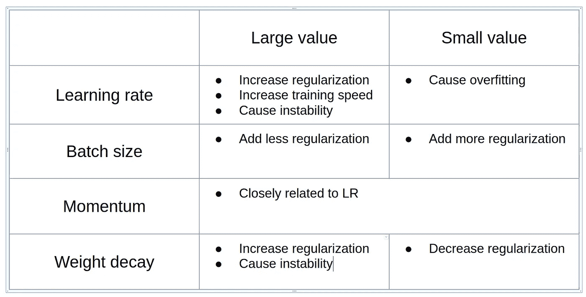

# 超参数调整实践:学习率、批量大小、动量和重量衰减。

> 原文：<https://medium.com/analytics-vidhya/hyper-parameters-tuning-practices-learning-rate-batch-size-momentum-and-weight-decay-4b30f3c19ae8?source=collection_archive---------5----------------------->

莱斯利·n·史密斯的技术报告【1】的评论。

通过网格搜索或随机搜索来调整深度学习(DL)模型的超参数在计算上是昂贵且耗时的。本技术报告给出了选择最佳超参数的几个实用建议和步骤。

充分理解本技术报告的一些先验知识:

1.  过度拟合/欠拟合
2.  学习率
3.  批量大小(BS)
4.  动力
5.  重量衰减

# 目标:

查看调整超参数的方法，这些方法可以显著减少训练时间并提高性能。

# 哪里可以找到调整超参数的线索？

测试/验证损失是网络收敛的一个很好的指标，应该检查其线索。在报告中，测试/验证损失用于提供对培训过程的见解，最终测试准确度用于比较绩效。

# 超参数的影响

一个良好调整的机器学习模型应该既不欠拟合也不过拟合。

来自技术报告[1]

当模型容量不足时，它不能很好地适应数据的分布。当模型过于复杂时，会过度拟合数据的分布，泛化能力较低。

在实践中，我们提高模型的复杂度来拟合训练数据，并使用正则化技术来克服过拟合。下表总结了每个超参数的影响。

**注意:**

高水平的正则化量有助于减少过拟合，但是当超过限制时，它可能导致模型不稳定。所以我们必须平衡正规化的数量。

**一般原则:减少其他形式的正则化和学习率大的正则化使训练明显更有效率。**

# 如何用给定的数据集和架构找到一组好的超参数？

1.  学习率(LR):进行学习率范围测试，找出最大学习率。
2.  总批处理大小(TBS):大的批处理大小可以很好地工作，但是数量通常受到 GPU 内存的限制。
3.  动量:动量值为 0.99、0.97、0.95 和 0.9 的短距离运行将快速显示动量的最佳值。
4.  重量衰减(WD):这需要网格搜索来确定合适的量级。

# 学习速度测验

在 LR 范围测试中，训练以小的学习率开始，在整个预训练过程中缓慢线性增加。当以小的学习速率开始时，网络开始收敛，并且随着学习速率的增加，网络最终变得太大，并且导致测试/验证损失增加和准确度降低。在这个极值的学习率是最大值。

有几种方法可以选择最小学习速率界限:

1.  比最大界限小 3 或 4 倍
2.  如果仅使用一个循环，则比最大界限小 10 或 20 倍，
3.  通过对具有一些初始学习率的数百次迭代的短测试，选择最大的一个，其允许收敛开始而没有过度拟合的迹象。

# 重量衰减的网格搜索

当 LR、BS 和动量固定时，测试 1e-3、1e-4、1e-5 和 0 作为重量衰减值，并选择最佳值。

# 结论

这篇文章总结了:

1.  LR、BS、动量和 WD 的影响
2.  选择四个超参数的步骤

> 如果你希望有更多的实验细节和解释，请阅读技术报告[1]。

参考:

[1]神经网络超参数的训练方法:第 1 部分—学习速率、批量大小、动量和权重衰减