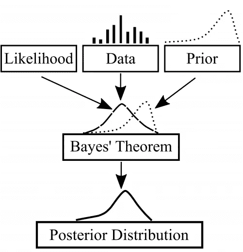

# 超参数搜索:贝叶斯优化

> 原文：<https://medium.com/analytics-vidhya/hyperparameter-search-bayesian-optimization-14be6fbb0e09?source=collection_archive---------5----------------------->

在[之前的帖子](/analytics-vidhya/hyperparameter-search-part-1-2b67fd7a71d8)中，我介绍了三种超参数搜索方法，即试错法、网格搜索和随机搜索。这篇文章将讨论第四种方法，贝叶斯优化。在我们讨论贝叶斯优化如何用于有效和高效的超参数搜索之前，我们需要简要介绍一下贝叶斯统计的基础知识。

礼貌:【http://jason-doll.com/wordpress/?page_id=127】T2

# 1-贝叶斯统计