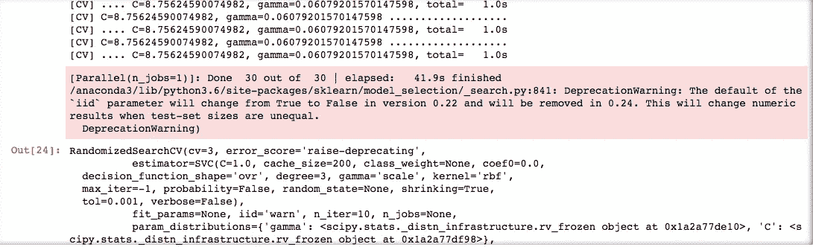

# 超参数调谐 SVM —使用超参数调谐的演示

> 原文：<https://medium.com/analytics-vidhya/hyperparameter-tuning-an-svm-a-demonstration-using-hyperparameter-tuning-cross-validation-on-96b05db54e5b?source=collection_archive---------0----------------------->

## MNIST 数据集的交叉验证或如何使用 SVM 改进 MNIST 的一对一策略

这是一件棘手的事情，因为改进算法不仅棘手和困难，而且有时不会有结果，很容易导致沮丧(抱歉，我在扯下一半头发后自言自语)。

哇呼，开始吧！

SVM 的是一个伟大的分类工具，几乎是足够好的数据集的标准，以获得高精度。

但是改进它们可能有点棘手，但是今天我们将使用一些标准技术来改进它们。

让我们挑选一个好的数据集，在此基础上进行分类，并对其使用一对一策略。

**你可能会问，什么是一对一战略？**

好吧，假设我训练一台机器去理解一碗水果中的苹果，里面还有橘子、香蕉和梨。

现在，机器将首先学习如何找到一个苹果，然后与橙子、香蕉和梨进行比较，宣布它们不是苹果。

同样的算法可以用来查找香蕉、橙子和梨，这有助于分别查找或分类所有水果。

这是一种一对一的技术，我们计算一个类别的概率或分类，然后将其与其他类别进行比较，而不是只找到这是苹果，这是橙色，等等，我们选择这不是苹果，这是苹果，这不是苹果，等等。

**关于数据集**

为了演示这种技术，我们将使用 MNIST 技术，这是一个包含从 0 到 9 的数字字母的数据集。

使用一对所有策略，我们首先发现，什么是 1 而不是 1，什么是 2 而不是 2，等等。然后用它来猜测我们作为测试提供的字母。

出于我们的目的，我们将保留一个训练集和一个测试集。

让我们更深入地研究代码——

```
*import numpy as np**from sklearn.datasets import fetch_openml
mnist = fetch_openml(‘mnist_784’, version=1, cache=True)**X = mnist[“data”]
y = mnist[“target”].astype(np.uint8)*X_train = X[:60000]
y_train = y[:60000]
X_test = X[60000:]
y_test = y[60000:]
```

#将数据集加载到 X 和 y 中，并将其分成训练和测试数据集。注意——我们也可以使用 train_test_split 来做到这一点。

是时候调用分类器并在数据集上对其进行训练了

```
*from sklearn.svm import LinearSVC**lin_clf = LinearSVC(random_state=42)
lin_clf.fit(X_train, y_train)**from sklearn.metrics import accuracy_score**y_pred = lin_clf.predict(X_train)
accuracy_score(y_train, y_pred)*
```

准确度分数达到 89.5，这相当糟糕，让我们尝试扩展训练数据集，看看是否存在任何改进-

```
*from sklearn.preprocessing import StandardScaler**scaler = StandardScaler()
X_train_scaled = scaler.fit_transform(X_train.astype(np.float32))
X_test_scaled = scaler.transform(X_test.astype(np.float32))**lin_clf = LinearSVC(random_state=42)
lin_clf.fit(X_train_scaled, y_train)**y_pred = lin_clf.predict(X_train_scaled)
accuracy_score(y_train, y_pred)*
```

准确度得分为 92.10，比以前有所提高，但仍然不够高。

**我们能做得更多吗？**

是

我们可以使用内核

什么是内核，我们为什么要使用它们？

如果我在绘制我的模型后有一个图，它没有分离我的类，建议给我的模型添加更多的度数，以帮助它线性地分离类，但是这个练习的成本是增加特性和降低模型的性能，因此是内核。

核是 ML 中的一种方式，通过增加数据集的多项式次数来增加算法的灵活性，而不增加特征或

**内核诡计(来源 Aurelion Geron)**

它可以获得相同的结果，就好像您添加了许多多项式特征，即使是非常高次的多项式，而实际上不必添加它们。

```
*from sklearn.svm import SVC**svm_clf = SVC(gamma=”scale”)
svm_clf.fit(X_train_scaled[:10000], y_train[:10000]) # We use an SVC with an RBF kernel*y_pred = svm_clf.predict(X_train_scaled)
accuracy_score(y_train, y_pred)
```

准确率得分出来是 94.5，现在好多了。

请注意，我们只训练了实际数据集的 1/6，这是因为该操作的性能成本很高，并且有许多超参数要优化，因为这对我们来说是可行的，我们来进行超参数优化。

**什么是超参数调谐？**

当我们定义分类器、回归器或任何算法时，超参数是[ *、SVC(gamma="scale")* ]括号中的东西。

超参数是算法的属性，当您增加或减少它们时，可帮助分类或回归数据集。

```
*lin_clf = LinearSVC(random_state=42)*
```

这里，random_state=42 是一个超参数，有助于将种子状态设置为 42，这有助于算法挑选相似的随机实例，这有助于给出相同实例的准确度分数。

类似地，每个超参数都是一个属性，有自己的功能。

让我向您展示一个技巧，通过使用 ML 找到超参数的最佳组合，并在多个实例上运行以检查分数。

有一种称为交叉验证的技术，其中我们使用小数据集，并检查这些小数据集上超参数的不同值，并在多个小数据集上多次重复这一练习。然后就可以找到每个超参数的最佳值。

多个小集合的使用被称为交叉值得分，而使用随机超参数值的技术被称为随机搜索。

让我用代码演示一下——

```
from sklearn.model_selection import RandomizedSearchCV
from scipy.stats import reciprocal, uniformparam_distributions = {"gamma": reciprocal(0.001, 0.1), "C": uniform(1, 10)}#Adding all values of hyperparameters in a list from which the values of hyperparameter will randomly inserted as hyperparameter
```



```
rnd_search_cv.best_estimator_> SVC(C=6.7046885962229785, cache_size=200, class_weight=None, coef0=0.0,
  decision_function_shape='ovr', degree=3, gamma=0.004147722987833689,
  kernel='rbf', max_iter=-1, probability=False, random_state=None,
  shrinking=True, tol=0.001, verbose=False)
```

这个最佳估计量给出了最佳的超参数值，我们可以将这些值插入到我们的算法中，这些值是通过多个小集合上的性能分数计算出来的。

现在我们有了最好的超参数，或者我们已经完成了超参数调整，我们可以在整个训练数据集上运行它，然后在测试数据集上运行它。

我们走吧。

```
rnd_search_cv.best_estimator_.fit(X_train_scaled, y_train)y_pred = rnd_search_cv.best_estimator_.predict(X_train_scaled)
accuracy_score(y_train, y_pred)y_pred = rnd_search_cv.best_estimator_.predict(X_test_scaled)
accuracy_score(y_test, y_pred)
```

我的准确度得分为 97.2，这并不算优秀，但已经足够好了，算法也没有过度拟合。

此外，请注意，我们将准确度得分从 89.5 提高到 97，这是真正的胜利。

我们首先调整输入，然后调整超参数。我们必须注意，训练 60，000 个数据点并不容易，可能需要很多时间，所以要有耐心。

如果您正在寻找相同的源代码。

源代码>[https://github . com/Madmanius/HyperParameter _ tuning _ SVM _ MNIST](https://github.com/Madmanius/HyperParameter_tuning_SVM_MNIST)