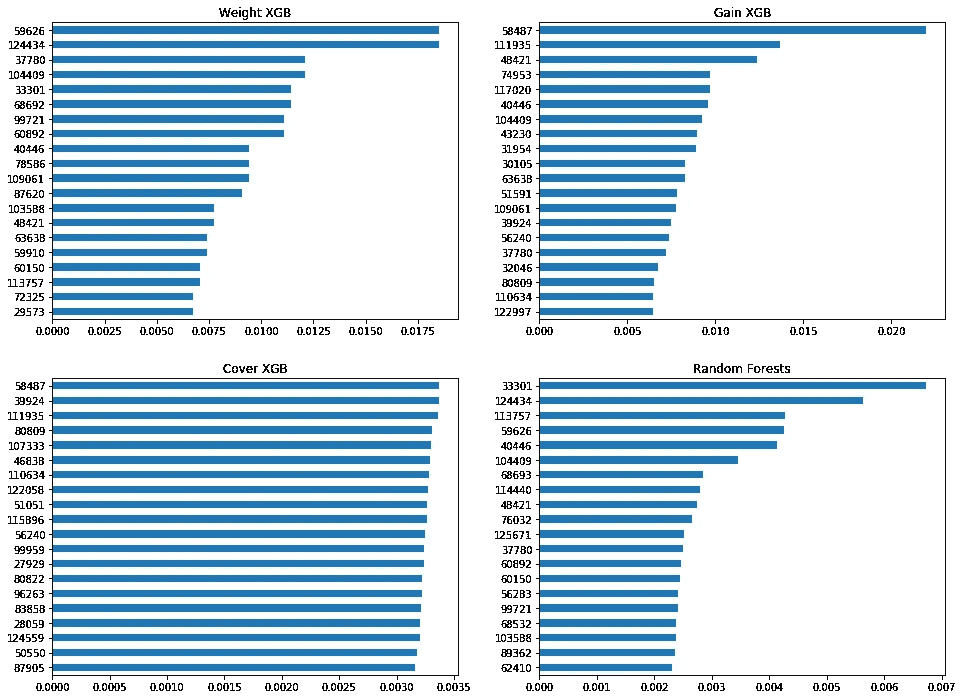

# 超参数调谐和评估

> 原文：<https://medium.com/analytics-vidhya/hyperparameter-tuning-and-evaluating-3df8032da76c?source=collection_archive---------11----------------------->

*网格搜索调整、k 倍评估和基于树的模型的特征重要性*

为了改进机器学习模型或简单地创建好的模型，一个人需要理解的关键概念之一是**超参数**。机器学习模型可能有大量的参数，其中许多参数对于机器从输入数据中实际学习和正确归纳非常关键。

这些参数中的一些在训练过程中不断更新，通过使用技术-如[梯度下降](https://en.wikipedia.org/wiki/Gradient_descent)。另一方面，其他参数在训练期间保持固定，因为它们是训练本身的定义。这些固定的参数就是我们所说的**超参数**。

如前所述，超参数定义了模型的训练过程。例如，在处理集合方法时，他们会告诉模型:使用多少个虚拟估计量，停止标准是什么，树的最大可能深度，单叶的最小数据点数量，等等。对于一个模型来说，这些都是非常相关的特征，并且根据问题的不同，可能是获得一个具有随机精度的模型和一个最先进的模型之间的差异。

鉴于此，为了找到解决机器学习问题的最佳模型，我们需要找到正确的超参数，由于我们无法在训练期间更新这些参数，为了找到它们，我们将一次又一次地训练模型。再一次。

## 网格搜索

最简单也可能是最著名的超参数调整方法是**网格搜索**。在网格搜索中，用户必须定义一个**超参数空间**，即一个数值范围或列表，用于每个所需参数的训练。网格搜索方法将为这些参数的每个可能组合训练一个模型**，并将返回每个单一训练组合的结果。**

在 Scikit-Learn 中，可以通过将模型和数据输入 sk Learn . model _ selection . gridsearchcv 来使用网格搜索。

## k 倍和分层

当训练一堆不同的模型时，确保模型之间的比较是公平的也是非常重要的。在机器学习中发现的两个常见问题是不平衡的训练数据和。

为了解决这种不平衡，有一种叫做**分层**的东西，通常是用户在创建模型时设置的。分层基本上是将输入数据分成训练和测试，同时保持其平衡的行为。

例如，如果您要拆分一个包含 50 个人样本的数据集，其中 40 人是男性，10 人是女性，那么有很小的可能性(考虑到 20%的测试数据)您的培训将只考虑男性，并且您的测试将只针对女性数据。根据数据集的内容，这可能会对结果产生巨大影响。对该数据集进行分层将通过确保男性和女性在训练和测试数据中得到平等的表示来解决这个问题。

但是即使我们在某些方面取得了平衡，我们怎么能确定我们的数据分割的当前配置没有不切实际地很好地工作呢？有时，只是碰巧，我们的训练数据和测试数据可能匹配得太好，或者太差，如果应用于未来收集的数据，最终给出的分数就不会相同。这个问题通常通过使用 **K 型折叠**来解决。

将数据分割成 K 倍意味着数据被分割成相同大小的 ***K*** 随机分割，对于每个分割，将在所有其他分割的组合上训练一个模型，然后在该分割上测试它。在 **K** 测试之后，用户可以从每个测试中取平均值，并将其用作所选模型的更真实的结果。

组合分层和 K-Folds 也是机器学习中非常常见的方法，实际上是前面提到的 GridSearchCV 函数的*默认*配置。

## 反对过度拟合的随机性

随机性是一个很好的例子，说明单个参数如何对模型产生巨大影响。在处理[决策树分类器](https://scikit-learn.org/stable/modules/generated/sklearn.tree.DecisionTreeClassifier.html)时，是否随机拆分数据的选择取决于用户。实际上，在构建决策树的 [bagging 分类器](https://scikit-learn.org/stable/modules/generated/sklearn.ensemble.BaggingClassifier.html)时，这种简单的参数选择可能会将 bagging 分类器变成[随机森林分类器](https://scikit-learn.org/stable/modules/generated/sklearn.ensemble.RandomForestClassifier.html)。

这种添加到数据分割中的随机性使得 bagging 分类器能够找到数据上的模式，这些模式在只进行最佳分割时难以识别。这在试图避免过度拟合时非常有用。当基于树的算法只寻找最佳分割选择时，它们会很快过度拟合，因为一些关键的数据特征可能不会被探索。通过随机分割，可以测试许多可能性，然后由算法相应地测量/加权。这意味着更多的元素将被

我们可以使用 scikit-learn 来测试这一点。

```
**# import the necessary stuff**
from sklearn.datasets import fetch_20newsgroups_vectorized
from sklearn.ensemble import BaggingClassifier
from sklearn.tree import DecisionTreeClassifier
from sklearn.model_selection import cross_val_score**# load our dataset**
data = fetch_20newsgroups_vectorized()**# set non-random classifier**
not_random_bagging_clf = BaggingClassifier(DecisionTreeClassifier(splitter=***'best'***, max_depth=2), n_estimators=500, max_features=0.33, oob_score=True)**# set random classifier**
random_bagging_clf = BaggingClassifier(DecisionTreeClassifier(splitter=***'random'***, max_depth=2), n_estimators=500, max_features=0.33, oob_score=True)**# score each**
oob_score_nr = cross_val_score(not_random_bagging_clf, data.data, data.target, cv=5).mean()
oob_score_r = cross_val_score(random_bagging_clf, data.data, data.target, cv=5).mean()
```

非随机分类器的 5 重交叉验证结果:

```
OOB Score: 0.3808
```

对于随机分类器:

```
OOB Score: 0.5017
```

我们能够通过简单地改变**分离器**参数来成功地增加我们的 OOB 分数。

## 权衡:理解

但是没有什么是完美的\_(ಠ_ಠ)_/，随机森林中的随机性所带来的改进让我们失去了基于树的方法的综合方面。而在常规树方法中，我们可以理解某个拆分决策是基于一组特定的规则做出的，当模型中发生随机性时，它会产生影响，使一些拆分决策**不可预测**(因为它是**随机的**！)

## 特征重要性

但是随机森林的另一个有趣之处是由算法生成的**特征重要性**“报告”。尽管重要性分数最初不是一个超参数，但它可以用于像**特征选择**这样的事情，并且可以作为调整过程的一部分插入到模型的管道中。

数据科学家可能希望在网格搜索器模型中测试不同的特征维度大小，以检查所有的特征是否实际相关。如果不同维度的模型具有相同的结果，您可能希望保留更简单的模型(维度更少)，因为它可能

特性重要性并不是一个非常客观的术语，就像不同的人对什么使某件事情变得重要会有不同的看法一样，有许多不同的方式来衡量特性的重要性。著名的梯度增强框架 [XGBoost](https://en.wikipedia.org/wiki/XGBoost) 单独提供了 3 种不同类型的特征重要性度量:“权重”、“增益”和“覆盖”。下面是它们与我们的示例数据集中的随机森林(RFs)的比较:



这里的特征没有名称，通过索引来识别。有 **130107** 不同的特性，您可以看到，尽管每次测量仅显示 20 个元素，但前 20 个结果之间有一些“交集”。例如:

*   *特征 33301* 是 RFs 中的**第 1**和*中的**第 5**重量*；
*   *特征 58487* 在*盖*和*增益中均为**第一**；*
*   *特性 104409* 在**RFs 和 *gain* 中都是前 10**

*体重*和*增益*共有 6 个元素在它们的前 20 名中，*封面*和*增益*也共有 6 个，*体重*和*封面*一个都没有。《随机森林》前 20 名共有 12 个元素*权重*，4 个*增益*，没有一个*覆盖*。这可能会让我们认为重要性的 RF 测量更接近于*、*，但事实并非如此，因为[对*、*、](https://towardsdatascience.com/interpretable-machine-learning-with-xgboost-9ec80d148d27)、*、*增益的定义更接近于我们的 bagging 模型如何测量重要性。

这是一个重要的(！)练习理解特性重要性是主观的，在您的模型中尝试不同的重要性度量是一个好主意。这不仅将您使用的特性数量转化为一个*超参数*，还转化为度量标准。

感谢您的来访，祝您在构建机器学习管道的过程中好运！:)