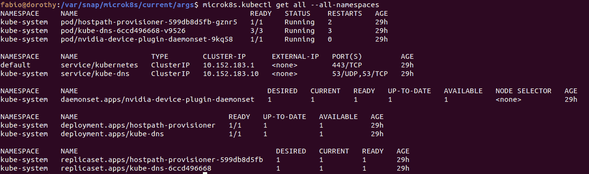
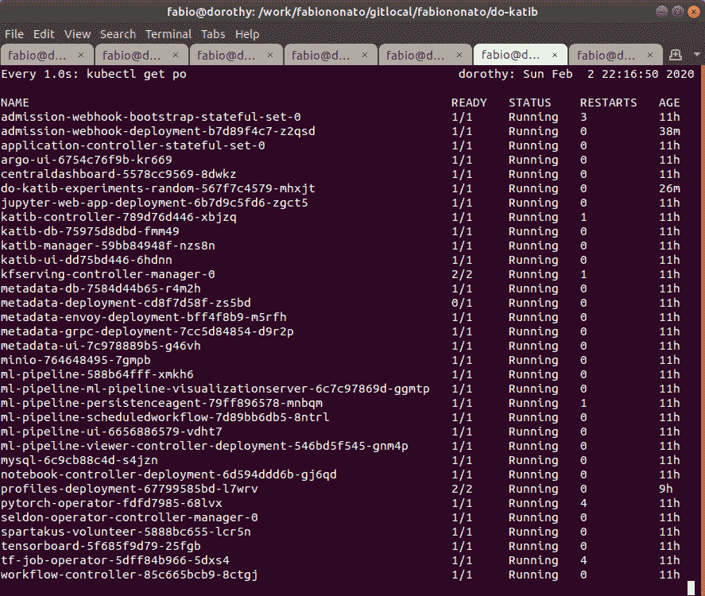
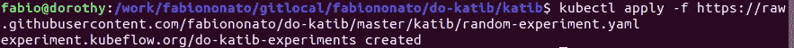
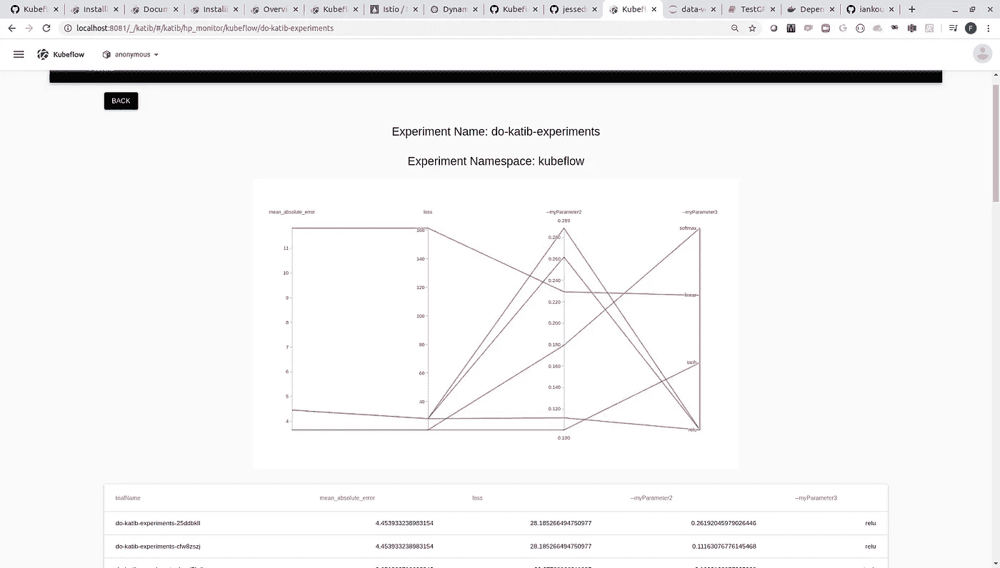
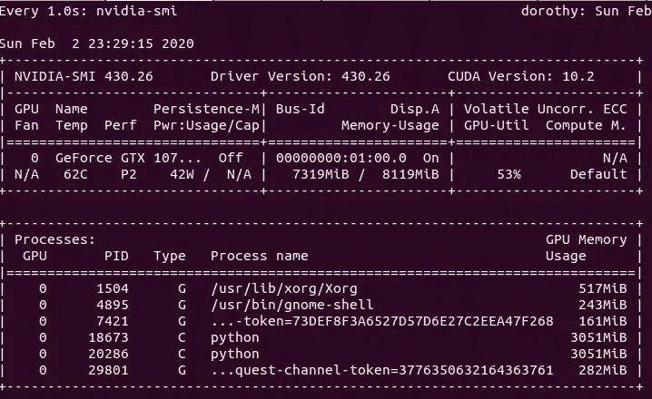

# 在游戏笔记本电脑上使用 Katib、Tensorflow、Keras 和 Nvidia GPU 进行端到端超参数调整

> 原文：<https://medium.com/analytics-vidhya/hyperparameter-tuning-with-katib-tensorflow-keras-and-nvidia-gpu-on-a-gaming-laptop-3ada6a8a01a9?source=collection_archive---------4----------------------->

当谈到可扩展的 GPU 加速的机器学习应用程序时，并不是每个人都有在云中加入[大规模 kubernetes 集群](https://www.youtube.com/watch?v=dIZt-Ahzew0)的奢侈。如果您没有花大价钱购买多 GPU 服务器，那么熟悉允许您这样做的工具和方法也是很重要的。

然而，如果你是一个精力充沛的数据科学家，只有一台运行 Ubuntu 的 GPU 机器，你会很高兴。继续阅读，也许你最终会使用 Kubeflow 在单个 GPU 中同时训练多个深度学习模型。或者像我一样，使用 Katib 调整一些超参数，从 GPU 中挤出每一滴内存。

不用担心，代码可用:【https://github.com/fabiononato/do-katib 

# 重大免责声明

这个博客并不打算成为一个完整的操作指南，而是为那些喜欢探索机器学习和数据科学作为工程学科的人收集了一些提示和技巧。我会确保沿途放置链接，以帮助端到端的故事。

我们将涵盖 Kubernetes、容器和 Kubeflow 的概念，这些概念不一定是数据科学家的日常工作。但希望这足以让一个人开始。

我们将这篇文章分成以下几个部分:**钻机**——在那里你会找到更多关于我正在使用的机器的信息。Kluster —围绕如何建立单节点 Kubernetes 集群和部署所有所需应用程序的建议集合。**代码** —我们将使用一个示例[开源项目](https://github.com/fabiononato/do-katib)来测试我们的部署，并查看我们正在使用的工具的具体需求。最后**运行**——使用 Kubeflow Katib 对超参数调谐进行执行和监控的快速入门指南。

# 钻机

我用来部署这个单节点集群的机器是一台[华硕 ROG 游戏笔记本电脑](https://www.asus.com/us/Laptops/ROG-ZEPHYRUS-S-GX701/)，配有英伟达 GTX 1070 8GB，运行 Ubuntu 18.04。除了必须设置 Docker、CUDA 和适当的 NVIDIA 驱动程序之外，对系统本身没有什么需要做的。我知道这不一定是一个简单的任务，所以这里有一个[要点](https://gist.github.com/fabiononato/be351e39b34497530156a3103b22e985)来帮助你开始。

运行 Ubuntu 18.04 带来了开箱即用的 [Snap](https://snapcraft.io/microk8s) 的好处，这就是我们将用来配置我们的集群。你会注意到，这种设置也可以在具有单个或多个 GPU 的云实例上复制，在已经为深度学习应用程序加载了所有驱动程序的虚拟机上复制。

# 克鲁斯特号

*这就是乐趣的开始！*

我们将使用一个漂亮的工具来部署 kubernetes 集群: [Microk8s](https://snapcraft.io/microk8s) 。这非常简单，有几个教程可用，包括一个来自 Ubuntu 的教程，这就是我们所需要做的: [Kubernetes on Ubuntu 教程](https://tutorials.ubuntu.com/tutorial/install-a-local-kubernetes-with-microk8s)

在跳 head first 之前，有几件事你需要知道。正如我们所说的，Microk8s 的开发正在全速前进，最新版本 1.17 已经承诺将 Kubeflow 作为一个插件。在这篇博客中，我们将探索如何部署 Kubeflow，但 1.17 版应该是一个非常方便的快捷方式。考虑到这一点，我们将一直追溯到 1.15 版，这样我们就可以将 docker 作为默认的 *kubelet 运行时*。

让我们休息一下…前一段中太多的术语和一些想当然的概念。不要害怕！让我写下必要的步骤，以确保我们部署 Kubeflow 时一切正常。

首先，应该安装带有标志 `— channel=1.15/stable`的 microk8s

```
snap install microk8s --classic --channel=1.15/stable
```

一旦完成，确保运行`microk8s.inspect` 来检查您的 *IPTables* 规则是否设置正确。一切就绪后，我们需要通过运行`microk8s.enable dns storage gpu`来启用 dns、存储和 GPU。

要检查集群状态，您可以运行:

```
microk8s.kubectl get all --all-namespaces
```



一旦你的集群看起来有点像这样，我们就快成功了。

让我们确保我们已经正确启用了 GPU，并且我们的 docker 守护程序将运行 Nvidia 运行时。

为此，我们检查在用`microk8s.kubectl describe node`描述节点时，是否将`nvidia.com/gpu: 1`视为可分配的资源。如果没有，让我们在 kubelet 配置中添加几行代码。

首先，在`/var/snap/microk8s/current/args`下，我们需要将 `— container-runtime=docker`添加到 kubelet 文件中。您的本地 docker 安装的 docker 应该包含标志`“default-runtime”: “nvidia”`，这使得您的所有 docker 运行命令运行 nvidia 运行时。该文件通常位于:`/etc/docker/daemon.json`下。即使可分配的 GPU 从一开始就存在，作为一种安全措施，我通常会检查运行时。

现在，部署 Kubeflow 就像遵循本教程的部署部分一样简单:[依赖于 Kubeflow 的 Docker](https://www.docker.com/blog/depend-on-docker-for-kubeflow/)。我再一次把你的注意力带到老的 Kubeflow 版本 0.6.2。这里有一个简单的原因，它更适合单主机部署。我们不必过多地处理单节点 kubernetes 中的负载平衡器。但是请放心，所有的功能都可以让我们烧掉 GPU！

最后一件事是使用以下命令对部署的入口网关进行端口转发:

```
microk8s.kubectl port-forward -n istio-system svc/istio-ingressgateway 8081:80 
```

这为我们提供了位于 http://localhost:808 1 的 Kubeflow UI。

# 代码

Habemus Kubeflow，现在呢？

Kubeflow 本身可以做很多事情。管道、整流罩等。事实上，全新的部署为您提供了在单节点群集中运行的 30 多个 pod:

```
microk8s.kubectl get pods -n kubeflow
```



我们将重点关注[卡提卜](https://www.kubeflow.org/docs/components/hyperparameter-tuning/hyperparameter/)。基本的概念是:如果您有一项工作需要接受参数并筛选度量，那么您可以在 Katib 中使用不同的算法来搜索这些度量的最小/最大值。

> 简单。

所以这些论点就是我们所说的超参数，而度量就是我们的目标。在这种情况下，单一目标，因为 Katib 不是为运行多目标优化而构建的。我将让您更深入地了解有哪些算法，[这里是开始的地方](https://www.kubeflow.org/docs/components/hyperparameter-tuning/experiment/#search-algorithms-in-detail)。

如果您已经熟悉 python 中的主要机器学习框架，您可能已经在考虑如何编写代码来接受参数并打印出指标。在全力以赴之前，请确保遵守一些概念，这将使你与 Katib 的生活更加轻松。

第一部分是如何接受论点。Katib 有一种非常奇特的方式来为你提供这些输入参数。我们需要熟悉 python 中的 [argparse 库](https://pypi.org/project/argparse/)。您可以在这里查看一个简单的例子[使用 argparse 参数作为参数，将模型训练作业包装在一个方法中。](https://github.com/fabiononato/do-katib/blob/master/Container-Root/src/my_awesome_model.py)

使用 argparse 进行方法调用的简单模板

将输出打印到屏幕上也需要遵守 Katib 形式主义，不过这很容易，只需遵循 docs: [Metrics Collection](https://www.kubeflow.org/docs/components/hyperparameter-tuning/experiment/#metrics-collector) 中的打印方案。

如果您正在运行一个 Keras 模型，比如我们示例中的模型，收集指标的最佳解决方案是在`.fit()`方法上设置`verbose=0`，并在每次我们想要绘制指标时添加一个`callbacks`。你可以在我们的项目或者下面查看一个[例子回调。](https://github.com/fabiononato/do-katib/blob/master/Container-Root/src/my_awesome_model.py#L14)

将指标打印到屏幕的示例 Keras 回调方法

现在，对于这个难题最关键的部分:将单个 GPU 训练分成两个任务。为此，我们将利用 tensorflow 中的这个漂亮特性，它允许为每个 tf 会话分配部分 GPU。

对 enable 的方法调用如下所示:

Tensorflow 和 Keras 中的部分 GPU 分配示例

[在我们的示例项目](https://github.com/fabiononato/do-katib/blob/master/Container-Root/src/my_awesome_model.py#L34)中，GPU 分配被设置为接受另一个输入参数，这使我们能够根据可用的基础设施灵活地分割 GPU 内存。

我们的示例模型可以使用大约 3GB 的内存安全地进行训练。这意味着这个钻机在任何时候至少有两个平行的模型。在我们的实验中，我们将它设置为总内存的 0.35–35%，这样我就不会扼杀 GPU 内存。如果我碰巧有一台 32GB 的 V100，我们可以同时运行 10 次实验。

# 跑步

现在，是激动人心的时刻了！

我们需要的不仅仅是 python 脚本。至于任何其他的 Katib 实验，我们需要我们项目的容器化版本。幸运的是，我们可以利用像[依赖码头](https://github.com/iankoulski/depend-on-docker)这样的东西来做到这一点。我们的示例项目已经完全容器化，可以通过 Docker Hub 获得[。](https://hub.docker.com/repository/docker/fabiononato/do-katib)

项目报告包含 [YAML 模板](https://github.com/fabiononato/do-katib/tree/master/katib)我们将需要从命令行启动 kubeflow 中的实验。在 kubernetes 中，大多数脏活都是通过控制平面完成的，这意味着发出`kubectl`命令，比如:

```
microk8s.kubectl apply -f [https://raw.githubusercontent.com/fabiononato/do-katib/master/katib/random-experiment.yaml](https://raw.githubusercontent.com/fabiononato/do-katib/master/katib/random-experiment.yaml)
```



是的，上面一行应该可以启动您的实验，即使您不需要克隆基本 repo 或提取 docker 映像。Kubernetes 就是这样有趣。我们还可以在文档中从 UI 中了解更多关于[运行实验的信息。](https://www.kubeflow.org/docs/components/hyperparameter-tuning/experiment/#running-the-experiment-from-the-katib-ui)

一旦我们看到了`Experiment Created`输出，我们现在可以在 Katib UI 中查看我们的结果。



对于那些喜欢将结果和运行结果保存在一个文件中的人来说，只需执行`microk8s.kubectl get trials -o json > trials.json`就可以获得一个包含每次运行所有信息的 json 文件。

为了确保我们将 GPU 挤压到最后一滴，我们可以开始观察我们正在运行的实验的`nvidia-smi`。正如你所看到的，尽管内存几乎用完了，但我们最多只能使用 53%的 GPU 计算。



节点上“watch -n 1 nvidia-smi”的输出

# 概括起来

我们简要介绍了在单节点集群上开始使用 Kubeflow 所需的所有步骤。此外，关于如何利用 Tensorflow 上的部分 GPU 分配，以便我们可以并行训练多个模型，并从 Katib 的实验管理功能中受益，即使我们只有一个 GPU 可以使用。

希望这篇博文能给你一些建议，告诉你如何在日常实验中使用 Katib 和 Kubeflow。这也是一种摆脱仅基于成熟的 Kubeflow 部署进行原型开发的方法。拥有一个你将要大规模处理的 API 的本地版本确实非常有帮助，这样你就可以像没有明天一样开始实验了！希望你和我一样开心。

> *保持牛逼！*

***致谢:***

这些年来，我在基于 MLOps 和 GPU 的分布式系统上的冒险经历中，有很多人都是我的参考。非常感谢你们所有人和那些直接为这项工作做出贡献的人: [*阿伦·k·苏布拉马尼扬*](https://medium.com/u/5cf1411dd79a?source=post_page-----3ada6a8a01a9--------------------------------) *，* [*亚历克斯·伊恩库尔斯基*](https://medium.com/u/41b3be1bfb74?source=post_page-----3ada6a8a01a9--------------------------------) *，舒尔亚·奥塔，* [*马哈德万·巴拉苏布拉马尼安*](https://medium.com/u/983ba08de2a9?source=post_page-----3ada6a8a01a9--------------------------------)

## **资源:**

katib docs:[https://www . kube flow . org/docs/components/hyperparameter-tuning/](https://www.kubeflow.org/docs/components/hyperparameter-tuning/)

github 回购样本:[https://github.com/fabiononato/do-katib](https://github.com/fabiononato/do-katib)

依赖码头工程:[https://github.com/iankoulski/depend-on-docker](https://github.com/iankoulski/depend-on-docker)

Ubuntu Turotial 上的 kubernetes:[https://tutorials . Ubuntu . com/tutorial/install-a-local-kubernetes-with-micro k8s](https://tutorials.ubuntu.com/tutorial/install-a-local-kubernetes-with-microk8s)