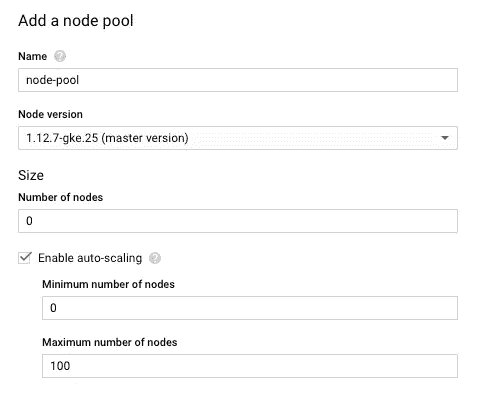

# 使用 Kubeflow Katib 进行超参数调谐

> 原文：<https://medium.com/analytics-vidhya/hyperparameter-tuning-with-kubeflow-katib-148d92208d73?source=collection_archive---------4----------------------->

# 介绍

Katib 是 Kubeflow 附带的一个工具，专门用于超参数调整。Kubeflow 是相当新的，Katib 也是。同时，还有很多其他的超参数调优框架。那么，为什么要为卡提卜费心呢？

对我来说，使用 Katib 进行超参数调优的最大优势是它通过 Kubeflow 与 Kubernetes (K8s)的直接集成。这提供了一些优势:

## A.享受 K8s 的可扩展性

如果训练模型很慢，超参数调整会慢 10 到 100 倍。K8s 的水平可伸缩性意味着您可以并行训练任意数量的模型**。这完全由 Katib 管理，包括超参数生成和指标收集。**

## **B.将调整后的模型直接部署到 K8s**

**虽然我们不会在本文中讨论如何将模型部署到 K8s，但您可能会意识到，越来越多的机器学习模型部署在 K8s 中用于生产。它们享有高可用性、自动可伸缩性、模型滚动更新以及比单个 web 服务器更多的优势。**

**像[塞尔顿](https://www.seldon.io/)或[库伯弗洛整流罩](https://github.com/kubeflow/fairing)这样的框架简化了机器学习工程师将模型部署到 K8s 的工作。作为 Kubeflow 生态系统的一部分，Katib 可以确保您的模型可以轻松地部署到 K8s。**

## **C.Katib 的其他一些特性**

1.  **足够通用，任何包装成 Docker 容器的模型都可以使用。**
2.  ****可抢占实例(GCP) /现场实例(AWS)可用于**大幅削减基础设施成本。K8s 的自动可伸缩性意味着您只需为您花费的计算能力付费。**
3.  ****用于结果管理和可视化的基本 UI** 。通过对研究配置文件和 Docker 容器图像进行版本控制，**结果可重现并得到管理**。**
4.  ****一些预先构建的算法**，从随机抽样到强化学习方法来调整超参数。**

# **设置 Kubeflow Katib(一次性)**

## **A.设置 Kubeflow**

**本文假设你已经安装了 Kubeflow 的 K8s 设置，否则你应该按照 Kubeflow 的[官方文档](https://www.kubeflow.org/docs/started/)来设置一个。确保您的“kubectl”命令行设置正确。**

## **B.设置 K8s 节点池**

**Kubeflow 在 K8s 上运行后，下一件事就是创建一个节点池来运行超参数调优作业。下面我们以 GCP 为例来说明如何做到这一点。**

1.  **在 Kubernetes 引擎中，找到您的 Kubeflow K8s 集群。选择“添加节点池”**

****

**2.为您的节点池命名，我们稍后会用到它。启用自动缩放，选择最小值 0 和最大值 100。“节点数”填写 0。**

****

**3.选择您喜欢的机器类型，选择“启用可抢占节点(测试版)”以使用可抢占实例来降低成本。**

****

**4.保存您的配置。您应该看到您的节点池出现在 K8s 面板中。**

****

# **使用 Katib**

## **A.Katib 仪表板**

**您可以从 Kubeflow 的下拉菜单中访问 Katib 仪表板。以下是我的仪表板示例，其中包括 2 项研究。**

****

**显示两项研究和多项研究工作的 Katib 仪表板。**

**一个**研究**是一个**研究工作**的集合。**

**每项研究工作都是一系列跑步的集合。例如，一项研究工作可能包含 50 次运行的指标和 50 组不同的超参数。**

## **B.准备一个 Docker 图像**

**Katib 支持任何类型的机器学习模型，满足以下要求:**

1.  **作为 Docker 映像构建并上传到 K8s 可访问的地方，**
2.  **以超参数为自变量，如 *"— epochs=10"* ，" *— rl=0.5"***
3.  **以“*metric*=*metric _ value”的格式将指标打印到标准输出。***

**我个人偏好使用 [s2i](https://github.com/openshift/source-to-image) ，它可以将 Python 包直接转换成 Docker 映像。因此，我的构建脚本只包含三行代码，用于构建、标记和推送图像:**

**我的 Docker 映像可通过命令“python -u train.py <arguments><hyperparameters>”执行，以进行训练和打印指标。</hyperparameters></arguments>**

## **C.创建研究工作**

**您可以参考 Katib 仪表板用户界面来创建新的研究。我个人觉得直接应用 K8s 配置要简单得多。以下是创建研究工作配置的模板。**

1.  **分别填写**元数据.名称**、**特定研究名称**和**特定所有者**作为您的研究工作标识符、您的研究标识符和您的姓名。**
2.  **spec.objectvievaluename 是 Katib 要收集的主要客观指标。其他指标可在**规格指标名称**中指定，以便交叉检查。确保您的程序将这些指标以"*metric*=*metric _ value "*的格式打印到 stdout**
3.  ****spec.parameterconfigs** 让您指定超参数的范围，采样的超参数将以 *" —超参数=超参数值"*的形式传入您的程序。**
4.  ****spec . workers pec . gotemplate . raw template**是实际要运行的作业。确保填写上传的图像和要执行的命令。请注意，采样的超参数由 Katib 注入到命令中。
    此外，您可以通过 **nodeSelector** 属性指定哪个节点池来执行您的作业。**
5.  ****spec.suggestionSpec** 让您指定选择超参数的策略。在本例中，我们选择了最简单的随机抽样策略，并行执行 10 次运行。只要您的节点池支持，您可以并行调度更多作业。就我个人而言，我安排了 100 个任务并行训练一个相对庞大的模型，没有任何问题。Katib 支持其他策略，如*网格搜索*、*超带*、*贝叶斯优化*等等。更多信息请参考[示例配置 yaml](https://github.com/kubeflow/katib/tree/master/examples/v1alpha2) 。**

**创建配置 yaml 后，**只需执行“ku bectl apply-f study _ job . YAML”**即可开始超参数调优！您可以随时使用“kubectl delete -f study_job.yaml”删除并重新运行研究作业。**

## **D.检查结果**

****

**学习工作结果的典型截图。**

**上面显示了一个典型的研究工作结果截图。每行代表一次运行的配置及其指标。**

**您甚至可以通过限制沿着每个度量轴的运行来做一些基本的分析。例如，下图显示，对于我的模型，高 IoU 指标的运行通常使用骰子损失。**

****

**通过仅显示具有高 IoU 的运行进行分析。**

# **结论**

**在本文中，我们介绍了通过 Kubeflow 的 Katib 工具在 K8s 上进行超参数调优的动机。我们首次展示了如何设置 Katib，如何将模型包装到 Docker 映像中，以及如何应用研究作业配置 yaml 来调整超参数。您还可以通过 Katib 的用户界面进行基本分析，以深入了解超参数选择。**

**本文旨在为您提供一个快速入门指南，帮助您建立一个高效的超参数调优解决方案。你可能会发现这篇文章遗漏了一些细节，如果有任何问题，请随时给我留言。**