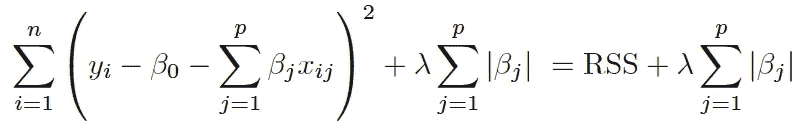

# 超参数调谐

> 原文：<https://medium.com/analytics-vidhya/hyperparameters-80cb4f442e5?source=collection_archive---------5----------------------->

术语*超参数*是指机器学习模型中的任何参数，其值不是直接从数据中导出的。换句话说，超参数是一个由研究者事先明确指定值的参数。大多数机器学习模型需要至少一个在学习前设置的变量。这适用于决策树、支持向量机、神经网络和普通最小二乘的正则化算法。每一个都需要研究者输入一个不可训练的超参数。

下面是套索回归算法的方程式。Lasso 将偏差引入到普通最小二乘法中，以对抗过度拟合。这个方程中的超参数用λ(λ)表示。为λ选择的值越大，算法输出中引入的偏差量就越大。



《统计学习导论:R 中的应用》(纽约:斯普林格，2013)。

超参数优化是调整超参数以最小化模型成本函数的过程。因此，上述 lasso 回归方程中λ值的调整可以被重新定义为*搜索问题*:研究人员*搜索*λ值，该λ值将足够量的偏差引入到模型中，而不会将不必要的大计算应变引入到模型中。

Sci-Kit Learn 为超参数调整提供了几种不同的内置方法。Sci-Kit Learn 提供的最常见的超参数优化技术之一叫做*网格搜索*。通过网格搜索，研究人员定义了一个可能λ值的*搜索空间*，在该空间内，将根据其有效的误差最小化来选择超参数。下面，我们将 11 个可能的错误值(用`alphas`表示)传递给了`GridSearchCV`方法。

```
>from sklearn import datasets
>from sklearn.linear_model import Lasso
>from sklearn.model_selection import GridSearchCV
>import numpy as np
>
>data = datasets.load_diabetes()
>
>alphas = np.array([5, 0.5, 0.05, 0.005, 0.0005, 1, 0.1, 0.01,      >                   0.001, 0.0001, 0 ])
>
>model = Lasso()
>grid = GridSearchCV(estimator=model, param_grid=dict(alpha=alphas))
>
>grid.fit(data.data, data.target)
>
>print(grid.best_estimator_.alpha)
>print(grid.best_score_)0.01
0.48924897208029955
```

我们正在打印来自`GridSearchCV`对象的两个值:我们的搜索空间中的最佳λ值及其相应的分数。每一个评估者都有自己的默认评分方法。对于 Lasso，默认的评分方法是 R；如果需要的话，我们可以用不同的方法给对象打分。在这里，网格搜索功能根据我们的模型测试我们的搜索空间中的每个`alpha`值，表现出最高 R 分数的`alpha`值占了我们数据中的最大方差，因此是该组中的最佳λ值。因此，我们可以将上述打印值解读为表明我们的 Lasso 模型(λ超参数设置为`0.01`)已经解释了数据的估计总方差的近 49%的方差。

值得注意的是，在需要一个以上超参数输入的模型中，我们可以为每个所需的超参数指定一个单独的搜索空间。然后，`GridSearchCV`函数将根据模型测试每个超参数组合，以确定具有最佳分值的组合。

Sci-Kit Learn 为超参数调整提供的另一种方法是*随机搜索*。随机搜索方法不是为函数提供一组搜索值，而是从值的随机分布中抽取参数样本。`RandomizedSearchCV`方法将一个连续的随机变量对象作为它的`param_grid`参数。下面我们用`scipy.stats.uniform`来生成这个随机变量对象。

```
>from scipy.stats import uniform 
>from sklearn.model_selection import RandomizedSearchCV
>
>param_grid = {'alpha': uniform()}
>
>model = Lasso()
>rand_search = RandomizedSearchCV(estimator=model, 
>                                 param_distributions=param_grid,
>                                 n_iter=100)
>
>rand_search.fit(data.data, data.target)
>
>print(rand_search.best_estimator_.alpha)
>print(rand_search.best_score_)0.013166578828218922
0.4892872029212656
```

这里，我们将均匀随机分布作为超参数搜索空间。该分布作为字典传递给`RandomizedSearchCV`方法，类似于网格搜索。我们用`n_iter`参数指定函数将从分布中获取的样本数。我们可以将`n_iter`值称为我们的*计算预算*。在上述代码中，该函数的计算预算为来自均匀连续随机变量的 100 个样本，并打印最佳采样λ值及其相应的 R 得分。

网格搜索和随机搜索各有优势。对于网格搜索，好处是该函数允许对任意数量的超参数的可能值的组合进行快速迭代。对于随机搜索，好处是该函数可用于对给定超参数进行更精细的探索。它还允许研究人员快速确定超参数的大致范围；网格搜索假设研究者已经确定了这个范围。